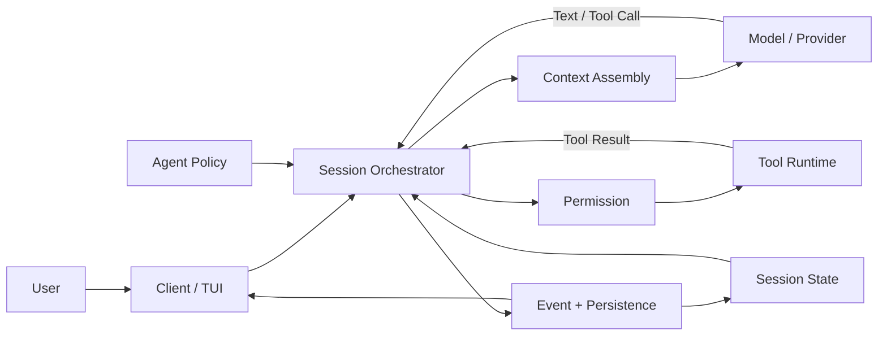

# OpenCode Agent Harness 总览：模型如何成为编码 Agent

上一篇：[05 扩展能力：Skill、MCP 与 Plugin](./05_Enhancement.md) ｜ 下一篇：[07 Agent Loop](./07_Agent_Loop.md)

> 固定源码：OpenCode `0e3474509aa5ad16afcf9c439785514d6443c6af`（`dev`，2026-08-18）
>
> 本篇职责：建立 Harness 的稳定全景、最短执行链和后续阅读地图。完整 Agent Loop、Context、Tool、Persistence、Agent 协作与 Runtime 边界分别留给 07—12 展开。

假设一位刚安装好 OpenCode 的学习者提出：

> 请先查看这个项目的 Harness 教程入口和项目规则，再告诉我应该按照什么顺序学习。

如果系统只把这句话交给语言模型，模型可以根据预训练知识解释“什么是 Harness”，却不知道本地项目中实际有哪些文档，也无法自行打开文件核对。要给出基于当前项目的答案，系统还要完成一整套模型之外的工作：发现可用能力、组织项目规则、执行文件读取、保存结果、把新观察交给下一次模型调用，并在任务完成时停止。

把模型包围起来、让它能够在真实环境中持续行动的这套运行与控制系统，就是本系列讨论的 **Agent Harness**。最短的理解是：

> **Model 提出下一步；Harness 组织、约束并记录执行；Tool 接触真实环境；Session 保存交互事实；Client 让用户提交目标并观察过程。**

## 一、从“会生成文本”到“能够完成任务”

### 1.1 Model 是推理核心，但不是完整 Agent

语言模型（Model）接收一次请求中的当前信息，然后生成文本、结构化内容或工具调用（Tool Call）。它擅长处理语义不确定性：判断学习者真正想知道什么、现有材料是否足够、下一步更应该读取 README 还是查找项目规则。

但一次模型调用本身有三个明显边界：

- 它只能依据本轮实际收到的信息判断，不能天然看见整个工作区；
- 它生成 `read(path=...)` 只是在表达调用意图，不等于文件已经读取；
- API 调用结束后，模型不会自行保留一条持续运行的本地任务和完整 Session 状态。

因此，单独的 Model 可以回答静态知识问题，却无法独自形成“行动—观察—再判断”的完整闭环。更强的 Model 会提高推理上限，但不会自动补出文件系统、权限、持久化和运行控制。

### 1.2 Agent 是完整应用，Harness 是它的运行骨架

代理（Agent）不是 Model 的别名。它是围绕目标持续工作的完整应用形态，至少需要把以下部分连接起来：

```text
Agent
├── Model：理解信息并提出下一步
├── Context：本轮交给模型的信息环境
├── Tools：获取信息或改变外部环境
├── Orchestration：运行判断、行动、观察的循环
└── Runtime Services：Session、Permission、事件、持久化和 Client/Server
```

OpenCode 中的 Harness 正是这套应用的运行骨架。它不替代 Model 做语义推理，而是负责让每次推理发生在明确边界中：本轮有哪些输入、哪些 Tool 可见、调用是否允许、结果怎样保存、是否需要再次请求模型，以及状态怎样回到用户界面。

从这个角度看，编排层（Orchestration Layer）是 Harness 的运行核心，但 Harness 的范围更宽。除了循环本身，它还包含 Agent 配置、上下文来源、工具注册与权限、Session 状态、Provider 适配以及 Client/Server 运行边界。

### 1.3 Model、Agent、Harness、Tool 与 Session 的层级

这五个名称经常在同一段话中出现，但解决的是不同问题：

| 概念 | 它回答的问题 | 学习场景中的作用 |
| --- | --- | --- |
| Model | “根据当前信息，下一步应该做什么？” | 判断应先读教程入口还是项目规则 |
| Agent | “以什么角色、指令、模型偏好和能力边界工作？” | 让本次工作采用适合调查或执行的配置 |
| Harness | “怎样让判断、行动和状态形成受控闭环？” | 组装输入、调用模型、执行 Tool、保存并继续 |
| Tool | “怎样取得真实信息或产生外部动作？” | 真正读取 README、搜索文件或运行命令 |
| Session | “一次连续交互中发生过什么？” | 组织 User、Assistant、Tool Call 和 Tool Result |

两个 Agent 可以使用同一个 Model，却因为指令、Tool 与 Permission 不同而表现出不同角色；同一个 Agent 也可以切换 Model。Session 保存交互事实，但不会代替 Harness 决定如何把历史转换成下一轮模型输入。Tool 负责真实动作，却不会自行决定什么时候被调用。

所以“OpenCode 很强”不能只归因于某一个模型名称。实际表现来自 Model、Context、Tools、Orchestration 与 Runtime 的共同作用。

## 二、一张全景图看懂 OpenCode Harness

### 2.1 稳定的逻辑角色

下面这张图展示逻辑职责，不表示每个方框都对应独立进程。默认本地 Worker、监听模式和远程 Server 的真实位置由[第 12 篇](./12_Runtime_Boundary.md)说明。



图中的箭头构成一条闭环：Client 把用户目标交给 Session Orchestrator；Orchestrator 从当前状态和 Agent Policy 出发，组装 Context 与 Tools；Model 返回文本或 Tool Call；普通本地 Tool 经 Permission 检查后在 Tool Runtime 中执行；Tool Result 和 Assistant 输出被结算为 Session 状态，并通过事件更新 Client；若任务还没有到达结束边界，下一轮重新读取这些状态。

Agent Policy 画在侧面，是因为它不是流水线中的一次动作，而是持续影响 Model、Tools 与 Permission 的配置边界。Event 与 Persistence 也不能简单合并成“存储”：完整 Message/Part 可以成为 durable state，增量事件还可能只是 live-only 更新；这一差异由第 10、12 篇展开。

### 2.2 Harness 的六个支撑面

同一条闭环可以按职责拆成六个相互连接的支撑面：

- **执行编排**：把一个用户目标推进为一个或多个 Provider Turn，并处理 continuation、retry、interrupt 和 stop。
- **上下文组织**：决定 System、Messages 与 Tool definitions 中分别放入什么，让 Model 看见正确的信息环境。
- **工具与权限**：把模型提出的调用意图变成经过 schema、Permission 和 executor 的真实操作。
- **状态与持久化**：保存 Session、Message、Part 与 durable Event，使后续轮次可以重载已经发生的事实。
- **Agent 专业化**：用 Agent 配置塑造角色，并在必要时通过父子 Session 隔离 Subagent 的工作上下文。
- **运行与呈现**：连接 TUI、SDK、Server、Provider、Tool Runtime、事件传输和存储。

这些不是 OpenCode 依次启动的六个独立程序。一次 `read` 就会同时涉及 Context 中的 Tool definition、Model 的 Tool Call、Permission、Tool Runtime、Tool Result 持久化、下一轮 Messages 和 TUI 事件更新。

### 2.3 一个学习请求的最短执行链

贯穿本系列的学习请求可以压缩成下面这条最短链：

```text
User 提出“查看教程入口并给出学习顺序”
-> Harness 保存 User Message
-> 为本轮组装 Agent、System、Messages 与 Tool definitions
-> Model 提出 read README
-> Harness 校验并执行 read
-> Tool Result 写入 Session
-> 下一轮重新组装 Context
-> Model 根据真实 README 输出阅读顺序
-> Harness 检查已无待反馈 Tool，运行到达 idle
```

这条链不是固定工作流。Model 也可能先搜索规则文件，或者在现有 Context 已经足够时不调用 Tool。稳定的是角色边界：Model 提议，Harness 落实控制，Tool 产生真实观察，Session 让观察进入后续轮次。

“自主”也应在这里准确理解：Agent 可以在没有人逐步指定每个动作的情况下，根据新观察选择下一步；它并不是脱离程序、权限和用户约束任意行动。

## 三、全景图怎样映射到 OpenCode 当前源码

本节只证明全景角色确实在当前默认路径中相连，不展开第 07 篇已经主讲的完整 Loop 控制。

### 3.1 输入先成为 Session 事实，再进入外层 Loop

默认 TUI 普通消息最终进入 `SessionPrompt.prompt`。固定源码先创建 User Message、触碰 Session 更新时间，并把本次 Tool override 转成 Session Permission，然后才调用 `loop(...)`：

```ts
const message = yield* createUserMessage(input)
yield* sessions.touch(input.sessionID)

const permissions: PermissionV1.Rule[] = []
for (const [t, enabled] of Object.entries(input.tools ?? {})) {
  permissions.push({ permission: t, action: enabled ? "allow" : "deny", pattern: "*" })
}
if (permissions.length > 0) {
  session.permission = permissions
  yield* sessions.setPermission({ sessionID: session.id, permission: permissions })
}

if (input.noReply === true) return message
return yield* loop({ sessionID: input.sessionID })
```

文件：`packages/opencode/src/session/prompt.ts`

函数：`SessionPrompt.prompt`

这段入口体现了两个边界。第一，用户输入会先成为可查询的 Session 事实，Loop 不是只围绕一份临时字符串运行。第二，`noReply` 可以让当前调用只接纳输入而不主动等待新回复；普通 TUI 消息则继续进入兼容 `SessionPrompt` Loop。

### 3.2 Orchestrator 在每个普通轮次连接 Context、Tools 与 Processor

外层 Loop 处理完终止检查和特殊任务后，会解析 Agent、创建 Assistant Message、物化 Tools，并取得五组本轮输入：

```ts
const tools = yield* SessionTools.resolve({
  agent,
  session,
  model,
  processor: handle,
  bypassAgentCheck,
  messages: msgs,
  promptOps,
})

const [skills, env, instructions, mcpInstructions, modelMsgs] = yield* Effect.all([
  sys.skills(agent),
  sys.environment(model),
  instruction.system().pipe(Effect.orDie),
  sys.mcp(agent, session.permission),
  MessageV2.toModelMessagesEffect(msgs, model),
])
const system = [
  ...env,
  ...instructions,
  ...(mcpInstructions ? [mcpInstructions] : []),
  ...(skills ? [skills] : []),
]
```

文件：`packages/opencode/src/session/prompt.ts`

函数：`SessionPrompt.run`

`SessionTools.resolve` 产生本轮候选 Tool map；Environment、Project Instructions、MCP Instructions 和 Skill guidance 进入 system-level 内容；`toModelMessagesEffect` 把活跃 Session History 转成模型消息。这些来源并发取得，但数组解构与后续拼接位置是确定的。

随后 `handle.process(...)` 把同一轮的 User、Agent、Permission、System、Messages、Tools 和 Model 交给 LLM Runtime。这里最值得记住的不是每个字段，而是三类输入保持分离：System 说明约束，Messages 表示已发生的交互，Tools 描述本轮可提议的能力。

### 3.3 LLM Runtime 把内部输入降低为 Provider 请求

`LLM.run` 会解析 Provider、认证与运行配置，再调用 `LLMRequestPrep.prepare(...)`：

```ts
const prepared = yield* LLMRequestPrep.prepare({
  ...input,
  provider: item,
  auth: info,
  plugin,
  flags,
  isWorkflow,
})
```

文件：`packages/opencode/src/session/llm.ts`

函数：`LLM.run`

请求准备层会加入 Provider-family base 或 Agent prompt、Provider options、headers 和插件变换，并最终得到 `prepared.system`、`prepared.messages` 与 `prepared.tools`。默认路径再通过 AI SDK 发送请求；显式实验开关也可以只替换这一层的 Provider adapter，但外层仍是 `SessionPrompt`，不能因此误判为 native V2 Session Runtime。

### 3.4 Processor 把模型流和 Tool 结果结算回 Session

Model 返回的并不是“一次性最终答案”这一种形态。当前 Processor 会接收 Text、Reasoning、Tool Call、Tool Result、Usage、Finish 和 Provider Error 等流事件，把它们归入已经创建的 Assistant Message 与 Parts。

Session 领域接口最终通过 EventV2-backed `events.publish(...)` 提交完整 Message/Part 更新：

```ts
const updateMessage = <T extends SessionV1.Info>(msg: T): Effect.Effect<T> =>
  Effect.gen(function* () {
    yield* events.publish(SessionV1.Event.MessageUpdated, { sessionID: msg.sessionID, info: msg })
    return msg
  })

const updatePart = <T extends SessionV1.Part>(part: T): Effect.Effect<T> =>
  Effect.gen(function* () {
    yield* events.publish(SessionV1.Event.PartUpdated, {
      sessionID: part.sessionID,
      part: structuredClone(part),
      time: Date.now(),
    })
    return part
  })
```

文件：`packages/opencode/src/session/session.ts`

函数：`Session.updateMessage`、`Session.updatePart`

完整 Message/Part 与流式 delta 的持久性并不相同；事件怎样投影进存储、怎样桥接到当前 TUI，也分别属于 Persistence 和 Runtime Boundary。总览阶段只需把握：Processor 不是 UI 文本拼接器，它承担 Model stream 到 Session domain state 的结算边界。

## 四、模型判断与 Harness 控制怎样配合

### 4.1 概率性决策与确定性边界

Agent 系统既不是每一步都由 Model 自由决定，也不是一份提前写死的流程图。它把语义判断交给 Model，把可以程序化验证的边界交给 Harness：

| 问题 | 主要负责者 | 原因 |
| --- | --- | --- |
| 先读 README 还是先找项目规则 | Model | 需要理解目标、缺失信息和相关性 |
| 本轮哪些 Tool definitions 可见 | Harness / Agent policy | 由配置和 Permission 规则物化、过滤 |
| 是否生成 `read` Tool Call | Model | 属于本轮模型输出 |
| 参数是否符合 schema | Harness | 可以按结构化契约校验 |
| 是否需要用户批准 | Harness + User | 由 Permission 流程落实 |
| 文件是否读取成功 | Tool Runtime | 发生真实 I/O，可能失败 |
| Tool Result 怎样进入 Part | Harness | 属于状态转换与记录 |
| 是否还要发起下一 Provider Turn | Harness | 由 Loop、Processor result 与终止检查控制 |
| Model 是否正确理解结果 | Model | 仍是概率性语义判断 |

Harness 可以约束 Model 的行动，却不能保证 Model 一定选择最佳文件或正确理解内容。反馈循环的意义就在于：系统不要求第一次调用就预测完整行动序列，而是让每一步在明确边界中发生，再根据新事实调整。

### 4.2 Permission 是应用策略，不是 OS Sandbox

模型提出某个动作后，OpenCode 可以根据 Agent、Session 和资源规则选择 allow、ask 或 deny。这是一层应用内策略门，决定受管 Tool 是否继续执行。

它不会自动降低 OpenCode 进程在操作系统中的真实权限，也不能回滚已经发生的外部副作用。把 Permission 理解为 Harness 的确定性控制点是正确的；把它理解为完整系统沙箱则会高估保护范围。Tool 生命周期与安全边界由[第 09 篇](./09_Tools_and_Permission.md)详细解释。

### 4.3 Harness 不是 Prompt、Tool 列表或 Server 的别名

几个相邻概念可以在这里就地排除：

- **不是一段很长的 System Prompt**：指令无法独自完成文件 I/O、状态持久化、Retry 和 Interrupt。
- **不是 Tool 列表**：定义了 Tool 仍需要决定何时可见、怎样授权、如何执行和怎样结算结果。
- **不是模型隐藏思维链**：Harness 管理的是模型外部可观察的请求、Tool、状态和事件，不是逐字读取模型私有推理。
- **不是 HTTP Server**：Server 只是 API 与 transport 边界；同一 Router 也可以被内存 `fetch` 调用。
- **不是 Session 数据库**：持久化提供事实来源，Orchestrator 仍需选择和转换这些事实，再驱动下一轮。

## 五、后续六篇分别放大哪个问题

全景图中的支撑面会同时运行，但学习时需要按依赖顺序逐层放大。

### 5.1 Agent Loop：一次请求为什么可以持续多轮

[第 07 篇](./07_Agent_Loop.md)从用户请求、Provider Turn 和流式事件三个尺度进入 `SessionPrompt.run` 的显式 `while (true)`，解释 Tool Result 为什么会推动 continuation，以及 Retry、Interrupt、Doom Loop 与停止条件分别位于什么控制位置。

它是后续专题的主干。只有先理解“每轮重新读取状态并形成下一次请求”，才能继续讨论模型每轮究竟看见了什么。

### 5.2 Context Architecture：模型本轮看见什么

[第 08 篇](./08_Context_Architecture.md)把 Provider Request 拆成 System、Messages 和 Tool definitions 三条输入通道，追踪 Environment、Project Instructions、Skill、MCP、Session History 和 Tool Result 怎样进入不同位置。

Context Engineering 不只是写一段更好的 Prompt，而是为每次 Model 调用选择、组织、更新和裁剪完整信息环境。

### 5.3 Tools 与 Permission：意图怎样变成真实操作

[第 09 篇](./09_Tools_and_Permission.md)沿 Tool 注册、每轮物化、Tool Call、参数校验、Permission、executor 和 Tool Result settlement 解释一次动作的完整生命周期。

它会继续区分“Registry 中存在”“本轮对 Model 可见”“Model 已提出调用”和“Tool 已真正执行”四种不同事实。

### 5.4 Session 与 Persistence：系统保存了什么

[第 10 篇](./10_Session_and_Persistence.md)解释 Session、Message、Part 和 Event 的领域关系，并区分 durable、process-local 与 live-only 状态。Context Compaction、代码 Snapshot 和 Revert 也会在各自的保存与恢复边界中展开。

核心问题不是把所有状态都叫“记忆”，而是说明哪些事实能跨 Model 调用或进程重读，哪些只属于当前运行现场。

### 5.5 Agent 专业化与协作：不同角色怎样分工

[第 11 篇](./11_Agent_Specialization_and_Collaboration.md)先区分 Model 与 Agent，再把 Plan、Todo、`task` 和 Subagent 放进同一层级模型。它会解释父子 Session 如何传递任务与结果，以及什么时候上下文隔离值得引入委派成本。

多 Agent 的价值来自专业分工和上下文隔离，不来自数量本身。

### 5.6 Runtime Boundary：Harness 在哪里运行

[第 12 篇](./12_Runtime_Boundary.md)把逻辑角色放回实际进程、Worker 和网络边界，区分默认本地、监听与远程 `attach` 三种拓扑，并说明 Prompt 最终响应与实时 Event 通道为何可以并行存在。

current/native V2 的完整演进也集中在这一篇，避免前面每个专题都同时维护两套叙事。

## 六、当前默认路径与 native V2 的边界

固定源码中同时存在当前兼容 Session Runtime 与 native V2 Runtime。默认 TUI 普通消息仍调用 compatibility `client.session.prompt(...)`，进入 `/session/:id/message`、`SessionHttpApi.prompt` 和 `SessionPrompt`；native V2 则有独立的 `/api/session/:id/prompt`、durable input admission、`SessionRunner` 与 Tool settlement。

两条路径共享部分事件、存储和 Server 基础设施，不表示它们具有相同请求语义，也不表示 native API 已经接管当前 TUI。本篇以及 07—11 都把当前默认路径作为学习主线，只在 native 机制会改变概念边界时作简短提醒。

对总览最重要的结论只有两个：

1. 看到文件名中的 `v2`、Effect 或 EventV2，不能单独判断已经进入 native V2 Session Runtime；必须继续追踪 Client、URL、Handler 和 Core 调用点。
2. native V2 重新划分了 durable admission、执行协调、Context 与 Tool settlement 等边界，但固定版本仍未完成当前路径的全部 parity。

完整路由、返回合同、event cursor 和恢复限制统一见第 12 篇。

## 七、关键源码索引

下面的入口把本篇全景关系映射到固定源码。正文只展示了能说明边界的短片段，完整测试矩阵见[源码与证据索引](./appendices/Source_Index.md)。

| 关注点 | 源码文件 | 关键符号 |
| --- | --- | --- |
| TUI 普通消息提交 | `packages/tui/src/component/prompt/index.tsx` | `submitInner`、`sdk.client.session.prompt` |
| compatibility Prompt Handler | `packages/opencode/src/server/routes/instance/httpapi/handlers/session.ts` | `SessionHttpApi.prompt` |
| User 输入与 Session Loop | `packages/opencode/src/session/prompt.ts` | `SessionPrompt.prompt`、`run`、`loop` |
| Context 与 Tool 组装 | `packages/opencode/src/session/prompt.ts` | `SessionTools.resolve` 调用、五类 Context 结果 |
| Provider 请求准备 | `packages/opencode/src/session/llm.ts`、`session/llm/request.ts` | `LLM.run`、`LLMRequestPrep.prepare` |
| 流事件与 Tool 结算 | `packages/opencode/src/session/processor.ts` | `SessionProcessor.create`、`process`、`cleanup` |
| Session 状态提交 | `packages/opencode/src/session/session.ts` | `updateMessage`、`updatePart`、`updatePartDelta` |
| Tool 物化与执行包装 | `packages/opencode/src/session/tools.ts` | `SessionTools.resolve` |
| native Session 入口 | `packages/core/src/session.ts`、`packages/core/src/session/runner/llm.ts` | `V2Session.prompt`、`SessionRunner.run` |

## 八、总结：Harness 把模型放进受控反馈系统

OpenCode 成为编码 Agent，不是因为语言模型突然拥有了文件系统、长期状态和后台执行能力，而是因为 Harness 把 Model、Context、Tools、Session、Permission、Provider 与 Client 连接成了反馈系统。

在这套系统中，Model 处理开放式的语义判断；Harness 物化输入和能力、执行确定性检查、驱动真实 Tool、结算并保存状态，再决定是否进入下一轮。模型的灵活性使 Agent 能根据观察改变计划，Harness 的边界则让这种灵活性可以被执行、观察和约束。

接下来先进入[第 07 篇 Agent Loop](./07_Agent_Loop.md)，沿固定源码看清一条用户请求为什么会产生多个 Provider Turn，以及这条反馈链究竟怎样运行到空闲。
