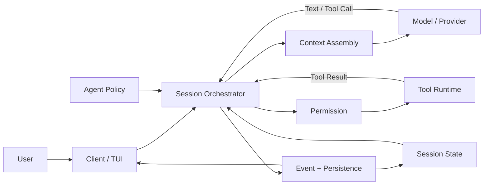

# OpenCode Agent Harness 总览：模型如何成为编码 Agent

> 核对基线：OpenCode `0e3474509aa5ad16afcf9c439785514d6443c6af`（`dev`，2026-08-18）
> 本篇目标：先建立一张稳定的全景地图，不要求读者理解 OpenCode 源码。

上一篇：[05 扩展能力：Skill、MCP 与 Plugin](./05_Enhancement.md)
下一篇：[07 Agent Loop](./07_Agent_Loop.md)

假设你刚刚完成 OpenCode 的安装，只知道它可以回答问题、读取项目和执行命令。现在你提出一个学习请求：

> 我想从零学习这个项目的 Harness 架构。请先查看教程入口，告诉我应该按照什么顺序学习；不要修改文件。

这句话看起来像一次普通对话，但 OpenCode 要真正完成它，需要解决一组模型本身无法独立解决的问题：到哪里找教程入口、可以使用哪些工具、谁来读取文件、结果如何交回模型、什么时候应该停止，以及整个过程怎样显示在终端里。

这些问题共同指向本系列的主题：Agent Harness。

## 1. Harness 简介

语言模型（Model）负责理解信息并判断下一步，但它本身不会直接读取本地文件，也不会天然保存上一次调用的状态。

OpenCode 在模型周围加入了一套运行和控制系统：

- 编排层组织多轮模型调用；
- 上下文系统决定模型本轮看见什么；
- 工具系统把模型的调用意图变成真实操作；
- Session 和事件系统保存已经发生的事实；
- Agent 配置规定角色、工具和权限边界；
- Client、Server 与 Provider 适配层让整条链路真正运行起来。

这套包围模型的系统，就是本文所说的 OpenCode Agent Harness。

可以先记住一句话：

> **模型提出下一步，Harness 组织和约束执行，工具接触真实环境，Session 保存过程，Client 把过程呈现给用户。**

## 2. Model、Agent 与 Harness 不是同一个概念

初学者最容易把“模型”“Agent”和“Harness”当作三个近义词。它们实际上位于不同层次。

| 概念 | 主要职责 | 在学习请求中的表现 |
| --- | --- | --- |
| Model | 理解当前输入，生成文本或 Tool Call | 判断应该先读取哪份 README |
| Agent | 面向某类任务的一组行为配置 | 规定当前角色、模型偏好、可见工具和 Permission |
| Harness | 让模型和工具持续协作的运行控制系统 | 组装输入、执行工具、保存结果并决定是否继续 |
| Tool | 获取信息或改变外部环境 | 真正读取 README 文件 |
| Session | 保存一次连续交互中的领域状态 | 保存用户消息、助手消息和工具结果 |

单独的模型可以解释“什么是 Harness”，但它无法知道你本地项目里有哪些文章。只有当系统向它提供项目内容，或者允许它调用读取工具后，它才能根据真实文件回答。

因此，Agent 的能力不是单一模型指标的直接映射。最终表现来自 Model、Context、Tools、Orchestration 和 Runtime 的共同作用。

## 3. Agent 的最小反馈循环

从学习者视角看，最重要的不是先背模块名，而是理解 Agent 为什么能够连续推进任务。

```text
接收目标
-> 收集当前信息
-> 模型判断下一步
-> 执行动作
-> 观察结果
-> 更新下一轮信息
-> 继续或停止
```

在本文的学习请求中，这条循环可以展开为：

1. OpenCode 接收“从零学习 Harness”的目标。
2. Harness 把当前用户消息、项目规则和可用工具组织给模型。
3. 模型发现自己还不知道教程目录，于是提出读取 `README.md`。
4. Harness 检查调用参数和 Permission，再由 `read` 工具真正读取文件。
5. 文件内容作为 Tool Result 被保存，并在下一轮重新提供给模型。
6. 模型根据真实目录给出阅读顺序；如果信息已经足够，就不再提出工具调用。
7. Harness 结束本次循环，把最终结果交给客户端。

这里的“自主”不是脱离控制。模型可以根据观察结果动态选择下一步，但它只能在 Harness 提供的工具、上下文和权限边界内行动。

## 4. OpenCode Harness 的全景结构

下面这张图先展示逻辑职责。图中的模块不一定各自对应一个独立操作系统进程；进程和网络边界会在第 12 篇解释。



可以把它理解成一个由六个问题组成的系统。

### 4.1 如何持续执行

Session Orchestrator 运行 Agent Loop。一次用户请求可能需要多次调用模型：先读取入口，再读取某篇教程，最后总结。本系列把每次真实发起的 Provider Request attempt，以及它的响应或错误投影，称为一个提供商轮次（Provider Turn）。

这一部分由 [07 Agent Loop](./07_Agent_Loop.md) 展开。

### 4.2 模型本轮看见什么

模型每次调用都是基于当下输入作出判断。Harness 需要组织系统指令、会话历史、项目规则、工具定义以及刚刚得到的 Tool Result。

这一部分由 [08 Context Architecture](./08_Context_Architecture.md) 展开。

### 4.3 动作怎样真实发生

模型生成一个名为 `read` 的 Tool Call，不等于文件已经读取。Harness 仍要验证参数、判断权限并调用真正的 executor，随后把结果转换成模型能够继续使用的观察信息。

这一部分由 [09 Tools 与 Permission](./09_Tools_and_Permission.md) 展开。

### 4.4 系统保存了什么

模型本身不会记住前一次 API 调用。OpenCode 使用 Session、Message、Part 和 Event 保存交互事实，并在下一轮重新加载需要的历史。

这一部分由 [10 Session 与 Persistence](./10_Session_and_Persistence.md) 展开。

### 4.5 不同角色怎样分工

OpenCode 的 Agent 不只是不同称呼。Agent 配置可以影响模型偏好、行为指令、工具可见性和 Permission。复杂任务还可以通过 Task 创建具有独立上下文的 Subagent。

这一部分由 [11 Agent 专业化与协作](./11_Agent_Specialization_and_Collaboration.md) 展开。

### 4.6 整套系统在哪里运行

TUI、Server、模型 Provider、Tool Runtime 和持久化层承担不同职责。实时进度与最终响应也不是同一条返回通道。

这一部分由 [12 Runtime Boundary](./12_Runtime_Boundary.md) 展开。

## 5. 模型决策与 Harness 控制的分界

理解 Harness 的关键，是分清哪些行为具有概率性，哪些边界由程序确定。

| 问题 | 通常由谁负责 | 性质 |
| --- | --- | --- |
| 当前应该先读哪份教程 | Model | 根据上下文作出的判断 |
| 本轮有哪些工具可供模型选择 | Harness / Agent policy | 程序组装和过滤 |
| 模型是否提出 `read` 调用 | Model | 生成结果的一部分 |
| `read` 参数是否符合 schema | Harness | 确定性校验 |
| 目标文件是否需要询问用户 | Permission system | 策略判断 |
| 文件是否真的被读取 | Tool executor | 真实 I/O |
| 结果是否写入 Session | Harness / persistence | 状态提交 |
| 是否满足停止条件 | Model 输出与 Harness 状态共同决定 | 模型意图受程序边界约束 |

生产级 Agent 通常不是纯粹的自由规划，也不是完全固定的工作流，而是两者的组合：模型处理语义理解和不确定选择，Harness 保证工具、权限、状态和运行边界。

## 6. Context Engineering 是贯穿全程的主线

提示词工程（Prompt Engineering）主要关注如何写好一段指令。上下文工程（Context Engineering）关注的是：每次模型调用时，应该把哪些信息以什么结构交给模型。

对学习请求来说，这些信息可能包括：

- 用户想从零学习，而不是参与 Runtime 开发；
- 本项目的 README 和阅读顺序；
- 当前选中的 Agent；
- 可以使用 `read` 等哪些工具；
- 上一轮读取到了什么；
- 用户明确要求不要修改文件；
- 当前任务是否已经可以回答。

Context 不是开场时组装一次就不再变化。工具结果、用户补充信息、压缩结果和任务状态都会影响下一轮输入。因此，Agent Loop 也可以理解为一个不断重组 Context 的过程。

## 7. 本系列的阅读方法

建议按 06-12 顺序阅读，不先背完整术语表：

```text
06 先看系统全景
-> 07 看懂反馈循环
-> 08 看懂模型输入
-> 09 看懂真实行动
-> 10 看懂状态延续
-> 11 看懂角色协作
-> 12 看懂运行边界与架构演进
```

遇到术语时可查询 [术语表](./appendices/Terminology.md)，需要核对实现时再查 [源码索引](./appendices/Source_Index.md)。这些附录用于查询，不是主系列的前置门槛。

## 9. 关键源码入口

以下入口用于证明本篇全景关系：

| 关注点 | 文件或导出符号 |
| --- | --- |
| TUI 普通消息提交 | `packages/tui/src/component/prompt/index.tsx`，`submitInner` |
| 当前 Session 编排 | `packages/opencode/src/session/prompt.ts`，`SessionPrompt.prompt/run/loop` |
| Provider 请求准备 | `packages/opencode/src/session/llm/request.ts`，`LLMRequestPrep.prepare` |
| Tool 物化 | `packages/opencode/src/session/tools.ts`，`SessionTools.resolve` |
| 流事件与 Part 结算 | `packages/opencode/src/session/processor.ts`，`SessionProcessor` |
| durable event 提交 | `packages/core/src/event.ts` |
| native Session 输入接纳 | `packages/core/src/session.ts`，`V2Session.prompt` |

完整证据边界见 [源码索引](./appendices/Source_Index.md)。
