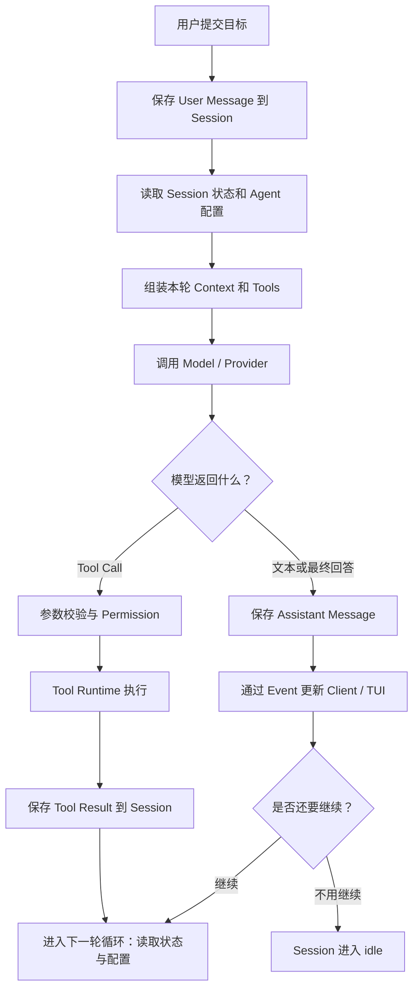

# OpenCode Agent Harness 总览：模型如何成为编码 Agent

上一篇：[05 扩展能力：Skill、MCP 与 Plugin](./05_Enhancement.md) ｜ 下一篇：[07 Agent Loop](./07_Agent_Loop.md)

> 固定源码：OpenCode `0e3474509aa5ad16afcf9c439785514d6443c6af`（`dev`，2026-08-18）
>
> 本篇职责：建立 Harness 的稳定全景、最短执行链和后续阅读地图。完整 Agent Loop、Context、Tool、Persistence、Agent 协作与 Runtime 边界分别留给 07—12 展开。

假设一位刚安装好 OpenCode 的学习者提出：

> 请先查看这个项目的 Harness 教程入口和项目规则，再告诉我应该按照什么顺序学习。

如果系统只把这句话交给语言模型，模型可以根据预训练知识解释“什么是 Harness”，却不知道本地项目中实际有哪些文档，也无法自行打开文件核对。要给出基于当前项目的答案，系统还要完成一整套模型之外的工作：发现可用能力、组织项目规则、执行文件读取、保存结果、把新观察交给下一次模型调用，并在任务完成时停止。

把模型包围起来、让它能够在真实环境中持续行动的这套运行与控制系统，就是本系列讨论的 **Agent Harness**。直观的理解是：

> **Model 提出下一步；Harness 组织、约束并记录执行；Tool 接触真实环境；Session 保存交互事实；Client 让用户提交目标并观察过程。**

## 一、从 LLM 到 Agent

### 1.1 Model 是推理核心，但不是完整 Agent

语言模型（Model）接收一次请求中的当前信息，然后生成文本、结构化内容或工具调用（Tool Call）。它擅长处理语义不确定性：判断学习者真正想知道什么、现有材料是否足够、下一步更应该读取 README 还是查找项目规则。

但一次模型调用本身有三个明显边界：

- 它只能依据本轮实际收到的信息判断，不能天然看见整个工作区；
- 它可以生成 `read(path=...)`的文本，但这只是在表达调用意图，文件不会被读取；
- API 调用结束后，模型不会自行保留一条持续运行的本地任务和完整 Session 状态。

因此，单独的 Model 可以回答静态知识问题，却无法独自形成“行动—观察—再判断”的完整闭环。更强的 Model 会提高推理上限，但不会自动补出文件系统、权限、持久化和运行控制。

### 1.2 Agent 是完整应用，Harness 是它的运行骨架

代理（Agent）不是 Model 的别名。它是围绕目标持续工作的完整应用形态，至少具有以下部分：

```text
Agent
├── Model：理解信息并提出下一步
├── Context：本轮交给模型的信息环境
├── Tools：获取信息或改变外部环境
├── Orchestration：运行判断、行动、观察的循环
└── Runtime Services：Session、Permission、事件、持久化和 Client/Server
```

OpenCode 中的 Harness 正是这套应用的运行骨架。它不替代 Model 做语义推理，而是负责让每次推理发生在明确边界中：本轮有哪些输入、哪些 Tool 可见、调用是否允许、结果怎样保存、是否需要再次请求模型，以及状态怎样回到用户界面。

从这个角度看，编排层（Orchestration Layer）是 Harness 的运行核心，但 Harness 的范围更宽。除了循环本身，它还包含 Agent 配置、上下文来源、工具注册与权限、Session 状态、Provider 适配以及 Client/Server 运行边界。


## 二、一张全景图看懂 OpenCode Harness

### 2.1 稳定的逻辑角色

下面这张图展示逻辑职责，不表示每个方框都对应独立进程。默认本地 Worker、监听模式和远程 Server 的真实位置由[第 12 篇](./12_Runtime_Boundary.md)说明。



图中的主线严格按从上到下的时间顺序排列，从保存 User Message 开始。Harness 每轮读取 Session 状态与 Agent 配置，组装 Context 和 Tools，再调用 Model。Model 如果返回 Tool Call，调用会经过参数校验和 Permission 检查，由 Tool Runtime 执行；Tool Result 保存到 Session 后，流程进入下一轮。Model 如果返回文本或最终回答，Harness 保存 Assistant Message、通过 Event 更新 Client，并判断继续运行还是进入 idle。为
Agent 配置被放进“每轮读取”节点，是因为它不是只执行一次的流水线动作，而是持续影响 Model、Tools 与 Permission 的配置边界。图中也把状态保存和界面事件分开：完整 Message/Part 可以成为 durable state，增量事件还可能只是 live-only 更新；这一差异由第 10、12 篇展开。

### 2.2 Harness 的六个支撑面

同一条闭环可以按职责拆成六个相互连接的支撑面：

- **执行编排**：把一个用户目标推进为一个或多个 Provider Turn，并处理 continuation、retry、interrupt 和 stop。
- **上下文组织**：决定 System、Messages 与 Tool definitions 中分别放入什么，让 Model 看见正确的信息环境。
- **工具与权限**：把模型提出的调用意图变成经过 schema、Permission 和 executor 的真实操作。
- **状态与持久化**：保存 Session、Message、Part 与 durable Event，使后续轮次可以重载已经发生的事实。
- **Agent 专业化**：用 Agent 配置塑造角色，并在必要时通过父子 Session 隔离 Subagent 的工作上下文。
- **运行与呈现**：连接 TUI、SDK、Server、Provider、Tool Runtime、事件传输和存储。

这些不是 OpenCode 依次启动的六个独立程序。一次 `read` 就会同时涉及 Context 中的 Tool definition、Model 的 Tool Call、Permission、Tool Runtime、Tool Result 持久化、下一轮 Messages 和 TUI 事件更新。

### 2.3 一个学习请求的最短执行链

贯穿本系列的学习请求可以压缩成下面这条最短链：

```text
User 提出“查看教程入口并给出学习顺序”
-> Harness 保存 User Message
-> 为本轮组装 Agent、System、Messages 与 Tool definitions
-> Model 提出 read README
-> Harness 校验并执行 read
-> Tool Result 写入 Session
-> 下一轮重新组装 Context
-> Model 根据真实 README 输出阅读顺序
-> Harness 检查已无待反馈 Tool，运行到达 idle
```

这条链不是固定工作流。Model 也可能先搜索规则文件，或者在现有 Context 已经足够时不调用 Tool。稳定的是角色边界：Model 提议，Harness 落实控制，Tool 产生真实观察，Session 让观察进入后续轮次。

“自主”也应在这里准确理解：Agent 可以在没有人逐步指定每个动作的情况下，根据新观察选择下一步；它并不是脱离程序、权限和用户约束任意行动。

## 三、一次请求在 OpenCode 当前源码中怎样走一圈

这一节只建立最小源码地图。函数名暂时把它们当作路标，不需要理解 Effect 写法、事件类型或 Provider 适配细节；这些内容会在 07—12 分别展开。

仍然使用同一个请求：

> 请先读取 Harness 教程入口，再告诉我应该按照什么顺序学习。

### 3.1 第一站：接收并保存用户目标

默认 TUI 会把这条消息提交给 OpenCode。当前默认路径中的 `SessionPrompt.prompt` 先把输入保存成当前 Session 的 User Message 和 Parts，然后才启动后续运行。

因此，Loop 不是只拿着一段临时字符串工作。用户目标先成为可重新查询的 Session 事实；后续模型调用、Tool Result 和最终回答都能围绕同一个 Session 继续积累。

这一站只回答一个问题：**系统接到了什么目标？**

### 3.2 第二站：准备模型本轮需要的信息和能力

接下来，`SessionPrompt.run` 为本次模型判断准备工作现场。它会读取当前有效的 Session 历史，确定使用哪个 Agent 和 Model，并准备三类模型输入：

- **System**：本轮要遵守的角色说明、环境信息和项目规则；
- **Messages**：用户、Assistant 与 Tool 交互形成的当前有效历史；
- **Tools**：本轮允许模型提出的候选能力及其参数说明。

Session 中保存的全部事实不等于模型本轮全部可见的 Context。Harness 会按当前历史边界、配置、模型能力和 Permission 组织它们，再把结果交给模型。

这一站只回答一个问题：**模型这一次能够依据什么做判断？**

### 3.3 第三站：模型提出下一步，Harness 落实行动

`LLM.run` 把 OpenCode 准备好的输入转换成当前 Provider 能接受的请求，再调用模型。模型可能直接返回文本，也可能提出一个 Tool Call。

在这个例子里，模型可以提出“读取 README”。这时它只表达了结构化调用意图，并没有亲自访问文件。OpenCode 还要检查参数与 Permission，再由 Tool Runtime 真正读取文件。

```text
Model 提出 read Tool Call
-> Harness 校验并授权
-> Tool Runtime 读取 README
-> 得到 Tool Result
```

这一站体现了最重要的职责边界：**Model 决定建议做什么，Harness 决定怎样受控地执行，Tool 才接触真实环境。**

### 3.4 第四站：保存结果，并决定是否继续

`SessionProcessor` 接收模型生成过程中的文本、Tool Call、Tool Result、结束或错误等信息，把它们整理成 OpenCode 自己的 Assistant Message 和 Parts，再保存回 Session。相关变化也会通过事件更新 TUI，所以用户能够看到文本和 Tool 状态逐步出现。

如果刚保存的是 Tool Result，外层 Loop 会在下一轮重新准备 Context，让模型看到 README 的真实内容并继续判断。如果模型已经给出最终回答，而且没有待处理的 Tool，运行就会停止并进入 idle。

整个例子实际包含两次独立的模型判断：

```text
第一次：根据用户目标，提出读取 README
-> OpenCode 在模型外部执行 read，并保存 Tool Result
第二次：根据真实 README，给出学习顺序
-> 保存最终回答，Session 进入 idle
```

到这里不需要记住每个函数内部怎样实现。第三节只要求建立四个路标：

```text
SessionPrompt.prompt：接收并保存目标
SessionPrompt.run：准备并组织每一轮
LLM.run：调用 Model / Provider
SessionProcessor：结算结果并更新 Session
```

## 四、模型判断与 Harness 控制怎样配合

### 4.1 概率性决策与确定性边界

Agent 系统既不是每一步都由 Model 自由决定，也不是一份提前写死的流程图。它把语义判断交给 Model，把可以程序化验证的边界交给 Harness：

| 问题 | 主要负责者 | 原因 |
| --- | --- | --- |
| 先读 README 还是先找项目规则 | Model | 需要理解目标、缺失信息和相关性 |
| 本轮哪些 Tool definitions 可见 | Harness / Agent policy | 由配置和 Permission 规则物化、过滤 |
| 是否生成 `read` Tool Call | Model | 属于本轮模型输出 |
| 参数是否符合 schema | Harness | 可以按结构化契约校验 |
| 是否需要用户批准 | Harness + User | 由 Permission 流程落实 |
| 文件是否读取成功 | Tool Runtime | 发生真实 I/O，可能失败 |
| Tool Result 怎样进入 Part | Harness | 属于状态转换与记录 |
| 是否还要发起下一 Provider Turn | Harness | 由 Loop、Processor result 与终止检查控制 |
| Model 是否正确理解结果 | Model | 仍是概率性语义判断 |

Harness 可以约束 Model 的行动，却不能保证 Model 一定选择最佳文件或正确理解内容。反馈循环的意义就在于：系统不要求第一次调用就预测完整行动序列，而是让每一步在明确边界中发生，再根据新事实调整。

### 4.2 Permission 是应用策略，不是 OS Sandbox

模型提出某个动作后，OpenCode 可以根据 Agent、Session 和资源规则选择 allow、ask 或 deny。这是一层应用内策略门，决定受管 Tool 是否继续执行。

它不会自动降低 OpenCode 进程在操作系统中的真实权限，也不能回滚已经发生的外部副作用。把 Permission 理解为 Harness 的确定性控制点是正确的；把它理解为完整系统沙箱则会高估保护范围。Tool 生命周期与安全边界由[第 09 篇](./09_Tools_and_Permission.md)详细解释。


## 五、后续六篇研究的方向

全景图中的支撑面会同时运行，但学习时需要按依赖顺序逐层放大。

### 5.1 Agent Loop：一次请求为什么可以持续多轮

[第 07 篇](./07_Agent_Loop.md)从用户请求、Provider Turn 和流式事件三个尺度进入 `SessionPrompt.run` 的显式 `while (true)`，解释 Tool Result 为什么会推动 continuation，以及 Retry、Interrupt、Doom Loop 与停止条件分别位于什么控制位置。

它是后续专题的主干。只有先理解“每轮重新读取状态并形成下一次请求”，才能继续讨论模型每轮究竟看见了什么。

### 5.2 Context Architecture：模型本轮看见什么

[第 08 篇](./08_Context_Architecture.md)把 Provider Request 拆成 System、Messages 和 Tool definitions 三条输入通道，追踪 Environment、Project Instructions、Skill、MCP、Session History 和 Tool Result 怎样进入不同位置。

Context Engineering 不只是写一段更好的 Prompt，而是为每次 Model 调用选择、组织、更新和裁剪完整信息环境。

### 5.3 Tools 与 Permission：意图怎样变成真实操作

[第 09 篇](./09_Tools_and_Permission.md)沿 Tool 注册、每轮物化、Tool Call、参数校验、Permission、executor 和 Tool Result settlement 解释一次动作的完整生命周期。

它会继续区分“Registry 中存在”“本轮对 Model 可见”“Model 已提出调用”和“Tool 已真正执行”四种不同事实。

### 5.4 Session 与 Persistence：系统保存了什么

[第 10 篇](./10_Session_and_Persistence.md)解释 Session、Message、Part 和 Event 的领域关系，并区分 durable、process-local 与 live-only 状态。Context Compaction、代码 Snapshot 和 Revert 也会在各自的保存与恢复边界中展开。

核心问题不是把所有状态都叫“记忆”，而是说明哪些事实能跨 Model 调用或进程重读，哪些只属于当前运行现场。

### 5.5 Agent 专业化与协作：不同角色怎样分工

[第 11 篇](./11_Agent_Specialization_and_Collaboration.md)先区分 Model 与 Agent，再把 Plan、Todo、`task` 和 Subagent 放进同一层级模型。它会解释父子 Session 如何传递任务与结果，以及什么时候上下文隔离值得引入委派成本。

多 Agent 的价值来自专业分工和上下文隔离，不来自数量本身。

### 5.6 Runtime Boundary：Harness 在哪里运行

[第 12 篇](./12_Runtime_Boundary.md)把逻辑角色放回实际进程、Worker 和网络边界，区分默认本地、监听与远程 `attach` 三种拓扑，并说明 Prompt 最终响应与实时 Event 通道为何可以并行存在。

current/native V2 的完整演进也集中在这一篇，避免前面每个专题都同时维护两套叙事。

## 六、总结：Harness 把模型放进受控反馈系统

OpenCode 成为编码 Agent，不是因为语言模型突然拥有了文件系统、长期状态和后台执行能力，而是因为 Harness 把 Model、Context、Tools、Session、Permission、Provider 与 Client 连接成了反馈系统。

在这套系统中，Model 处理开放式的语义判断；Harness 物化输入和能力、执行确定性检查、驱动真实 Tool、结算并保存状态，再决定是否进入下一轮。模型的灵活性使 Agent 能根据观察改变计划，Harness 的边界则让这种灵活性可以被执行、观察和约束。

## 七、关键源码索引

下面的入口把本篇全景关系映射到固定源码。正文只展示了能说明边界的短片段，完整测试矩阵见[源码与证据索引](./appendices/Source_Index.md)。

| 关注点 | 源码文件 | 关键符号 |
| --- | --- | --- |
| TUI 普通消息提交 | `packages/tui/src/component/prompt/index.tsx` | `submitInner`、`sdk.client.session.prompt` |
| compatibility Prompt Handler | `packages/opencode/src/server/routes/instance/httpapi/handlers/session.ts` | `SessionHttpApi.prompt` |
| User 输入与 Session Loop | `packages/opencode/src/session/prompt.ts` | `SessionPrompt.prompt`、`run`、`loop` |
| Context 与 Tool 组装 | `packages/opencode/src/session/prompt.ts` | `SessionTools.resolve` 调用、五类 Context 结果 |
| Provider 请求准备 | `packages/opencode/src/session/llm.ts`、`session/llm/request.ts` | `LLM.run`、`LLMRequestPrep.prepare` |
| 流事件与 Tool 结算 | `packages/opencode/src/session/processor.ts` | `SessionProcessor.create`、`process`、`cleanup` |
| Session 状态提交 | `packages/opencode/src/session/session.ts` | `updateMessage`、`updatePart`、`updatePartDelta` |
| Tool 物化与执行包装 | `packages/opencode/src/session/tools.ts` | `SessionTools.resolve` |
| native Session 入口 | `packages/core/src/session.ts`、`packages/core/src/session/runner/llm.ts` | `V2Session.prompt`、`SessionRunner.run` |


接下来先进入[第 07 篇 Agent Loop](./07_Agent_Loop.md)，沿固定源码看清一条用户请求为什么会产生多个 Provider Turn，以及这条反馈链究竟怎样运行到空闲。
