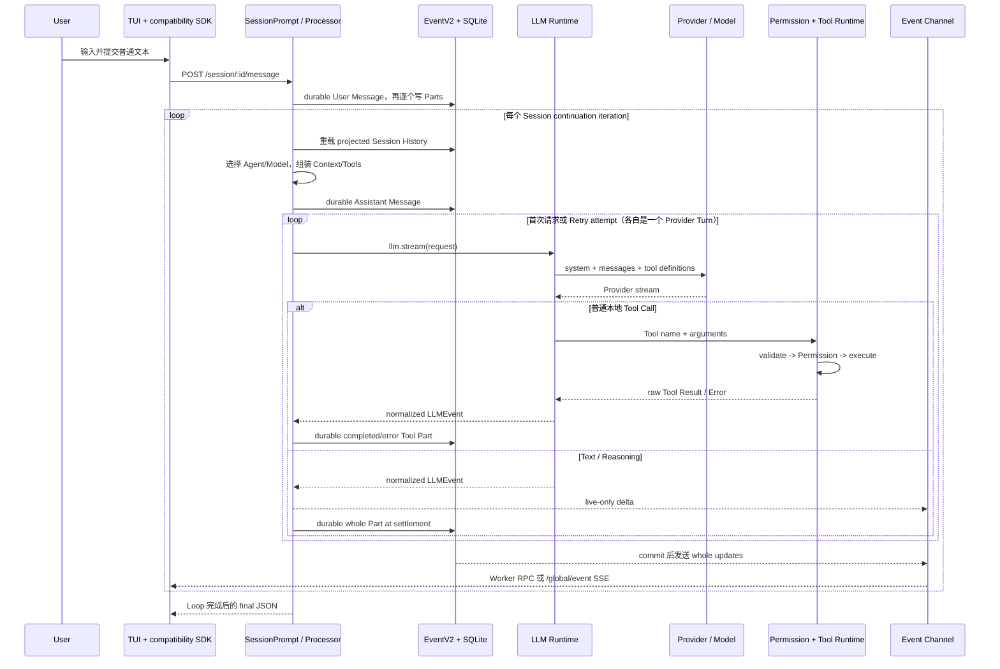

# OpenCode Agent Harness 总览

> **核对日期**：2026-08-18  
> **固定源码**：`0e3474509aa5ad16afcf9c439785514d6443c6af`（`dev`）  
> **验收状态**：任务 8 按用户指示跳过，未进行 Teach-back 或用户理解验收；任务 6 尚未完成最终交叉审计。本文据固定源码、当前端到端 trace、专题文档 07-12 与任务 7 代表性验证给出总览，不把未验收或未实测部分写成已完成。

专题导航：[07 Runtime 术语](./07_OpenCode_Runtime_Terminology.md) · [08 Agent 与 Orchestration](./08_Agent_and_Orchestration.md) · [09 Context 与 Persistence](./09_Context_and_Persistence.md) · [10 Tools 与 Security](./10_Tools_and_Security.md) · [11 Runtime Boundary](./11_Runtime_Boundary.md) · [12 V1/V2 对照](./12_V1_V2_Comparison.md)

## 1. Harness 是什么

OpenCode 的 Agent Harness 是包围模型的一套运行时控制系统。它把一次自然语言请求变成可观察、可授权、可持久化并可能跨多个提供商轮次（Provider Turn）继续的编码工作流。它主要负责：

- 根据 Session 和输入选择 Agent、Model 与行为策略。
- 为每轮 Provider Request 组装 system-level 内容、会话历史（Session History）和 Tool definitions。
- 接收模型生成的 Text、Reasoning 与工具调用（Tool Call），验证并调度真正的 Tool executor。
- 执行权限（Permission）、结果结算（Tool Settlement）、历史重载、重试、压缩、中断和停止判断。
- 用 Session、Message、Part、Event 与 projection 保存已确认的事实，并把实时变化送到 Client。

Harness **不是模型本身**，也不是单个 Prompt、Tool Registry、Session 表或 HTTP Server。它是这些模块围绕模型形成的控制面与执行循环。

### 1.1 本系列的范围

本文及 07-12 只讨论 OpenCode 内部 Agent Harness：Agent/Model、Orchestration、Context、Session/Persistence、Tools/Permission、Compaction/Recovery，以及 Client/Server/Provider/Event 如何支撑这条链路。

以下内容不在本系列展开：

- 泛化的 Harness Engineering 方法论或所有“对 Agent 友好”的仓库工程实践。
- OpenCode 安装、模型部署、Server 运维、反向代理和容器操作。
- Skill、MCP、Plugin 与 Custom Tool 的安装教程。
- 模型内部如何推理，以及 Provider 自身的训练、调度和安全机制。

## 2. 最短心智模型

> **Model 提议，Harness 控制，Tools 执行，Session/Event 保存，Client 展示。**

| 角色          | 最短职责                                          | 不能误解为                                  |
| ------------- | ------------------------------------------------- | ------------------------------------------- |
| Model         | 生成 Text、Reasoning 或 Tool Call 意图            | 直接读取、修改文件或运行命令                |
| Harness       | 选择策略、构造请求、授权、编排 continuation/stop  | 模型内部的“思考”                            |
| Tools         | 在 OpenCode 或外部受管执行端完成真实 I/O 和副作用 | 模型输出的一段 JSON 就等于已执行            |
| Session/Event | 保存 durable 领域事实并形成可查询 projection      | 每个 token 都已持久化，或崩溃后必然自动续跑 |
| Client        | 提交输入、订阅事件、hydrate 状态并渲染            | Provider Stream 或持久化数据库本身          |

对普通本地 Tool，模型只提出名称和参数；OpenCode 才验证、请求 Permission 并调用 executor。只有标记为 `providerExecuted` 的 hosted tool 由 Provider 执行。**模型不直接操作文件。**

Permission 也不是操作系统沙箱（OS Sandbox）：它是 OpenCode 应用层对受管 action/resource 的策略门，不会降低 OpenCode 进程在操作系统中的真实权限。Plugin、Custom Tool、本地 MCP Server 和 `bash` 的系统级隔离仍需要低权限账户、容器、虚拟机或其他平台机制。详见 [10 Tools 与 Security](./10_Tools_and_Security.md)。

## 3. 当前版本边界：两条 Prompt 路径共存

固定 SHA 下，当前 executable 同时合并兼容路由与 native `/api` 路由，但默认 TUI 普通消息仍走兼容 Session Runtime：

下面两条调用链中的节点依次是 Client SDK、HTTP route、Session Handler、Session Core 入口和执行器；返回节点分别表示 compatibility 的 final Assistant JSON 与 native V2 的 durable admission receipt。

```text
当前默认 TUI：
client.session.prompt
-> POST /session/:id/message
-> SessionHttpApi.prompt
-> SessionPrompt.prompt / SessionPrompt.loop
-> Loop 完成后返回 final SessionV1.WithParts JSON

显式 native V2：
client.v2.session.prompt
-> POST /api/session/:id/prompt
-> native Session Handler
-> V2Session.prompt
-> durable SessionInput.Admitted receipt
-> resume !== false 时 advisory wake
-> SessionRunner
```

两条链路彼此独立编排。关键区别不是 URL 上有没有 `v2` 字样，而是输入何时持久化、何时进入模型可见历史、由哪个 Runner 编排，以及 POST 返回 final Assistant 还是 admission receipt；native 路径的 Core 入口是 `V2Session.prompt`，不能与当前路径的 `SessionPrompt.prompt` 混写。

当前旧 Session Runtime 已复用 `EventV2`、Core Projector、统一 LLM Event 和组合 Router。**复用 EventV2 不等于 V2 已接管 Session Orchestration。**同理，文件名含 `v2`、使用 Effect、启用旧 Loop 下的 Native LLM Adapter，均不能单独证明当前 TUI 已进入 native V2。

关键入口证据（均为固定 SHA）：

- `packages/tui/src/component/prompt/index.tsx:1092-1146`，`submitInner` 普通消息分支调用 `sdk.client.session.prompt`。
- `packages/opencode/src/server/routes/instance/httpapi/handlers/session.ts:295-309`，`SessionHttpApi.prompt` 等待 `SessionPrompt` 完成。
- `packages/opencode/src/session/prompt.ts:1052-1071,1081-1347`，`SessionPrompt.prompt`、`run`、`loop`。
- `packages/server/src/handlers/session.ts:139-171`，native `session.prompt` Handler。
- `packages/core/src/session.ts:360-386`，`V2Session.prompt` 的 admission 与 optional wake。

完整 API、Worker RPC、HTTP/SSE 与 Embedded 边界见 [11 Runtime Boundary](./11_Runtime_Boundary.md)。

## 4. 参与模块图

先区分图中的参与者和节点：User 提供输入；Client/TUI 负责提交与显示；Router、Handler 和 Session Orchestrator 构成 Harness 控制面；Provider/Model 生成响应投影；Tool Runtime 执行受管副作用；EventV2、Projector 与 SQLite 保存 durable 事实并向 Client 发布变化。这些是逻辑角色，不必一一对应独立 OS 进程。默认本地 TUI 通过 Bun Worker RPC 调用同一 Router 的内存 `fetch`；远程 `attach` 才在 TUI 与 executable 之间使用网络 HTTP/SSE。

```text
User
  |
  v
Client / TUI
  |  Prompt POST                         ^  live events / hydration
  v                                      |
Executable Router + Session Handler -----+
  |
  v
Session Orchestrator
  |-- Agent / Model selection
  |-- Session History + Context assembly
  |-- Tool materialization + Permission
  |-- Retry / Compaction / Interrupt / Stop
  |
  +---------------------> Provider / Model
  |                         |
  |                         +-- Text / Reasoning
  |                         +-- Tool Call proposal
  |                                  |
  |                                  v
  |                         Tool Runtime / MCP / hosted tool
  |                                  |
  |<------------------------- raw Tool Result / Error
  |
  v
EventV2 + Projector + SQLite
  |
  +-- durable Message / Part / Event / sequence
  +-- live notification -> Bridge / GlobalBus -> Worker RPC or SSE -> TUI
```

Provider 通常位于网络另一端，普通本地 Tool Runtime 通常与 Harness 位于 OpenCode Server 运行时内。

| 模块                | 当前默认主实现                                                  | 核心问题                             |
| ------------------- | --------------------------------------------------------------- | ------------------------------------ |
| Client/Server       | TUI、兼容 SDK、Worker fetch、兼容 Session Handler               | 输入如何进入，进度与最终结果如何返回 |
| Agent/Orchestration | `Agent`、`SessionPrompt`、`SessionRunState`、`SessionProcessor` | 谁选择行为，何时继续或停止           |
| Context/Persistence | system/request prep、Message/Part、EventV2、Projector、SQLite   | 模型本轮看到什么，系统实际保存什么   |
| Tools/Security      | Tool Registry、`SessionTools`、Permission、executors            | Tool 如何可见、授权、执行和结算      |
| Provider Boundary   | LLM Runtime、AI SDK 或可选 Native Adapter                       | 如何把请求和 Provider Stream 归一化  |
| native V2           | Protocol/Server/Core Runner、typed Context/Tool/Event           | 新边界已实现多少，哪些 parity 仍缺失 |

## 5. 一次普通 TUI 文本请求的完整时序

本节只追踪默认 TUI 中的一条普通文本消息，不把 Slash Command、Shell mode、`opencode run` 或 native V2 Client 混入主线。

先区分时序图中的参与者：U 是 User；T 是 TUI 与 compatibility SDK；H 是 `SessionPrompt`/`SessionProcessor`；DB 是 EventV2 projection 与 SQLite；R 是 LLM Runtime；P 是 Provider/Model；X 是 Permission 与 Tool Runtime；E 是回送 TUI 的事件通道。本文严格把一次 Provider Request 及其响应投影定义为一个 Provider Turn；Retry 的每次物理 Provider Request 都形成不同的 Provider Turn，即使它们共享同一 Assistant Message 和 `SessionProcessor` context。



### 5.1 输入与持久化

1. TUI 收集 Text、附件、Agent、Model 和 Variant，调用 `client.session.prompt(...)`。它不等待 Promise 才清空输入和继续渲染；错误由 Promise handler 报告，进度主要依赖事件通道。
2. 兼容 SDK 把请求编码为 `POST /session/:id/message`。默认本地模式经 Worker RPC 调用 `Server.Default().app.fetch`，经过完整 Router/Handler，但不等于 TCP 请求。
3. `SessionPrompt.prompt` 清理必要的 Revert 状态，解析输入并创建 User Message/Parts。Message 先作为 durable event 提交，各 Part 再逐项提交；它们不在一个共同事务中，所以中途失败理论上可留下部分输入。
4. EventV2 在 SQLite transaction 中运行 Projector、推进 sequence 并写 event row，commit 后才通知 listener。核心事务证据是 `packages/core/src/event.ts:205-438` 的 `commitDurableEvent`、`publishEvent` 与 `notify`。

### 5.2 Agent、Model、Context 与 Tools

5. `SessionPrompt.loop` 通过 `SessionRunState.ensureRunning` 汇合同一 Session 的并发调用者，再进入 `SessionPrompt.run` 的显式 `while (true)`。
6. 每个 Session continuation iteration 先从 SQLite projection 重载经过 Compaction 选择的 Session History，并据最新 User Message 选择 Agent、Model 与 Variant。由 Retry 发起的后续 Provider Turn 留在同一 Assistant/Processor context 内，不重新经过这一步。Agent 是包含 prompt、model preference、Permission、steps 等信息的行为配置，不是 Model 的别名。
7. Harness 创建并持久化本轮 Assistant Message，然后组装请求。逻辑上应分成三个边界：system/privileged instructions、chronological messages、独立 Tool definitions。当前旧路径会按本轮观察结果拼接 Environment、Project/MCP/Skill instructions 等 system-level 内容；它没有 native V2 的 typed 上下文快照（Context Snapshot）或上下文纪元（Context Epoch）。
8. Tool Registry 和 `SessionTools.resolve` 为本轮物化候选工具；Agent/Session/per-prompt 规则决定 catalog visibility。工具被发送给模型只表示“可提议调用”，不表示资源级 Permission 已通过。

### 5.3 Provider、Tool 与下一轮

9. 默认旧路径由 `LLM.run` 调用 AI SDK `streamText`；专用实验 flag 可选择旧 Loop 下的 Native Adapter。Provider 返回的流被归一化为 Text、Reasoning、工具调用（Tool Call）、raw Tool Result event、Usage、Finish 等 `LLMEvent`。一次物理 Provider Request 与其响应投影严格构成一个 Provider Turn；Retry 不创建新的 Assistant Message 或 Processor，但每次 Retry request 都是新的 Provider Turn。
10. 普通本地 Tool Call 在 OpenCode 一侧经过参数验证、Plugin hooks、leaf Permission 和 executor。文件读取、编辑与命令执行发生在 Tool Runtime，而不是模型中。`SessionProcessor` 把 Tool Part 从 pending/running 结算为 completed 或 error，并 durable 保存 whole Part。
11. Tool Settlement 形成 completed/error terminal state 和 Model Tool Output 后，外层 Loop 回到顶部并重新读取 durable history；下一次 Provider Request 才把模型工具输出作为历史发给模型。一次用户请求因此可包含多轮“模型提议 -> Tool 执行 -> 结果结算与保存 -> 模型继续”。
12. `SessionProcessor.process` 返回 `continue`、`compact` 或 `stop`。普通最终文本通常先返回 `continue`；Loop 顶部随后确认最新 Assistant 已完成、对应最新 User Message，且没有需要 continuation 的本地 Tool Part，才不再调用 Provider 并退出。Provider finish reason、Todo 状态和旧 `agent.steps` 都不能单独决定停止。

关键实现证据（固定 SHA）：

- `packages/opencode/src/session/prompt.ts:1081-1339`，`SessionPrompt.run` 的 history reload、Agent/Model、Context/Tools、Provider Turn 和 terminal check。
- `packages/opencode/src/session/tools.ts:41-134`，`SessionTools.resolve` 的 Tool materialization、hooks 与执行上下文。
- `packages/opencode/src/session/processor.ts:278-683`，`handleEvent`、`cleanup`、`process` 的流处理、Tool Part 结算与 continuation 结果。
- `packages/opencode/src/session/llm/request.ts:56-214`，`LLMRequestPrep.prepare` 与 `resolveTools`。

### 5.4 实时事件与最终 POST 是不同通道

兼容 Prompt Handler 要先等待整个 `SessionPrompt` Loop，再把 final `SessionV1.WithParts` 序列化为一个 JSON body。源码虽然使用 `HttpServerResponse.stream(Stream.make(...))`，其中也只有完成后的单个字符串，**不是 token stream**。

TUI 提前显示 Text、Reasoning 和 Tool 状态依赖另一条路径：

下面链路的节点依次是 Processor、durable Event、compatibility bridge、进程内 event bus、Worker RPC 或 SSE transport，以及 TUI reactive store。

```text
SessionProcessor
-> EventV2
-> EventV2Bridge / compatibility event
-> GlobalBus
-> Worker RPC event（本地）或 /global/event SSE（网络）
-> TUI reactive store
```

因此，实时事件和最终 POST 是不同通道。事件连接断开不会自动取消 Prompt POST；POST 失败也不自动回滚已持久化输入或 Tool 副作用。兼容 SSE 没有 durable cursor replay，断线窗口要靠后续 GET hydration 恢复 durable whole state，live-only delta 无法补回。详见 [11 Runtime Boundary](./11_Runtime_Boundary.md)。

## 6. 状态分类

| 分类              | 代表状态                                                                                                                                  | 能否作为恢复依据               | 主要限制                                          |
| ----------------- | ----------------------------------------------------------------------------------------------------------------------------------------- | ------------------------------ | ------------------------------------------------- |
| **durable**       | Session、User/Assistant Message、whole Part、durable Event/sequence、Usage/Error、Compaction/Revert/代码工作树快照（代码 Snapshot）引用   | 可从 SQLite 或受管文件对象重读 | 不等于永久保留、模型当前可见或自动续跑            |
| **process-local** | `SessionRunState` Runner、Processor accumulator、Tool Deferred、旧 Permission pending/approved、GlobalBus、native coordinator/Tool fibers | 只在当前进程协调运行           | 重启清空；不能提供跨进程 ownership                |
| **live-only**     | `message.part.delta`、部分 status/error/permission 通知、heartbeat；native Text/Reasoning/Tool Input Delta                                | 只供当前订阅者低延迟观察       | 不写 durable event row，断线和硬崩溃后不能 replay |

一个 durable whole Message/Part 也会在 commit 后通过 live transport 通知 Client，所以“durable”和“当前通过事件通道发送”可以同时成立。反过来，UI 已显示某段 delta，不代表该后缀已经 whole-save 到数据库。

native V2 进一步将 Prompt admission/promotion、`Tool.Called`、工具终态与模型工具输出、Text/Reasoning Started/Ended 和 completed Compaction checkpoint 建模为 durable facts；工具结算（Tool Settlement）是产生这些终态的过程，本身不是一条可重读的 fact。会话执行排空（Session Drain）、coordinator 与 Tool fibers 仍是 process-local。完整状态与压缩边界见 [09 Context 与 Persistence](./09_Context_and_Persistence.md)。

## 7. 失败与可靠性概览

下表的源码证据均对应固定 SHA `0e3474509aa5ad16afcf9c439785514d6443c6af`；每项列出路径、符号与行号。

| 失败边界               | 当前行为                                                                                                                                                 | 不能保证什么                                                  | 关键证据                                                                                                                                                                                                                            |
| ---------------------- | -------------------------------------------------------------------------------------------------------------------------------------------------------- | ------------------------------------------------------------- | ----------------------------------------------------------------------------------------------------------------------------------------------------------------------------------------------------------------------------------- |
| 输入写入失败           | 旧路径 Message 与各 Part 分别提交                                                                                                                        | 不能保证整条输入原子写入                                      | `packages/opencode/src/session/prompt.ts:1052-1071`，`SessionPrompt.prompt`                                                                                                                                                         |
| Provider 可重试错误    | 旧路径在同一 Assistant Message 和 `SessionProcessor` context 内按策略 Retry，最多安排 5 次；每次物理 Provider Request 及其响应投影都是不同 Provider Turn | 已投影的部分输出不一定无痕；native V2 尚无一般 Retry parity   | `packages/opencode/src/session/processor.ts:627-676`，`SessionProcessor.process`；`packages/opencode/src/session/retry.ts:84-205`，`retryable/policy`；`packages/core/src/session/runner/llm.ts:43-90`，Retry TODO                  |
| Permission deny/reject | 阻止受管 executor，可能让当前 Loop blocked/stop                                                                                                          | 不是 OS Sandbox，也不撤销 Plugin 已有进程权限                 | `packages/opencode/src/permission/index.ts:18-167,204-219`，`evaluate/ask/reply/visibleTools`                                                                                                                                       |
| Tool/Provider error    | 保存 Assistant Error 或 error Tool Part，按 Processor/Loop 规则停止或继续                                                                                | 外部副作用与数据库 settlement 不是原子事务                    | `packages/opencode/src/session/processor.ts:315-683`，`handleEvent/cleanup/process`                                                                                                                                                 |
| Interrupt              | 中断当前 process-local Runner/stream，尽力 whole-save，并封口未完成 Tool                                                                                 | 不回滚已修改文件、已启动命令或远端副作用                      | `packages/opencode/src/session/run-state.ts:77-86`，`cancel`；`packages/opencode/src/session/processor.ts:539-683`，`cleanup/process`                                                                                               |
| Context overflow       | 当前旧路径可 Compaction；`auto=false` 时保存 overflow error 并停止                                                                                       | Compaction 是有损 active-history 替换，不是完整记忆           | `packages/opencode/src/session/overflow.ts:22-34`，`isOverflow`；`packages/opencode/src/session/processor.ts:599-625`，`SessionProcessor.halt`                                                                                      |
| Client 断线            | 兼容事件流重连并可后续 hydrate durable whole state                                                                                                       | 无 cursor replay，live-only 后缀可能丢失                      | `packages/tui/src/context/sdk.tsx:82-117`，`startSSE`；`packages/tui/src/context/sync.tsx:451-667`，bootstrap/hydration                                                                                                             |
| 进程崩溃               | durable history 可重读；遗留 Tool 可被封口                                                                                                               | 两条路径都没有安全的自动 post-crash continuation              | `packages/opencode/src/session/prompt.ts:96-100,1103-1129`，`isOrphanedInterruptedTool`/terminal check；`packages/core/src/session/runner/llm.ts:119-139`，`failInterruptedTools`；`specs/v2/session.md:165-185`，Recovery deferred |
| 多进程执行             | Event 可 durable 排序                                                                                                                                    | native clustered ownership、fencing 与跨进程 interrupt 仍缺失 | `packages/core/src/session/execution/local.ts:10-46`，`SessionExecutionLocal`；`packages/core/src/session/run-coordinator.ts:24-104`，`SessionRunCoordinator.make`                                                                  |

“可恢复读取”比“自动续跑”窄。要安全重放 Provider 或 Tool 工作，还需要判断请求是否已送达、外部副作用是否已发生、settlement 是否提交以及哪个进程拥有执行权；固定 SHA 没有完整解决这些歧义。

## 8. V1/V2 迁移概览

本文中的 V1/V2 是架构与兼容性标签，不是产品版本号。当前准确状态是：

> **旧 Session Orchestration + compatibility contracts + 共享新基础设施 + 可达但尚未接管 TUI 的 native V2 slice。**

下表的源码证据同样对应固定 SHA `0e3474509aa5ad16afcf9c439785514d6443c6af`；`implemented`、`partial` 与 `missing` 分别按实际接线判定，不用同名数据字段代替执行能力。

| 模块                             | native V2 已实现的边界                                                                           | Partial / Missing                                                       | 关键证据                                                                                                                                                                                                                        |
| -------------------------------- | ------------------------------------------------------------------------------------------------ | ----------------------------------------------------------------------- | ------------------------------------------------------------------------------------------------------------------------------------------------------------------------------------------------------------------------------- |
| Prompt/Execution                 | durable admission、Prompt admission exact retry、promotion、steer/queue、local Runner            | 当前 TUI 未接线；clustered/durable execution 缺失                       | `packages/core/src/session.ts:360-386`，`V2Session.prompt`；`packages/core/src/session/execution/local.ts:10-46`，`SessionExecutionLocal`                                                                                       |
| Context/History                  | typed Context Sources、baseline/snapshot、Context Epoch、chronological update、history cutoff    | 旧 context 来源 parity、move reset、Revert/Epoch 交互不完整             | `packages/core/src/system-context/index.ts:21-80,131-320`，`Source/Snapshot/initialize/reconcile/replace`；`packages/core/src/session/context-epoch.ts:23-174`，`initialize/prepare/advance`                                    |
| Persistence/Event/Crash recovery | native projections、durable Session cursor/history、Started/Ended settlement、orphan closure     | live delta 仍不可重放；post-crash continuation 缺失                     | `packages/core/src/event.ts:152-164,205-438`，`allBounded/commitDurableEvent/publishEvent/notify`；`packages/core/src/session/runner/llm.ts:119-139`，`failInterruptedTools`；`specs/v2/session.md:165-185`，Recovery deferred  |
| Tools/Permission                 | typed Registry、stale identity、durable settlement、project-saved approval、generic output bound | Custom/Plugin/MCP/StructuredOutput 与部分 built-ins parity 不完整       | `packages/core/src/tool/registry.ts:50-82,106-121`，`settleWith/materialize`；`packages/core/src/tool/builtins.ts:18-48`，`BuiltInTools.node`/remaining-port TODO；`packages/core/src/plugin/host.ts:20-219`，`PluginHost.make` |
| Agent/Orchestration              | Agent Registry、continuation、强于旧路径的 steps allowance                                       | Agent request policy、Plan/Build workflow、一般 Retry、Doom Loop 不完整 | `packages/core/src/session/runner/llm.ts:43-90,173-406`，parity TODO/`runTurnAttempt`/`SessionRunner.run`                                                                                                                       |
| Todo                             | `SessionTodo` 与 permission-checked `todowrite` implemented                                      | 不代表 Task 或子代理（Subagent）已实现                                  | `packages/core/src/session/todo.ts:26-78`，`update/get`；`packages/core/src/tool/todowrite.ts:25-62`，`todowrite`                                                                                                               |
| Task/Subagent                    | 无                                                                                               | Task Tool、父子 Session/Subagent 结果回传和 background dispatch missing | `packages/core/src/tool/builtins.ts:18-48`，remaining-port TODO；`packages/core/src/session.ts:79-84,208-262`，`CreateInput/create`；旧路径对照 `packages/opencode/src/tool/task.ts:81-347`，`TaskTool.execute/runTask`         |
| Client/UI                        | native Protocol/Server/Client、live API、per-session durable cursor、embedded sdk-next           | 当前 TUI 的 native prompt/event/store integration missing               | `packages/tui/src/component/prompt/index.tsx:392-421,1092-1146`，interrupt/`submitInner`；`packages/tui/src/context/sdk.tsx:23-131`，SDK/SSE；`packages/tui/src/context/sync.tsx:321-415,594-667`，reducer/hydration            |

V2 的改进应落到具体不变量，如 admission 与 execution 分离、typed Context、durable Tool identity 和 cursor；不能因为“模块更多”或“使用 Effect”就笼统宣称更可靠。反过来，当前旧路径仍在 Provider coverage、Plugin/MCP/Custom Tool、StructuredOutput、Task/Subagent 和成熟 TUI 集成上覆盖更广。完整迁移表见 [12 V1/V2 对照](./12_V1_V2_Comparison.md)。

## 9. 07-12 阅读目标与各篇覆盖内容

阅读目标是先建立严格术语和双路径边界，再分别理解编排、状态、工具安全、运行时连接与迁移状态。各篇覆盖内容如下。

| 文档                                                             | 各篇覆盖内容                                                                                                                                                                    |
| ---------------------------------------------------------------- | ------------------------------------------------------------------------------------------------------------------------------------------------------------------------------- |
| [07 OpenCode Runtime 术语](./07_OpenCode_Runtime_Terminology.md) | System Context、Session History、Context Source/Snapshot/Epoch、Provider Turn、Session Drain、Prompt Admission/Promotion、Tool Settlement 和 Checkpoint 的严格定义与禁用混写。  |
| [08 Agent 与 Orchestration](./08_Agent_and_Orchestration.md)     | Agent/Model 边界，多 Provider Turn 的来源，以及 Todo、Task、Subagent、Retry、Interrupt、Doom Loop、steps 和停止条件的协作关系。                                                 |
| [09 Context 与 Persistence](./09_Context_and_Persistence.md)     | 模型可见内容，Message/Part/Event 保存方式，durable/process-local/live-only 分类，以及 Compaction、Pruning、代码工作树快照（代码 Snapshot）、Context Snapshot 和 Revert 的边界。 |
| [10 Tools 与 Security](./10_Tools_and_Security.md)               | `read` Tool Call 的注册、物化、授权、执行、截断、结算与回传，以及 Permission、OS Sandbox、Plugin、MCP 和 Custom Tool 的信任边界。                                               |
| [11 Runtime Boundary](./11_Runtime_Boundary.md)                  | 本地 Worker fetch、远程 HTTP/SSE、Provider、Tool Runtime、EventV2/Bridge/GlobalBus、TUI Store、实时事件、最终 POST 与两个 Prompt API 的连接和返回语义。                         |
| [12 V1/V2 对照](./12_V1_V2_Comparison.md)                        | 各模块的 implemented/partial/missing 状态、compatibility 共存方式，以及能力进入当前调用链所需的证据。                                                                           |

推荐首次深入的顺序是 `06 -> 07 -> 08 -> 09 -> 10 -> 11 -> 12`。若正在排查具体调用链，可先从 11 确认入口，再回到 08-10 查看编排、状态或 Tool 细节。

## 10. 版本、证据与任务 7 限制

本文只对固定 commit `0e3474509aa5ad16afcf9c439785514d6443c6af` 下的源码和 2026-08-18 记录负责。行号、默认入口、V2 parity 与测试结果不能静默外推到后续版本。

### 10.1 精简验证摘要

任务 7 使用 Bun fixtures、fake/mock LLM、临时 SQLite 和临时目录，没有真实 Provider 密钥、付费请求或真实外部 MCP。完整命令、逐项数字与实验过程只保留在四份研究记录：[Agent 与 Orchestration](./research/10_Research_Agent_and_Orchestration.md)、[Context 与 Persistence](./research/11_Research_Context_and_Persistence.md)、[Tools 与 Security](./research/12_Research_Tools_and_Security.md) 和 [Runtime Boundary](./research/13_Research_Runtime_Boundary.md)。本总览只保留最重要发现：

- Agent/Orchestration 的隔离实验确认旧 `steps: 1` 不是硬调用上限，仍可发生至少 3 次 Provider 调用且请求携带 Tools；这不证明无限循环。
- Context/Persistence 的代表性 slice 支持 durable Event、admission/promotion、Context Epoch、checkpoint、Compaction/Revert/代码工作树快照（代码 Snapshot）等边界可运行，但未覆盖 hard crash 或完整 Epoch 交互。
- Tools/Security 的隔离实验确认旧 Registry Tool 的 after hook 可在通用 Truncate 后重新放大输出；实验未跑完整 Provider -> Tool Part -> SQLite -> 下一请求链。
- Runtime Boundary 的代表性 slice 支持 route composition、TUI hydration race 防护和 native admission receipt 的有限合同，但未动态证明完整 compatibility POST 时序、真实网络或 post-crash continuation。

这些结果不能合并成“整个 Harness 全部通过”，也不能外推到真实 Provider、真实网络、完整 TUI 端到端或跨进程恢复。

### 10.2 已知测试 Harness 失败

- `packages/opencode/test/server/httpapi-sdk.test.ts` 独立和串行复核仍失败，并出现本地 Effect test server 的 502/空 response、SSE timeout 和 test 间 unhandled error。compatibility fake-LLM filter 也在取得 `prompt.data` 前失败，因此 compatibility POST 等待 final Assistant 的结论主要来自固定 Handler 控制流，不是完整动态时序证据；这些 Harness 失败也不足以证明产品 Prompt/SSE 语义有缺陷。
- `packages/sdk-next/test/embedded.test.ts` 整文件稳定失败，指向首个测试删除临时数据库后 module-global DB/layer 仍引用旧路径并触发 `SQLITE_CANTOPEN`；各测试在独立进程过滤时可通过。这是测试生命周期污染证据，既不能写成 sdk-next 产品语义失败，也不能抹去整文件失败。
- Agent 组跑中的取消用例曾超时但定向复跑通过；`steps` 临时实验也受测试 timeout 影响。它们说明 Harness/时序存在验证限制，不能证明竞态不存在，也不能把 timeout 当成产品断言失败。

### 10.3 未验证与流程限制

- 未运行真实或付费 Provider、真实外部 MCP 和完整网络部署实验。
- 未运行 hard-crash 后缀恢复、自动 post-crash continuation、跨进程 ownership/fencing 实验。
- 未完整验证 compatibility POST 与实时 Event 的动态到达顺序、主动 SSE 断线/cursor 重连，以及 fetch cancel、Session interrupt 与 Tool settlement 的交叉组合。
- 未验证 V2 `auto=false + Provider overflow`、Message/Parts 中途故障注入、Session move/Revert 与 Context Epoch 的完整交互。
- 任务 6 尚未完成最终交叉审计；任务 8 已按指示跳过且未验收。因此本文是固定版本的源码与代表性测试总览，不是完整形式化验证或用户理解通过记录。
