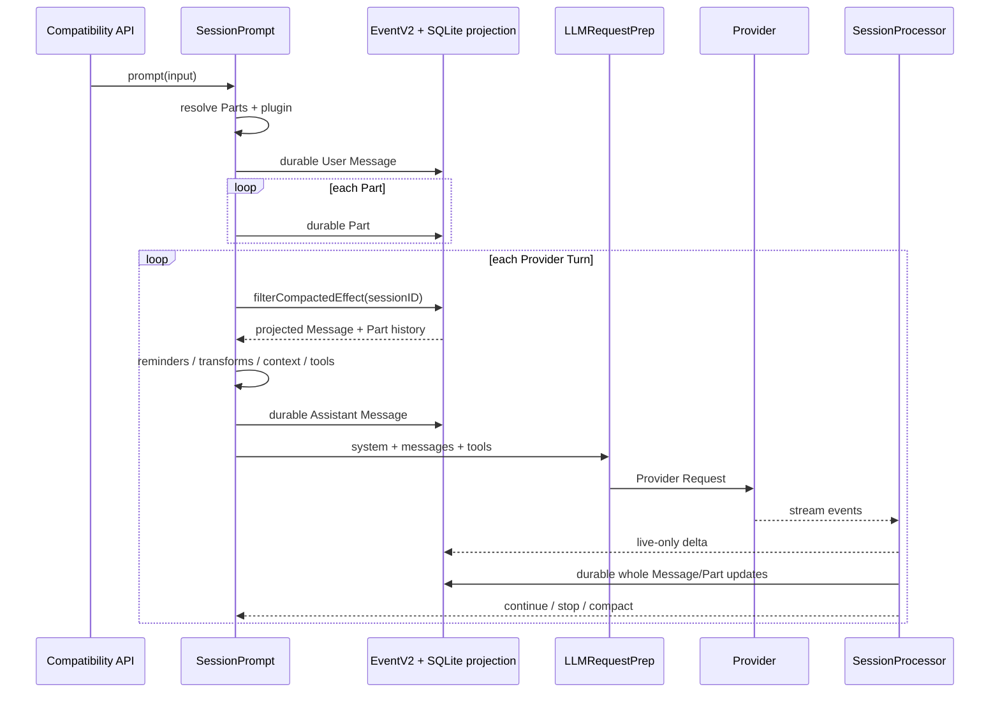

# Context 与 Persistence：长会话中模型看见什么、系统保存什么

> 核对日期：2026-08-18  
> 固定源码版本：`0e3474509aa5ad16afcf9c439785514d6443c6af`（`dev`）  
> **当前默认**：默认 TUI 普通消息经兼容 Session API 进入 `SessionPrompt.prompt -> SessionPrompt.loop` 的旧 Session Runtime。  
> **native V2**：经 `/api/session/:sessionID/prompt` 进入 `V2Session.prompt -> SessionExecution -> SessionRunner` 的 Effect-native 路径。文件名含 `v2`、使用 Effect 或复用 EventV2，均不能单独证明默认 TUI 已进入此路径。  
> **审计与验收状态**：任务 6 最终交叉审计尚未完成；任务 7 已完成代表性测试与一个旧运行时定向验证；任务 8 按要求跳过，**未作理解验收**。本文不声称 Teach-back 已通过。

## 前置阅读

建议先读 [上一篇：Agent 与 Orchestration](./08_Agent_and_Orchestration.md)，理解会话循环（Session Loop）、提供商轮次（Provider Turn）和 Tool continuation。本文沿着同一条执行链设定四项学习目标：

1. 识别模型在一次 Provider Turn 中实际接收的请求边界。
2. 区分 OpenCode 的持久化状态、进程内状态与只存在于实时连接中的状态。
3. 解释 raw/domain Tool Result 经结算形成 durable terminal state 与模型工具输出（Model Tool Output）后，下一轮和进程重启能够恢复的状态及其限制。
4. 说明上下文压缩（Compaction）后模型可见内容与持久化历史的变化。

读完后可继续阅读 [下一篇：Tools 与 Security](./10_Tools_and_Security.md)，理解 Tool schema、权限判断与真实副作用的边界。

本章所有源码引用均固定到完整 SHA `0e3474509aa5ad16afcf9c439785514d6443c6af`。当前普通 TUI 路径的入口证据是：

- 文件：`packages/tui/src/component/prompt/index.tsx`；函数：`submitInner` 普通消息分支；位置：`1092-1146`；SHA：`0e3474509aa5ad16afcf9c439785514d6443c6af`。
- 文件：`packages/opencode/src/server/routes/instance/httpapi/handlers/session.ts`；函数：`SessionHttpApi.prompt`；位置：`295-309`；SHA：`0e3474509aa5ad16afcf9c439785514d6443c6af`。
- 文件：`packages/opencode/src/session/prompt.ts`；函数：`SessionPrompt.prompt`、`SessionPrompt.loop`；位置：`1052-1071`、`1343-1347`；SHA：`0e3474509aa5ad16afcf9c439785514d6443c6af`。
- V2 对照：`packages/core/src/session.ts`；函数：`V2Session.prompt`；位置：`360-386`；SHA：`0e3474509aa5ad16afcf9c439785514d6443c6af`。

## 1. 贯穿例子：即将超出 Context 的长会话

假设一个 Session 已经持续了 100 个 Provider Turns：

- 用户要求修复支付重试 Bug。
- Agent 读过 30 个文件，执行过多次测试，历史里有很长的 Bash 输出。
- 较早的历史已经做过一次压缩。
- 最近两轮修改了 `src/payment/retry.ts`。
- 用户现在输入：“保留已有行为，修复最后一个失败测试并解释原因。”
- 如果把全部历史、当前环境、工具定义和预留输出一并发送，本轮将超过模型的上下文窗口。

先给出结论，后文再逐层证明：

| 关注点 | 当前默认路径结论 |
| --- | --- |
| 本轮模型输入 | 本轮组装的 system-level 内容、经压缩和工具输出裁剪（Pruning）投影的会话历史（Session History）、当前用户输入，以及独立的 Tool schemas |
| 系统持久化内容 | User/Assistant Message、whole Parts、durable Events、SQLite projections、用量和代码工作树快照（Code Snapshot）引用；流式 delta 本身不持久化 |
| 下一轮恢复来源 | 外层 Loop 重新查询 SQLite 中投影的 Message/Part，而不是依赖上一轮的 JavaScript 消息数组 |
| 压缩后的模型损失 | 未进入摘要的旧细节、未保留的逐字旧 turns、旧媒体和被截断或 Prune 的 Tool output |
| 压缩后的存储保留 | 旧 Event、Message/Part、Compaction marker、摘要与边界通常仍在；“模型不可见”不等于“数据库已删除” |

这里的“Context”是解释模型请求时使用的通称，不应把所有相关数据都命名成系统上下文（System Context）。下一节先建立严格的概念边界。

## 2. 概念地图：六个不能互换的概念

先区分图中的三组节点：Provider Request 是最终请求边界；请求构造数据包括会话历史和两条 Runtime 各自的 system-level 状态；保存与复用机制则处理恢复、跨会话语义和文件状态。native V2 的结构化状态进一步由上下文源（Context Source）、上下文快照（Context Snapshot）和上下文纪元（Context Epoch）组成；它们不属于当前默认旧 Runtime。长期记忆（Long-term Memory）与代码工作树快照也不属于模型请求本身。

```text
某次 Provider Request（解释性总称）
├── system / initial instructions
├── chronological messages
└── tool schemas

用于构造请求的数据
├── Session History：为这一轮选出的时间序会话投影
├── 当前默认的 per-turn system-level 字符串来源
└── native V2 的 System Context、Context Snapshot、Context Epoch

保存与恢复机制
├── Persistence：Event、projection、Message/Part、checkpoint 等
├── 长期记忆：跨 Session 抽取、检索和复用语义记忆
└── 代码工作树快照：用于 diff/restore 的工作树状态
```

| 概念 | 准确定义 | 不等同于 |
| --- | --- | --- |
| 系统上下文（System Context） | native V2 中由一个或多个 typed Context Sources 组成的结构化集合；以初始 Baseline 和后续时间序更新呈现给模型 | 任意 System Prompt 字符串；完整 Provider Request；旧路径每轮拼接出的所有字符串 |
| 会话历史（Session History） | 应用 active Compaction 与 Context Epoch cutoff 后，为某次 Provider Turn 选出的 chronological projected conversation | System Context；Session Context；数据库全量记录 |
| 持久化（Persistence） | 让 Event、projection、Session、Message/Part、checkpoint 等跨调用或进程保存的机制 | 模型上下文窗口；自动继续执行；长期记忆 |
| 长期记忆（Long-term Memory） | 跨 Session 抽取、检索并复用语义信息的能力 | 单个 Session 的 SQLite history；项目中的 `AGENTS.md`；Compaction summary |
| 上下文快照（Context Snapshot） | native V2 中 model-hidden 的 JSON 比较状态，记录各 Context Source 最近一次 admitted value | 聊天记录副本；代码文件状态；代码工作树快照 |
| 代码工作树快照（Code Snapshot） | Git tree/index 形式的文件状态，用于 patch、diff、restore 和 Revert | Context Snapshot；Session History；模型缓存 |

根 `CONTEXT.md` 还定义了两个紧邻概念：

- 上下文源（Context Source）：带稳定 key、JSON codec、loader、baseline/update renderer 和可选 removal renderer 的独立 typed value。
- 上下文纪元（Context Epoch）：一个 immutable Baseline System Context 作为 provider-cache baseline 的有效跨度，而不是整个 Session 生命周期或一个 Provider Turn。

这些定义来自 `CONTEXT.md` 的正式语言与关系约束：符号 `Language`、`Relationships`；位置 `7-46`、`88-135`；SHA：`0e3474509aa5ad16afcf9c439785514d6443c6af`。实现对应 `packages/core/src/system-context/index.ts` 的 `Source`、`Snapshot`、`make`、`combine`、`initialize`、`reconcile`、`replace`，位置 `21-80`、`131-320`；同 SHA。

因此，本章对旧路径使用“system-level 内容”或源码字段 `system`，只在 native V2 的 typed abstraction 上使用正式术语 System Context。

## 3. 当前输入：一条用户消息不是一次原子写入

### 3.1 输入先解析，再逐项保存

当前路径中，`SessionPrompt.createUserMessage` 先选择 Agent/Model，解析 Text、File、目录、MCP Resource 和 Agent mention。所有 Parts resolve 完成后，代码运行 `chat.message` plugin hook、处理图片，再开始写入：

```ts
const resolvedParts = yield* Effect.forEach(input.parts, resolvePart, {
  concurrency: "unbounded",
})

yield* plugin.trigger("chat.message", /* ... */, {
  message: info,
  parts: resolvedParts,
})

yield* sessions.updateMessage(info)
for (const part of parts) yield* sessions.updatePart(part)
```

这段控制流说明：

1. Part resolve 和 plugin hook 在首次 durable write 之前完成。
2. User Message 是一次 durable event。
3. 每个 Part 又分别发布一次 durable event。
4. Message 与全部 Parts 没有被包进一个共同事务。

所以用户一句话在领域模型中不是单个不可分对象。若 Message 成功、第二个 Part 写入失败，理论上可能留下 Message 和第一个 Part。本文没有把这种静态控制流结论扩大成已完成的故障注入实验。

证据：`packages/opencode/src/session/prompt.ts`；函数 `SessionPrompt.createUserMessage`；位置 `635-1050`，关键 resolve/plugin/write 为 `995-1049`；SHA：`0e3474509aa5ad16afcf9c439785514d6443c6af`。

在贯穿例子中，最后一句话会成为 durable User Message，文本、附件或 synthetic file-read 内容成为独立 Parts。全部正常写入后，Session Loop 才开始请求模型。

### 3.2 Message 和 Parts 也不是 Provider Request

保存输入只建立 durable domain state。真正请求模型前还要：

- 重载并筛选 Session History；
- 计算当前 system-level 内容；
- 把 Message/Parts 降低为 provider 可接受的 messages；
- 物化和过滤 Tool schemas；
- 创建本轮 Assistant Message。

因此，“数据库里有什么”和“模型这一轮看到什么”是两个不同层次。

## 4. 当前默认路径：每个 Provider Turn 都重载历史

### 4.1 当前路径独立流程图

以下节点只描述当前默认旧 Session Runtime，不能与第 9 节的 native V2 节点拼接：

| 节点 | 职责 |
| --- | --- |
| Compatibility API、`SessionPrompt` | 接收输入并控制旧 Session Loop |
| EventV2、SQLite projection | 持久化 Message/Part，并为每轮提供可重载历史 |
| `LLMRequestPrep`、Provider | 组装并执行 Provider Request |
| `SessionProcessor` | 累积流、发布 live-only delta，并结算 durable whole Message/Part |



这张图只描述当前默认旧 Session Runtime，不表示 native V2。

### 4.2 重载发生在哪里

`SessionPrompt.run` 的显式 `while (true)` 每轮先执行：

```ts
let msgs = yield* MessageV2.filterCompactedEffect(sessionID)
const { user: lastUser, assistant: lastAssistant, finished: lastFinished, tasks } =
  MessageV2.latest(msgs)
```

`MessageV2.stream` 分页读 `message` projection，再 hydrate `part` projection；`filterCompacted` 选择 active model representation。代码不会简单沿用上轮的 `msgs` 并 append。

证据：

- `packages/opencode/src/session/prompt.ts`；函数 `SessionPrompt.run`，局部实现 `runLoop`；位置 `1081-1096`、`1288-1338`；SHA：`0e3474509aa5ad16afcf9c439785514d6443c6af`。
- `packages/opencode/src/session/message-v2.ts`；函数 `hydrate`、`page`、`stream`、`filterCompactedEffect`；位置 `98-123`、`425-490`、`521-575`；SHA：`0e3474509aa5ad16afcf9c439785514d6443c6af`。
- 测试：`packages/opencode/test/session/prompt.test.ts`；测试 `loop continues when finish is tool-calls`、`prompt submitted during an active run is included in the next LLM input`；位置 `825-850`、`1405-1468`；同 SHA。

这解释了贯穿例子的恢复行为：如果第一轮让 Bash 运行失败测试，raw Tool Result 被结算为 completed/error Tool Part 和 Model Tool Output 后，第二个 Provider Turn 会从 SQLite 重读这些持久化投影。恢复的权威来源是 whole Message/Part projection，不是第一次请求时的内存数组，也不是 UI 曾收到的 delta。

### 4.3 重载不代表原样直送

重载后的 domain state 还会被投影为 model-visible messages：

- 跳过没有 Parts 的 Message；
- 忽略 `ignored` 或空 User text；
- 将合适的附件读取结果转换为文本；
- 将已 Prune 的 Tool output 变成 `[Old tool result content cleared]`；
- 处理不同模型间不兼容的 reasoning/provider metadata；
- 将未结算 Tool 降低成 interrupted error，避免 dangling call；
- 应用最新 completed Compaction 的 summary 与 retained tail；
- 叠加本轮 reminder 和 `experimental.chat.messages.transform` 的变换。

这些 per-turn 变换不自动成为新的 durable Message/Part。只有显式 `updateMessage`、`updatePart` 或相应 durable event 才会推进 projection。

证据：`packages/opencode/src/session/message-v2.ts`；函数 `MessageV2.toModelMessagesEffect`、`filterCompacted`；位置 `131-415`、`521-571`；SHA：`0e3474509aa5ad16afcf9c439785514d6443c6af`。调用位置：`packages/opencode/src/session/prompt.ts`；函数 `SessionPrompt.run`；位置 `1170-1201`、`1252-1286`；同 SHA。

## 5. 模型这一轮看什么：System、Messages、Tool schemas

### 5.1 三个请求边界

可把一次模型请求理解为三个逻辑字段：

| 边界 | 作用 | 贯穿例子中的内容 |
| --- | --- | --- |
| System / privileged instructions | 规定身份、环境、项目规则与本轮上层约束 | Provider base 或 Agent prompt、环境、项目/MCP/Skill 指令、可选 per-prompt system |
| Messages | 呈现按顺序选择和转换的对话事实 | Compaction summary、retained tail、近期 Model Tool Output、当前用户输入 |
| Tool schemas | 告诉模型本轮可以调用哪些工具及参数结构 | 经过 Agent、Session permission 和 per-prompt override 过滤后的工具定义 |

Tool schema 描述“现在可以调用什么”；历史中的工具调用（Tool Call）与 Model Tool Output 描述“过去发生过什么”。历史中出现过 Bash 的 Model Tool Output，不保证本轮仍暴露 `bash` schema；schema 可见也不表示工具已经执行。

### 5.2 当前 system-level 内容的确定顺序

`SessionPrompt.run` 并发加载 Skills、Environment、Project Instructions、MCP Instructions 和 model messages，但数组位置与最终拼接顺序固定：

```text
Environment
-> Project Instructions
-> MCP Instructions
-> Skill guidance
-> Structured-output policy（启用时）
```

靠近 Provider 边界的 `LLMRequestPrep.prepare` 再在前后加入：

```text
Provider-family base instructions，或 Agent prompt（二选一）
-> Environment
-> Project Instructions
-> MCP Instructions
-> Skill guidance
-> Structured-output policy（启用时）
-> per-prompt user.system
-> experimental.chat.system.transform
```

Agent 有自定义 `prompt` 时，它替代 Provider base，不是与其叠加。最后的 plugin hook 可以改写整个 `system` 数组，所以 hook 之后不能再无条件保证原拼接形态。

证据：

- `packages/opencode/src/session/prompt.ts`；函数 `SessionPrompt.run`；位置 `1221-1286`，关键组装 `1255-1285`；SHA：`0e3474509aa5ad16afcf9c439785514d6443c6af`。
- `packages/opencode/src/session/llm/request.ts`；函数 `LLMRequestPrep.prepare`；位置 `56-146`；SHA：`0e3474509aa5ad16afcf9c439785514d6443c6af`。
- `packages/opencode/src/session/system.ts`；函数 `provider`、`SystemPrompt.environment`、`SystemPrompt.skills`、`SystemPrompt.mcp`；位置 `27-49`、`67-135`；同 SHA。
- 测试：`packages/opencode/test/session/system.test.ts`；provider prompt、Skill guidance、MCP instructions 测试；位置 `86-167`；同 SHA。

普通 AI SDK 路径会把 system messages 放在 chronological messages 之前；OpenAI OAuth 等适配路径可能编码到 provider options 的 `instructions`。这属于传输编码差异，不改变“System、Messages、Tools 是不同逻辑边界”的结论。

### 5.3 Tool schemas 独立过滤

`resolveTools` 合并 Agent permission 与 Session permission，再应用当前 User Message 的 `tools[name] !== false` override。最终工具 map 按名称排序，作为独立字段发送。

证据：`packages/opencode/src/session/llm/request.ts`；函数 `resolveTools`、`LLMRequestPrep.prepare`；位置 `148-184`、`208-214`；SHA：`0e3474509aa5ad16afcf9c439785514d6443c6af`。

### 5.4 回到长会话

在贯穿例子的这一轮，模型会看到：

1. 当前计算出的 base/Agent、Environment、Instructions、MCP 和 Skill 等 system-level 内容。
2. 上一次 Compaction summary。
3. `tail_start_id` 之后保留的近期逐字 history，包括最近对 `src/payment/retry.ts` 的操作。
4. Compaction 后的新消息和当前用户输入。
5. 本轮仍获授权的 Tool schemas。

如果较老的 Bash output 已被 Prune，模型只看到占位符；如果某项早期约束没有进入 summary 且不在 retained tail，它已经不再对未来模型可见，即使原记录仍在 SQLite。

## 6. 保存什么：durable、process-local 与 live-only

### 6.1 状态矩阵

| 状态 | 生命周期 | 保存位置或载体 | 下一轮 | 进程重启后 |
| --- | --- | --- | --- | --- |
| Session row | durable | SQLite `session` projection | 可读 | 可读 |
| User/Assistant Message | durable | Event + `message` projection | 可重载 | 可重载 |
| whole Text/Reasoning/Tool Part | durable | Event + `part` projection | 可重载 | 可重载到最近一次 whole write |
| aggregate sequence | durable | `event_sequence` | 保序 | 保序 |
| `message.part.delta` | live-only | Listener/PubSub/transport | 不作为权威 history | 不可重放 |
| Processor 累积文本、Tool deferred | process-local | `ProcessorContext` | 同进程内暂存 | 丢失 |
| Session Runner、Status map | process-local | `SessionRunState` 等 | 协调当前运行 | 清空 |
| TUI reactive store | client process-local | TUI 内存 | 可即时显示 | 需重新 hydrate |
| 代码 Snapshot object | durable filesystem object | OpenCode 管理的 Git dir，引用可写入 Part/Session | 可 diff/restore | 对象仍存在时可用 |
| Revert marker | durable | `session.revert` projection | 可继续 cleanup/unrevert | 可继续读取 |

“durable”只表示状态跨调用或进程保存，不表示 Harness 会自动恢复一个正在运行的 Session Loop，也不表示已经发送但结果未知的 Provider request 可以安全重放。

### 6.2 whole Part durable，delta live-only

Text/Reasoning 开始时，Processor 先创建一个空 whole Part。每个 delta 只追加到进程内累计字符串，并发布 live-only `message.part.delta`；在 `text-end` 或受控 cleanup 时，再 durable 写回完整 Part。Tool Part 则通过 whole updates 进入 pending、running、completed 或 error。

证据：

- `packages/opencode/src/session/processor.ts`；函数 `SessionProcessor.create` 内 `handleEvent`、`cleanup`；位置 `278-313`、`383-418`、`486-532`、`539-597`；SHA：`0e3474509aa5ad16afcf9c439785514d6443c6af`。
- `packages/opencode/src/session/session.ts`；函数 `Session.updatePart`、`updatePartDelta`；位置 `631-645`、`879-887`；同 SHA。
- `packages/schema/src/v1/session.ts`；符号 `PartUpdated`、`PartDelta`；位置 `502-507`、`612-641`；同 SHA。

这会产生一个重要恢复边界：UI 也许已经显示“失败原因是重试计数……”，但进程若在最终 whole update 前硬崩溃，最后一段 delta 后缀可能从未落库。重启只能恢复最近 durable whole Part，不能从实时连接补回这段文本。

受控 interrupt 较好：`cleanup` 会尽量 whole-save 当前 Text/Reasoning，把未完成 Tool 标为 interrupted error，并完成 Assistant Message。但 Tool 已产生的外部副作用不因此自动回滚。

## 7. EventV2 与 SQLite：事件不是 projection

当前旧 Session Runtime 已复用 EventV2 和 Core Session Projector，但这不使它变成 native V2 Session Runtime。

一个 durable event 的主要提交顺序是：

```text
进入 SQLite transaction
-> 读取/分配 aggregate sequence
-> 执行 inline Projector
-> 执行可选 local commit hook
-> 更新 event_sequence
-> 插入 event row
-> transaction commit
-> 通知 durable wake、Listener 与 PubSub
```

Event 表示已经发生的 domain fact；SQLite projection 是 Projector 为读取生成的 read model。两者可在同一事务中推进，但不是同一个概念。live-only event 则跳过 durable transaction 和 event row，直接通知订阅者。

证据：

- `packages/core/src/event.ts`；函数 `commitDurableEvent`、`publishEvent`、`notify`；位置 `205-438`；SHA：`0e3474509aa5ad16afcf9c439785514d6443c6af`。
- `packages/core/src/session/projector.ts`；符号 `SessionProjector` 对 `MessageUpdated`、`PartUpdated` 的 projectors；位置 `210-328`；同 SHA。
- `packages/core/src/event/sql.ts`；符号 `EventTable`、`EventSequenceTable`；位置 `4-25`；同 SHA。
- `packages/core/src/session/sql.ts`；符号 `MessageTable`、`PartTable`；位置 `68-98`；同 SHA。
- 测试：`packages/core/test/event.test.ts`；projector/commit/rollback/notification 与 live-only exclusion；位置 `157-288`、`507-518`；同 SHA。

所以“事件已实时到达 TUI”不必然表示它可重放；只有 durable contract、成功提交的 Event 和相应 projection 才构成恢复依据。

## 8. 上下文压缩、工具输出裁剪、代码工作树快照与 Revert

### 8.1 四种机制解决四类问题

| 机制 | 主要目标 | 改变未来模型可见历史 | 改变代码工作树 | 是否物理删除原 conversation |
| --- | --- | --- | --- | --- |
| 上下文压缩（Compaction） | 用摘要和近期尾部控制上下文窗口 | 是 | 否 | 通常否 |
| 工具输出裁剪（Pruning） | 隐藏较旧的大型 Tool output | 是 | 否 | 当前实现不清空原 output 字段 |
| 代码工作树快照（Code Snapshot） | 捕获文件状态以生成 patch、diff 或 restore | 否 | 捕获本身不改；restore 会改 | 否 |
| Revert | 协调撤回 conversation suffix 与代码改动 | 是 | 是 | 删除 projection suffix，但 durable event log 仍记录删除事实 |

### 8.2 当前 Compaction 怎样改变模型所见

当前路径先创建带 `compaction` Part 的 synthetic User Message，再由 compaction Agent 对 selected head 生成 Assistant summary。`tail_start_id` 标记需要逐字保留的近期尾部。完成后，active model representation 大致变成：

```text
compaction user marker
-> completed Assistant summary
-> retained recent tail
-> compaction 后的新消息
```

对未来模型，Compaction：

- 保留 summary 选中的目标、约束、决定和工作状态；
- 保留 `tail_start_id` 后的近期逐字 turns；
- 保留压缩后新增的 turns；
- 丢失没有写入 summary 的旧细节；
- 丢失未进入 retained tail 的逐字表达；
- 可能丢失旧媒体、被 serialization 截断的 Tool output 和依赖原 prefix 的 provider-native continuation 信息。

对 durable storage，上下文压缩不删除原历史：原 Message/Part rows、Compaction marker、summary、tail boundary 和 Events 通常仍在。`filterCompacted` 做读取选择和重排，不是批量删除历史。

证据：

- `packages/opencode/src/session/compaction.ts`；函数 `select`、`processCompaction`、`create`；位置 `215-269`、`319-582`；SHA：`0e3474509aa5ad16afcf9c439785514d6443c6af`。
- `packages/opencode/src/session/message-v2.ts`；函数 `filterCompacted`、`toModelMessagesEffect`；位置 `228-233`、`521-571`；同 SHA。
- 测试：`packages/opencode/test/session/compaction.test.ts`；tail boundary 与 filtered history；位置 `939-1095`、`1447-1455`、`1559-1606`；同 SHA。

这正是长会话中的核心取舍：Persistence 可以保留审计历史，模型上下文窗口却必须使用一个有损、有限的 active representation。

### 8.3 自动 Compaction 与 `auto=false`

当前默认路径可由本地 token threshold 或 Provider Context Overflow 触发自动 Compaction。但当 `compaction.auto === false`：

- 本地 `isOverflow` threshold 不触发压缩；
- Provider overflow 被保存为 Assistant `ContextOverflowError`；
- `finish` 设为 `error`，Loop 停止；
- 不创建 Compaction Part。

证据：`packages/opencode/src/session/overflow.ts`；函数 `isOverflow`；位置 `22-34`；`packages/opencode/src/session/processor.ts`；函数 `SessionProcessor.halt`；位置 `599-625`，关键分支 `607-617`；SHA 均为 `0e3474509aa5ad16afcf9c439785514d6443c6af`。

任务 7 对旧运行时这一组合做了定向运行验证，结果见第 11 节。这个已验证结论不能外推到 native V2；V2 同配置组合没有在本轮运行。

### 8.4 Pruning 不是摘要

Pruning 从较老的 completed Tool output 中选择内容，保护最近约 40,000 tokens、至少两个最近 user turns 和 `skill` Tool；达到约 20,000 tokens 的最小收益后，为选中的 Tool Part 写入 `state.time.compacted`。它没有删除 `state.output`，但 model projection 会改成 `[Old tool result content cleared]`。

证据：`packages/opencode/src/session/compaction.ts`；符号 `PRUNE_MINIMUM`、`PRUNE_PROTECT`，函数 `prune`；位置 `28-33`、`271-317`；`packages/opencode/src/session/message-v2.ts`；函数 `toModelMessagesEffect`；位置 `290-323`；SHA 均为 `0e3474509aa5ad16afcf9c439785514d6443c6af`。测试：`packages/opencode/test/session/compaction.test.ts`；旧 Tool output 与 protected Skill 用例；位置 `626-812`；同 SHA。

### 8.5 代码工作树快照与 Revert

SessionProcessor 在 Provider stream 前后捕获代码工作树快照，计算 patch，并将 hash/files 写入 durable Parts。Snapshot 数据位于 OpenCode 管理的 Git directory，不进入模型的 Context Snapshot。

当前 Revert 分两阶段：

1. `revert` 要求 Session idle，计算目标之后的 patch，恢复文件，并把 boundary、snapshot、diff 写入 `session.revert`；此时对应 Message rows 尚未删除。
2. 下一次 prompt 前或显式调用 `cleanup`，从 boundary 删除 conversation projection suffix；若 boundary 是 Part，则保留该 Message 中它之前的 Parts。`unrevert` 恢复暂存前代码工作树快照并清除 marker。

证据：

- `packages/opencode/src/session/processor.ts`；函数 `SessionProcessor.create`、`handleEvent`、`cleanup`；位置 `98-114`、`424-470`、`539-553`；SHA：`0e3474509aa5ad16afcf9c439785514d6443c6af`。
- `packages/opencode/src/snapshot/index.ts`；符号 `Snapshot.Service`，函数 `track`、`patch`、`restore`、`revert`；位置 `36-45`、`318-443`、`779-795`；同 SHA。
- `packages/opencode/src/session/revert.ts`；函数 `SessionRevert.revert`、`unrevert`、`cleanup`；位置 `38-124`；同 SHA。
- 测试：`packages/opencode/test/session/revert-compact.test.ts`；Revert/cleanup 用例；位置 `230-265`、`273-395`、`400-464`；同 SHA。

Context Snapshot 不参与这项文件恢复。名称相似不能越过存储与职责边界。

## 9. native V2：admission、System Context、Context Epoch 与 checkpoint

本节是独立路径，不应与第 4 节当前默认图合并阅读。

### 9.1 native V2 独立流程图

以下节点只描述 native V2 的 admission、Runner、结构化 Context 与结算路径：

| 节点 | 职责 |
| --- | --- |
| V2 Client、`V2Session.prompt` | durable admit 输入，并按 `resume` 请求 advisory wake |
| EventV2、SQLite | 保存 pending input、promotion、Context 和结算事件及 projection |
| `SessionRunner` | 在安全边界 promotion、重载历史并驱动 Provider Turn |
| System Context Registry | 初始化或 reconcile Context Sources、Snapshot 与 Epoch |
| Provider | 接收独立的 system、messages 与 tools，并返回 stream |

```mermaid
sequenceDiagram
    participant C as V2 Client
    participant V as V2Session.prompt
    participant E as EventV2 + SQLite
    participant R as SessionRunner
    participant X as System Context Registry
    participant L as Provider

    C->>V: prompt(prompt, delivery, resume)
    V->>E: PromptAdmitted -> session_input
    opt resume !== false
        V->>R: advisory wake(sessionID)
    end
    R->>X: initialize missing Context Epoch
    alt initial Context Source unavailable
        R-->>C: turn blocked; input remains pending
    else complete baseline
        R->>E: persist session_context_epoch
        R->>E: Prompted promotes input atomically
        opt existing Context Epoch
            R->>X: prepare/reconcile at Safe Provider-Turn Boundary
            opt sources changed
                R->>E: ContextUpdated + atomic snapshot advance
            end
        end
        R->>E: load Session History by epoch/compaction cutoff
        R->>L: agent system + baseline; messages; tools
        L-->>R: stream
        R-->>E: live-only deltas
        R->>E: durable ended/settlement events
        R->>E: reload before continuation
    end
```

### 9.2 durable admission 与 Prompt Promotion

V2 将“输入已被系统接收”和“输入已进入模型可见历史”拆成两个 durable transitions：

1. `PromptAdmitted` 的 projector 写入 pending `session_input`，但不写 model-visible `session_message`。
2. `resume !== false` 只请求一次 advisory wake；wake 不是 durable execution identity。
3. Runner 在安全的提供商轮次边界（Safe Provider-Turn Boundary）发布 `Prompted`。
4. 同一个 durable event transaction 把 `session_input.promoted_seq` 与 User `session_message` projection 一起推进。

因此，如果初始 System Context 暂时不可用，baseline 初始化会阻止 turn，输入仍 pending 且可重试，尚未错误地进入 Session History。

证据：

- `packages/core/src/session.ts`；函数 `V2Session.prompt`；位置 `360-386`；SHA：`0e3474509aa5ad16afcf9c439785514d6443c6af`。
- `packages/core/src/session/input.ts`；函数 `SessionInput.admit`、`projectAdmitted`、`projectPrompted`、`promoteSteers`、`promoteNextQueued`；位置 `41-168`、`216-288`；同 SHA。
- `packages/core/src/session/projector.ts`；符号 `Prompted`、`PromptAdmitted` projectors；位置 `348-374`；同 SHA。
- 测试：`packages/core/test/session-prompt.test.ts`；durable admission 与 event order；位置 `143-213`；同 SHA。

### 9.3 System Context、Context Snapshot 与 Context Epoch

`SystemContext.make` 把不同 value type 的 Context Sources 封装成可组合的 opaque carrier：

- `initialize` 并发 observe sources；任何 expected initial source unavailable 都阻止不完整 baseline。
- `reconcile` 用 Context Snapshot 比较这次观察值和上次 admitted value。
- 多个变化在同一个安全边界合并成一个 durable Mid-Conversation System Message。
- Context Snapshot 与 `ContextUpdated` event 在同一 durable transaction 中推进。
- source 暂时 unavailable 时保留 prior effective state；成功观察到 removal 才按 removal renderer 更新。
- completed Compaction 后，`replace` 用当前完整 sources 建立新 generation。

当前 Runner 的组合顺序是 Location-scoped registry contributions、selected-agent Skill Guidance、Reference Guidance。Registry contribution 按稳定 key 排序，`SystemContext.combine` 保持 caller order。已接入的 sources 是旧路径 system content 的一个子集，不能写成完整 parity。

证据：

- `packages/core/src/system-context/index.ts`；符号 `Source`、`Snapshot`，函数 `make`、`combine`、`initialize`、`reconcile`、`replace`；位置 `21-80`、`131-320`；SHA：`0e3474509aa5ad16afcf9c439785514d6443c6af`。
- `packages/core/src/system-context/registry.ts`；函数 `SystemContextRegistry.register`、`load`；位置 `12-49`；同 SHA。
- `packages/core/src/session/context-epoch.ts`；函数 `SessionContextEpoch.initialize`、`prepare`、`advance`；位置 `23-89`、`122-174`；同 SHA。
- 测试：`packages/core/test/session-runner.test.ts`；initial unavailable、durable baseline/update、removal、unavailable；位置 `658-772`、`941-959`、`1007-1037`；同 SHA。

一个 Context Epoch 内，Baseline System Context 保持 immutable 并 durable 保存；ordinary source change 作为 chronological Mid-Conversation System Message 进入 Session History，而不是重写 baseline。completed Compaction 后的下一次 preparation 才建立新 baseline。

### 9.4 V2 Provider Request 中模型看什么

V2 Runner 当前构造的逻辑边界是：

```text
system: Agent system -> durable Baseline System Context
messages: selected Session History + chronological Mid-Conversation System Messages
tools: materialized Tool definitions
```

证据：`packages/core/src/session/runner/llm.ts`；函数 `SessionRunner.runTurn`；位置 `168-232`，关键 request `197-214`；`packages/core/src/session/runner/to-llm-message.ts`；函数 `toLLMMessage`、`toLLMMessages`；位置 `70-171`；SHA 均为 `0e3474509aa5ad16afcf9c439785514d6443c6af`。

旧路径的 provider-family base、configured/remote/nested instructions、MCP instructions、per-prompt system/tool overrides、plugin transforms 和 structured-output policy 并未因 System Context algebra 存在而自动获得 V2 parity。

### 9.5 V2 stream、checkpoint 与恢复

V2 Text/Reasoning/Tool Input 使用 Started、Delta、Ended：Started 与 Ended durable，Delta live-only；Ended 含完整累计值。Tool settlement 与 Step settlement 也 durable。若崩溃发生在 Ended 之前，尚未结算的 fragment 仍可能丢失。

证据：`packages/schema/src/session-event.ts`；符号 `Text`、`Reasoning`、`Tool.Input`、`DurableDefinitions`；位置 `197-373`、`448-520`；`packages/core/src/session/runner/publish-llm-event.ts`；函数 `createLLMEventPublisher`、`fragments`、`publish`；位置 `53-197`、`239-408`；SHA 均为 `0e3474509aa5ad16afcf9c439785514d6443c6af`。

V2 在 Provider call 前估算完整 `{ system, messages, tools }`。预算不足时：

1. 发布 durable `Compaction.Started`。
2. summary 的 text delta 只在本地 `chunks` 中累计。
3. 只有成功得到非空 summary，才发布 durable `Compaction.Ended`，其中带 rolling summary 与 serialized recent context。
4. `Compaction.Ended` 投影成 model-visible checkpoint。
5. completed checkpoint 成为新的 active history boundary；原 pending turn 重载 history。
6. 下一次 Context Epoch preparation 用当前完整 System Context 替换 baseline。

失败或 interrupted summary 没有 `Compaction.Ended`，不会激活新 boundary，也不会替换 Context Epoch baseline。原 durable Events 仍保留用于审计与 replay，未来模型主要看到 checkpoint summary/recent 和 cutoff 后的 history。

证据：

- `packages/core/src/session/compaction.ts`；函数 `SessionCompaction.make`、`compactIfNeeded`、`compactAfterOverflow`；位置 `176-247`；SHA：`0e3474509aa5ad16afcf9c439785514d6443c6af`。
- `packages/core/src/session/history.ts`；函数 `latestCompaction`、`messageRows`、`entriesForRunner`；位置 `13-99`；同 SHA。
- `packages/core/src/session/context-epoch.ts`；函数 `prepare`、`replace`；位置 `31-78`、`141-159`；同 SHA。
- 测试：`packages/core/test/session-runner.test.ts`；rebaseline、automatic checkpoint、complete-message selection、failed/interrupted recovery；位置 `1039-1199`、`1282-1324`；同 SHA。

`SessionRunner` 在 promotion 和 Context Epoch preparation 后，每个 Provider Turn 都重新调用 `SessionHistory.entriesForRunner`。但会话执行排空（Session Drain）、coordinator 和 Tool fibers 是 process-local。durable admitted input 不等于 durable execution，也不等于崩溃后会自动继续已 dispatched Provider work。

证据：`packages/core/src/session/runner/llm.ts`；函数 `failInterruptedTools`、`runTurnAttempt`、`run`；位置 `119-139`、`173-232`、`383-406`；`packages/core/src/session/run-coordinator.ts`；函数 `SessionRunCoordinator.make`；位置 `24-104`；SHA 均为 `0e3474509aa5ad16afcf9c439785514d6443c6af`。

### 9.6 V2 Snapshot 与 Revert

native V2 已实现 Location-scoped 代码 Snapshot，以及 durable `RevertEvent.Staged`、`RevertEvent.Cleared`、`RevertEvent.Committed`：Stage 计算 boundary 之后需要恢复的文件；Clear 恢复 stage 前状态；Commit 的 projector 删除 boundary 后的 `session_message` 和相关 `session_input` projections。

这仍然是代码与 conversation rollback，不是 Context Snapshot。固定 commit 中没有发现 Revert commit 后显式重置或重新初始化 Context Epoch 的接线，所以不能宣称 baseline、snapshot 和 cutoff interaction 已完整处理。

证据：`packages/core/src/session.ts`；符号 `V2Session.revert.stage`、`clear`、`commit`；位置 `433-452`；`packages/core/src/session/revert.ts`；函数 `SessionRevert.plan`、`stage`、`clear`、`commit`；位置 `27-121`；`packages/core/src/session/projector.ts`；符号 `RevertEvent` projectors；位置 `394-450`；SHA 均为 `0e3474509aa5ad16afcf9c439785514d6443c6af`。测试：`packages/core/test/session-projector.test.ts`；测试 `projects staged, cleared, and committed reverts`；位置 `81-130`；`packages/core/test/snapshot.test.ts`；Snapshot/Revert 测试；位置 `16-68`、`132-166`；同 SHA。

### 9.7 V2 `auto=false` 的未验证边界

固定 commit 中，`compactIfNeeded` 在 `config.auto === false` 时跳过 request-budget pre-compaction；但 `runTurn` 仍把 `compactAfterOverflow` 传给 overflow recovery，而后者本身没有检查 `auto`。静态控制流因此显示：Provider 在尚无 durable Assistant output 或 Tool side effect 前报告 overflow 时，仍可能尝试一次 checkpoint。

证据：`packages/core/src/session/compaction.ts`；函数 `compactIfNeeded`、`compactAfterOverflow`；位置 `176-247`，关键检查 `231-242`；`packages/core/src/session/runner/llm.ts`；函数 `runTurnAttempt`、`runTurn`；位置 `277-345`、`369-380`；SHA 均为 `0e3474509aa5ad16afcf9c439785514d6443c6af`。

本轮**没有运行** `V2 auto=false + Provider overflow` 专门实验。以上只能写成固定 commit 的代码边界，不能写成已完成的运行验证，也不能套用旧 runtime 的定向测试结果。

## 10. 当前默认与 native V2 的状态对照

| 问题 | 当前默认旧 Runtime | native V2 | 固定 commit 状态 |
| --- | --- | --- | --- |
| 输入保存 | User Message 后逐个 Part，整体非原子 | `PromptAdmitted -> session_input -> Prompted` | V2 admission/promotion implemented |
| 首次模型可见前 | 输入已经进入 Message/Part history | 完整 baseline 初始化先于 Prompt Promotion | V2 implemented |
| system-level context | 每轮字符串观察与拼接，无 typed Context Snapshot/Epoch | typed Context Sources、Registry、durable baseline/snapshot | Core implemented，旧能力 parity partial |
| history order | Message/Part projection + Compaction selection | aggregate sequence + epoch/compaction cutoff | 两条路径均已实现各自机制 |
| Tool schemas | built-in/custom/plugin/MCP，request-time permission filter | typed Tool Registry 的有限覆盖 | V2 partial |
| stream durability | whole Part durable，delta live-only | Started/Ended durable，delta live-only | 两条路径均 implemented |
| Compaction | summary + retained tail | rolling summary + serialized recent checkpoint | 两条路径均 implemented |
| Pruning | durable visibility marker | deterministic old Tool-result pruning 尚缺 | V2 missing/planned |
| post-crash continuation | history 可重载，Runner 不自动恢复 | admitted inbox 可恢复；dispatched work 自动恢复待设计 | V2 partial/missing |
| Context Epoch move reset | 不适用 | 规格要求 reset，但固定 commit 未找到 `reset` 调用接线 | V2 missing/planned |

V2 还没有完整替代当前默认路径。canonical parity 证据：`specs/v2/session.md`；符号 `V1 Runtime Context Parity`；位置 `123-153`；SHA：`0e3474509aa5ad16afcf9c439785514d6443c6af`。

Context Epoch 的核心 initialization、reconciliation 和 compaction replacement 已接入 Runner，但不是完整的显式 lifecycle state machine。固定 commit 的重要限制包括：

- `SessionContextEpoch.reset` 函数存在，但 repository-wide 接线审计未找到 Session move 调用方；不能写成 move reset 已实现。
- replacement 覆盖唯一 `session_context_epoch` row，旧 baseline 没有作为独立 retired epoch entity 保留。
- Revert commit 与 active epoch cutoff/snapshot 的 interaction 尚未得到专门验证。
- post-crash continuation、Provider dispatch ambiguity 和 clustered execution ownership 仍未完成。

相关实现：`packages/core/src/session/context-epoch.ts`；函数 `initialize`、`prepare`、`reset`、`replace`；位置 `23-89`、`111-159`；`packages/core/src/control-plane/move-session.ts`；函数 `MoveSession.moveSession`；位置 `77-138`；`packages/core/src/session/projector.ts`；符号 `Moved` projector；位置 `242-255`；SHA 均为 `0e3474509aa5ad16afcf9c439785514d6443c6af`。

## 11. 实测摘要与限制

任务 7 在固定 SHA `0e3474509aa5ad16afcf9c439785514d6443c6af` 下的精简结果如下：

| 范围 | 结果与边界 |
| --- | --- |
| 8 个代表性测试文件 | **241 pass / 1 skip / 0 fail**；不是全仓测试 |
| 旧 runtime `auto=false` overflow 定向用例 | **1 pass**；观察到 `ContextOverflowError`、`finish: "error"`，且没有 Compaction Part |
| 未执行实验 | native V2 `auto=false + Provider overflow`；hard-crash |

代表性测试覆盖 durable Event transaction/projector/notification、live-only exclusion、V2 admission/promotion、Context Epoch initialize/reconcile/rebaseline、completed checkpoint、whole Part settlement、Compaction/Pruning、Revert cleanup 和 Snapshot/Tool race。关键测试路径与行号为 `packages/core/test/event.test.ts:157-288,507-518`、`packages/core/test/session-prompt.test.ts:143-213`、`packages/core/test/session-projector.test.ts:202-370`、`packages/core/test/session-runner.test.ts:658-1324`、`packages/opencode/test/session/processor-effect.test.ts:708-814`、`packages/opencode/test/session/compaction.test.ts:547-563,626-812,939-1095`、`packages/opencode/test/session/revert-compact.test.ts:230-464`、`packages/opencode/test/session/snapshot-tool-race.test.ts:126-189`；SHA 同上。

旧 runtime 定向证据：`packages/opencode/test/session/prompt.test.ts`；测试 `loop stops provider overflow instead of auto-compacting when disabled`；位置 `677-705`；SHA：`0e3474509aa5ad16afcf9c439785514d6443c6af`。该结果没有断言 Provider call 次数，也没有模拟进程硬崩溃。

完整命令、逐文件结果、Bun 版本与耗时见 [research/11 详细记录](./research/11_Research_Context_and_Persistence.md)。正式文档不重复这些执行细节。

其余限制保持不变：Message 与 Parts 的非原子结论来自独立 durable publish 的控制流，未做 partial-failure 注入；move/revert 与 Context Epoch interaction、自动 post-crash continuation 和真实 Provider 行为均未完成动态验证。任务 6 最终交叉审计尚未完成；任务 8 已跳过且未作理解验收。

## 12. 小结

1. 某轮模型所见不是数据库全文，而是 **System/initial instructions、selected Messages 与独立 Tool schemas** 组成的有限请求。
2. 当前默认路径先把 User Message 和各 Parts 分别持久化，整体不是原子写入；每个 Provider Turn 再从 SQLite 重载 projected history。
3. whole Message/Part 和 durable Event/projection 可恢复；流式 delta、Processor accumulator、Runner 和 Session Drain 是 live-only 或 process-local。
4. 下一轮能看到 Model Tool Output，是因为 Loop 重读 durable terminal state 与模型可见投影；这不等于进程崩溃后会自动继续执行。
5. Compaction 改变 active model representation：未来模型只保留摘要、selected recent tail 和新 history；未摘要的旧细节会丢失，但 durable store 通常仍保留原记录。
6. 工具输出裁剪、代码工作树快照、Context Snapshot 和 Revert 分别处理 Tool output 可见性、文件状态、Context Source 比较状态和撤回，不能混用。
7. native V2 已实现 durable admission/promotion、typed System Context、Context Snapshot、Context Epoch、chronological updates 和 completed checkpoint，但 runtime-context parity、move reset 与 post-crash continuation 仍不完整。
8. 任务 7 的实测边界是代表性 8 文件 **241 pass、1 skip、0 fail**，外加旧 runtime `auto=false` overflow 定向 **1 pass**；hard-crash 和 V2 `auto=false` overflow 不能写成已完成实验。
