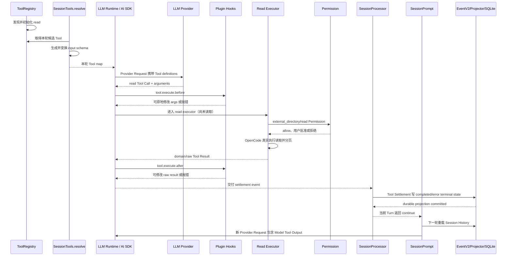

# OpenCode 工具与安全：从一次 `read` 调用理解执行与安全边界

本文区分工具（Tool）、工具调用（Tool Call）、工具结果（Tool Result，本文特指 domain/raw result）、工具结算（Tool Settlement）、模型工具输出（Model Tool Output）、权限（Permission）、操作系统沙箱（Sandbox）、MCP 服务器（MCP Server）、插件（Plugin）、技能（Skill）和子代理（Subagent）。

> **验收状态**：任务 6 的最终交叉审计尚未完成；任务 8 按用户指示跳过，未进行理解验收。本文依据固定源码 commit `0e3474509aa5ad16afcf9c439785514d6443c6af`、当前请求 trace 和任务 7 的代表性验证编写；未覆盖的实验不会写成已经通过。
>
> **实现边界**：当前普通 TUI 使用兼容 Session API 和 `SessionPrompt` 编排；native V2 API/Runner 已实现但不是普通 TUI 的默认路径。本文将两者独立展示。

## 1. 前置阅读与学习路线

建议先阅读 [09_Context_and_Persistence.md](09_Context_and_Persistence.md)，理解 Message、Part、会话历史（Session History）和 durable projection；读完本文后继续阅读 [11_Runtime_Boundary.md](11_Runtime_Boundary.md)，把 Tool Runtime 放回 Client、Server、Provider 和事件通道的完整边界中。

本文解释内部机制，不重复安装和配置步骤。需要创建 Custom Tool、安装 Skill、连接 MCP Server、安装 Plugin 或编写 Permission 配置时，参见 [05_Enhancement.md](05_Enhancement.md)。

本文的目标是说明：模型产生读取 `/project/src/app.ts` 的调用意图后，`read` 如何从候选能力经过授权和真实执行，产生 domain/raw Tool Result，再经 Tool Settlement 形成 durable terminal state 与下一次提供商轮次（Provider Turn）可见的 Model Tool Output。

```json
{
  "tool": "read",
  "arguments": {
    "filePath": "/project/src/app.ts",
    "offset": 1,
    "limit": 2000
  }
}
```

这只是便于阅读的表示，不是某个 Provider 的固定 wire format。最重要的边界是：

```text
模型产生 Tool Call 和参数
-> OpenCode 验证并通过 Permission
-> OpenCode 真实执行并得到 domain/raw Tool Result
-> OpenCode 完成 Tool Settlement
-> 保存 durable terminal state，并在下一轮发送 Model Tool Output
```

**模型不会自己打开文件。模型只生成 Tool Call；真正读取文件的是 OpenCode 的 Tool executor。**

## 2. 先分清十一个概念

| 概念              | 本文中的含义                                                                                                         | 不应混同为                                                      |
| ----------------- | -------------------------------------------------------------------------------------------------------------------- | --------------------------------------------------------------- |
| Tool              | 向模型声明的具名能力和 input schema；本地 Tool 还关联 executor                                                       | MCP Server、Plugin、Skill、Subagent                             |
| Tool Call         | Provider 在一个 Provider Turn 中生成的调用意图，包含名称、ID 和输入                                                  | Tool 已执行、Tool Result                                        |
| Tool Result       | executor 或 Provider 托管执行产生的 domain/raw 成功值或错误值                                                        | durable terminal state、Model Tool Output、完整 Settlement 过程 |
| Tool Settlement   | Harness 在取得 domain/raw Tool Result 后执行 codec/projection/bounding，并把调用确定为成功、模型可见失败或中断的过程 | Tool Call、原始结果、仅仅 `execute()` 返回                      |
| Model Tool Output | Tool Result 经语义投影和尺寸约束后，持久化到 Session History 并回放给模型的内容                                      | 完整 domain output、managed file、durable terminal state        |
| Permission        | OpenCode 对 action/resource 规则求值，并在 `ask` 时等待用户决定的应用层策略门                                        | OS Sandbox                                                      |
| Sandbox           | 通过进程、容器、系统调用、文件系统或网络隔离限制真实系统权限的环境                                                   | Permission 对话框、worktree 记录                                |
| MCP Server        | 通过 MCP 协议提供 Tools、Resources、Prompts 等能力的本地进程或远程服务                                               | 单个 MCP Tool、Plugin                                           |
| Plugin            | 启动时载入 OpenCode 进程并注册 Hook、Tool 等行为的代码；其进程能力不被 Tool Permission 沙箱化                        | 模型按需调用的 Tool、Sandbox                                    |
| Skill             | 由内置 `skill` Tool 按需加载的工作说明及资源                                                                         | 自动运行的脚本、Subagent                                        |
| Subagent          | 由 `task` 等能力启动的另一个 Agent/Session 工作流                                                                    | 普通叶子 Tool、远程 MCP Server                                  |

全文统一采用这条本地调用主链，验证和 Hook 只是插入点：`Tool Call -> Permission -> execution -> domain/raw Tool Result -> Tool Settlement -> durable terminal state / Model Tool Output`。`providerExecuted` 是明确例外，由 Provider 执行后交回 provider-native result，OpenCode 不再运行同名本地 executor。

注册、模型选择和执行是三个边界：Registry 中存在 `read`，不代表这一轮模型一定能看到它；模型看到 `read`，也不代表它一定会选择它；模型生成 Tool Call 后，文件仍未读取，OpenCode 还要验证、授权和执行。

当前证据：`packages/opencode/src/tool/registry.ts`，`ToolRegistry` Layer、`ToolRegistry.tools`，86-249、286-335；`packages/opencode/src/session/tools.ts`，`SessionTools.resolve`，41-134；`packages/opencode/src/session/llm.ts`，`LLM.run`，276-353。版本：`0e3474509aa5ad16afcf9c439785514d6443c6af`。

## 3. 当前默认路径：一次 `read` 的完整生命周期

本节只描述当前普通 TUI 的默认路径：兼容 Session API 进入 `SessionPrompt.run`，默认 AI SDK 分支持有 Tool map 并调度普通本地 Tool。native V2 在第 8 节另述。

状态：`[Current default @ 0e3474509aa5ad16afcf9c439785514d6443c6af]`。

### 3.1 总时序

参与者按职责分为四组：`ToolRegistry` 和 `SessionTools.resolve` 负责发现与本轮物化；Provider 只产生 Tool Call；LLM Runtime、Plugin Hooks、Read Executor 与 Permission 完成验证、授权和执行；`SessionProcessor`、`SessionPrompt` 与 EventV2/Projector/SQLite 完成 Tool Settlement、持久化和下一轮回放。图中的 executor 入口本身不代表副作用已经发生，真实读取位于 Permission allow 之后。



图中的 Provider 只产生 Tool Call；`ReadTool.execute` 和底层文件系统服务才执行真实 I/O。这里的 domain/raw Tool Result、completed/error durable terminal state 和下一轮 Model Tool Output 是三个边界，不能统称为同一个 Tool Result。当前完整 TUI 请求链的入口边界可对照 [11_Runtime_Boundary.md](11_Runtime_Boundary.md)。

### 3.2 `read` 如何进入 Registry

`ReadTool` 通过 `Tool.define("read", ...)` 声明 description、Effect Schema 和 executor。Registry 初始化时取得 `ReadTool`，调用 `Tool.init`，并把结果放进 built-in 集合。

当前参数合同是：

```text
filePath: string，必需
offset: 非负整数，可选，1-based
limit: 非负整数，可选，默认 2000
```

此时只完成候选注册，没有读取文件，也没有发起 Provider Request。

源码证据：

- `packages/opencode/src/tool/read.ts`，`Parameters`、`ReadTool`，28-36、64-75、379-385。
- `packages/opencode/src/tool/registry.ts`，Registry Layer 中的 `ReadTool`、`Tool.init(read)` 和 built-in 数组，96-111、204-244。
- `packages/opencode/src/tool/tool.ts`，`wrap`、`define`、`init`，99-180。
- 以上位置版本均为 `0e3474509aa5ad16afcf9c439785514d6443c6af`。

### 3.3 每个 Provider Turn 都重新物化 Tool map

每一轮 `SessionPrompt.run` 都调用 `SessionTools.resolve`。它从 Registry 取得适合当前 Agent、Model 和 Provider 的候选，把每个 Tool 包装成 AI SDK Tool：

```text
Registry Tool
-> ToolJsonSchema.fromTool
-> ProviderTransform.schema
-> AI SDK tool({ description, inputSchema, execute })
-> LLMRequestPrep 最终过滤和排序
-> Provider Request
```

最后的可见性还会受以下因素影响：

- per-prompt `tools[name] === false` 会隐藏 Tool。
- Agent 和 Session Permission 合并后，whole-tool `*` deny 可隐藏 Tool。
- Registry 会按 Model/Provider 选择 `edit`、`write`、`apply_patch`、`websearch` 等候选。
- OpenAI/Azure 等动态 Tool 路径可设置 `strict: false`，避免 MCP schema 因不属于 Structured Outputs 子集而无法注册。

这只是 catalog 可见性。资源级 Permission 仍要等 executor 调用 `ctx.ask`，不能把“没有发给模型”和“调用已经获得授权”写成同一步。

源码证据：`packages/opencode/src/session/prompt.ts`，`SessionPrompt.run`，1221-1286；`packages/opencode/src/session/tools.ts`，`SessionTools.resolve`，92-134；`packages/opencode/src/tool/json-schema.ts`，`fromSchema`、`fromTool`，8-26；`packages/opencode/src/session/llm/request.ts`，`LLMRequestPrep.prepare`、`resolveTools`，148-185、208-214；`packages/opencode/src/session/llm.ts`，`streamText` 的 `activeTools/tools`，276-353。版本：`0e3474509aa5ad16afcf9c439785514d6443c6af`。

### 3.4 模型看到 schema，但看不到 executor

当前默认路径中，Provider 收到的是其协议格式下的 Tool name、description 和变换后的 input JSON Schema。模型看不到：

- JavaScript/Effect executor。
- `ctx.ask` 和 Permission rules。
- Plugin Hook 实现。
- 文件系统对象和 SQLite。
- OpenCode 进程实际拥有的 OS 权限。

因此，模型只能决定“建议调用 `read` 并给出这些参数”；它不能绕过 Harness 直接调用 `fs.readFile`。

native V2 的内部 `ToolDefinition` 还包含 `outputSchema`，用于 typed settlement；但不能据此断言所有 Provider 请求都发送 output schema。固定源码中，OpenAI Chat、Anthropic 和 Gemini 的常见 lowering 分别只把 input schema 写入 `parameters` 或 `input_schema`。

源码证据：`packages/opencode/src/session/tools.ts`，Registry Tool 到 AI SDK Tool 的转换，98-102；`packages/core/src/tool/tool.ts`，`Runtime.definition`，79-90；`packages/llm/src/schema/messages.ts`，`ToolDefinition`、`LLMRequest.tools`，224-232、271-281；`packages/llm/src/protocols/openai-chat.ts`，`lowerTool`，179-186；`packages/llm/src/protocols/anthropic-messages.ts`，`lowerTool`，261-266；`packages/llm/src/protocols/gemini.ts`，`lowerTool`，171-175。版本：`0e3474509aa5ad16afcf9c439785514d6443c6af`。

### 3.5 Provider Tool Call 到本地调度

Provider Stream 产生 Tool Call 后，默认 AI SDK 路径用本轮 Tool map 找到 `read.execute`。OpenCode 的 adapter 再把 Provider/AI SDK 事件归一化为 `LLMEvent`，保留：

- Tool Call 的 `id`、`name`、parsed input、可选 `providerExecuted` 和 provider metadata。
- Tool Result 的值、`providerExecuted` 和 provider metadata。
- Tool Error 的 name、message 和原始 error。

旧 Session Loop 下还有可选 native transport/dispatch adapter，但它不等于 native V2 Session Runtime。

源码证据：`packages/opencode/src/session/llm.ts`，`LLM.run` AI SDK 分支，276-353；`packages/opencode/src/session/llm/ai-sdk.ts`，`tool-call`、`tool-result`、`tool-error` cases，220-261；`packages/opencode/src/session/llm/native-runtime.ts`，`stream`、`nativeTools`，103-145、169-193。版本：`0e3474509aa5ad16afcf9c439785514d6443c6af`。

### 3.6 输入验证、before hook、Permission 和执行顺序

普通 Built-in 输入至少经过两层相关验证：AI SDK 先按提供给模型的 `inputSchema` 校验；`Tool.wrap` 再用原始 Effect Schema 执行 `Schema.decodeUnknownEffect`。第二层失败会产生 `Tool.InvalidArgumentsError`，原 executor 不运行。

普通 Registry Tool 的真实顺序是：

```text
AI SDK input validation
-> tool.execute.before
-> item.execute
   -> Built-in Tool.wrap 再做 typed decode
   -> Built-in executor 自行 ctx.ask
   -> 真实副作用
   -> 通用 Truncate（若 producer 未自行标记 truncated）
-> tool.execute.after
-> 返回 AI SDK
```

这带来四个重要结论：

1. `before` 在 `read` 的 Permission 前运行。Hook 原地修改共享 `args.filePath` 后，`read` 对修改后的路径求 Permission；仅把 Hook output 的 `args` 属性替换为另一个对象，不会替换 wrapper 已捕获的实参引用。
2. Built-in 的 Permission 不是 Registry 自动统一注入，而是 leaf executor 自己调用 `ctx.ask`。
3. Custom/Plugin Tool 不经过 Built-in 的 `Tool.wrap`；默认 AI SDK 路径中的 input schema 是其主要调用前 gate，扩展也不会自动获得一次 host `ctx.ask`。
4. `after` 位于普通 Registry Tool 的通用 Truncate 之后。第 6 节会说明任务 7 已确认的缺口。

源码证据：`packages/opencode/src/tool/tool.ts`，`wrap`，99-145；`packages/opencode/src/session/tools.ts`，Registry wrapper，98-132；`packages/opencode/src/tool/registry.ts`，`fromPlugin`，120-175；`packages/plugin/src/index.ts`，`Hooks["tool.execute.before"]`、`Hooks["tool.execute.after"]`，266-281；`packages/opencode/src/plugin/index.ts`，`Plugin.trigger`，282-295。版本：`0e3474509aa5ad16afcf9c439785514d6443c6af`。

### 3.7 `read` 怎样授权并真实读取

`ReadTool.execute` 依次执行：

1. 相对路径按当前 Instance directory 解析，Windows 路径再规范化。
2. 检查目标是否位于外部目录；需要时先请求 `external_directory`。
3. 请求 `read` Permission，resource 是相对 worktree 路径。
4. 用户或规则允许后才读取目录、文本、图片或 PDF。
5. 文本按 `offset/limit` 分页，默认最多 2000 行、50 KiB，每行最多 2000 字符。
6. 图片/PDF 形成 data URL attachment；其他二进制被拒绝。
7. 文本成功后异步 warm LSP，并可能把相邻 instruction 作为 system reminder 附在 output 后。

`read` 的 2000 行/50 KiB 是 producer 自己的读取边界，不是外层 Registry 通用 Truncate。因为 `read` 返回的 metadata 已包含 `truncated`，`Tool.wrap` 会直接返回，不再生成通用 truncation 文件。完整文件仍在原路径，下一页应通过新的 `read(offset=...)` 获取。

源码证据：`packages/opencode/src/tool/read.ts`，常量和 `Parameters`，13-36；`ReadTool.lines`，137-180；`ReadTool.execute`，229-377；`packages/opencode/src/tool/tool.ts`，`wrap` 跳过已标记结果，130-144。版本：`0e3474509aa5ad16afcf9c439785514d6443c6af`。

### 3.8 Permission 决策和等待用户

当前规则形状是：

```text
permission + pattern + action(allow | ask | deny)
```

`Permission.evaluate` 选择最后一条同时匹配 permission 和 pattern 的规则；没有匹配时默认 `ask`。`SessionTools` 把 Agent rules 放在前、Session rules 放在后，因此后面的匹配规则优先。

`ctx.ask` 对每个 pattern 求值：

- 任一结果为 `deny`：立即失败，不创建 pending request。
- 全部为 `allow`：直接继续。
- 至少一个为 `ask`：创建 `PermissionV1.Request` 和进程内 `Deferred`，发布 `permission.asked`，executor 阻塞等待。

用户回复的含义：

- `once`：只完成当前 Deferred。
- `always`：把 Tool 提供的 `always` patterns 加入当前 Instance 的内存 `approved`，并放行同 Session 中被这些规则覆盖的 pending requests。
- `reject`：当前请求失败，并拒绝同 Session 的其他 pending requests；带 message 时产生纠正反馈。

当前旧 Permission 的 pending 和 approved 都是 Instance 内存状态，不是 durable SQLite store。`always` 可供同一 Instance 的其他 Session 使用，但不能据此称为跨进程重启持久化。

源码证据：`packages/opencode/src/permission/index.ts`，`State`、`evaluate`、`ask`、`reply`、`disabled/visibleTools`，18-38、42-167、204-219；`packages/opencode/src/session/tools.ts`，`context.ask`，59-90。版本：`0e3474509aa5ad16afcf9c439785514d6443c6af`。

### 3.9 Raw Result、Settlement、durable state 和下一轮

LLM Runtime 把 domain/raw Tool Result 转换为统一事件；`SessionProcessor` 消费这些事件完成 Tool Settlement，并建立、更新 Tool Part：

```text
tool-input-start/delta/end -> pending
tool-call                 -> running
tool-result success       -> completed
tool-result error         -> error
tool-error                -> error
```

`completed` 保存 input、经 wrapper/hook 处理的 output、title、metadata、start/end 和 attachments；`error` 保存 input、error、metadata 和时间。二者是 durable terminal state，不是 executor 最初返回的 domain/raw Tool Result。`Session.updatePart` 发布 durable V1 Part event，Core Projector 在 SQLite transaction 中投影 whole Part。

普通本地 Tool Settlement 完成后，`SessionPrompt` 回到外层 Loop，重新读取 durable Session History。`MessageV2.toModelMessagesEffect` 把 completed/error Tool Part 降为 Provider 协议的 tool-role 内容，其中承载的是 Model Tool Output；新的 Provider Turn 才让模型看到读取内容。这一轮不是仅依赖一份内存数组。

源码证据：`packages/schema/src/v1/session.ts`，`ToolStatePending/Running/Completed/Error`、`ToolPart`，259-324；`packages/opencode/src/session/processor.ts`，`ensureToolCall`、`handleEvent`、`completeToolCall`、`failToolCall`，160-205、216-253、315-419；`packages/opencode/src/session/session.ts`，`Session.updatePart`，631-645；`packages/core/src/session/projector.ts`，V1 `PartUpdated` projector，260-328；`packages/opencode/src/session/message-v2.ts`，Tool Part lowering，290-360；`packages/opencode/src/session/prompt.ts`，terminal check 和 continuation，1092-1132、1288-1335。版本：`0e3474509aa5ad16afcf9c439785514d6443c6af`。

更完整的 durable history 与 projection 解释见 [09_Context_and_Persistence.md](09_Context_and_Persistence.md)。

## 4. Built-in、Custom、Plugin、MCP、Skill 与 Subagent

### 4.1 当前发现、注册和信任边界

| 类型        | 怎样发现/加入本轮 Tool map                                            | 谁执行                                              | Permission                                     | Hook 与信任边界                                        |
| ----------- | --------------------------------------------------------------------- | --------------------------------------------------- | ---------------------------------------------- | ------------------------------------------------------ |
| Built-in    | Registry 静态导入、`Tool.init`，再由 `SessionTools.resolve` 物化      | OpenCode 内部 executor                              | leaf 自行 `ctx.ask`                            | Registry before/after；受信仓库代码仍有真实副作用      |
| Custom Tool | 扫描 config directories 下 `{tool,tools}/*.{js,ts}` 并动态 import     | Custom module 的 `def.execute`                      | 扩展主动调用 `pluginCtx.ask`；Host 不自动 ask  | Registry before/after；项目/用户目录中的任意进程内代码 |
| Plugin Tool | 启动后的 Plugin 返回 `hooks.tool`，Registry 读取                      | Plugin Tool 的 `def.execute`                        | 同 Custom                                      | Registry before/after；Plugin 已在进程内执行           |
| MCP Tool    | MCP service 连接 Server、缓存 `tools/list`，每轮转换为 dynamic Tool   | MCP Client `callTool`，最终由 Server 执行           | Host 在 `tools/call` 前显式 ask namespaced key | before/after；Server schema/result 是外部输入          |
| Skill       | Registry 提供内置 `skill` Tool，具体 Skill 的 name/description 供选择 | `skill` executor 加载说明和资源列表                 | `skill` Tool 自行按 Skill 名称 ask             | Skill 文本可引导后续调用，但不会因存在脚本就自动执行   |
| Subagent    | Registry 提供 `task` 等编排 Tool                                      | Tool 内创建/恢复子 Session，再运行另一个 Agent Loop | `task` 和子 Session 各有规则                   | 入口有 Tool lifecycle，但执行体不是普通叶子函数        |

Custom Tool 文件和 Plugin Tool 可共享 `ToolDefinition` 适配形状，但 Custom Tool 文件不是完整 Plugin。反过来，Plugin 也可以只注册 event/LLM Hook，完全不增加模型 Tool。

源码证据：`packages/opencode/src/tool/registry.ts`，`fromPlugin`、Custom 扫描、Plugin Tool 收集，120-199；`packages/opencode/src/plugin/index.ts`，`Plugin.state`，132-280；`packages/opencode/src/plugin/loader.ts`，`resolve/load/loadExternal`，82-145、203-236；`packages/opencode/src/tool/task.ts`，`TaskTool.execute`，102-238；`packages/opencode/src/tool/skill.ts`，`SkillTool`，35-99。版本：`0e3474509aa5ad16afcf9c439785514d6443c6af`。

需要实际安装、使用和卸载这些扩展时，转到 [05_Enhancement.md](05_Enhancement.md)，不要在内部机制文档中照抄操作教程。

### 4.2 MCP 与普通 Registry Tool 的关键差异

MCP Server 不是单个 Tool。当前路径会连接 enabled Server，调用分页 `tools/list` 并缓存 definitions；`tools/list_changed` 可触发刷新。模型侧名称是经过 sanitize 的 `server_tool` 组合名。

普通 MCP Tool 的执行顺序是：

```text
tool.execute.before
-> ctx.ask(namespaced MCP tool)
-> client.callTool
-> tool.execute.after(raw MCP result)
-> Host 转换 text/resource/image
-> Host 对文本执行 Truncate
-> 返回 AI SDK
```

所以 MCP 的 after hook 位于 Host 文本 bounding 之前，不具有普通 Registry Tool 那个“after hook 位于通用 Truncate 之后”的相同顺序缺口。MCP Server 的 description、schema、result 仍是不可信输入；本地 Server 启动和远程 Server 内部权限也不受这次 Tool Permission 修复。

源码证据：`packages/opencode/src/mcp/index.ts`，`connectRemote`、`connectLocal`、`create/watch/tools`，236-415、442-560、666-688；`packages/opencode/src/mcp/catalog.ts`，`convertTool`、`toolName`，42-82、117-120；`packages/opencode/src/session/tools.ts`，MCP loop，390-490。版本：`0e3474509aa5ad16afcf9c439785514d6443c6af`。

## 5. Permission 不是 OS Sandbox

Permission 的保证范围是：受管 executor 是否在副作用前按规则调用 `ctx.ask`，以及用户是否放行。它不会改变 Linux、macOS 或 Windows 赋予 OpenCode 进程的权限。

- `bash` 以 OpenCode 进程用户的 host 权限启动真实子进程，不自动获得 mount namespace、容器或系统调用隔离。
- `read` 依靠路径解析、`external_directory` 和 `read` Permission，不是受限文件系统挂载。
- Custom/Plugin Tool 可以选择不调用 `ctx.ask`。
- **Plugin 不受 Agent Tool Permission 沙箱化。** Plugin 模块顶层和 factory 在模型产生 Tool Call 前就可运行，并获得 `client`、目录信息和 Bun `$`；它可以直接读文件、执行命令或访问网络。
- whole-tool deny 可以让模型看不到 Plugin Tool，但不能撤销 Plugin 已经取得的进程权限。
- 本地 MCP Server 在连接阶段已由 `StdioClientTransport` 启动；后续 Tool Permission 只 gate 受管的 `tools/call`，不约束 Server 启动代码和后台行为。
- 远程 MCP Server 的漏洞、账号权限、内部审计和数据保留不受 OpenCode Permission 控制。

仓库中 Project 的 `sandboxes` 是 worktree/项目位置记录，不能据此宣称 Tool 在 OS sandbox 中执行。若需要真正隔离，应在低权限用户、容器、虚拟机、受限网络或平台级 sandbox 中运行 OpenCode/扩展，并使用最小权限凭据。

源码证据：`packages/opencode/src/tool/shell.ts`，`ShellTool.run` 的 spawn，428-595；`packages/opencode/src/plugin/index.ts`，`PluginInput` 构造，141-166；`packages/opencode/src/tool/registry.ts`，Plugin Tool context，138-164；`packages/opencode/src/mcp/index.ts`，`connectLocal`，340-369；`packages/core/src/tool/bash.ts`，V2 Bash description/executor，97-196；`specs/v2/session.md`，V2 Bash 边界，193-206。版本：`0e3474509aa5ad16afcf9c439785514d6443c6af`。

## 6. 输出、附件、Truncation 与任务 7 发现

### 6.1 当前路径不是一个统一输出闸门

当前默认路径至少有三类边界：

1. producer-specific bound：`read` 只读取一页；Shell 边执行边保留 bounded preview 并可写完整输出文件；MCP resource blob 有 MIME/10 MiB gate。
2. Tool Wrapper bound：普通 Built-in 在 `Tool.wrap` 调用 `Truncate.output`；Custom/Plugin Tool 在 `fromPlugin` 调用同一服务；MCP 文本在 Session MCP adapter 转换后调用。
3. history/compaction bound：`MessageV2.toModelMessagesEffect` 可在 compaction 场景按 `toolOutputMaxChars` 再裁历史 Tool output；这不是首次 settlement 的通用留存保证。

默认通用阈值是 2000 行和 50 KiB，可由 `tool_output` 配置覆盖。超限时 `Truncate.output` 写完整文本到 truncation directory，并返回 preview、提示和 `outputPath`；默认保留 7 天。`read` 已自行标记分页结果，所以不走这个完整文本留存路径。

源码证据：`packages/opencode/src/tool/truncate.ts`，limits、`output`、cleanup，12-43、53-150；`packages/opencode/src/tool/tool.ts`，`wrap`，130-144；`packages/opencode/src/tool/registry.ts`，`fromPlugin.execute`，149-164；`packages/opencode/src/session/tools.ts`，MCP text bound，426-480；`packages/opencode/src/session/message-v2.ts`，`truncateToolOutput` 和 Tool lowering，49-53、290-313。版本：`0e3474509aa5ad16afcf9c439785514d6443c6af`。

### 6.2 已确认：Registry Tool after hook 可在 Truncate 后放大输出

普通 Registry Tool 的 `item.execute` 返回前已经执行 Built-in/Custom 的通用 Truncate；`SessionTools.resolve` 随后触发 `tool.execute.after`，再直接返回可变 output。当前代码没有在 after hook 后再次调用 `Truncate.output`。

任务 7 的临时隔离实验实际确认了这个顺序缺口：

```text
真实 ToolRegistry 中的内置 invalid
-> Tool.define / Tool.init / Tool.wrap
-> 真实 SessionTools.resolve 物化 AI SDK Tool
-> 真实文件 Plugin 的 tool.execute.after
-> materialized Tool.execute 返回
```

executor 先返回 53-byte 短文本；通用 Truncate 后 metadata 为 `truncated: false`。after hook 再把 `output.output` 放大到 60 KiB。最终 6 个断言确认：结果为 61,440 bytes，超过默认 50 KiB；`truncated` 仍为 `false`；`outputPath` 不存在。

这证明：**普通 Registry Tool 的 after hook 可以在通用 Truncate 之后放大输出，当前路径没有再次 bound。** 它不证明所有输出都必然被放大，也不等于已经完整验证放大结果的后续 Provider/持久化链。

实验限制必须保留：

- 临时测试直接执行 materialized AI SDK Tool wrapper，没有运行完整 fake/真实 Provider stream。
- 没有单独验证放大结果写入 Tool Part、SQLite projection、下一轮 Provider Request 或 compaction 时的最终表现。
- 没有调用真实外部 Provider 或 MCP Server。
- 临时测试文件运行后已删除，固定 commit 仍缺永久回归测试。

源码证据：`packages/opencode/src/tool/tool.ts`，`wrap` 的先 Truncate，130-144；`packages/opencode/src/tool/registry.ts`，`fromPlugin.execute`，149-164；`packages/opencode/src/session/tools.ts`，Registry wrapper 的 after hook 和直接 return，111-130；同文件 MCP 对照，407-480。版本：`0e3474509aa5ad16afcf9c439785514d6443c6af`。运行证据见第 10.2 节。

### 6.3 Attachments 不是文本 truncation

- `read` 可把 image/PDF 作为 data URL File Part 返回。
- Custom/Plugin Tool 可返回 attachments，Registry 为其补 Session/Message/Part identity。
- MCP image 可转 File Part；MCP resource blob 只允许 PDF/GIF/JPEG/PNG/WebP，且该 resource blob 路径上限为 10 MiB。
- Processor 会 normalize image；无法缩到图像限制以下时省略附件，并把说明追加到 output。
- Provider 不支持 tool-result media 时，history lowering 可提取为 synthetic user message。

文本 output 小不代表 attachment 小。文本 bounding 不能替代 MIME、尺寸、内存和 Provider media 能力检查。

源码证据：`packages/opencode/src/tool/read.ts`，attachments，306-324；`packages/opencode/src/tool/registry.ts`，Custom attachments，149-163；`packages/opencode/src/session/tools.ts`，MCP MIME/size 和转换，32-39、426-480、533-575；`packages/opencode/src/session/processor.ts`，image normalization，383-413；`packages/opencode/src/session/message-v2.ts`，Provider history conversion，290-323。版本：`0e3474509aa5ad16afcf9c439785514d6443c6af`。

## 7. 失败、取消、`providerExecuted` 与 StructuredOutput

### 7.1 参数错误、执行错误与 Permission 拒绝

输入 decode 失败不会运行 Built-in executor。普通 executor throw、MCP `isError`、Permission deny/reject 可经 AI SDK 形成 `tool-error` 或 error Tool Result，Processor 将 running Tool Part 结算为 `error`。用户 reject 会使 Processor 进入 blocked；默认 `continue_loop_on_deny !== true` 时当前 Loop 停止，兼容配置可以改变该行为。

不要把所有异常都描述为模型可见 Tool Result。进程 interruption、defect 和 Provider failure 可能位于不同失败域；尤其 native V2 会刻意让 interruption/defect 穿过 typed Tool failure 边界。固定 SHA 的 managed output file 留存失败会传播 `StorageError` 并使本次 operational settlement 失败；`CONTEXT.md` 描述的 lossy-success 降级属于尚未接线的目标合同，详见第 8.5 节。

当前证据：`packages/opencode/src/tool/tool.ts`，invalid input，121-145；`packages/opencode/src/session/processor.ts`，`failToolCall`、`process`，186-205、627-683；`packages/opencode/src/session/tools.ts`，MCP execution，398-486。版本：`0e3474509aa5ad16afcf9c439785514d6443c6af`。

### 7.2 取消和 interrupted orphan

取消会中断 Runner/Provider Stream。Processor cleanup 会尽力持久化已累积 Text/Reasoning/Patch，短暂等待 Tool deferred，然后把仍 pending/running 的 Tool Part 写成：

```text
status: error
error: "Tool execution aborted"
metadata.interrupted: true
```

Assistant 同时记录 abort error。下一次 Loop 的 terminal check 忽略这种 interrupted orphan，避免把历史中的未正常 settlement Tool 当成待重放副作用。这里的 orphan 是“被 cleanup 封口的未完成 Tool block”，不是“OpenCode 会自动重新执行它”。

源码证据：`packages/opencode/src/session/processor.ts`，`cleanup/process`，539-597、627-683；`packages/opencode/src/session/prompt.ts`，`isOrphanedInterruptedTool` 和 terminal check，96-100、1103-1129。版本：`0e3474509aa5ad16afcf9c439785514d6443c6af`。

### 7.3 `providerExecuted` 不运行同名本地 executor

`providerExecuted: true` 表示 Tool 由 Provider 托管执行。OpenCode 接收 Provider 已产生的 Tool Call/Result，保留 provider metadata 并持久化，但不应查找或运行同名本地 executor，也不按普通本地 Tool 强制 continuation。

源码证据：`packages/opencode/src/session/llm/ai-sdk.ts`，Tool events，220-261；`packages/opencode/src/session/processor.ts`，provider metadata，216-245、331-351；`packages/opencode/src/session/prompt.ts`，terminal check，1103-1115；`packages/opencode/src/session/llm/native-runtime.ts`，显式跳过本地 dispatch，115-129；`packages/core/src/session/runner/llm.ts`，V2 skip，232-272，特别是 243。版本：`0e3474509aa5ad16afcf9c439785514d6443c6af`。

### 7.4 StructuredOutput 是 per-request 控制 Tool

当最新 User Message 要求 `json_schema` format，当前 Loop 临时加入 `StructuredOutput`：input schema 来自用户格式，`toolChoice` 设为 required，executor 只捕获 args 为 Assistant structured output。成功后 Loop 直接结束，不按普通 Tool Result 发起 continuation；模型未调用则写 `StructuredOutputError`。

它不来自 Registry，不走普通 Plugin before/after，也没有普通 Tool Permission。不要用 `read` 的 Registry 生命周期解释它。

源码证据：`packages/opencode/src/session/prompt.ts`，StructuredOutput prompt、插入/退出和 `createStructuredOutputTool`，74-82、1243-1250、1270-1315、1565-1590；`specs/v2/session.md`，Structured-output policy missing，139-145。版本：`0e3474509aa5ad16afcf9c439785514d6443c6af`。

## 8. Native V2：typed registry 与 durable settlement

本节是独立路径，不是当前普通 TUI `read` 调用的后半段。native V2 已从 `V2Session.prompt -> SessionExecution -> Location-scoped SessionRunner` 接入 executable Server，但普通 TUI 仍使用 `SessionPrompt`。

状态：typed registry、Runner settlement 等为 `[V2 implemented @ 0e3474509aa5ad16afcf9c439785514d6443c6af]`；各项 V1 parity 仍须按第 9 节区分 implemented、partial 和 missing/planned。

### 8.1 Opaque typed Tool、Application scope 与 Location scope

`Tool.make` 创建 opaque Definition。公开调用者不能直接取得 executor；内部 runtime 同时保存 input codec、output codec、executor，以及可选 structured projection 和 model-output projection。注册 record 的 key 才是 model-facing name。

V2 有两种注册位置：

- `ApplicationTools`：process-scoped，供 embedded/sdk-next 的 `opencode.tools.register` 使用，跨 Locations 可见。
- `ToolRegistry/Tools.Service`：Location-scoped；Built-in 在 Location Layer 构造时注册。

同一 Location 内最新同名 registration 优先；Scope 关闭只移除本次 registration；Location registration 覆盖 application registration。每个 Location 的 Registry、Permission、filesystem 和 Runner 由 `LocationServiceMap` 组合。

scope 不是授权。Application Tool 没有被 Registry 自动注入 `PermissionV2.assert`；应用提供方必须把它视为受信进程内代码，并在 leaf executor 中实现需要的授权。

源码证据：`packages/core/src/tool/tool.ts`，`Definition`、`make`，18-27、40-67、71-132；`packages/core/src/tool/application-tools.ts`，`ApplicationTools` Layer，21-57；`packages/core/src/tool/registry.ts`，state、`register`，42-105；`packages/core/src/tool/builtins.ts`，`BuiltInTools.node`，31-48；`packages/core/src/location-services.ts`，`locationServices`，42-79；`packages/sdk-next/src/opencode.ts`，`OpenCode.create`，10-42。版本：`0e3474509aa5ad16afcf9c439785514d6443c6af`。

### 8.2 每轮 materialization 和 stale identity

`ToolRegistry.materialize(permissions)` 合并 Application/Location registrations，过滤 whole-tool deny，生成本轮 definitions，并返回本轮专属的 `settle` closure。closure 捕获当时 advertised registration identity。

如果模型返回 Tool Call 时，同名 Tool 已移除、被替换，或 overlay 关闭后露出旧 registration，本轮 materialization closure 返回 `Stale tool call`，不会误执行另一个同名 handler。调用一旦捕获当前 handler，之后 registration 变化不会替换正在运行的调用。

源码证据：`packages/core/src/tool/registry.ts`，`settleWith`、`materialize`，50-82、106-121；测试静态位置：`packages/core/test/session-runner-tool-registry.test.ts`，scoped removal、stale/replacement/captured execution，124-155、336-450。版本：`0e3474509aa5ad16afcf9c439785514d6443c6af`。该测试文件属于任务 7 的 V2 实跑集合。

### 8.3 Durable Tool Call 和 settlement

V2 每个 Provider Turn 的 Tool 主线是：

```text
加载 projected history，选择 Agent/Model
-> tools.materialize(agent.permissions)
-> LLM.request(tools = definitions)
-> llm.stream(request)
-> durable publish Tool.Called
-> 非 providerExecuted call decode input
-> trusted leaf 内 Permission.assert
-> leaf execution
-> domain/raw Tool Result
-> Tool Settlement：encode/validate -> project Model Tool Output -> ToolOutputStore.bound
-> durable publish Tool.Success/Failed terminal state
-> 等待所有 Tool fibers
-> 重载 projected history
-> 下一 Provider Turn
```

Tool Call 的 `assistantMessageID` 在副作用前由 durable `Tool.Called` 建立。实现中的 `materialization.settle` closure 编排 decode、leaf execution 和结算，但概念顺序仍是 Permission -> execution -> domain/raw Tool Result -> Tool Settlement；不能把 closure 的函数名误读为“raw result 之前已经完成结算”。多个本地 Tool 当前 eager 并发启动，durable publication 由 per-turn semaphore 串行。`providerExecuted` call 在 Runner 中显式跳过本地 execution/settlement。

V2 使用专用 `session.next.tool.*` 事件，而不是把旧 `message.part.updated` 当主合同：

```text
Input.Started -> pending
Input.Delta   -> live-only
Input.Ended   -> durable raw-input boundary
Called        -> running
Progress      -> durable bounded checkpoint
Success       -> completed
Failed        -> error
```

源码证据：`packages/core/src/session/runner/llm.ts`，`runTurnAttempt`，173-345；`packages/core/src/tool/tool.ts`，`Runtime.settle`，91-129；`packages/schema/src/session-event.ts`，Tool events，273-373；`packages/schema/src/session-message.ts`，Tool states，81-138；`packages/core/src/session/runner/publish-llm-event.ts`，Tool lifecycle，144-193、213-232、291-394；`packages/core/src/session/message-updater.ts`，Tool cases，249-342。版本：`0e3474509aa5ad16afcf9c439785514d6443c6af`。

### 8.4 V2 Permission

V2 rule 形状变为：

```text
action + resource + effect(allow | ask | deny)
```

最后匹配仍优先，但执行授权属于 trusted leaf Tool，不由 Registry 自动包围。Built-in executor 捕获 Location-scoped `PermissionV2.Service`，并使用精确的 Session、Assistant Message 和 Tool Call identity 构造 source。

相对当前旧路径：

- configured deny 先求值，不能被 saved approval 覆盖。
- `always` approval 写入 SQLite `PermissionTable`，按 project 保存，可跨进程读取。
- 正在等待的 approval 仍是进程内 Deferred，重启不会恢复对话框。
- 用户 decline 被 Runner 识别为中断边界，不伪装成普通模型可见 Tool error。
- Application Tool 仍不会自动调用 Permission service。

源码证据：`packages/core/src/permission.ts`，`evaluate`、configured/saved precedence、`assert/reply`，76-101、131-162、190-285；`packages/core/src/permission/saved.ts`，`list/add/remove`，37-79；`packages/core/src/tool/read.ts`，leaf Permission，53-105；`packages/core/src/session/runner/llm.ts`，decline 分类，144-150、295-310。版本：`0e3474509aa5ad16afcf9c439785514d6443c6af`。

### 8.5 V2 ToolOutputStore

V2 generic model-output bound 位于 Tool Settlement：成功的 domain/raw Tool Result 先通过 output codec，再投影为 Model Tool Output，最后由 `ToolOutputStore.bound` 检查。默认仍为 2000 行/50 KiB；超限且 managed file 留存成功时，完整 contextual text 写入临时 `tool-output` 文件，durable/model-facing 内容变为首尾 preview，并返回 `outputPaths`。

managed file 只是临时留存，不是 durable replay record。固定 SHA 的当前实现中，`ToolOutputStore.bound` 写文件失败会产生 `StorageError`，该错误经 `registry.settleWith` 传播，使本次 operational settlement 失败；对应测试也把 retention failure 断言为失败。因此，当前实现不能描述成已经提供 lossy success。

`CONTEXT.md:193-195` 描述的是尚待对齐的目标合同：managed file 留存失败不应把已经成功的 Tool operation 改成失败，而应发布唯一成功 terminal state，保存明确标记为有损的 bounded Model Tool Output，不附 managed path，并并发发送 operator diagnostics。目标合同还要求 bounding 与 durable publish 构成 interruption-safe completion region，不能先发布 raw oversized success、再用第二次 terminal event 修正。

这比当前旧路径集中，但仍不是“所有字节都保证完整留存”：

- V2 Bash producer 仍有 1 MiB `AppProcess.maxOutputBytes`，producer 已丢弃的字节不能由后续 store 恢复。
- V2 Read 仍先实行 2000 行/50 KiB page 和 20 MiB media ingest gate。
- Store 保留 structured data 和 native media；超大 structured payload、媒体大小和公开 `outputPaths` 仍有后续设计边界。
- 固定 SHA 的当前行为是 retention error 导致 operational settlement 失败；目标合同则要求 lossy-success 降级。两者构成明确的 contract drift，不能把任一方静默写成另一方已经实现。

源码与合同证据：`CONTEXT.md`，managed output 最终语义，193-195；`packages/core/src/tool/registry.ts`，`settleWith`，50-82；`packages/core/src/tool/tool.ts`，`Runtime.settle` codec/projection，91-129；`packages/core/src/tool-output-store.ts`，`StorageError`、`ToolOutputStore.bound`，13-45、112-174；`packages/core/src/tool/bash.ts`，`BashTool` 的 `MAX_CAPTURE_BYTES`、executor，21、77、154-196；`packages/core/src/tool/read-filesystem.ts`，`ReadToolFileSystem` limits、`PageInput/Interface`，11-15、72-100；`specs/v2/tools.md`，managed-output follow-up，182-186。版本：`0e3474509aa5ad16afcf9c439785514d6443c6af`。

### 8.6 V2 interruption 和 orphan closure

V2 interruption 会 durable 发布未完成 Tool 的 `Tool.Failed("Tool execution interrupted")`。新 Runner 开始前扫描 projected history，把上次进程遗留的 pending/running Tool durable fail，然后才发新 Provider Request；它不会自动重放这些副作用。

这实现的是 durable orphan closure，不是 post-crash 自动 continuation。Provider 是否收到请求、远端是否执行、Tool 副作用是否开始都可能有歧义，固定版本仍把自动 crash recovery 留作后续设计。

源码证据：`packages/core/src/session/runner/llm.ts`，`failInterruptedTools`、本轮 interruption、`run`，119-139、277-345、383-405；`specs/v2/session.md`，恢复边界，48-52、160-173。版本：`0e3474509aa5ad16afcf9c439785514d6443c6af`。

## 9. 当前默认与 native V2 状态对照

| 能力                            | 当前默认兼容 Session 路径                                          | native V2 @ 固定 SHA                                                                                                                                                 |
| ------------------------------- | ------------------------------------------------------------------ | -------------------------------------------------------------------------------------------------------------------------------------------------------------------- |
| 普通 TUI 入口                   | `SessionPrompt` 实际使用                                           | API/Runner 已接线，普通 TUI 未使用                                                                                                                                   |
| Canonical Tool                  | Built-in、AI SDK、MCP、Plugin 适配 shape 并存                      | opaque typed `Tool.make` 已实现                                                                                                                                      |
| Registry scope                  | Instance Registry + 独立 MCP service                               | Application process scope + Location scope 已实现                                                                                                                    |
| Custom directory Tool           | 已发现和执行                                                       | parity missing                                                                                                                                                       |
| Plugin Tool / before-after Hook | 已接线                                                             | parity missing/planned                                                                                                                                               |
| MCP Tool                        | connect/list/cache/call 已接线                                     | canonical registration/Runner parity missing                                                                                                                         |
| StructuredOutput                | per-request 控制 Tool 已接线                                       | parity missing                                                                                                                                                       |
| 每轮 materialization            | 重建 AI SDK Tool map                                               | typed materialization + stale identity 已实现                                                                                                                        |
| input/output validation         | Built-in 双层 input；扩展路径不一致；无统一 output codec           | input/output codec 已实现                                                                                                                                            |
| Permission                      | leaf `ctx.ask`；old always 为 Instance 内存                        | leaf `assert`；saved always 按 project durable                                                                                                                       |
| durable settlement              | domain/raw result 经 Processor 结算为 completed/error V1 Tool Part | domain/raw result 经 codec/projection/bound 后发布 dedicated Tool terminal events                                                                                    |
| output bounding                 | producer/wrapper/MCP 分散；Registry after-hook 缺口已复现          | generic bound 已实现；固定 SHA 的 retention failure 会传播 `StorageError` 并使 settlement 失败，目标合同要求 lossy success、无 path、operator diagnostics；contract drift 待解决 |
| `providerExecuted`              | 保存并跳过本地执行/普通 continuation                               | 显式跳过本地 execution/settlement，并保留 metadata                                                                                                                   |
| cancel/orphan                   | cleanup 写 interrupted error                                       | interruption和上次遗留 Tool durable fail                                                                                                                             |
| post-crash 自动 continuation    | 无安全自动重放保证                                                 | missing/planned                                                                                                                                                      |

V2 parity 证据：`packages/core/src/session/runner/llm.ts`，module parity checklist，45-76；`packages/core/src/tool/builtins.ts`，`BuiltInTools.node` 前的 remaining-port TODO，18-48；`packages/core/src/plugin/host.ts`，`PluginHost.make` capabilities，20-219；`specs/v2/session.md`，Tool parity，123-150、187-215；`specs/v2/tools.md`，follow-up，182-186。版本：`0e3474509aa5ad16afcf9c439785514d6443c6af`。

## 10. 源码与实测证据

### 10.1 证据读法

本文所有源码行号都对应完整 commit `0e3474509aa5ad16afcf9c439785514d6443c6af`。入口接线和实现源码证明固定版本的静态行为；本章 Tools 专项统计与其他模块的任务 7 实跑分开列示。测试文件被引用本身不等于已运行，实际状态以第 10.2、10.3 节为准。

任务 7 环境为上述 SHA 与 Bun `1.3.14 (0d9b296a)`。完整命令、Bun/wall 耗时和临时文件过程见 [research/12：Tools and Security](research/12_Research_Tools_and_Security.md) 的第 10.4、12.2 节；本章只保留可核对的统计和覆盖边界。

### 10.2 任务 7 实跑结果

| 范围                | 实际执行的测试                                                                                                                                      | 结果                                          |
| ------------------- | --------------------------------------------------------------------------------------------------------------------------------------------------- | --------------------------------------------- |
| 当前默认路径        | `packages/opencode/test/tool/registry.test.ts`、`tool/tool-define.test.ts`、`permission/next.test.ts`、`mcp/lifecycle.test.ts`、`tool/read.test.ts` | **159 pass，0 fail**；289 `expect()`；5 files |
| native V2           | `packages/core/test/session-runner-tool-registry.test.ts`、`permission.test.ts`、`tool-output-store.test.ts`                                        | **39 pass，0 fail**；97 `expect()`；3 files   |
| after-hook 隔离实验 | 临时 `packages/opencode/test/tool/task7-after-hook-bound-20260818.test.ts`                                                                          | **1 pass，0 fail**；6 `expect()`；1 file      |

本章 Tools 专项仓库测试共 **198 pass、0 fail**；加上隔离实验为 **199 pass、0 fail**，即 **159 + 39 + 隔离 1**。临时测试文件执行后已删除，不属于固定 commit 的仓库测试集合；其代码和运行过程不在本章重复展开。

以下三个文件在其他模块的任务 7 中实际运行过，但**未纳入本章 Tools 专项命令及 198/199 统计**：

- `packages/opencode/test/session/processor-effect.test.ts`：16 pass、0 fail。
- `packages/opencode/test/session/prompt.test.ts`：所在五文件组为 178 pass、1 skip、1 fail；唯一失败是 `cancel interrupts loop queued behind shell` 的 30 秒超时，该失败用例定向重跑 1 pass。
- `packages/core/test/session-runner.test.ts`：85 pass、0 fail。

本章 Tools 专项仍未覆盖完整 Provider stream -> Tool Part -> SQLite -> 下一 Provider Request 的 after-hook 放大链、真实外部 Provider/MCP Server、MCP 大附件与 abort 组合，以及 V2 post-crash continuation。其他模块运行过相关文件，也不等于这些具体组合场景已经通过。

### 10.3 代表性静态测试索引

| 主题                                                      | 测试文件、名称/范围                                                               | 本轮状态                                                                      |
| --------------------------------------------------------- | --------------------------------------------------------------------------------- | ----------------------------------------------------------------------------- |
| Custom/Plugin discovery、schema、attachments              | `packages/opencode/test/tool/registry.test.ts:224-493`                            | 任务 7 已执行所属文件                                                         |
| typed decode、invalid args 不执行                         | `packages/opencode/test/tool/tool-define.test.ts:82-153`                          | 任务 7 已执行所属文件                                                         |
| old ask/reply/always/reject                               | `packages/opencode/test/permission/next.test.ts:651-910`                          | 任务 7 已执行所属文件                                                         |
| MCP cache、refresh、disconnect、prefix                    | `packages/opencode/test/mcp/lifecycle.test.ts:219-237,255-327,483-495`            | 任务 7 已执行所属文件                                                         |
| `read` pagination/truncation                              | `packages/opencode/test/tool/read.test.ts:315-385,474-480`                        | 任务 7 已执行所属文件                                                         |
| V2 scope、stale、codec、bound                             | `packages/core/test/session-runner-tool-registry.test.ts:61-450`                  | 任务 7 已执行所属文件                                                         |
| V2 Permission                                             | `packages/core/test/permission.test.ts:105-315`                                   | 任务 7 已执行所属文件                                                         |
| V2 ToolOutputStore                                        | `packages/core/test/tool-output-store.test.ts:47-225`                             | 任务 7 已执行所属文件                                                         |
| completed/error/interrupted Tool Part                     | `packages/opencode/test/session/processor-effect.test.ts:751-879`                 | 其他模块实跑 16 pass；未计本章 Tools 专项                                     |
| Tool continuation、orphan/cancel                          | `packages/opencode/test/session/prompt.test.ts:503-529,825-918,1147-1168`         | 其他模块五文件组 178 pass/1 skip/1 fail；失败定向 1 pass；未计本章 Tools 专项 |
| V2 durable continuation、providerExecuted、orphan closure | `packages/core/test/session-runner.test.ts:557-655,1462-1517,1622-1674,2252-2409` | 其他模块实跑 85 pass；未计本章 Tools 专项                                     |

表中路径和行号版本均为 `0e3474509aa5ad16afcf9c439785514d6443c6af`。

## 11. 安全边界清单

在允许一个 Tool 或扩展前，至少核对：

- 模型看到的 name、description 和 schema 是否来自可信代码或可信 MCP Server。
- leaf executor 是否真的在副作用前调用 Permission，而不是只有 catalog deny。
- Permission resource 是否覆盖修改后的真实路径、命令、URL 或远端资源。
- Plugin 是否在 Tool Call 之外读取消息、文件、环境变量或访问网络。
- 本地 MCP Server 的启动命令、依赖和运行账户是否可信。
- 远程 MCP 使用的 Token 是否为最小权限，数据是否允许外发。
- output、structured data 和 attachments 是否分别有尺寸与留存边界。
- after hook 是否能修改已经截断的结果，metadata 是否仍与真实 output 一致。
- Tool 是否可能重复执行副作用；取消或崩溃后是否只能封口而不能安全重放。
- `providerExecuted` 是否被误送入同名本地 executor。
- V2 功能是否有实际入口和 parity，还是只存在于规格、TODO 或类型中。

## 12. 小结

一次当前默认的 `read` 可以概括为：

```text
候选注册
-> 每轮按 Agent/Model/Permission 物化 input schema
-> Provider 只看到定义并生成 Tool Call 意图
-> OpenCode/AI SDK 验证参数
-> Plugin before hook
-> Read executor 通过 ctx.ask 完成 Permission 决策
-> OpenCode 真实 execution 并执行 producer paging
-> 形成 domain/raw Tool Result
-> Tool wrapper/result conversion 与 Plugin after hook
-> Tool Settlement
-> SessionProcessor 写入 completed/error durable terminal state
-> 外层 Loop 重载 Session History
-> 下一 Provider Turn 看到 Model Tool Output
```

必须保留三条安全结论：

1. **模型只产生调用意图，OpenCode 才真实执行 Tool。**
2. **Permission 是应用层策略门，不是 OS Sandbox。**
3. **Plugin 不受 Agent Tool Permission 沙箱化；whole-tool deny 也不能撤销 Plugin 的进程能力。**

固定版本的当前路径还存在一个已实测缺口：普通 Registry Tool 的 after hook 可在通用 Truncate 后放大输出。任务 7 的隔离实验确认最终返回 **61,440 bytes**，但只覆盖 materialized Tool wrapper，没有完整运行 Provider/持久化链。native V2 已实现 typed registry、Location-scoped materialization、stale identity、durable Tool events、集中 output store 和 durable saved Permission；固定 SHA 中 managed file 留存失败会传播 `StorageError` 并使 settlement 失败，而目标合同要求保留成功并发布显式 lossy bounded Model Tool Output、无 managed path和并发 operator diagnostics。MCP、Custom directory Tool、Plugin Tool/Hook、StructuredOutput 等 V1 parity 仍未完成，post-crash 自动 continuation 也仍缺失。
