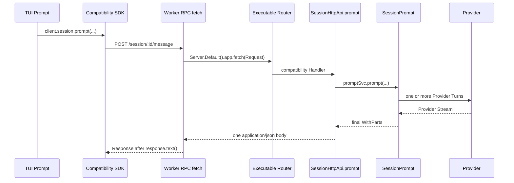

# OpenCode Runtime Boundary：从 TUI 到 Provider 与事件返回

> **任务状态**：任务 6 最终交叉审计尚未完成，本文相关结论仍待该审计收口。  
> **验收状态**：任务 8 已按要求跳过，未进行理解问答验收；本文不能视为任务 8 已通过。
>
> **源码基线**：`0e3474509aa5ad16afcf9c439785514d6443c6af`（`dev`）  
> **核对与实测日期**：2026-08-18  
> **范围**：默认本地 TUI、远程 `attach` TUI、当前兼容 Session Runtime、native V2 Session Runtime、Provider/Tool 边界和事件返回路径。

本文解释一条用户消息跨过哪些运行边界。它不重复安装、端口、认证和反向代理配置，也不把源码中出现的 `V2`、生成类名中的数字或 HTTP 本身当成架构版本证据。

## 1. 前置阅读

建议先阅读：

1. [Harness 总览](06_Harness.md)，先建立一次 Agent Loop 的整体图。
2. [上一篇：Tools 与安全边界](10_Tools_and_Security.md)，理解模型产生工具调用（Tool Call）与 OpenCode 真正执行 Tool 的区别。
3. 本文读完后继续阅读 [V1/V2 对照](12_V1_V2_Comparison.md)，按模块查看迁移状态。

贯穿本文的例子是：用户在 TUI 输入“解释这个失败测试”并按 Enter。需要始终分开观察两条返回路径：

- Prompt POST 的最终返回值。
- TUI 在 POST 完成前接收实时更新的路径。

术语约定：客户端（Client）发起请求并消费结果，服务端（Server）承载 Router、Handler 与 Session Runtime；工作线程远程过程调用（Worker RPC）是默认本地模式的进程内传输边界；提供商轮次（Provider Turn）指一次模型请求及其返回流；事件通道（Event Channel）是独立于 Prompt POST 的实时返回路径；持久事件（durable event）可从存储重读，仅实时事件（live-only event）只通知当前观察者；提示接纳（Prompt Admission）指 native V2 先持久化输入、再调度执行的边界。一次用户消息可能经过多个 Provider Turn 和多个本地 Tool 执行。

## 2. 逻辑角色与进程、Worker、网络边界

### 2.1 角色不等于进程

| 逻辑角色 | 当前职责 | 是否天然是独立进程 |
| --- | --- | --- |
| TUI Prompt | 收集输入，调用 SDK | 否，属于 TUI 客户端运行时 |
| 兼容 JavaScript SDK | 把 `client.session.prompt(...)` 编码成兼容 HTTP 合同 | 否 |
| Worker RPC Adapter | 在默认本地模式中转发 `fetch` 和全局事件 | 否；源码证明 Worker/RPC 隔离，不证明它是独立的 OS Server 进程 |
| Executable Router | 组合兼容路由、native `/api` 路由和 Handler | 否；既可被内存 `fetch` 调用，也可挂到网络 listener |
| `SessionPrompt` | 当前兼容 Session Orchestrator，运行旧 Loop | 否 |
| `SessionV2`、`SessionExecution`、`SessionRunner` | native V2 admission、进程内调度和执行 | 否；当前 TUI 未调用其 Prompt 路径 |
| `EventV2`、Projector | durable event、projection 和进程内通知 | 否 |
| `EventV2Bridge`、`GlobalBus` | 把 EventV2 转换成兼容客户端事件 | 否；`GlobalBus` 是进程内 `EventEmitter` |
| Provider | 接收模型请求并返回 Provider Stream | 通常位于真实网络或本地 Provider transport 的另一端 |
| Tool Runtime | 授权并执行本地 Tool，保存结果 | 通常与 Harness 在同一 Server 运行时，不在模型 Provider 内 |

默认本地 TUI 的源码入口创建 Worker，并分别注入 Worker fetch 与 Worker event source；是否使用外部 listener 由启动参数分支决定。

源码依据：

- `packages/opencode/src/cli/cmd/tui.ts:189-249`，`TuiThreadCommand.handler`、`external`、`transport`，版本 `0e3474509aa5ad16afcf9c439785514d6443c6af`。
- `packages/opencode/src/cli/cmd/tui.ts:24-50`，`createWorkerFetch`、`createEventSource`，版本 `0e3474509aa5ad16afcf9c439785514d6443c6af`。
- `packages/opencode/src/cli/tui/worker.ts:23-57`，Global event forwarding、`rpc.fetch`、`rpc.server`，版本 `0e3474509aa5ad16afcf9c439785514d6443c6af`。

### 2.2 三种部署拓扑

```text
A. 默认本地 TUI
TUI + SDK --Worker RPC fetch--> Server.Default().app.fetch
TUI Store <--Worker RPC event-- GlobalBus

B. 本 executable 的监听模式
TUI + SDK --HTTP--> listener + 同一 Router
TUI Store <--SSE--- /global/event

C. 远程 attach
本地 TUI + SDK --HTTP--> 远程 executable Router
本地 TUI Store <--SSE--- 远程 /global/event
```

这三种拓扑改变的是传输边界，不自动改变 Session Runtime。固定 commit 下，三者的普通 TUI 消息都调用兼容 `client.session.prompt(...)`。

## 3. 默认本地 TUI：Worker RPC fetch

### 3.1 同一条消息的请求路径



当前 TUI 的普通消息分支明确调用：

```ts
sdk.client.session.prompt(...).catch(...)
```

它没有等待 Promise 才清空输入并继续渲染。生成 SDK 将该调用编码为 `POST /session/{sessionID}/message`，最终由兼容 `SessionHttpApi.prompt` 调用 `SessionPrompt.prompt`。

源码依据：

- `packages/tui/src/component/prompt/index.tsx:1092-1146`，`submitInner()` 普通消息分支，版本 `0e3474509aa5ad16afcf9c439785514d6443c6af`。
- `packages/sdk/js/src/v2/gen/sdk.gen.ts:3737-3795`，`Session2.prompt`，版本 `0e3474509aa5ad16afcf9c439785514d6443c6af`。
- `packages/opencode/src/server/routes/instance/httpapi/groups/session.ts:78-105,316-328`，`SessionPaths.prompt`、`SessionApi` 的 `prompt` endpoint，版本 `0e3474509aa5ad16afcf9c439785514d6443c6af`。
- `packages/opencode/src/server/routes/instance/httpapi/handlers/session.ts:295-309`，`SessionHttpApi.prompt`，版本 `0e3474509aa5ad16afcf9c439785514d6443c6af`。
- `packages/opencode/src/session/prompt.ts:1052-1071,1343-1347`，`SessionPrompt.prompt`、`SessionPrompt.loop`，版本 `0e3474509aa5ad16afcf9c439785514d6443c6af`。
- `packages/opencode/src/session/run-state.ts:52-69,88-94`，`SessionRunState.ensureRunning`，版本 `0e3474509aa5ad16afcf9c439785514d6443c6af`。

`Session2` 只是旧 JavaScript SDK 生成器处理重名时采用的类名。它不能作为 native Session V2 的证据。

### 3.2 本地内存 fetch 不等于 TCP

TUI 侧的 `createWorkerFetch` 读取 Request body，把 URL、method、headers 和 body 通过 RPC 发送给 Worker。Worker 重建 Request，直接执行：

```ts
const response = await Server.Default().app.fetch(request)
const body = await response.text()
```

因此它确实经过完整 Server Router 和 Handler，却没有因此建立到 `opencode.internal` 的 TCP 连接。`fetch` 在这里是 Web Request/Response 接口，也是可替换的进程内调用边界；“用了 fetch”不能推出“走了网络”。Worker 最后还会完整读取 `response.text()`，所以该 RPC 返回不保留流式 response body。

源码依据：

- `packages/opencode/src/cli/cmd/tui.ts:24-40`，`createWorkerFetch`，版本 `0e3474509aa5ad16afcf9c439785514d6443c6af`。
- `packages/opencode/src/cli/tui/worker.ts:30-49`，`rpc.fetch`，版本 `0e3474509aa5ad16afcf9c439785514d6443c6af`。
- `packages/opencode/src/server/server.ts:56-65`，`Server.Default`，版本 `0e3474509aa5ad16afcf9c439785514d6443c6af`。

这段源码证明的是 Worker/RPC 和内存 Router fetch，不应扩写成未经运行时实验确认的 OS 进程拓扑。

## 4. 远程 attach：HTTP 请求与 SSE 返回

仍发送“解释这个失败测试”。`opencode attach <url>` 只把 URL、directory 和认证 headers 交给 TUI，没有注入 Worker fetch 或 Worker event source：

```text
请求：TUI SDK --HTTP POST /session/:id/message--> remote executable
事件：TUI SDK <--HTTP SSE GET /global/event----- remote executable
Provider：remote executable --provider transport--> LLM Provider
```

生成 SDK 此时使用普通网络 fetch。Session 入口仍是兼容 `/session/:id/message` 和 `SessionPrompt`；远程连接不等于 native V2。

没有注入 `props.events` 时，`SDKProvider.startSSE()` 调用 `sdk.global.event({ sseMaxRetryAttempts: 0 })`。生成 SDK 内部 retry 被关闭，TUI 外层循环在流结束后按 1 秒到 30 秒的指数退避重连。

Server 的 `/global/event` 订阅 `GlobalBus`，发送 `server.connected`、heartbeat 和后续 `GlobalEvent`。该 Handler 不读取 `Last-Event-ID`，SSE frame 也没有可供兼容 TUI续接的 event ID。因此重连只恢复后续 live event，不回放断线窗口。

源码依据：

- `packages/opencode/src/cli/cmd/attach.ts:107-146`，`AttachCommand.handler`，版本 `0e3474509aa5ad16afcf9c439785514d6443c6af`。
- `packages/tui/src/context/sdk.tsx:23-31,82-131`，`createSDK`、`startSSE`、`onMount`，版本 `0e3474509aa5ad16afcf9c439785514d6443c6af`。
- `packages/sdk/js/src/v2/gen/sdk.gen.ts:1318-1341`，`Global.event`，版本 `0e3474509aa5ad16afcf9c439785514d6443c6af`。
- `packages/opencode/src/server/routes/instance/httpapi/groups/global.ts:65-93`，`GlobalPaths.event`、Global event endpoint，版本 `0e3474509aa5ad16afcf9c439785514d6443c6af`。
- `packages/opencode/src/server/routes/instance/httpapi/handlers/global.ts:16-65,78-80`，`eventResponse`、Global event Handler，版本 `0e3474509aa5ad16afcf9c439785514d6443c6af`。

远程 TUI 使用两个独立的 HTTP exchange：一个长耗时 POST 和一个长连接 SSE。SSE 重连既不会重发 Prompt POST，也不会把 Prompt POST 变成 token stream。

## 5. 兼容 Prompt POST：最终 JSON 与实时 Event Channel

### 5.1 POST body stream 不等于 token stream

兼容 Handler 的实现使用 `HttpServerResponse.stream(...)`，但执行顺序是：

```text
message = await promptSvc.prompt(...整个 Loop...)
body = Stream.make(JSON.stringify(message))
```

`Stream.make(...)` 中只有 Loop 完成后的一个 JSON 字符串。这里的 stream 是 HTTP response body 的实现方式，不是逐 token 发送。默认本地 Worker 又执行 `await response.text()`，进一步把 body 完整缓冲后才返回给 SDK。

因此，当前兼容路径的准确描述是：

```text
client.session.prompt
-> POST /session/:id/message
-> SessionHttpApi.prompt
-> SessionPrompt.prompt/loop
-> 完成后返回 final SessionV1.WithParts JSON
```

源码依据：

- `packages/opencode/src/server/routes/instance/httpapi/handlers/session.ts:295-309`，`SessionHttpApi.prompt`，版本 `0e3474509aa5ad16afcf9c439785514d6443c6af`。
- `packages/opencode/src/cli/tui/worker.ts:42-48`，`rpc.fetch` 的 response buffering，版本 `0e3474509aa5ad16afcf9c439785514d6443c6af`。
- `packages/tui/src/component/prompt/index.tsx:1094-1119`，Prompt Promise 只挂接 `.catch(...)`，版本 `0e3474509aa5ad16afcf9c439785514d6443c6af`。

### 5.2 TUI 提前显示内容的事件路径

实时画面走另一条 Event Channel：

```text
SessionProcessor
-> EventV2
-> EventV2Bridge
-> compatibility GlobalEvent
-> GlobalBus
-> Worker RPC event（本地）或 /global/event SSE（网络）
-> TUI reducer
```

完整 Message/Part update 可以是 durable event；`message.part.delta` 是 live-only event。两者都要经过 live transport 才能到 TUI。durable 描述能否从存储重读，RPC/SSE 描述当前如何传输，它们不是二选一的概念。

源码依据：

- `packages/opencode/src/session/processor.ts:278-537,627-683`，`handleEvent`、`SessionProcessor.process`，版本 `0e3474509aa5ad16afcf9c439785514d6443c6af`。
- `packages/schema/src/v1/session.ts:502-507,596-641`，Message/Part event definitions 与 durable options，版本 `0e3474509aa5ad16afcf9c439785514d6443c6af`。
- `packages/opencode/src/session/session.ts:631-645`，`Session.updateMessage`、`Session.updatePart`，版本 `0e3474509aa5ad16afcf9c439785514d6443c6af`。
- `packages/tui/src/context/sync.tsx:176-445`，`SyncProvider` event reducer，版本 `0e3474509aa5ad16afcf9c439785514d6443c6af`。

## 6. Provider、AI SDK、Native Adapter 与 Tool 执行边界

### 6.1 当前兼容 Runtime 的默认 Provider 路径

当前 `SessionPrompt` Loop 中，`LLM.run` 先解析模型、认证和 Provider 配置，再准备 messages、tools、headers 与 Provider options。默认分支调用 AI SDK 的 `streamText(...)`；`result.fullStream` 经 `LLMAISDK.toLLMEvents` 转成统一 `LLMEvent`，供 `SessionProcessor` 消费。

```text
SessionPrompt -> LLM.run -> AI SDK streamText -> Provider
SessionProcessor <- normalized LLMEvent <- AI SDK fullStream
```

源码依据：

- `packages/opencode/src/session/llm.ts:85-113,224-280,313-381`，`LLM.run`、`LLM.stream`，版本 `0e3474509aa5ad16afcf9c439785514d6443c6af`。
- `packages/opencode/src/session/llm/ai-sdk.ts:76-270`，`LLMAISDK.toLLMEvents`，版本 `0e3474509aa5ad16afcf9c439785514d6443c6af`。
- `packages/opencode/src/session/llm/request.ts:56-214`，`LLMRequestPrep.prepare`、`resolveTools`，版本 `0e3474509aa5ad16afcf9c439785514d6443c6af`。

### 6.2 旧 Loop 下的 Native Adapter

只有专用 `OPENCODE_EXPERIMENTAL_NATIVE_LLM` flag 启用时，旧 Loop 才尝试 `LLMNativeRuntime.stream`。不支持的 Provider、认证或配置会给出原因并回退 AI SDK。总开关 `OPENCODE_EXPERIMENTAL` 不会自动开启这个专用 flag。

Native Adapter 把旧 Session 输入降低为 `@opencode-ai/llm` 的 canonical request，但它仍位于 `SessionPrompt` 之下。因此：

> Provider transport 选择了 Native Adapter，不代表 Session Orchestration 已切换到 native V2。

源码依据：

- `packages/opencode/src/session/llm.ts:224-280,357-381`，native selection、fallback 与统一 `LLMEvent` seam，版本 `0e3474509aa5ad16afcf9c439785514d6443c6af`。
- `packages/opencode/src/session/llm/native-runtime.ts:46-145`，`statusWithFetch`、`LLMNativeRuntime.stream`，版本 `0e3474509aa5ad16afcf9c439785514d6443c6af`。
- `packages/opencode/src/session/llm/native-request.ts:145-193`，`model`、`request` lowering，版本 `0e3474509aa5ad16afcf9c439785514d6443c6af`。
- `packages/opencode/src/effect/runtime-flags.ts:10-14,42-55`，`RuntimeFlags.Service`，版本 `0e3474509aa5ad16afcf9c439785514d6443c6af`。

### 6.3 native V2 Runner

native V2 `SessionRunner` 不经过旧 AI SDK `streamText`。它用 `LLM.request(...)` 形成 canonical request，每个 Provider Turn 明确调用一次 `llm.stream(request)`；当前 catalog adaptation 和 Provider coverage 仍是 partial。

源码依据：

- `packages/core/src/session/runner/llm.ts:173-275`，`runTurnAttempt` 的 request、`llm.stream` 和 Tool settlement，版本 `0e3474509aa5ad16afcf9c439785514d6443c6af`。
- `packages/core/src/session/runner/model.ts:131-179`，`fromCatalogModel`、`supported`，版本 `0e3474509aa5ad16afcf9c439785514d6443c6af`。
- `packages/llm/src/route/client.ts:341-379,417-425`，`compile`、`streamRequestWith`、`layer`，版本 `0e3474509aa5ad16afcf9c439785514d6443c6af`。

### 6.4 Tool 的实际执行位置

Provider 可以产生 Tool Call；普通本地 Tool 的 Permission、文件或命令副作用以及 Tool Settlement 都在 OpenCode 一侧执行。只有标为 `providerExecuted` 的 hosted tool 由 Provider 执行，OpenCode 会跳过本地 dispatch。

| Provider 路径 | 普通本地 Tool dispatch |
| --- | --- |
| 默认 AI SDK | `streamText` 获得带 `execute` 的 tool；Tool Wrapper 回到 OpenCode Permission/Tool Runtime |
| 旧 Loop + Native Adapter | `LLMNativeRuntime` 遇到非 `providerExecuted` call 后调用 `ToolRuntime.dispatch`，再桥回旧 Tool `execute` |
| native V2 Runner | Runner 先发布 call，再用 `toolMaterialization.settle(...)` 启动本地 Tool fiber，并把结果发布为 Session Event |

源码依据：

- `packages/opencode/src/session/llm.ts:276-353`，AI SDK tool wiring，版本 `0e3474509aa5ad16afcf9c439785514d6443c6af`。
- `packages/opencode/src/session/tools.ts:59-134`，`SessionTools.resolve` 中的 Tool Wrapper、Permission 和 `execute`，版本 `0e3474509aa5ad16afcf9c439785514d6443c6af`。
- `packages/opencode/src/session/llm/native-runtime.ts:103-145,169-190`，`providerExecuted` 检查与 `ToolRuntime.dispatch`，版本 `0e3474509aa5ad16afcf9c439785514d6443c6af`。
- `packages/core/src/session/runner/llm.ts:228-275`，native Runner Tool dispatch，版本 `0e3474509aa5ad16afcf9c439785514d6443c6af`。
- `packages/core/src/session/runner/publish-llm-event.ts:313-394`，Tool event settlement，版本 `0e3474509aa5ad16afcf9c439785514d6443c6af`。

## 7. EventV2、Bridge、GlobalBus、sync 与 TUI Store

### 7.1 五层职责

| 层 | 作用 | durable / live 属性 |
| --- | --- | --- |
| EventV2 + Projector | 在 transaction 中投影状态、写 event row 和 sequence，提交后通知 listener | durable event 可重读；live-only event 不写 row |
| `EventV2Bridge` | 把 EventV2 转成兼容 payload；对 durable event 额外生成 `sync` envelope | 转换层，不是新存储 |
| `GlobalBus` | 在 executable 内发布兼容 GlobalEvent | 进程内、live transport source |
| Worker RPC 或 SSE | 把 GlobalEvent 送到客户端 | 连接本身不 durable |
| TUI Reactive Store | 合并 Message、Part 与 delta，驱动界面 | 客户端内存状态 |

Durable Event 的 Projector、commit hook、sequence 更新和 event row 写入发生在同一个 SQLite transaction 中；transaction 返回后才通知 listener/pubsub。live-only event 则直接通知当前观察者。

源码依据：

- `packages/core/src/event.ts:205-438`，`commitDurableEvent`、`publishEvent`、`notify`、`publish`，版本 `0e3474509aa5ad16afcf9c439785514d6443c6af`。
- `packages/core/src/session/projector.ts:210-328`，`SessionProjector` 的兼容 Message/Part projectors，版本 `0e3474509aa5ad16afcf9c439785514d6443c6af`。

### 7.2 Bridge 会产生两份兼容 payload

`EventV2Bridge` 对每个 Event 先发送普通兼容 payload：

```text
{ payload: { id, type, properties } }
```

如果 Event 是 durable，再发送一份带 `seq`、`aggregateID` 和 versioned type 的：

```text
{ payload: { type: "sync", syncEvent: ... } }
```

`sync` envelope 是 durable identity 的兼容同步封装，不是普通 Part update 的替代品。

源码依据：

- `packages/opencode/src/event-v2-bridge.ts:35-65`，`EventV2Bridge` listener，版本 `0e3474509aa5ad16afcf9c439785514d6443c6af`。
- `packages/opencode/src/server/routes/instance/httpapi/groups/global.ts:16-48`，`SyncEventSchemas`、`GlobalEventSchema`，版本 `0e3474509aa5ad16afcf9c439785514d6443c6af`。

### 7.3 当前 TUI 明确丢弃 sync envelope

Worker RPC 或 SSE 会把两种 envelope 都送入 TUI 的 SDK event emitter，但 `useEvent.subscribe` 对 `payload.type === "sync"` 直接 `return`。因此当前 TUI reducer **不消费任何 `sync` envelope**；它只处理普通 compatibility event copy。

TUI 中名为 `SyncProvider` 的模块主要负责 GET bootstrap/hydration 与 live event reducer，不能因名称推断它是 EventV2 durable sync projector。

源码依据：

- `packages/opencode/src/cli/tui/worker.ts:23-26`，Global event RPC forwarding，版本 `0e3474509aa5ad16afcf9c439785514d6443c6af`。
- `packages/opencode/src/cli/cmd/tui.ts:42-50`，`createEventSource`，版本 `0e3474509aa5ad16afcf9c439785514d6443c6af`。
- `packages/tui/src/context/sdk.tsx:35-80,119-131`，event queue、`handleEvent`、emitter、transport selection，版本 `0e3474509aa5ad16afcf9c439785514d6443c6af`。
- `packages/tui/src/context/event.ts:9-19`，`useEvent.subscribe` 无条件丢弃 `sync`，版本 `0e3474509aa5ad16afcf9c439785514d6443c6af`。
- `packages/tui/src/context/sync.tsx:321-415,594-667`，Event reducer、`session.sync` hydration，版本 `0e3474509aa5ad16afcf9c439785514d6443c6af`。

进入 Session route 时，TUI 通过兼容 GET API读取 Session、最近消息、todo 和 diff。hydration tracker 会避免较旧 HTTP snapshot 覆盖 hydration 期间已经到达的较新 live Message/Part。这是 snapshot merge，不是 durable event replay。

源码依据：

- `packages/tui/src/routes/session/index.tsx:287-325`，Session route hydration effect，版本 `0e3474509aa5ad16afcf9c439785514d6443c6af`。
- `packages/tui/src/context/sync.tsx:150-158,594-667`，hydration tracker 与 `session.sync`，版本 `0e3474509aa5ad16afcf9c439785514d6443c6af`。

## 8. 当前 executable 的新旧路由组合

当前 executable 的 `createRoutes()` 在同一个 Effect Router layer tree 中合并：

- `rootApiRoutes`：兼容 `/global/*`。
- `eventApiRoutes`：兼容 `/event`。
- `instanceRoutes`：兼容 `/session/*`，包括 `SessionHttpApi.prompt`。
- `serverRoutes`：native `@opencode-ai/server` 的 `/api/*`。
- OpenAPI doc 和 UI fallback。

`serverRoutes` 不是另启的 Server 进程，也不是反向代理到 `packages/server`。它与兼容路由并列 merge，并由同一个 executable 提供所需 layers。

源码依据：

- `packages/opencode/src/server/routes/instance/httpapi/server.ts:154-181,271-312`，`instanceApiRoutes`、`serverRoutes`、`createRoutes`，版本 `0e3474509aa5ad16afcf9c439785514d6443c6af`。
- `packages/opencode/src/server/routes/instance/httpapi/server.ts:276-303`，新旧 route merge 与 `SessionV2`/`SessionExecutionLocal` layer，版本 `0e3474509aa5ad16afcf9c439785514d6443c6af`。
- `packages/server/src/api.ts:1-8`，`Api`，版本 `0e3474509aa5ad16afcf9c439785514d6443c6af`。
- `packages/server/src/handlers.ts:21-40`，native `handlers` composition，版本 `0e3474509aa5ad16afcf9c439785514d6443c6af`。
- `packages/server/src/routes.ts:26-68`，`createRoutes`、`createEmbeddedRoutes`、`makeRoutes`，版本 `0e3474509aa5ad16afcf9c439785514d6443c6af`。

所以，同一个 executable 可以同时响应 `/session/:id/message` 和 `/api/session/:id/prompt`。这只证明 native API 可达，不证明当前 TUI 已使用 native V2。

## 9. native V2 API、admission receipt、Client 与 sdk-next

### 9.1 两个 Prompt API

| 边界 | 当前兼容路径 | native V2 路径 |
| --- | --- | --- |
| SDK 调用 | `client.session.prompt(...)` | `client.v2.session.prompt(...)` |
| HTTP | `POST /session/:id/message` | `POST /api/session/:id/prompt` |
| Handler | `SessionHttpApi.prompt` | `SessionHandler` 的 `session.prompt` |
| Core | `SessionPrompt.prompt -> loop` | `V2Session.prompt -> SessionInput.admit -> optional wake` |
| POST 成功值 | Loop 完成后的 final `SessionV1.WithParts` | durable `SessionInput.Admitted` receipt |
| 是否等待 Provider 完成 | 是 | 否；`wake` 只调度进程内 drain |
| 当前普通 TUI 使用 | 是 | 否 |

需要明确记住两条实际调用链：

```text
当前 TUI：
client.session.prompt
-> /session/:id/message
-> SessionHttpApi.prompt
-> SessionPrompt

native V2：
client.v2.session.prompt
-> /api/session/:id/prompt
-> SessionHandler(session.prompt)
-> V2Session.prompt
```

源码依据：

- `packages/sdk/js/src/v2/gen/sdk.gen.ts:3737-3795,7195-7198`，`Session2.prompt`、`OpencodeClient.session`，版本 `0e3474509aa5ad16afcf9c439785514d6443c6af`。
- `packages/sdk/js/src/v2/gen/sdk.gen.ts:5617-5656,7006-7009,7215-7218`，`Session3.prompt`、`V2.session`、`OpencodeClient.v2`，版本 `0e3474509aa5ad16afcf9c439785514d6443c6af`。
- `packages/protocol/src/groups/session.ts:204-224`，`session.prompt` endpoint，版本 `0e3474509aa5ad16afcf9c439785514d6443c6af`。
- `packages/server/src/handlers/session.ts:139-171`，`SessionHandler` 的 `session.prompt` Handler，版本 `0e3474509aa5ad16afcf9c439785514d6443c6af`。
- `packages/core/src/session.ts:360-386`，`V2Session.prompt`，版本 `0e3474509aa5ad16afcf9c439785514d6443c6af`。
- `packages/core/src/session/input.ts:41-81`，`SessionInput.admit`，版本 `0e3474509aa5ad16afcf9c439785514d6443c6af`。
- `packages/core/src/session/execution/local.ts:10-36`，local `SessionExecution`、`wake`，版本 `0e3474509aa5ad16afcf9c439785514d6443c6af`。

### 9.2 admission receipt 的含义

`V2Session.prompt` 在 uninterruptible 区域先检查 Session，再 durable admit 输入；同一 message ID 的 exact retry 必须与 Session、prompt 和 delivery 一致。除非 `resume:false`，它随后调用 `execution.wake`，最后立即返回 admitted record。

所以 native Prompt POST 也不是 token stream，并且不是最终 Assistant Message。它的成功只表示输入已经 durable admission；Provider output 要从 message/context 查询或事件 API观察。

### 9.3 native 事件与 cursor

native V2 提供三种不同边界：

| API | 语义 |
| --- | --- |
| `GET /api/event` | 全 Server 的 EventV2 live stream；没有历史 replay，慢订阅者可能因 bounded queue overflow 被终止 |
| `GET /api/session/:id/event?after=N` | 按 Session aggregate 的 durable-only replay-and-tail，可从 sequence cursor 无竞态续接；不含 live-only delta |
| `GET /api/session/:id/history?after=N&limit=M` | durable history 的有限页 request/response resync |

源码依据：

- `packages/protocol/src/groups/event.ts:29-45`，`/api/event` endpoint，版本 `0e3474509aa5ad16afcf9c439785514d6443c6af`。
- `packages/server/src/handlers/event.ts:20-50`，`EventHandler`，版本 `0e3474509aa5ad16afcf9c439785514d6443c6af`。
- `packages/core/src/event.ts:152-164`，`allBounded` dropping queue，版本 `0e3474509aa5ad16afcf9c439785514d6443c6af`。
- `packages/protocol/src/groups/session.ts:306-343`，Session history/events endpoints，版本 `0e3474509aa5ad16afcf9c439785514d6443c6af`。
- `packages/server/src/handlers/session.ts:332-364`，`session.history`、`session.events`，版本 `0e3474509aa5ad16afcf9c439785514d6443c6af`。
- `packages/core/src/session.ts:346-359`，`V2Session.events`、`V2Session.history`，版本 `0e3474509aa5ad16afcf9c439785514d6443c6af`。

### 9.4 packages/client 与 sdk-next

`@opencode-ai/client` 按 native Protocol/Server contract 生成。Promise client 的 `sessions.prompt` 固定调用 `/api/session/:id/prompt`，`sessions.events` 固定调用 per-session durable SSE，`events.subscribe` 固定调用 `/api/event`。它不是当前 TUI 使用的兼容 Session SDK 路径。

`sdk-next` 组合 Effect client、Core 和 `packages/server` 的 `createEmbeddedRoutes()`。它创建内存 Web Handler 和自定义 fetch，不打开 listener，也不发生 TCP 网络 I/O；但请求仍经过 native HTTP Router、middleware、Handler 和 codec。这里再次说明“经过 HTTP Router”与“经过网络”是两回事。

源码依据：

- `packages/client/src/contract.ts:14-38`，`ClientApi` 与 group mapping，版本 `0e3474509aa5ad16afcf9c439785514d6443c6af`。
- `packages/client/src/generated/client.ts:370-381,449-483,811-816`，`sessions.prompt`、`sessions.history/events/interrupt`、`events.subscribe`，版本 `0e3474509aa5ad16afcf9c439785514d6443c6af`。
- `packages/client/src/generated-effect/client.ts:109-124,181-192,210-228`，Prompt adapter 与 Session event stream，版本 `0e3474509aa5ad16afcf9c439785514d6443c6af`。
- `packages/sdk-next/src/opencode.ts:10-43`，`OpenCode.create`、embedded Web Handler 和 custom fetch，版本 `0e3474509aa5ad16afcf9c439785514d6443c6af`。

### 9.5 manual compaction 与 wait 是不同能力

兼容路径提供手动摘要/压缩流程：`POST /session/:id/summarize` 进入 `SessionHttpApi.summarize`，先创建 compaction，再调用 `promptSvc.loop(...)` 完成该流程。兼容 `SessionPaths` 没有独立 `wait` 路径，也没有与 native `session.wait` 等价的 endpoint。

兼容 Prompt POST 确实会等待它自己调用的 `promptSvc.prompt(...)` 和旧 Loop 完成，但这是 `/session/:id/message` 这次请求的控制流，不是一个可单独调用的 wait API。两者不能合并成“兼容 `wait` 可用”。

native V2 分别声明 `POST /api/session/:id/compact` 和 `POST /api/session/:id/wait`，Server Handler 也分别转发到 Session Core。不过当前 `V2Session.compact` 与 `V2Session.wait` 都在确认 Session 存在后返回 `OperationUnavailableError`，Handler 将其映射为 `ServiceUnavailableError`。因此 native endpoint 合同存在，但这两项操作当前不可用。

源码依据：

- `packages/opencode/src/server/routes/instance/httpapi/groups/session.ts:78-105,303-315`，兼容 `SessionPaths` 完整列表与 `session.summarize` endpoint；其中没有独立 `wait`，版本 `0e3474509aa5ad16afcf9c439785514d6443c6af`。
- `packages/opencode/src/server/routes/instance/httpapi/handlers/session.ts:273-309`，`SessionHttpApi.summarize` 的 compaction/loop 流程与 `SessionHttpApi.prompt` 等待自身 Prompt 调用，版本 `0e3474509aa5ad16afcf9c439785514d6443c6af`。
- `packages/protocol/src/groups/session.ts:226-254`，native `session.compact` 与独立 `session.wait` endpoint 合同，版本 `0e3474509aa5ad16afcf9c439785514d6443c6af`。
- `packages/server/src/handlers/session.ts:172-219`，native compact/wait Handler 及 unavailable error 映射，版本 `0e3474509aa5ad16afcf9c439785514d6443c6af`。
- `packages/core/src/session.ts:417-424`，`V2Session.compact` 与 `V2Session.wait` 返回 `OperationUnavailableError`，版本 `0e3474509aa5ad16afcf9c439785514d6443c6af`。

## 10. 断线、取消与恢复

### 10.1 当前兼容路径

Prompt 请求、事件连接和 Session 执行是三个不同边界：

- Prompt Promise reject 只说明客户端没有成功取得该请求的结果，不会自动撤销已经 durable 的 User Message/Part，也不会回滚已经发生的 Tool 副作用。
- Provider error 由 `SessionProcessor` 记录 Assistant Error、发布 `session.error` 并设置 idle；可重试错误可能先进入 `SessionRetry.policy`。
- TUI 的 interrupt 命令调用兼容 `POST /session/:id/abort`，最终进入 `SessionPrompt.cancel -> SessionRunState.cancel`，中断当前 Runner 和 Provider Stream。cleanup 会尽力保存已有 Text/Reasoning，并把未完成 Tool 标成 interrupted error。
- `/global/event` 断线后，TUI 会重连，但没有 cursor replay。断线期间已经形成的 durable whole Message/Part 可以在后续 GET hydration 中重读；尚未形成 whole update 的 live-only delta 后缀可能丢失。
- 当前代码没有在每次新的 `server.connected` 上自动执行 `session.sync`。Session route mount、显式 bootstrap 或 instance disposal 等路径才触发 snapshot refresh。

源码依据：

- `packages/tui/src/component/prompt/index.tsx:1111-1119`，Prompt error toast，版本 `0e3474509aa5ad16afcf9c439785514d6443c6af`。
- `packages/opencode/src/session/processor.ts:539-683`，`cleanup`、`halt`、`process`，版本 `0e3474509aa5ad16afcf9c439785514d6443c6af`。
- `packages/tui/src/component/prompt/index.tsx:392-421`，`session.interrupt` command，版本 `0e3474509aa5ad16afcf9c439785514d6443c6af`。
- `packages/opencode/src/server/routes/instance/httpapi/handlers/session.ts:232-235`，`SessionHttpApi.abort`，版本 `0e3474509aa5ad16afcf9c439785514d6443c6af`。
- `packages/opencode/src/session/prompt.ts:152-155`，`SessionPrompt.cancel`，版本 `0e3474509aa5ad16afcf9c439785514d6443c6af`。
- `packages/opencode/src/session/run-state.ts:77-86`，`SessionRunState.cancel`，版本 `0e3474509aa5ad16afcf9c439785514d6443c6af`。
- `packages/tui/src/context/sdk.tsx:82-117`，`startSSE` reconnect loop，版本 `0e3474509aa5ad16afcf9c439785514d6443c6af`。
- `packages/tui/src/context/sync.tsx:451-555,594-667`，bootstrap 与 Session hydration，版本 `0e3474509aa5ad16afcf9c439785514d6443c6af`。

### 10.2 native V2 的 interrupt、cursor 与 crash 边界

`POST /api/session/:id/interrupt` 调用 `V2Session.interrupt`，中断当前进程中 local coordinator 对该 Session 的活动 owner；idle interrupt 是 no-op。显式 `resume` 可以要求执行器从 durable projection 继续排空符合条件的输入。

但是，**native sequence cursor 与 post-crash continuation 不是同一能力**：

- cursor 解决客户端从哪个 durable Session Event sequence 继续读取。
- post-crash continuation 要决定 Server 崩溃后是否以及怎样重新执行 Provider/Tool 工作。
- 崩溃点可能位于 Provider 已收到请求、Tool 已产生副作用、但 settlement 尚未完整提交的歧义区间。
- 当前 ownership、active status 和 drain 都是 process-local；没有安全的自动 startup continuation policy。

因此，native V2 已有 durable admission 和 per-session cursor，仍不能宣称 Provider work 能自动 crash-resume。

源码依据：

- `packages/protocol/src/groups/session.ts:344-358`，native interrupt endpoint，版本 `0e3474509aa5ad16afcf9c439785514d6443c6af`。
- `packages/server/src/handlers/session.ts:365-370`，`session.interrupt` Handler，版本 `0e3474509aa5ad16afcf9c439785514d6443c6af`。
- `packages/core/src/session.ts:425-432`，`V2Session.resume`、`V2Session.interrupt`，版本 `0e3474509aa5ad16afcf9c439785514d6443c6af`。
- `packages/core/src/session/run-coordinator.ts:24-103`，process-local coordination、resume、interrupt，版本 `0e3474509aa5ad16afcf9c439785514d6443c6af`。
- `packages/core/src/session/runner/llm.ts:277-345,383-405`，Provider/Tool interruption cleanup 与 continuation loop，版本 `0e3474509aa5ad16afcf9c439785514d6443c6af`。
- `specs/v2/session.md:153-169`，durable status、clustered ownership 与 post-crash continuation 状态，版本 `0e3474509aa5ad16afcf9c439785514d6443c6af`。

## 11. V1/V2 当前状态

这里的 V1/V2 是迁移边界标签，不是两个完全隔离的产品版本。当前兼容 Runtime 已复用 EventV2、Core Projector 和组合 Router；native V2 已有独立 API 与 Runner，但仍未替代当前 TUI 主线。

| 能力 | 当前兼容 Runtime | native V2 |
| --- | --- | --- |
| Prompt 入口 | 当前 TUI 默认使用 | API implemented，TUI 未接线 |
| Prompt 返回 | final Assistant `WithParts` | durable admission receipt |
| 调度 | `SessionRunState.ensureRunning` | process-global `SessionExecution` + local coordinator |
| Provider | AI SDK 默认；Native Adapter experimental | canonical `@opencode-ai/llm` native routes，coverage partial |
| Tool loop | `SessionPrompt`、`SessionProcessor` 与 runtime adapter | `SessionRunner` 显式 Provider Turn 与 durable settlement，parity partial |
| 客户端实时事件 | compatibility GlobalEvent，经 RPC 或 `/global/event` | `/api/event` live stream；per-session durable stream |
| TUI Store | compatibility event + GET hydration 已接线 | 未接线 |
| cursor replay | 兼容 TUI 无 cursor | per-session durable cursor implemented |
| 手动 compaction | `/session/:id/summarize` 摘要/压缩流程可用 | `/api/session/:id/compact` 合同存在；操作返回 `OperationUnavailableError` |
| 独立 wait API | 不存在；Prompt POST 等待自己的 Loop 不等于 wait endpoint | `/api/session/:id/wait` 独立合同存在；`V2Session.wait` 返回 `OperationUnavailableError` |
| clustered ownership / post-crash continuation | 无精确跨崩溃 continuation contract | missing/planned |

状态证据：

- 当前 TUI 未调用 native Prompt：`packages/tui/src/component/prompt/index.tsx:1092-1119`，`submitInner`，版本 `0e3474509aa5ad16afcf9c439785514d6443c6af`。
- native admission 与 optional wake：`packages/core/src/session.ts:360-386`，`V2Session.prompt`，版本 `0e3474509aa5ad16afcf9c439785514d6443c6af`。
- 兼容 summarize/compaction 与无独立 wait：`packages/opencode/src/server/routes/instance/httpapi/groups/session.ts:78-105,303-315`；`packages/opencode/src/server/routes/instance/httpapi/handlers/session.ts:273-309`，版本 `0e3474509aa5ad16afcf9c439785514d6443c6af`。
- native compact/wait 合同、Handler 与 unavailable Core：`packages/protocol/src/groups/session.ts:226-254`；`packages/server/src/handlers/session.ts:172-219`；`packages/core/src/session.ts:417-424`，版本 `0e3474509aa5ad16afcf9c439785514d6443c6af`。
- V1 context parity 与 recovery 缺口：`specs/v2/session.md:123-177`，Session parity 表和 deferred work，版本 `0e3474509aa5ad16afcf9c439785514d6443c6af`。
- Provider adaptation 范围：`specs/v2/provider-model.md:268-284`，Current Session Runner Adaptation，版本 `0e3474509aa5ad16afcf9c439785514d6443c6af`。

更完整的按模块迁移说明见 [V1/V2 对照](12_V1_V2_Comparison.md)。

## 12. 任务 7 实测证据摘要与限制

固定源码 `0e3474509aa5ad16afcf9c439785514d6443c6af`、无真实 Provider 的最小验证结果如下。完整环境、命令、逐项运行记录和失败现象见 [research/13 完整任务 7 记录](research/13_Research_Runtime_Boundary.md#104-任务-7-最小验证结果与后续实验)。

### 12.1 面向用户的结果摘要

| Slice | 结果 | 可支持的结论 |
| --- | --- | --- |
| `packages/opencode` 稳定集 | **5 files、106 pass、0 fail** | native/compat Server 组合、基础事件、Public OpenAPI、LLM runtime seam 与 runtime flag |
| TUI | **8 pass、0 fail** | Prompt submit race mirror、live event 与 hydration 竞争 |
| Client | **10 pass、0 fail** | native Promise URL/body 与 contract generation identity |
| native admission receipt | **通过** | `/api/session/:id/prompt` 返回 durable `SessionInput.Admitted` receipt；覆盖 exact retry、`resume:false` 与 default wake |

native receipt 测试经过真实组合 Router，但未调用真实 Provider，也未验证最终 Assistant 输出。对应源码与测试位置为 `packages/core/src/session.ts:360-386` 和 `packages/opencode/test/server/httpapi-session.test.ts:564-637`，版本 `0e3474509aa5ad16afcf9c439785514d6443c6af`。

必须同时保留两项 Harness 限制：

- `httpapi-sdk.test.ts` 独立运行结果为 **6 pass、12 fail、1 error**。失败集中在本地 Effect test server 的 502/空 response、SSE 超时和 readiness error，后续还有级联断言失败；因此本轮没有形成兼容 Prompt 最终响应的动态证据。
- `sdk-next/embedded.test.ts` 整文件结果为 **1 pass、3 fail**，但四个测试逐项置于独立进程时全部通过。整文件失败指向临时数据库与 module-global/memoized layer 的生命周期污染，不能抹去，也不能外推为 embedded native API 的语义失败。

这些失败是测试 Harness 限制，不是 Prompt、SSE、Runtime Boundary 或 sdk-next 产品语义的反证。它们只限制本轮动态证据可以覆盖的范围。

### 12.2 未动态验证的边界

- 本地内存 fetch 非 TCP 的结论来自固定 commit 的入口与实现源码；本轮未直接实例化 TUI Worker 或检查 listener。
- 兼容 Prompt filter 受 Harness 失败影响，不能宣称已动态测得兼容 POST 与 native POST 的完整响应时点对照；兼容 POST 等待自身 Loop 的结论来自 Handler 控制流。
- 本轮未主动切断 `/global/event`，未动态验证重连、live-only suffix 丢失或 native per-session cursor 续接。
- 本轮未交叉测试 fetch cancel、Session abort/interrupt 与 Tool settlement。
- native receipt 只验证 Prompt Admission，不验证 Provider 完成、真实模型服务或自动 post-crash continuation。

源码可以证明控制流和合同，稳定通过的隔离测试可以证明对应 slice；Harness 失败与未运行实验继续构成明确限制。

## 13. 小结

用最短的两张图记住本章：

```text
当前本地/远程 TUI：
client.session.prompt
-> POST /session/:id/message
-> SessionPrompt old Loop
-> final JSON

实时画面：
EventV2
-> compatibility event
-> GlobalBus
-> Worker RPC 或 /global/event SSE
-> TUI Store
```

```text
native V2：
client.v2.session.prompt
-> POST /api/session/:id/prompt
-> V2Session.prompt
-> durable SessionInput.Admitted receipt
-> optional process-local wake
-> SessionRunner

观察输出：
/api/event                  = volatile global live stream
/api/session/:id/event      = durable per-session cursor
/api/session/:id/history    = durable history page
```

最容易误判的六点是：

1. 本地 `Server.Default().app.fetch` 经过 Server Router，但不等于 TCP 网络请求。
2. `HttpServerResponse.stream(Stream.make(JSON.stringify(message)))` 是单个最终 JSON body，不是 token stream。
3. 当前 TUI 丢弃全部 `sync` envelope，只消费普通 compatibility event copy。
4. Native Adapter 只改变旧 Loop 下的 Provider runtime，不等于 native V2 Session Runtime。
5. native durable cursor 解决事件续读，不等于 Provider/Tool 工作具备自动 post-crash continuation。
6. 兼容 summarize/compaction 可用，但没有独立 wait API；native compact/wait endpoint 合同存在，但 Core 操作当前 unavailable。

下一篇：[V1/V2 对照](12_V1_V2_Comparison.md)。
