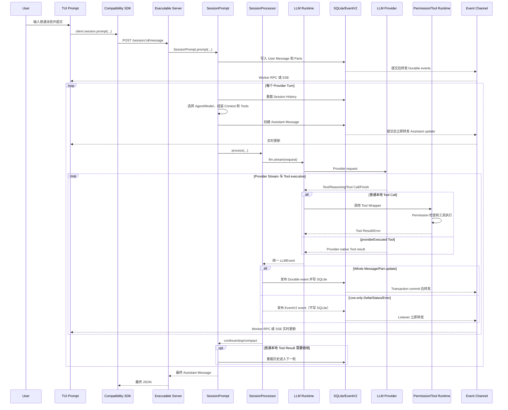

# 任务 2：当前运行时完整请求链

状态：已完成静态源码追踪，尚未运行端到端实验。

版本：`0e3474509aa5ad16afcf9c439785514d6443c6af`。

## 1. 追踪对象

本次追踪选择最常见场景：用户在默认交互式 TUI 中输入一条普通文本消息并按 Enter。Shell 模式、Slash Command、`opencode run` 和 native V2 Client 暂不作为主线。

## 2. 最重要的结论

当前 TUI 虽然导入了 `@opencode-ai/sdk/v2`，普通消息调用的仍是顶层兼容接口：

```ts
sdk.client.session.prompt(...)
```

它映射到：

```text
POST /session/{sessionID}/message
```

最终进入 `SessionPrompt.prompt` 和 `SessionPrompt.loop`。它不是 native V2 的：

```text
client.v2.session.prompt(...)
POST /api/session/{sessionID}/prompt
SessionV2.prompt(...)
```

因此，本章中的“当前请求链”以 `packages/opencode/src/session/` 为执行主体，同时标明它复用的 EventV2、Core Projector 和新 Server 组合层。

## 3. 总体流程

### 3.1 图中参与者分别是什么

用户提出的九个名称不是九个相互独立的进程，而是为了理解一次请求而划分的角色。为了不隐藏关键职责，图中还显式加入了 LLM Runtime 和 SessionProcessor 两个内部角色。默认本地 TUI 已经存在主线程与 Bun Worker 之间的 RPC；LLM Provider 也通常通过网络访问。远程连接时，TUI 与 Executable Server 之间会进一步改为 HTTP/SSE 通信。

| 图中名称 | 含义 | 在当前流程中的职责 |
| --- | --- | --- |
| 用户（User） | 使用 OpenCode 的开发者 | 输入目标、代码问题或修改要求，并在需要时回答 Permission 或 Question |
| TUI 输入组件（TUI Prompt） | 终端界面中的消息输入组件 | 收集 Text、File、Agent、Model 等信息，调用 SDK 发出请求，并清空输入框 |
| 兼容 SDK（Compatibility SDK） | 当前 TUI 使用的旧 Session API 客户端封装 | 把 `client.session.prompt(...)` 转换为 `POST /session/:id/message` 请求；它不是 native V2 Client 路径 |
| 可执行 Server（Executable Server） | OpenCode 当前 executable 组装出的 HTTP 路由和 Handler | 接收请求、校验 Session，并把兼容 Prompt 请求交给 `SessionPrompt.prompt`；默认本地模式可以通过 Worker 内部 `fetch` 调用，不要求监听真实端口 |
| SessionPrompt | 当前旧应用运行时的 Session Orchestration Service | 创建 User Message、运行外层 Agent Loop、重载历史、选择 Agent/Model、组装 Context/Tools，并决定继续、压缩或停止 |
| LLM Runtime | OpenCode 位于 SessionPrompt 与 Provider 之间的模型运行适配层 | 准备请求，通过默认 AI SDK 或可选 Native Adapter 调用 Provider，把 Provider Stream 统一转换成 `LLMEvent`，并在普通本地 Tool Call 时调度 Tool Wrapper |
| 模型提供商（LLM Provider） | 实际执行模型推理的远程 API 或本地模型服务 | 接收 System、Messages 和 Tool definitions，流式返回 Text、Reasoning、Tool Call、Usage 和 Finish 等结果 |
| Permission 与 Tool Runtime | OpenCode 的 Permission 检查、Tool Wrapper 和实际 Tool Executor | 验证模型生成的 Tool 参数，必要时请求用户批准，执行 Read、Bash、Edit、MCP 等 Tool，并产生 Tool Result |
| SessionProcessor | 当前 Provider Turn 的流式事件处理器 | 消费统一的 `LLMEvent`，维护 Assistant/Part/Tool 状态，发布 whole Part 和 live delta，并向 SessionPrompt 返回 `continue`、`stop` 或 `compact` |
| SQLite 与 EventV2 | OpenCode 的持久化数据库和统一事件基础设施 | EventV2 先运行 Projector 并把 durable Event、Message、Part 等写入 SQLite，提交后再通知 Listener；它们在图中合并表示“持久化边界”，但 EventV2 本身不等于数据库 |
| 事件通道（Event Channel） | 把运行进度实时送回 TUI 的 live transport | 默认本地 TUI 使用 Worker RPC 转发 GlobalBus Event；网络模式使用 `/global/event` SSE。它传输 Part Delta、Status 和 whole Message/Part update 等事件 |

几个最容易混淆的边界：

- `SessionPrompt` 是当前请求的 Orchestrator，不是模型本身。
- LLM Provider 只负责生成响应或 Tool Call，不直接读取 OpenCode 的 SQLite。
- Tool Runtime 负责真正改变文件或运行命令，模型只生成调用意图和参数。
- LLM Runtime 负责把本地 Tool Result 转成 `tool-result` 或 `tool-error` event；SessionProcessor 再把该 event 持久化成 completed/error Tool Part。
- EventV2 负责 durable Event 的提交和通知；Event Channel 负责把更新送到客户端，两者不是同一个概念。
- Compatibility SDK 和 native V2 Client 可以同时存在，但当前 TUI 普通消息只使用前者。

### 3.2 一次请求的流程总览

1. User 在 TUI Prompt 中输入消息并提交。
2. TUI Prompt 调用 Compatibility SDK 的 `client.session.prompt(...)`。
3. Compatibility SDK 构造 `POST /session/:id/message`，交给 Executable Server。
4. Server Handler 调用 `SessionPrompt.prompt(...)`。
5. SessionPrompt 先创建 User Message 和 Parts，通过 EventV2 持久化到 SQLite。
6. SessionPrompt 进入外层 Loop，重载 Session History，选择 Agent/Model，并组装 Context 和 Tools。
7. SessionPrompt 调用 SessionProcessor；SessionProcessor 通过 LLM Runtime 向 LLM Provider 发起一个 Provider Turn。
8. Provider Stream 经过 LLM Runtime 转成 `LLMEvent`。SessionProcessor 边接收边处理，而不是等整个 Provider Turn 结束后再统一处理。
9. 如果模型返回普通 Text，SessionProcessor 持久化完整 Part；Delta 和状态先作为 live-only EventV2 event 发布，再经 Event Channel 实时送回 TUI。
10. 如果模型返回需要本地执行的 Tool Call，LLM Runtime 调用 Permission/Tool Runtime；Tool Result 返回 LLM Runtime，并被转换成 `tool-result` 或 `tool-error` event。SessionProcessor 再将成功结果写成 completed Tool Part，将拒绝或失败写成 error Tool Part。`providerExecuted` Tool 不走本地执行路径。
11. 普通本地 Tool Result 通常触发下一次 Loop：SessionPrompt 重载历史，把 Tool Result 放入新的 Provider Request。
12. 当最新 Assistant Message 存在非 `tool-calls` 的 finish、它的 `parentID` 等于最新 User Message ID，并且不存在非 `providerExecuted`、非 interrupted-orphan 的 Tool Part 时，Loop 在顶部检查中退出。
13. Executable Server 最后通过原 Prompt 请求返回完整 Assistant Message；TUI 在此之前已经通过 Event Channel 持续显示进度。

下图把上述流程压缩成一张时序图：



这里存在两条不同的数据返回路径：

- Prompt POST 在整个 Loop 完成后返回一个最终 JSON 对象。
- Text delta、Reasoning、Tool 状态等实时更新通过独立事件通道返回。

## 4. 第一步：TUI 提交普通消息

TUI 的普通消息分支调用 `sdk.client.session.prompt(...)`。代码没有 `await` 这个 Promise，而是注册错误处理后立即清空输入框并继续渲染；实时结果依赖事件更新。

下面是省略错误处理细节后的核心逻辑：

```ts
sdk.client.session
  .prompt(
    {
      sessionID,
      ...selectedModel,
      agent: agent.name,
      model: selectedModel,
      variant,
      parts: [...editorParts, { type: "text", text: inputText }, ...nonTextParts],
    },
    { throwOnError: true },
  )
  .catch(/* 显示错误 */)
```

**源码位置**

- 文件：`packages/tui/src/component/prompt/index.tsx`
- 函数：`submitInner()` 的普通消息分支
- 行号：1092-1146
- 版本：`0e3474509a`

生成 SDK 将该方法映射为兼容路由。

**源码位置**

- 文件：`packages/sdk/js/src/v2/gen/sdk.gen.ts`
- 方法：`Session2.prompt()`
- 行号：3737-3795
- 版本：`0e3474509a`

注意：`Session2` 是代码生成名称，不能把数字 2 直接解释为 native Session V2。

## 5. 第二步：请求进入当前 executable Server

默认本地 TUI 不一定打开真实网络监听端口。它通过 Worker RPC 把生成 SDK 的 `fetch` 转交给同一套 `Server.Default().app.fetch` 路由图；显式网络模式才使用普通 HTTP。

**本地 Worker 传输位置**

- 文件：`packages/opencode/src/cli/cmd/tui.ts`
- 函数：`createWorkerFetch()`
- 行号：24-40
- 版本：`0e3474509a`

- 文件：`packages/opencode/src/cli/tui/worker.ts`
- 符号：`rpc.fetch`
- 行号：28-57
- 版本：`0e3474509a`

兼容 Session API 声明：

- 文件：`packages/opencode/src/server/routes/instance/httpapi/groups/session.ts`
- 符号：`SessionPaths`、`SessionApi` 的 `prompt` endpoint
- 行号：78-105、316-342
- 版本：`0e3474509a`

实际 Handler 调用 `promptSvc.prompt(...)`，等待整个 Loop 完成，再把最终 Message 作为单元素 JSON Stream 返回。

```ts
const message = yield* promptSvc.prompt({
  ...ctx.payload,
  sessionID: ctx.params.sessionID,
})
return HttpServerResponse.stream(Stream.make(JSON.stringify(message)).pipe(Stream.encodeText), {
  contentType: "application/json",
})
```

**源码位置**

- 文件：`packages/opencode/src/server/routes/instance/httpapi/handlers/session.ts`
- 函数：`SessionHttpApi.prompt`
- 行号：295-309
- 版本：`0e3474509a`

这意味着这里的 Streaming HTTP 响应不是逐 Token 响应。逐 Token 更新来自后文的事件通道。

## 6. 第三步：创建并持久化 User Message

`SessionPrompt.prompt` 先清理可能存在的 Revert 状态，再调用 `createUserMessage`。User Message 和解析后的 Parts 写入后，才进入 Loop。

下面是保留 per-prompt Permission 更新步骤的精简逻辑：

```ts
const session = yield* sessions.get(input.sessionID)
yield* revert.cleanup(session)
const message = yield* createUserMessage(input)
yield* sessions.touch(input.sessionID)

const permissions = Object.entries(input.tools ?? {}).map(([tool, enabled]) => ({
  permission: tool,
  action: enabled ? "allow" : "deny",
  pattern: "*",
}))
if (permissions.length > 0) {
  session.permission = permissions
  yield* sessions.setPermission({ sessionID: session.id, permission: permissions })
}

if (input.noReply === true) return message
return yield* loop({ sessionID: input.sessionID })
```

**源码位置**

- 文件：`packages/opencode/src/session/prompt.ts`
- 函数：`SessionPrompt.prompt`
- 行号：1052-1071
- 版本：`0e3474509a`

`createUserMessage` 同时完成 Agent、Model、Variant 选择，解析 Text、File、MCP Resource 和 Agent mention 等 Part，并触发 `chat.message` Plugin Hook。

**源码位置**

- 文件：`packages/opencode/src/session/prompt.ts`
- 函数：`SessionPrompt.createUserMessage`
- 行号：635-1050
- 版本：`0e3474509a`

最终写入位置：

- 文件：`packages/opencode/src/session/prompt.ts`
- 函数：`SessionPrompt.createUserMessage`
- 行号：1046-1049
- 版本：`0e3474509a`

Message 和各个 Part 是逐项发布的 durable event，不是把整条用户输入放在一个事务中一次写完。这意味着中途失败时，理论上可能留下 Message 和部分 Parts。

## 7. 第四步：进入串行化 Session Loop

`SessionPrompt.loop` 不直接执行 `runLoop`，而是通过 `SessionRunState.ensureRunning` 保证同一个 Session 只有一个活动 Runner。多个调用者会等待同一个运行结果，而不是启动两个并行 Loop。

**源码位置**

- 文件：`packages/opencode/src/session/prompt.ts`
- 函数：`SessionPrompt.loop`
- 行号：1343-1347
- 版本：`0e3474509a`

- 文件：`packages/opencode/src/session/run-state.ts`
- 函数：`SessionRunState.ensureRunning`
- 行号：52-69、88-94
- 版本：`0e3474509a`

主循环是显式的 `while (true)`。每一轮开始时重新从持久化状态加载经过 Compaction 过滤的历史。

```ts
while (true) {
  yield* status.set(sessionID, { type: "busy" })
  let msgs = yield* MessageV2.filterCompactedEffect(sessionID)
  const { user: lastUser, assistant: lastAssistant, finished: lastFinished, tasks } = MessageV2.latest(msgs)
  // 判断停止、Subtask、Compaction 或新 Provider Turn
}
```

**源码位置**

- 文件：`packages/opencode/src/session/prompt.ts`
- 函数：`SessionPrompt.run`，局部变量 `runLoop`
- 行号：1081-1168
- 版本：`0e3474509a`

重新加载 durable history 是一个重要设计事实：工具执行结束后的下一轮不是只依赖内存数组，而是重新读取已投影的 Message/Part。

## 8. 第五步：判断是否需要下一轮

Loop 在顶部检查最后一个 Assistant Message。如果它已经有非 `tool-calls` 的 finish reason、没有需要本地继续处理的 Tool Part，并且对应当前最新 User Message，就退出。

**源码位置**

- 文件：`packages/opencode/src/session/prompt.ts`
- 函数：`SessionPrompt.run` 的 terminal check
- 行号：1100-1130
- 版本：`0e3474509a`

显式检查 Tool Part 是为了兼容某些 Provider：它们可能返回 `stop`，但响应里同时存在 Tool Call。在默认 AI SDK 路径中，本地 Tool 通常已经在前一次 `llm.stream` 中执行并产生 Tool Result；顶部检查的作用是继续 Loop，把已经持久化的 Tool Result 发送给下一次 Provider Turn，而不是在检查后才开始执行 Tool。

## 9. 第六步：选择 Agent、Model 并创建 Assistant Message

每轮根据最新 User Message 重新解析 Model 和 Agent。随后创建新的 Assistant Message，并在调用 Provider 之前持久化。

**源码位置**

- 文件：`packages/opencode/src/session/prompt.ts`
- 函数：`SessionPrompt.run`
- 行号：1141-1179、1186-1201
- 版本：`0e3474509a`

Agent 的 `steps` 在当前路径中不是硬性程序循环上限。达到阈值时，OpenCode 向模型追加 `MAX_STEPS_PROMPT`；如果模型继续发出 Tool Call，代码没有仅因 steps 超限而直接 `break`。

**源码位置**

- 文件：`packages/opencode/src/session/prompt.ts`
- 函数：`SessionPrompt.run`
- 行号：1178-1179、1279-1282
- 版本：`0e3474509a`

## 10. 第七步：物化 Tools 并组装 Context

`SessionTools.resolve` 把 Built-in、Custom、Plugin 和 MCP Tool 转换成当前 Agent/Model 可以使用的可执行 Tool map。每个执行 Context 都带有 Session、Assistant Message、Call ID、Abort Signal、Agent、历史和 Permission 请求能力。

**源码位置**

- 文件：`packages/opencode/src/session/tools.ts`
- 函数：`SessionTools.resolve`
- 行号：41-493
- 版本：`0e3474509a`

Registry 的 Built-in Tool 初始化和初步筛选位置：

- 文件：`packages/opencode/src/tool/registry.ts`
- 函数：`ToolRegistry` Layer 初始化、`ToolRegistry.tools`
- 行号：86-249、286-335
- 版本：`0e3474509a`

同一轮使用未指定 `concurrency` 的 `Effect.all` 按数组顺序获取 Skills、Environment、Project Instructions、MCP Instructions 和转换后的 Session History，再按确定顺序放入 `system` 和 `messages`。

```ts
const [skills, env, instructions, mcpInstructions, modelMsgs] = yield* Effect.all([
  sys.skills(agent),
  sys.environment(model),
  instruction.system(),
  sys.mcp(agent, session.permission),
  MessageV2.toModelMessagesEffect(msgs, model),
])
```

**源码位置**

- 文件：`packages/opencode/src/session/prompt.ts`
- 函数：`SessionPrompt.run`
- 行号：1221-1286
- 版本：`0e3474509a`

## 11. 第八步：形成最终 Provider Request

`LLMRequestPrep.prepare` 在更靠近 Provider 的边界加入 Provider-specific base prompt 或 Agent prompt，并合并 per-turn system、User system、Agent/Model/Variant options、Plugin 参数、Headers 和最终可见 Tools。

```ts
const system = [
  [
    ...(input.agent.prompt ? [input.agent.prompt] : SystemPrompt.provider(input.model)),
    ...input.system,
    ...(input.user.system ? [input.user.system] : []),
  ].filter((x) => x).join("\n"),
]
```

**源码位置**

- 文件：`packages/opencode/src/session/llm/request.ts`
- 函数：`LLMRequestPrep.prepare`
- 行号：56-206
- 版本：`0e3474509a`

最终 Tool 可见性过滤：

- 文件：`packages/opencode/src/session/llm/request.ts`
- 函数：`resolveTools`
- 行号：208-214
- 版本：`0e3474509a`

默认 Provider 执行路径使用 AI SDK `streamText`。Native LLM Runtime 是当前旧 Session Loop 下的可选 Transport Adapter，不等同于 native V2 Session Runtime。

**源码位置**

- 文件：`packages/opencode/src/session/llm.ts`
- 函数：`LLM.run`、`LLM.stream`
- 行号：85-381
- 版本：`0e3474509a`

## 12. 第九步：处理流式输出和 Tool Call

`SessionProcessor.process` 消费统一的 `LLMEvent` Stream，把 Text、Reasoning、Tool Call、Tool Result、Usage、Step 和 Error 转成 Message/Part 更新。

```ts
const stream = llm.stream(streamInput)
yield* stream.pipe(
  Stream.tap((event) => handleEvent(event)),
  Stream.takeUntil(() => ctx.needsCompaction),
  Stream.runDrain,
)

if (ctx.needsCompaction) return "compact"
if (ctx.blocked || ctx.assistantMessage.error) return "stop"
return "continue"
```

**源码位置**

- 文件：`packages/opencode/src/session/processor.ts`
- 函数：`SessionProcessor.process`
- 行号：627-683
- 版本：`0e3474509a`

Tool Part 的主要状态变化发生在 `handleEvent`：

```text
tool-input-start/delta/end -> pending
tool-call                  -> running
tool-result                -> completed
tool-error                 -> error
```

**源码位置**

- 文件：`packages/opencode/src/session/processor.ts`
- 函数：`handleEvent`
- 行号：278-537
- 版本：`0e3474509a`

具体 Tool Wrapper 会在执行前后调用 Plugin Hook，并通过 `ctx.ask` 进入 Permission 系统。

**源码位置**

- 文件：`packages/opencode/src/session/tools.ts`
- 函数：`SessionTools.resolve` 中 Registry Tool Wrapper
- 行号：59-134
- 版本：`0e3474509a`

## 13. 第十步：持久化 Message、Part 和 Event

旧运行时没有直接在 `Session.updateMessage` 中写 SQL，而是发布 durable `SessionV1` Event。

```ts
const updateMessage = (msg) =>
  events.publish(SessionV1.Event.MessageUpdated, { sessionID: msg.sessionID, info: msg })

const updatePart = (part) =>
  events.publish(SessionV1.Event.PartUpdated, { sessionID: part.sessionID, part, time: Date.now() })
```

**源码位置**

- 文件：`packages/opencode/src/session/session.ts`
- 函数：`Session.updateMessage`、`Session.updatePart`
- 行号：631-645
- 版本：`0e3474509a`

EventV2 在 SQLite transaction 中先运行 Projector 和可选的 local commit hook，再更新 Event Sequence、写入 Event row；transaction 提交后才通知 Listener 和 PubSub。

**源码位置**

- 文件：`packages/core/src/event.ts`
- 函数：`commitDurableEvent`、`publishEvent`、`publish`
- 行号：205-438
- 版本：`0e3474509a`

旧 Session Event 被 Projector 写入 `session`、`message`、`part` 表。

**源码位置**

- 文件：`packages/core/src/session/projector.ts`
- 符号：`SessionProjector` Layer，`MessageUpdated` 与 `PartUpdated` Projector
- 行号：210-328
- 版本：`0e3474509a`

Text 和 Reasoning 的完整 Part 是 durable 的；中间 `message.part.delta` 是 live-only。进程在最终 whole-Part update 前崩溃时，最新流式后缀可能尚未持久化。

## 14. 第十一步：事件返回 TUI

`EventV2Bridge` 把 EventV2 转成兼容 `GlobalBus` Payload。Durable Event 还会额外发出一个 `sync` envelope，但当前 TUI 的普通更新主要消费 `message.updated`、`message.part.updated` 和 `message.part.delta`。

**源码位置**

- 文件：`packages/opencode/src/event-v2-bridge.ts`
- 符号：`EventV2Bridge` Layer、`publish`、Event Listener
- 行号：12-69
- 版本：`0e3474509a`

默认本地 TUI 使用 Worker 直接转发 `GlobalBus` Event：

- 文件：`packages/opencode/src/cli/tui/worker.ts`
- 符号：Global event RPC forwarding
- 行号：23-26
- 版本：`0e3474509a`

- 文件：`packages/opencode/src/cli/cmd/tui.ts`
- 函数：`createEventSource()`
- 行号：42-50
- 版本：`0e3474509a`

远程或网络 TUI 没有注入 Event Source 时，使用 `/global/event` SSE：

- 文件：`packages/tui/src/context/sdk.tsx`
- 函数：`startSSE()`
- 行号：82-131
- 版本：`0e3474509a`

TUI 将 Message、Part 和 Delta 合并到 Reactive Store：

- 文件：`packages/tui/src/context/sync.tsx`
- 符号：`SyncProvider` Event Reducer
- 行号：316-415
- 版本：`0e3474509a`

## 15. 第十二步：继续、停止、重试、压缩或中断

### 继续

普通本地、非 `providerExecuted` Tool Result 持久化后，Processor 通常返回 `continue`，外层 Loop 重载历史并创建下一个 Assistant Message，再次调用 Provider。`StructuredOutput` Tool 成功后会直接退出；由 Provider 自己执行的 Tool Part 也不会按普通本地 Tool 的规则强制继续。

### 停止

以下情况会停止当前 Loop：

- 普通最终文本响应后，Processor 通常先返回 `continue`；外层 Loop 重载历史，再由顶部 terminal check 确认最新 Assistant 已完成且没有需要继续的本地 Tool Part，然后退出而不再请求 Provider。
- Processor 返回 `stop`。
- Content Filter、Structured Output Error 或其他 Assistant Error。
- Compaction 处理决定停止。

**源码位置**

- 文件：`packages/opencode/src/session/prompt.ts`
- 函数：`SessionPrompt.run`
- 行号：1100-1130、1288-1339
- 版本：`0e3474509a`

### 重试

Retry 是同一个 Assistant Message、同一次应用 Provider Turn 的 Request retry，不会先重载 Session History。这个结论由 `Effect.retry` 在 `SessionProcessor.process` 内部包裹同一个 Processor Context 的位置证明；`SessionRetry.policy` 只负责错误分类和延迟策略。

- 文件：`packages/opencode/src/session/processor.ts`
- 函数：`SessionProcessor.process`
- 行号：627-676
- 版本：`0e3474509a`

- 文件：`packages/opencode/src/session/retry.ts`
- 函数：`SessionRetry.policy`
- 行号：84-205
- 版本：`0e3474509a`

### 压缩

启用自动压缩时，Context Overflow 或 Token 使用超过可用窗口通常会让 Processor 返回 `compact`；外层 Loop 创建 Compaction marker，后续轮次执行摘要和可选的自动继续。若 `compaction.auto === false`，Context Overflow 会记录 Assistant Error 并停止，Token 阈值检查也不会触发自动压缩。

- 文件：`packages/opencode/src/session/compaction.ts`
- 函数：`SessionCompaction.isOverflow`、`create`、`process`
- 行号：203-213、319-582
- 版本：`0e3474509a`

- 文件：`packages/opencode/src/session/processor.ts`
- 函数：`halt`、`SessionProcessor.process`
- 行号：607-617、679-681
- 版本：`0e3474509a`

- 文件：`packages/opencode/src/session/overflow.ts`
- 函数：`isOverflow`
- 行号：22-33
- 版本：`0e3474509a`

### 中断

取消会 Interrupt 当前 Runner 和 Provider Stream。Cleanup 会尽量持久化部分 Text/Reasoning，把未完成 Tool 标为 interrupted error，并给 Assistant Message 写入 Abort Error。

- 文件：`packages/opencode/src/session/run-state.ts`
- 函数：`SessionRunState.cancel`
- 行号：77-86
- 版本：`0e3474509a`

- 文件：`packages/opencode/src/session/processor.ts`
- 函数：`cleanup`、`halt`、`process`
- 行号：539-683
- 版本：`0e3474509a`

## 16. 状态分类

| 类型 | 当前请求链中的内容 |
| --- | --- |
| Durable SQLite | Session、Message、完整 Part、Durable Event、Event Sequence、Usage、Assistant Error |
| 文件系统 Snapshot | Git Tree、Index、Patch 所需的 Worktree 快照对象 |
| Server process-local | Session Runner、Status Map、Processor Context、流式 Text 累积、Tool Deferred、GlobalBus |
| TUI process-local | Event Queue、Reactive Store、Hydration Tracker、渲染状态 |
| Live-only Event | Part Delta、Session Status、Session Error、Permission Asked/Replied、Heartbeat 等 |
| Durable 且同时 Live | Session/Message/Part 的 whole update，先提交再通知 Listener |

## 17. 当前路径与 native V2 的边界

当前链路使用：

- `SessionV1.User`、`SessionV1.Assistant` 和旧 Part contracts。
- `SessionPrompt.run` 外层循环。
- `message.updated`、`message.part.*` 兼容事件。

当前链路没有调用：

- `SessionV2.prompt`。
- `SessionInput.admit`。
- `SessionExecution.wake`。
- native V2 `SessionRunner`。
- V2 Context Epoch admission 流程。

但它复用了新的 EventV2、Core Projector、部分共享 Schema、LLM Event 和新旧 Server 组合层。因此“当前运行时”不是完全隔离的纯 V1，而是旧 Session Orchestration 与新基础设施共存的迁移状态。

## 18. 关键测试

| 测试 | 证明内容 |
| --- | --- |
| `packages/opencode/test/server/httpapi-sdk.test.ts`，`matches generated SDK prompt streaming through fake LLM`，774-806 | 兼容 SDK prompt 路由、一次 LLM 调用和最终持久化 |
| `packages/opencode/test/session/prompt.test.ts`，825-851 | `tool-calls` 会触发第二次 Provider Call |
| `packages/opencode/test/session/prompt.test.ts`，892-918 | Provider 返回 `stop` 但存在 Tool Part 时仍继续 |
| `packages/opencode/test/session/processor-effect.test.ts`，751-814 | 最终 completed Tool Part 的 Input、Output、Metadata 和时间被正确持久化；完整状态转换由 Processor 实现代码证明 |
| `packages/core/test/event.test.ts`，157-321 | Projector 与 Durable Event 的 transaction/notification 顺序 |
| `packages/opencode/test/session/snapshot-tool-race.test.ts`，126-189 | Bash Tool 修改文件后能够得到非空 Session Diff；执行前调用 `snapshot.track()` 的时点由 `packages/opencode/src/session/processor.ts` 中的 `SessionProcessor.create` 98-109 行证明 |
| `packages/opencode/test/session/prompt.test.ts`，1405-1469 | Active Run 中的新 Prompt 会进入后续 Provider Input |

所有测试均位于 commit `0e3474509a`。本阶段只完成静态阅读，尚未实际执行这些测试。

## 19. 任务 2 输出结论

当前普通 TUI 请求的核心可以概括为：

```text
TUI 异步发起兼容 Prompt 请求
-> Server 等待 SessionPrompt 完成
-> User Message/Parts 先持久化
-> 每个 Provider Turn 重载 durable history
-> 组装 Agent、Context 和 Tools
-> Provider Stream 产生 Text/Reasoning/Tool Events
-> Message/Part/Event 持久化并实时通知 TUI
-> 普通本地 Tool Result 通常触发下一轮；普通最终响应在下一次顶部检查中结束 Loop
```

这里的普通本地 Tool 不包括 `providerExecuted` Tool 和成功后直接结束的 `StructuredOutput` Tool。

这条链路为后续各模块提供共同骨架。下一阶段应在这个骨架上分别深入 Agent/Orchestration、Context/Persistence、Tools/Security 和 Runtime Boundary，再按相同模块与 native V2 对照。
