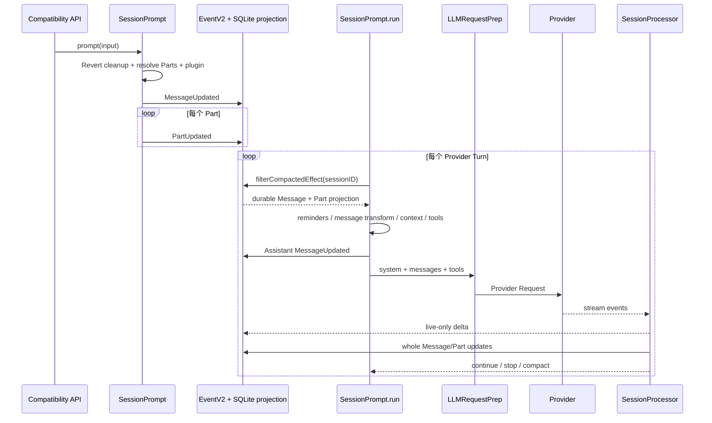

# OpenCode Harness：Context 与 Persistence 模块研究

状态：任务 7 已完成最小验证；任务 8 按用户指示跳过、未作理解验收；待任务 6 交叉审计。

核对日期：2026-08-18。

固定版本：`0e3474509aa5ad16afcf9c439785514d6443c6af`（分支 `dev`）。

研究对象：当前默认旧 Session Runtime 与 native V2 Session Runtime。除非另有说明，本文的“当前默认”指默认 TUI 普通消息实际进入的 `SessionPrompt` 路径；“native V2”指 `packages/core` 中通过 `/api/session/:sessionID/prompt` 接入的 Effect-native 路径。文件名中的 `v2`、Effect 写法或共享 EventV2 基础设施都不能单独证明 native V2 已接管默认 TUI。

研究方法：先对固定 commit 的入口、实现、规格和测试源码进行静态交叉阅读；任务 7 在 package 目录使用已安装依赖和 Bun 实际运行 Context/Persistence 代表性测试，并对旧 runtime `auto=false` overflow 做 test-name 隔离验证。未调用真实 Provider。

> 本文遵守仓库根 `CONTEXT.md` 的术语。System Context 不自动写成 System Prompt；Session History 不写成 Session Context；Context Snapshot 不等于代码工作树 Snapshot；Session Persistence 不自动称为长期 Memory。

系列位置：这是任务 3-5 四份模块笔记中的第 2 篇。阅读前建议先通过 `10_Research_Agent_and_Orchestration.md` 理解 Session Loop 和 Provider Turn；本文进一步解释每一轮“模型看见什么、系统保存什么”。读完后继续阅读 `12_Research_Tools_and_Security.md`。

## 1. 学习目标、前置知识与路线

### 1.1 学习目标

读完后应能按时间顺序回答：

1. 用户的一条输入怎样变成 User Message 与 Parts，哪些写入是原子的，哪些不是。
2. 每次 Provider Request 中模型看到了什么，System、Messages 与 Tool schemas 各自在哪里。
3. Provider base/Agent prompt、Environment、Project Instructions、MCP Instructions、Skill guidance、Session History 与 per-prompt system input 的拼接顺序是什么。
4. whole Message/Part、流式 delta、Event、SQLite projection 与进程内状态的生命周期有何不同。
5. 下一次 Provider Turn 或进程重启后为何能恢复，哪些流式后缀可能丢失。
6. Compaction、Pruning、代码工作树 Snapshot 与 Revert 分别解决什么问题。
7. native V2 的 Context Source、Context Snapshot、Context Epoch、`session_input`、event/projection 与 checkpoint 已实现到什么程度。

### 1.2 前置知识

- 当前默认请求链：`TUI -> 兼容 Session API -> SessionPrompt.prompt -> SessionPrompt.loop`。
- Provider Turn 是一次模型请求与其投影响应，不等于一条完整用户对话。
- Tool Call、Tool Result 与 Tool Settlement 是不同阶段。
- EventV2 是事件发布、durable sequence、projector 与订阅抽象；SQLite 是其中 durable 路径使用的存储，不是 EventV2 的同义词。

### 1.3 建议阅读路线

先看第 2 节概念地图，再按第 3 节走完当前默认时序；第 4 节专门拆 Provider Request，第 5-6 节回答持久化与压缩；最后单独阅读第 7 节 native V2，不把两套流程混在一张图中。

### 1.4 贯穿例子：窗口即将耗尽的长会话

假设一个 Session 已持续 100 个 Provider Turns：

- 用户要求修复支付重试 bug。
- Agent 已读取 30 个文件，运行多次测试，并产生很长的 Bash 输出。
- 前面已经做过一次 Compaction。
- 最近两轮又修改了 `src/payment/retry.ts`。
- 用户现在输入：“保留已有行为，修复最后一个失败测试并解释原因。”
- 这一轮 Provider Request 即将超过模型上下文窗口。

后文反复用这个例子回答四个问题：

1. **模型这一轮看到了什么？** 当前系统级内容、经 Compaction 选择的 Session History、当前用户输入和独立 Tool schemas。
2. **哪些内容保存了？** whole Message/Part、durable Event、projection、使用量和代码快照引用；流式 delta 本身不保存。
3. **下一轮为何能恢复？** Loop 重新查询 SQLite projection，而不是只复用内存数组。
4. **压缩后丢了什么、保留了什么？** 对未来模型而言，旧逐字历史可能只剩摘要、最近尾部和占位符；对 durable 存储而言，旧记录通常仍存在。

## 2. 概念地图：Context、History、Persistence、Memory 与 Snapshot

```text
Provider Request Context（解释性总称，不是一个仓库类型）
├── System / privileged instructions
│   ├── 当前默认：base/agent + env + instructions + MCP + skills + per-prompt system
│   └── native V2：agent system + Baseline System Context
├── Messages
│   ├── User / Assistant / Tool chronology
│   ├── native V2 Mid-Conversation System Message
│   └── Compaction summary/checkpoint + retained recent context
└── Tool schemas（独立 request 字段，不是 message，也不是 system 文本）

Durable state
├── Event log + aggregate sequence
├── SQLite projections（V1 message/part 或 V2 session_message/session_input）
├── native V2 Context Epoch row
└── 代码 Snapshot 对象与其引用

Ephemeral state
├── Session Runner / Drain / Status
├── 当前流式累积器与 Tool fibers/deferred
└── live-only deltas
```

| 概念 | 本文采用的准确含义 | 不等同于 |
| --- | --- | --- |
| System Context | `CONTEXT.md` 定义的、由 typed Context Sources 构成并作为初始指令与时间序更新呈现给模型的结构化集合；这是 native V2 的正式抽象 | 一个任意字符串 System Prompt；完整 Provider Request |
| Session History | 经 active Compaction 与 Context Epoch cutoff 后，为某次 Provider Turn 选择的 chronological projected conversation | System Context；完整数据库历史 |
| Context Source | 带稳定 key、codec、loader、baseline/update renderer 和可选 removal renderer 的独立 typed value | 当前旧路径中的任意 prompt 字符串 |
| Context Snapshot | native V2 用于比较 Context Source 上次 admitted value 的 model-hidden JSON | 代码工作树 Snapshot；聊天记录副本 |
| Context Epoch | 一个 immutable Baseline System Context 作为 provider-cache baseline 的有效跨度 | Session 生命周期；每个 Provider Turn |
| 代码工作树 Snapshot | Git tree/index 形式的文件状态，用于 patch、diff、restore、Revert | Context Snapshot；Session History |
| Persistence | Event、projection、Session/Message/Part、checkpoint 等跨调用保存机制 | Memory 的全部含义 |
| 长期 Memory | 跨 Session 检索、抽取和复用语义记忆的能力；本研究路径没有把 Session SQLite 历史实现成这种能力 | 单个 Session 的 durable history；项目 `AGENTS.md` |

**核心主张 CTX-001** `[V2 implemented @ 0e3474509aa5ad16afcf9c439785514d6443c6af]`：上述 System Context、Session History、Context Source、Context Snapshot 与 Context Epoch 的边界来自官方术语，不应互换。

- 路径：`CONTEXT.md`
- 符号：`Language`、`Relationships`
- 行号：7-46、88-135
- 版本：`0e3474509aa5ad16afcf9c439785514d6443c6af`

## 3. 当前默认路径：按时间顺序追踪

### 3.1 当前路径总图



### 3.2 输入解析发生在写入之前

`SessionPrompt.prompt` 先清理已有 Revert，再调用 `createUserMessage`。`createUserMessage` 选择 Agent/Model，生成 User Message，展开 Text、File、目录、MCP Resource 与 Agent mention；所有输入 Parts 并发 resolve，之后运行 `chat.message` plugin hook 和图像 normalize，最后才开始 Message/Part 写入。

```ts
const resolvedParts = yield* Effect.forEach(input.parts, resolvePart, { concurrency: "unbounded" }).pipe(
  Effect.map((x) => x.flat().map(assign)),
)
yield* plugin.trigger("chat.message", /* ... */, { message: info, parts: resolvedParts })
// ... image normalization and validation logging ...
yield* sessions.updateMessage(info)
for (const part of parts) yield* sessions.updatePart(part)
```

**核心主张 CTX-002** `[Current default @ 0e3474509aa5ad16afcf9c439785514d6443c6af]`：User Message 与所有 Parts **不是一个原子写入**。Message 是一个 durable event，每个 Part 又是一个独立 durable event；Message 成功后若第 N 个 Part 写入失败，理论上可留下 Message 与前 N-1 个 Parts。Part resolve/plugin 发生在首次写入前，但最终写入循环本身没有包在一个共同事务中。

- 路径：`packages/opencode/src/session/prompt.ts`
- 函数：`SessionPrompt.createUserMessage`、`SessionPrompt.prompt`
- 行号：635-1057，关键写入 995-1049
- 版本：`0e3474509aa5ad16afcf9c439785514d6443c6af`
- 边界：当前未找到专门注入第 N 个 `PartUpdated` 失败以证明残留形态的测试；结论由入口控制流和每次 `events.publish` 独立提交的位置直接得出。

对贯穿例子而言，用户的最后一句先成为 durable User Message；文本、附件或 synthetic file-read 内容分别成为 Parts。只有这些写入完成，Loop 才开始请求模型。

### 3.3 每个 Loop 都重载 durable history

`SessionPrompt.run` 的外层 `while (true)` 每轮执行：

```ts
let msgs = yield* MessageV2.filterCompactedEffect(sessionID)
const { user: lastUser, assistant: lastAssistant, finished: lastFinished, tasks } = MessageV2.latest(msgs)
```

`MessageV2.stream` 分页查询 `message` 表，再批量 hydrate `part` 表；`filterCompacted` 选择 active model representation。它不是从上轮的 in-memory `msgs` 接着 append。

**核心主张 CTX-003** `[Current default @ 0e3474509aa5ad16afcf9c439785514d6443c6af]`：普通 Tool Result 后的下一次 Provider Turn 会重新读取 SQLite 中已投影的 Message/Part；因此 durable whole Part 是恢复与 continuation 的权威来源，live delta 不是。

- 路径：`packages/opencode/src/session/prompt.ts`
- 函数：`SessionPrompt.run` 的 `runLoop`
- 行号：1081-1096、1288-1338
- 版本：`0e3474509aa5ad16afcf9c439785514d6443c6af`
- 路径：`packages/opencode/src/session/message-v2.ts`
- 函数：`hydrate`、`page`、`stream`、`filterCompactedEffect`
- 行号：98-123、425-490、521-575
- 版本：`0e3474509aa5ad16afcf9c439785514d6443c6af`
- 测试：`packages/opencode/test/session/prompt.test.ts`，`loop continues when finish is tool-calls`，825-850；`prompt submitted during an active run is included in the next LLM input`，1405-1468
- 测试版本：`0e3474509aa5ad16afcf9c439785514d6443c6af`

### 3.4 重载后进行 per-turn 变换

重载后的 `msgs` 还会经过以下过程：

1. `SessionReminders.apply` 可以为当前 turn 修改 model-visible messages。
2. `experimental.chat.messages.transform` 可以修改 `msgs`。
3. `MessageV2.toModelMessagesEffect` 把 V1 Message/Part 降低成 Provider messages。
4. 当前 Assistant Message 在 Provider call 前先 durable 写入。

这些 per-turn 变换不应自动理解成新的 durable Message/Part；只有显式调用 `Session.updateMessage/updatePart` 的内容才投影到 SQLite。

**核心主张 CTX-004** `[Current default @ 0e3474509aa5ad16afcf9c439785514d6443c6af]`：当前 turn 的 model-visible messages 是 durable history 的一次 projection，加上 per-turn reminders/plugin transform；它不等于数据库中 Message/Part 的逐字 dump。

- 路径：`packages/opencode/src/session/prompt.ts`
- 函数：`SessionPrompt.run`
- 行号：1170-1201、1252-1286
- 版本：`0e3474509aa5ad16afcf9c439785514d6443c6af`
- 路径：`packages/opencode/src/session/message-v2.ts`
- 函数：`MessageV2.toModelMessagesEffect`
- 行号：131-415
- 版本：`0e3474509aa5ad16afcf9c439785514d6443c6af`

### 3.5 Context 与 Tools 组装

同一轮并发加载五项结果，但最终数组位置是确定的：

```ts
const [skills, env, instructions, mcpInstructions, modelMsgs] = yield* Effect.all([
  sys.skills(agent),
  sys.environment(model),
  instruction.system(),
  sys.mcp(agent, session.permission),
  MessageV2.toModelMessagesEffect(msgs, model),
])
const system = [
  ...env,
  ...instructions,
  ...(mcpInstructions ? [mcpInstructions] : []),
  ...(skills ? [skills] : []),
]
```

`Effect.all` 的并发完成顺序不改变 destructuring 与后续拼接顺序。Tools 由 `SessionTools.resolve` 独立物化，不塞进这个字符串数组。

**核心主张 CTX-005** `[Current default @ 0e3474509aa5ad16afcf9c439785514d6443c6af]`：`SessionPrompt.run` 提供给 LLM 层的 system-level 内容顺序为 **Environment -> Project Instructions -> MCP Instructions -> Skill guidance**；Session History 走独立 `messages`，Tool definitions 走独立 `tools`。

- 路径：`packages/opencode/src/session/prompt.ts`
- 函数：`SessionPrompt.run`
- 行号：1221-1286，关键顺序 1255-1285
- 版本：`0e3474509aa5ad16afcf9c439785514d6443c6af`
- 测试：`packages/opencode/test/session/prompt.test.ts`，`loop includes MCP instructions in model system context`，557-580
- 测试版本：`0e3474509aa5ad16afcf9c439785514d6443c6af`

### 3.6 最终 Provider Request

靠近 Provider 边界的 `LLMRequestPrep.prepare` 再加入最前和最后两层：

```ts
const system = [[
  ...(input.agent.prompt ? [input.agent.prompt] : SystemPrompt.provider(input.model)),
  ...input.system,
  ...(input.user.system ? [input.user.system] : []),
].filter((x) => x).join("\n")]
```

之后 `experimental.chat.system.transform` 可修改整个 `system` 数组。普通 AI SDK 路径把 System message(s) 放在 chronological messages 前；OpenAI OAuth 把它们写入 provider option `instructions`，workflow 路径也不在这里 prepend System message。Tool map 经过 permission 与 per-prompt override 过滤，再按名称排序，仍是单独字段。

**核心主张 CTX-006** `[Current default @ 0e3474509aa5ad16afcf9c439785514d6443c6af]`：默认旧路径在 plugin system transform **之前**的 assembly order 是：

```text
Provider-family base instructions，或 Agent prompt（二选一）
-> Environment
-> Project Instructions
-> MCP Instructions
-> Skill guidance
-> Structured-output policy（如启用）
-> per-prompt user.system
-> experimental.chat.system.transform
```

Session History 不在这条字符串拼接链内；Tool schemas 也不在。`experimental.chat.system.transform` 可以任意修改 `system` 数组，因此 hook 运行后不再保证仍保持前述顺序。

- 路径：`packages/opencode/src/session/llm/request.ts`
- 函数：`LLMRequestPrep.prepare`、`resolveTools`
- 行号：56-114、148-205、208-214
- 版本：`0e3474509aa5ad16afcf9c439785514d6443c6af`
- 路径：`packages/opencode/src/session/system.ts`
- 函数：`provider`、`SystemPrompt.environment`、`SystemPrompt.skills`、`SystemPrompt.mcp`
- 行号：27-49、67-135
- 版本：`0e3474509aa5ad16afcf9c439785514d6443c6af`
- 测试：`packages/opencode/test/session/system.test.ts`，provider prompt 选择 86-110、Skill guidance 112-129、MCP instructions 132-167
- 测试版本：`0e3474509aa5ad16afcf9c439785514d6443c6af`

### 3.7 流式更新与下一轮恢复

Text/Reasoning 开始时先写一个 whole Part；delta 只更新 `ProcessorContext` 中的累计字符串并发布 live-only `message.part.delta`；结束时再 durable 写完整 Part。Tool Part 则 durable 经历 pending/running/completed/error 状态。

**核心主张 CTX-007** `[Current default @ 0e3474509aa5ad16afcf9c439785514d6443c6af]`：whole Part update 是 durable，delta 是 live-only。正常结束或受控 interrupt cleanup 会尽量把累计全文写回；若进程在 whole update 前直接崩溃，最后一段 delta 后缀可能只曾存在于进程内和连接中的 UI，不能从 durable history 重放。

- 路径：`packages/opencode/src/session/processor.ts`
- 函数：`SessionProcessor.create` 内 `handleEvent`、`cleanup`
- 行号：278-313、486-532、539-597
- 版本：`0e3474509aa5ad16afcf9c439785514d6443c6af`
- 路径：`packages/opencode/src/session/session.ts`
- 函数：`Session.updatePart`、`updatePartDelta`
- 行号：631-645、879-887
- 版本：`0e3474509aa5ad16afcf9c439785514d6443c6af`
- 路径：`packages/schema/src/v1/session.ts`
- 符号：durable `PartUpdated` 与 live-only `PartDelta`
- 行号：502-507、612-641
- 版本：`0e3474509aa5ad16afcf9c439785514d6443c6af`

对贯穿例子：UI 可能已经显示“失败原因是重试计数…”，但若进程在 `text-end` 前硬崩溃，SQLite 中可能仍是较早的 whole Part 状态。重启后的下一轮只能恢复 durable 版本，不会从 delta transport 补齐文字。

## 4. 当前模型可见内容：来源、优先与边界

### 4.1 来源拆解

| 来源 | 当前默认模型如何看到 | 是否 durable | 关键边界 |
| --- | --- | --- | --- |
| Provider base instructions | System content 的最前部 | 否，每 turn 按 model 重选 | Agent 有自定义 `prompt` 时被替代，不是叠加 |
| Agent prompt | 替代 Provider base，位于最前 | Agent config durable 于配置文件，不作为 Session Message 保存 | 与 native V2 `agent.system` 命名时代不同 |
| Environment | System content | 否，每 turn 重算 | 包含 model identity、cwd、worktree、git/platform/date、references |
| Project Instructions | System content | 来源文件 durable；拼接结果不作为旧 Session Message 保存 | global/upward、configured glob/local 与 remote URL；读取失败通常降为空字符串 |
| MCP Instructions | System content | 否，每 turn从连接状态获取 | 只保留至少一个相关 tool 未被 deny 的 server |
| Skill guidance | System content | 否，每 turn按 Agent permission 获取 | 这里只列 skill 名称/描述；skill body 经 `skill` tool 加载并以 Tool Result 进入 history |
| Session History | `messages` | 是，来自 Message/Part projection | 经 Compaction、Part 类型、错误状态、model compatibility 等转换 |
| per-prompt system input | System content 最后部 | 是，保存在 User Message 的 `system` 字段 | 只对以该 latest User Message 驱动的 turns 生效 |
| Tool schemas | Provider request 的 `tools` 字段 | 定义本身通常来自进程/config/plugin/MCP，不作为 Message 保存 | 权限、Agent 与 per-prompt `tools[name] !== false` 决定可见性 |

附近嵌套 instruction 还有一条不同边界：`Instruction.resolve` 在 Read Tool 读取文件时向上发现附近 `AGENTS.md`/`CLAUDE.md`/`CONTEXT.md`，将内容包在 `<system-reminder>` 中追加到该 Tool Result。它随 completed Tool Part 进入 Session History，不属于每轮 `Instruction.system()` 产生的 ambient System content。

- 路径：`packages/opencode/src/tool/read.ts`
- 函数：Read Tool `run`
- 行号：300-376，关键追加 355-357
- 版本：`0e3474509aa5ad16afcf9c439785514d6443c6af`

**核心主张 CTX-008** `[Current default @ 0e3474509aa5ad16afcf9c439785514d6443c6af]`：旧路径中的 Environment、Instructions、MCP 与 Skill 文本是 per-turn 重新观察和拼接的字符串来源，不能倒推为 native V2 typed Context Source、Context Snapshot 或 Context Epoch；当前默认路径没有调用 V2 Context Epoch admission。

- 路径：`packages/opencode/src/session/system.ts`
- 符号：`SystemPrompt.Service`
- 行号：51-152
- 版本：`0e3474509aa5ad16afcf9c439785514d6443c6af`
- 路径：`packages/opencode/src/session/instruction.ts`
- 函数：`Instruction.systemPaths`、`Instruction.system`、`Instruction.resolve`
- 行号：110-169、179-221
- 版本：`0e3474509aa5ad16afcf9c439785514d6443c6af`
- 入口边界：`packages/opencode/src/session/prompt.ts`，`SessionPrompt.run`，1255-1286
- 版本：`0e3474509aa5ad16afcf9c439785514d6443c6af`

### 4.2 Session History 不是数据库全文直送

当前 projection 会：

- 跳过没有 Parts 的 Message。
- 忽略 `ignored` 或空 User text。
- 把 text/plain/目录附件的 synthetic read 内容作为文本，而不重复发文件。
- 对已 Prune 的 Tool output 发送 `[Old tool result content cleared]`。
- 对不同 model 的 reasoning 降低为普通 Assistant text，并去掉不兼容 provider metadata。
- 把未结算 Tool 状态降低成 interrupted error，避免 dangling tool call。
- 应用最新 completed Compaction 的 summary 与 retained tail。

**核心主张 CTX-009** `[Current default @ 0e3474509aa5ad16afcf9c439785514d6443c6af]`：历史重载恢复的是 durable domain state；`toModelMessagesEffect` 再生成本轮 Provider-visible representation。两者不能写成同一层。

- 路径：`packages/opencode/src/session/message-v2.ts`
- 函数：`toModelMessagesEffect`、`filterCompacted`
- 行号：131-415、521-571
- 版本：`0e3474509aa5ad16afcf9c439785514d6443c6af`

### 4.3 Tool schemas 与 Messages/System 分离

Tool definition 描述“模型可以调用什么以及参数 schema”，历史中的 Tool Call/Result 描述“过去发生了什么”。即使历史里已有一个 Bash Tool Result，本轮 `bash` schema 仍可能因为权限或 per-prompt override 被移除；反过来，schema 可见也不表示工具已执行。

**核心主张 CTX-010** `[Current default @ 0e3474509aa5ad16afcf9c439785514d6443c6af]`：最终 Tool visibility 由 Agent permission、Session permission 与 User Message 的 per-prompt tool override 共同过滤；Tool map 按名称排序后作为独立 request 字段发送。

- 路径：`packages/opencode/src/session/llm/request.ts`
- 函数：`resolveTools`、`LLMRequestPrep.prepare`
- 行号：148-184、208-214
- 版本：`0e3474509aa5ad16afcf9c439785514d6443c6af`

## 5. Durable、process-local 与 live-only 状态矩阵

### 5.1 当前默认路径

| 状态 | 分类 | 保存/失效位置 | 下一轮或重启后 |
| --- | --- | --- | --- |
| Session row | Durable SQLite projection | `session` | 可重载 |
| V1 User/Assistant Message | Durable Event + `message` projection | `event`、`message` | 可重载 |
| whole Part，包括完整 Text/Reasoning/Tool | Durable Event + `part` projection | `event`、`part` | 可重载 |
| `message.part.delta` | Live-only Event | Listener/PubSub/transport | 不可重放 |
| Event aggregate sequence | Durable | `event_sequence` | 保持顺序与 cursor |
| Session Runner、Status map | Process-local | `SessionRunState`、status service | 进程退出即失效 |
| Processor accumulated text/reasoning/tool deferred | Process-local | `ProcessorContext` | 硬崩溃丢失未 whole-save 后缀 |
| TUI reactive store | Client process-local | TUI store | 断线后需 authoritative refresh |
| 代码 Snapshot object | Durable filesystem object，引用可在 Part/Session row | OpenCode snapshot Git dir | 在保留期与对象存在时可 restore/diff |
| Revert marker | Durable Session projection | `session.revert` | 后续 cleanup/unrevert 可继续 |

### 5.2 native V2 路径

| 状态 | 分类 | 保存/失效位置 | 下一轮或重启后 |
| --- | --- | --- | --- |
| `PromptAdmitted` | Durable Event | `event` | 可重放 |
| `session_input` pending row | Durable projection | `session_input` | 可继续 promotion |
| `Prompted` 与 User message | Durable Event + atomic projections | `session_input.promoted_seq`、`session_message` | 可重载 |
| Baseline System Context + Context Snapshot | Durable operational state | `session_context_epoch` | 同一 active epoch 中复用 |
| Mid-Conversation System Message | Durable Event + `session_message` projection | `event`、`session_message` | 可按 cutoff 重放给模型 |
| Text/Reasoning/Tool Input Delta | Live-only Event | PubSub/connected renderer | 不进入 durable Session stream |
| Text/Reasoning Ended 与 Tool settlement | Durable Event + projection | `event`、`session_message` | 可恢复完整结算值 |
| Session Drain、active registry、Tool fibers | Process-local | `SessionRunCoordinator`/FiberSet | 重启清空 |
| completed checkpoint | Durable Event + Compaction message projection | `event`、`session_message` | 决定新的 active history boundary |

### 5.3 EventV2 不等于 SQLite

durable event 的提交顺序是：

```text
进入 SQLite transaction
-> 分配/核验 aggregate sequence
-> inline Projector
-> 可选 local commit hook
-> 更新 event_sequence
-> 插入 event row
-> transaction commit
-> 通知 durable wake、Listener 与 PubSub
```

live-only event 跳过 durable transaction 与 event row，直接 notify。SQLite projection 是 Projector 根据 Event 更新的 read model；Event 是发生过的 domain fact。二者可以同事务更新，但仍是不同概念和不同表。

**核心主张 CTX-011** `[Current compatibility @ 0e3474509aa5ad16afcf9c439785514d6443c6af]`：当前旧 Session Message/Part 写入复用 EventV2 durable transaction 与 Core SessionProjector；一个 `PartUpdated` transaction 会同时更新 `part` projection、aggregate sequence 与 `event` row，提交后才通知观察者。

- 路径：`packages/core/src/event.ts`
- 函数：`commitDurableEvent`、`publishEvent`、`notify`
- 行号：205-438
- 版本：`0e3474509aa5ad16afcf9c439785514d6443c6af`
- 路径：`packages/core/src/session/projector.ts`
- 符号：`SessionProjector` 对 `MessageUpdated`、`PartUpdated` 的 projector
- 行号：210-328
- 版本：`0e3474509aa5ad16afcf9c439785514d6443c6af`
- 路径：`packages/core/src/event/sql.ts`、`packages/core/src/session/sql.ts`
- 符号：`EventTable`、`EventSequenceTable`、`MessageTable`、`PartTable`
- 行号：`event/sql.ts` 4-25；`session/sql.ts` 68-98
- 版本：`0e3474509aa5ad16afcf9c439785514d6443c6af`
- 测试：`packages/core/test/event.test.ts`，projector/commit/rollback/notification tests，157-288；live-only durable stream exclusion，507-518
- 测试版本：`0e3474509aa5ad16afcf9c439785514d6443c6af`

## 6. 当前默认：Compaction、Pruning、Snapshot、Revert 与恢复

### 6.1 四者目的不同

| 机制 | 主要目的 | 改变模型可见历史 | 改变代码工作树 | 删除 durable conversation |
| --- | --- | --- | --- | --- |
| Compaction | 用摘要和近期尾部控制上下文窗口 | 是 | 否 | 通常否 |
| Pruning | 隐藏较旧、很大的 Tool output | 是 | 否 | 当前实现保留原 output 字段，只写 `time.compacted` |
| 代码 Snapshot | 捕获代码文件状态，用于 diff/restore | 否 | Snapshot 本身不改；restore/revert 会改 | 否 |
| Revert | 暂存或提交对 conversation suffix 与代码改动的撤回 | 是，cleanup 后 | 是 | cleanup 发布 remove events 删除 projections；durable event log 仍保留删除事实 |

### 6.2 自动 Compaction 与禁用行为

当前默认路径有两类触发：

- 已完成 turn 的 token usage 达到 usable limit，Loop 创建 Compaction marker。
- Provider 返回 Context Overflow，Processor 设置 `needsCompaction`。

但 `compaction.auto === false` 时：

- 本地 token threshold 的 `isOverflow` 直接返回 `false`。
- Provider Context Overflow 被写成 Assistant Error，finish 设为 `error`，Loop 停止，不创建 Compaction marker。

**核心主张 CTX-012** `[Current default @ 0e3474509aa5ad16afcf9c439785514d6443c6af]`：旧运行时禁用自动 Compaction 后，不是“仍压缩但不自动继续”，而是阈值不触发压缩，Provider overflow 作为终止错误保存。

- 路径：`packages/opencode/src/session/overflow.ts`
- 函数：`isOverflow`
- 行号：22-34
- 版本：`0e3474509aa5ad16afcf9c439785514d6443c6af`
- 路径：`packages/opencode/src/session/processor.ts`
- 函数：`SessionProcessor.halt`
- 行号：599-625，关键分支 607-617
- 版本：`0e3474509aa5ad16afcf9c439785514d6443c6af`
- 测试：`packages/opencode/test/session/prompt.test.ts`，`loop stops provider overflow instead of auto-compacting when disabled`，677-705
- 测试：`packages/opencode/test/session/compaction.test.ts`，`returns false when compaction.auto is disabled`，547-563
- 测试版本：`0e3474509aa5ad16afcf9c439785514d6443c6af`

### 6.3 Compaction 保存什么、未来模型失去什么

旧路径先创建一个带 `compaction` Part 的 synthetic User Message，再让 compaction Agent 根据 selected head 生成 Assistant summary。`tail_start_id` 指向需要逐字保留的近期尾部；`filterCompacted` 后，Provider-visible history 变成：

```text
compaction user marker（降低成 “What did we do so far?”）
-> completed summary Assistant Message
-> retained recent tail
-> compaction 后的新消息
```

**对未来模型保留：** summary 中被模型选中的目标、约束、工作状态，`tail_start_id` 后的完整近期 turns，以及压缩后的新 turns。

**对未来模型丢失：** 未进入 summary 的旧细节、未保留的逐字旧 turns、旧媒体原始内容，以及 compaction serialization 中被截断的 Tool output。

**对 durable store 保留：** 原 Message/Part rows、Compaction marker、summary、tail boundary 与事件；`filterCompacted` 是读取选择，不是批量删除旧 rows。

**核心主张 CTX-013** `[Current default @ 0e3474509aa5ad16afcf9c439785514d6443c6af]`：当前 Compaction 是“保留 durable 全历史、替换 active model representation”的机制；摘要是有损的，而 retained tail 是选择出的原 Message/Part projection。

- 路径：`packages/opencode/src/session/compaction.ts`
- 函数：`select`、`processCompaction`、`create`
- 行号：215-269、319-582
- 版本：`0e3474509aa5ad16afcf9c439785514d6443c6af`
- 路径：`packages/opencode/src/session/message-v2.ts`
- 函数：`filterCompacted`、`toModelMessagesEffect`
- 行号：228-233、521-571
- 版本：`0e3474509aa5ad16afcf9c439785514d6443c6af`
- 测试：`packages/opencode/test/session/compaction.test.ts`，tail boundary/filtered history tests，939-1095、1447-1455、1559-1606
- 测试版本：`0e3474509aa5ad16afcf9c439785514d6443c6af`

### 6.4 Pruning 不是 Compaction

Pruning 从旧 Tool output 向前累计 token，保护最近 40,000 tokens、至少两个最近 user turns 和 `skill` Tool；达到最小 20,000 tokens 后，把选中 completed Tool Part 的 `state.time.compacted` 写入 durable Part。它没有删除 `state.output` 字符串，但 model projection 改成 `[Old tool result content cleared]`。

**核心主张 CTX-014** `[Current default @ 0e3474509aa5ad16afcf9c439785514d6443c6af]`：当前 Pruning 是 durable visibility marker，不是 summary，也不是物理清空 Tool output 字段。它减少未来模型可见内容，但保留数据库中的原 Part output。

- 路径：`packages/opencode/src/session/compaction.ts`
- 符号：`PRUNE_MINIMUM`、`PRUNE_PROTECT`、`prune`
- 行号：28-33、271-317
- 版本：`0e3474509aa5ad16afcf9c439785514d6443c6af`
- 路径：`packages/opencode/src/session/message-v2.ts`
- 函数：`toModelMessagesEffect`
- 行号：290-323
- 版本：`0e3474509aa5ad16afcf9c439785514d6443c6af`
- 测试：`packages/opencode/test/session/compaction.test.ts`，`compacts old completed tool output` 与 protected Skill，626-812
- 测试版本：`0e3474509aa5ad16afcf9c439785514d6443c6af`

### 6.5 代码工作树 Snapshot 与 Revert

SessionProcessor 在 Provider stream 前预捕获 Git tree Snapshot，step finish 后计算 patch，并把 snapshot hash/files 放入 durable Parts。Snapshot 数据位于 OpenCode 管理的 Git dir，不是模型 Context。

Revert 分两阶段：

1. `revert(...)` 要求 Session idle，计算目标后续 patch，恢复文件，并将 boundary/snapshot/diff 写入 `session.revert`；此时 Message rows 还在。
2. `cleanup(...)` 在下一次 prompt 前或显式调用时，从 Message boundary 起删除 suffix；有 `partID` 时保留该 Message 中 boundary Part 之前的 Parts，再清除 revert marker。`unrevert(...)` 则恢复暂存前 Snapshot 并清 marker。

**核心主张 CTX-015** `[Current default @ 0e3474509aa5ad16afcf9c439785514d6443c6af]`：Revert 同时协调代码工作树与 conversation projection，但 Context Snapshot 完全不参与；“撤回聊天”和“恢复文件”由不同存储机制协作完成。

- 路径：`packages/opencode/src/session/processor.ts`
- 函数：`SessionProcessor.create`、`handleEvent`、`cleanup`
- 行号：98-114、424-470、539-553
- 版本：`0e3474509aa5ad16afcf9c439785514d6443c6af`
- 路径：`packages/opencode/src/snapshot/index.ts`
- 符号：`Snapshot.Service`；函数 `track`、`patch`、`restore`、`revert`
- 行号：36-45、318-443、779-795
- 版本：`0e3474509aa5ad16afcf9c439785514d6443c6af`
- 路径：`packages/opencode/src/session/revert.ts`
- 函数：`SessionRevert.revert`、`unrevert`、`cleanup`
- 行号：38-124
- 版本：`0e3474509aa5ad16afcf9c439785514d6443c6af`
- 测试：`packages/opencode/test/session/revert-compact.test.ts`，revert/cleanup tests，230-265、273-395、400-464
- 测试版本：`0e3474509aa5ad16afcf9c439785514d6443c6af`

### 6.6 失败恢复语义

| 失败点 | 当前默认可恢复内容 | 限制 |
| --- | --- | --- |
| User Message 后、部分 Parts 前失败 | 已提交 Message 与前缀 Parts | 非原子，可能是 partial input |
| delta 中硬崩溃 | 最近 whole Part、durable Message/Tool state | delta 后缀丢失 |
| 受控 interrupt | cleanup 尽量 whole-save Text/Reasoning，Tool 标 interrupted，Assistant 写 Abort Error | side effect 本身不保证回滚 |
| Tool Result 后 | 下一 Loop 从 SQLite 重载 Result | Tool side effect 与记录之间仍有进程崩溃窗口 |
| Provider retry | 同一个 Processor/Assistant 内重试 | retry 前不重载 history |
| 进程重启 | Session/Message/Part/Event/projection 可读 | 当前旧 Runner/Status 不恢复；需要新的 prompt/resume 触发执行 |

**核心主张 CTX-016** `[Current default @ 0e3474509aa5ad16afcf9c439785514d6443c6af]`：durable history 支持重载，不等于自动 post-crash continuation。Session Runner、Status 与流式 accumulator 都是 process-local；重启后需要新的入口重新驱动 Loop。

- 路径：`packages/opencode/src/session/run-state.ts`
- 函数：`SessionRunState.ensureRunning`、`cancel`
- 行号：52-94
- 版本：`0e3474509aa5ad16afcf9c439785514d6443c6af`
- 路径：`packages/opencode/src/session/processor.ts`
- 函数：`SessionProcessor.process`、`cleanup`
- 行号：539-683
- 版本：`0e3474509aa5ad16afcf9c439785514d6443c6af`

## 7. native V2：独立术语与流程

### 7.1 native V2 总图

```mermaid
sequenceDiagram
    participant C as V2 Client
    participant V as SessionV2.prompt
    participant E as EventV2/SQLite
    participant R as SessionRunner
    participant X as System Context Registry
    participant L as LLM

    C->>V: prompt(prompt, delivery, resume)
    V->>E: PromptAdmitted -> session_input
    opt resume !== false
        V->>R: advisory wake(sessionID)
    end
    R->>X: initialize missing Context Epoch
    alt initial source unavailable
        R-->>C: fail; prompt remains pending
    else complete baseline
        R->>E: insert session_context_epoch
        R->>E: Prompted (promote input atomically)
        R->>X: reconcile at safe boundary
        opt changed sources
            R->>E: ContextUpdated + snapshot advance atomically
        end
        R->>E: load Session History by compaction/epoch cutoff
        R->>L: agent system + baseline; messages; tools
        L-->>R: stream
        R-->>E: live deltas
        R->>E: durable ended/settlement events + session_message projection
        R->>E: reload before continuation
    end
```

### 7.2 durable admission 与 Prompt Promotion

`SessionV2.prompt` 先在 uninterruptible region 中调用 `SessionInput.admit`。`PromptAdmitted` 的 projector 写 `session_input`，但不写 model-visible `session_message`。`resume !== false` 只做 advisory wake。

Runner 在 Safe Provider-Turn Boundary 发布 `Prompted`。同一个 durable event transaction 中，Projector 既将 `session_input.promoted_seq` 更新为 event sequence，又通过 `SessionMessageUpdater` append User message。

**核心主张 CTX-017** `[V2 implemented @ 0e3474509aa5ad16afcf9c439785514d6443c6af]`：V2 把“输入已 durable 接收”与“输入已进入 Session History”拆成两个 durable transition；Prompt Promotion 对 inbox 消费状态和 visible User message projection 是原子的。

- 路径：`packages/core/src/session.ts`
- 函数：`V2Session.prompt`
- 行号：360-386
- 版本：`0e3474509aa5ad16afcf9c439785514d6443c6af`
- 路径：`packages/core/src/session/input.ts`
- 函数：`SessionInput.admit`、`projectAdmitted`、`projectPrompted`、`promoteSteers`、`promoteNextQueued`
- 行号：41-168、216-288
- 版本：`0e3474509aa5ad16afcf9c439785514d6443c6af`
- 路径：`packages/core/src/session/projector.ts`
- 符号：`Prompted`、`PromptAdmitted` projectors
- 行号：348-374
- 版本：`0e3474509aa5ad16afcf9c439785514d6443c6af`
- 测试：`packages/core/test/session-prompt.test.ts`，durable admission 143-163、durable event order 186-213；`packages/core/test/session-projector.test.ts`，promotion sequence 202-243
- 测试版本：`0e3474509aa5ad16afcf9c439785514d6443c6af`

### 7.3 Context Source、Snapshot 与 Epoch

V2 `SystemContext.make` 把 typed source 封装成 opaque carrier。`initialize` 并发 observe 所有 sources，任何 expected initial source unavailable 都阻止 baseline；`reconcile` 比较 snapshot，多个变化合并成一个 rendered text；`replace` 为 completed Compaction 后的新 baseline 准备 generation。

当前接入 Runner 的顺序是：

```text
SystemContextRegistry.load()
  -> contribution key 排序
  -> 每个 contribution 内保持 Context Source 顺序
-> selected-agent SkillGuidance
-> ReferenceGuidance
-> SystemContext.combine(...)
```

首批 registry sources 包括 Environment、host-local Date、global/upward `AGENTS.md` instructions。Registry contributors 并发 load，但按 contribution key 稳定排序；`SystemContext.combine` 保持 caller order。

**核心主张 CTX-018** `[V2 implemented @ 0e3474509aa5ad16afcf9c439785514d6443c6af]`：native V2 已实现 typed Context Source algebra、deterministic Registry、baseline/snapshot 初始化、stale-while-unavailable reconciliation、durable Mid-Conversation System Message，以及 snapshot 与该 event 的 atomic advance。

- 路径：`packages/core/src/system-context/index.ts`
- 符号：`Source`、`Snapshot`、`make`、`combine`、`initialize`、`reconcile`、`replace`
- 行号：21-80、131-225、228-320
- 版本：`0e3474509aa5ad16afcf9c439785514d6443c6af`
- 路径：`packages/core/src/system-context/registry.ts`
- 函数：`SystemContextRegistry.register`、`load`
- 行号：12-49
- 版本：`0e3474509aa5ad16afcf9c439785514d6443c6af`
- 路径：`packages/core/src/session/context-epoch.ts`
- 函数：`SessionContextEpoch.initialize`、`prepare`、`advance`
- 行号：23-89、122-174
- 版本：`0e3474509aa5ad16afcf9c439785514d6443c6af`
- 测试：`packages/core/test/session-runner.test.ts`，initial unavailable 658-688、durable baseline/update 741-772、removal 941-959、unavailable 1007-1037
- 测试版本：`0e3474509aa5ad16afcf9c439785514d6443c6af`

### 7.4 Context Epoch admission、activation、replacement 与 retirement 的实现程度

这里的 admission、activation、retirement 是按用户提出的审计维度描述实现，不把后两者冒充 `CONTEXT.md` 已定义的独立 domain event 或官方状态名。当前官方对象是 Context Epoch、Baseline System Context、Context Snapshot 与相关 safe-boundary 行为。

| 阶段 | 固定 commit 的实际表示 | 状态 |
| --- | --- | --- |
| Admission / initialization | 首次 Provider attempt 在 Prompt Promotion 前 observe 完整 sources，并插入唯一 `session_context_epoch` row | `[V2 implemented @ 0e3474509aa5ad16afcf9c439785514d6443c6af]` |
| Activation | 没有独立 `Activated` event/state；单行写入后立即通过 `baseline`/`baseline_seq` 用于本次 request | `[V2 partial @ 0e3474509aa5ad16afcf9c439785514d6443c6af]`，行为已实现，显式生命周期概念未建模 |
| Ordinary update | 保持 immutable baseline，`ContextUpdated` 作为 Mid-Conversation System Message；snapshot 与 event 同事务推进 | `[V2 implemented @ 0e3474509aa5ad16afcf9c439785514d6443c6af]` |
| Compaction replacement | completed Compaction sequence 新于 `baseline_seq` 时，下一次 `prepare` 调用 `SystemContext.replace` 并 overwrite epoch row | `[V2 implemented @ 0e3474509aa5ad16afcf9c439785514d6443c6af]` |
| Retirement / historical epoch record | 没有独立 retired epoch rows/events；replacement 覆盖唯一 row，旧 baseline 不作为单独 epoch entity 保留 | `[V2 partial @ 0e3474509aa5ad16afcf9c439785514d6443c6af]` |
| Session move reset | 规格说 move 清 active epoch；`reset` 函数存在，但固定 commit 的 repository-wide symbol search 未找到调用，Moved projector 只更新 Session location | `[V2 missing/planned]`（接线缺失，待交叉审计） |

**核心主张 CTX-019** `[V2 partial @ 0e3474509aa5ad16afcf9c439785514d6443c6af]`：Context Epoch 的核心 admission/reconciliation/compaction replacement 已接入 Runner，但不是完整的显式 lifecycle state machine；尤其不能把 `reset` 函数存在写成 Session move 已清 epoch。

- 路径：`packages/core/src/session/runner/llm.ts`
- 函数：`SessionRunner.runTurn`
- 行号：168-216
- 版本：`0e3474509aa5ad16afcf9c439785514d6443c6af`
- 路径：`packages/core/src/session/context-epoch.ts`
- 函数：`initialize`、`prepare`、`reset`、`replace`
- 行号：23-89、111-159
- 版本：`0e3474509aa5ad16afcf9c439785514d6443c6af`
- 路径：`packages/core/src/session/sql.ts`
- 符号：`SessionContextEpochTable`
- 行号：168-176
- 版本：`0e3474509aa5ad16afcf9c439785514d6443c6af`
- 路径：`packages/core/src/control-plane/move-session.ts`、`packages/core/src/session/projector.ts`
- 函数/符号：`MoveSession.moveSession`、`Moved` projector
- 行号：`move-session.ts` 77-138，关键 publish 106-111；`projector.ts` 242-255
- 版本：`0e3474509aa5ad16afcf9c439785514d6443c6af`
- 规格：`specs/v2/session.md` 54-109 @ `0e3474509aa5ad16afcf9c439785514d6443c6af`

### 7.5 native V2 Provider Request 的实际边界

V2 Runner 当前构造：

```ts
system: [agent.info?.system, system.baseline].filter(/* ... */).map(SystemPart.make),
messages: [...toLLMMessages(context, model), ...(isLastStep ? [Message.assistant(MAX_STEPS_PROMPT)] : [])],
tools: toolMaterialization?.definitions ?? [],
```

System 顺序是 **Agent system -> durable Baseline System Context**。Mid-Conversation System Message 位于 chronological `messages` 中。Tool schemas 独立。Provider/model-specific base instructions、per-prompt system、MCP/plugin transforms 等没有在此暗中出现。

**核心主张 CTX-020** `[V2 partial @ 0e3474509aa5ad16afcf9c439785514d6443c6af]`：native V2 已能发出 Agent system、Baseline System Context、chronological Session History 与 materialized Tools，但 V1 runtime-context parity 仍有多项 partial/missing；不得把 Context Source 基础设施写成已覆盖全部旧 system content。

- 路径：`packages/core/src/session/runner/llm.ts`
- 函数：`SessionRunner.runTurn`
- 行号：197-232
- 版本：`0e3474509aa5ad16afcf9c439785514d6443c6af`
- 路径：`packages/core/src/session/runner/to-llm-message.ts`
- 函数：`toLLMMessage`、`toLLMMessages`
- 行号：70-171
- 版本：`0e3474509aa5ad16afcf9c439785514d6443c6af`
- 测试：`packages/core/test/session-runner.test.ts`，Agent system ordering 775-849、Skill guidance switch 852-878、model switch keeps epoch 962-1004
- 测试版本：`0e3474509aa5ad16afcf9c439785514d6443c6af`
- parity 规格：`specs/v2/session.md` 123-151 @ `0e3474509aa5ad16afcf9c439785514d6443c6af`

### 7.6 V2 event/projection 与 live delta

V2 Text/Reasoning/Tool Input 都使用 Started、Delta、Ended：Started 与 Ended durable，Delta live-only；Ended 包含完整 accumulated value。Tool Called/Progress/Success/Failed 与 Step settlement durable。`session_message` 按 aggregate sequence 保存投影后的 chronological records。

**核心主张 CTX-021** `[V2 implemented @ 0e3474509aa5ad16afcf9c439785514d6443c6af]`：native V2 的 durable boundary 比“每个 token 都落库”更粗：完整 Ended/settlement 可重放，delta 不可重放。崩溃前尚未形成 Ended 的 fragment 仍可能丢失。

- 路径：`packages/schema/src/session-event.ts`
- 符号：`Text`、`Reasoning`、`Tool.Input`、`DurableDefinitions`
- 行号：197-271、273-373、448-520
- 版本：`0e3474509aa5ad16afcf9c439785514d6443c6af`
- 路径：`packages/core/src/session/runner/publish-llm-event.ts`
- 函数：`createLLMEventPublisher`、`fragments`、`publish`
- 行号：53-197、239-408
- 版本：`0e3474509aa5ad16afcf9c439785514d6443c6af`
- 测试：`packages/core/test/session-projector.test.ts`，live Compaction Delta exclusion 299-327；`packages/core/test/event.test.ts`，live-only aggregate exclusion 507-518
- 测试版本：`0e3474509aa5ad16afcf9c439785514d6443c6af`

### 7.7 V2 automatic Compaction 与 checkpoint

Runner 在 Provider call 前估算完整 `{ system, messages, tools }`，预算为 context window 减去 `max(output allowance, compaction.buffer)`。超预算时：

1. durable `Compaction.Started` 标记 attempt。
2. summary Provider Turn 的 text delta 只在内存 `chunks` 中累计。
3. 只有有效非空 summary 才发布 durable `Compaction.Ended`，其中含 rolling summary 与 serialized recent context。
4. `Compaction.Ended` 投影成一个 model-visible checkpoint Message。
5. 原 pending turn 重载 history；下一次 Context Epoch preparation 用当前完整 sources 替换 baseline。

未来模型看到 checkpoint 中的 summary/recent，而不是 checkpoint 前的 provider-native Assistant/Reasoning/Tool messages。原 durable events 仍保留审计与 replay；active Session History 按 checkpoint cutoff 选择。

**核心主张 CTX-022** `[V2 implemented @ 0e3474509aa5ad16afcf9c439785514d6443c6af]`：V2 completed checkpoint 是新的 active history boundary；失败或 interrupted summary 没有 `Compaction.Ended`，因此不激活新 boundary，也不替换 Context Epoch baseline。

`SessionEvent.Compaction.Delta` schema 已定义为 live-only，Projector 测试也证明它不写 event/projection；但固定 commit 的 `compactAfterOverflow` 没有发布该事件，只在本地 `chunks` 累计 LLM text delta。因此“Compaction progress delta 可实时观察”在当前实现中是 `[V2 partial @ 0e3474509aa5ad16afcf9c439785514d6443c6af]`，不能仅凭 schema 写成已接线。

- 路径：`packages/core/src/session/compaction.ts`
- 函数：`SessionCompaction.make`、`compactIfNeeded`、`compactAfterOverflow`
- 行号：176-247
- 版本：`0e3474509aa5ad16afcf9c439785514d6443c6af`
- 路径：`packages/schema/src/session-event.ts`
- 符号：`SessionEvent.Compaction.Delta`
- 行号：398-431、479-512
- 版本：`0e3474509aa5ad16afcf9c439785514d6443c6af`
- 路径：`packages/core/src/session/history.ts`
- 函数：`latestCompaction`、`messageRows`、`entriesForRunner`
- 行号：13-99
- 版本：`0e3474509aa5ad16afcf9c439785514d6443c6af`
- 测试：`packages/core/test/session-runner.test.ts`，rebaseline 1039-1075、automatic checkpoint 1078-1138、complete-message selection 1141-1199、failed/interrupted recovery 1282-1324
- 测试版本：`0e3474509aa5ad16afcf9c439785514d6443c6af`

### 7.8 V2 禁用 automatic Compaction 时的细边界

`compactIfNeeded` 在 `config.auto === false` 时直接返回 `false`，所以不会做 request-budget pre-compaction。但是 Runner 始终把 `compactAfterOverflow` 作为一次 overflow recovery callback 传给 `runTurnAttempt`；`compactAfterOverflow` 本身没有检查 `config.auto`。

**核心主张 CTX-023** `[V2 implemented @ 0e3474509aa5ad16afcf9c439785514d6443c6af]`：在固定 commit 的 native V2 代码中，`auto=false` 只明确禁用本地预算预压缩；若 Provider 在尚无 durable Assistant output/tool side effect 前报告 context overflow，Runner 仍可能尝试一次 overflow-triggered checkpoint。它与当前旧运行时“直接保存 overflow error 并停止”不同。

- 路径：`packages/core/src/session/compaction.ts`
- 函数：`compactIfNeeded`、`compactAfterOverflow`
- 行号：176-247，关键检查 231-242
- 版本：`0e3474509aa5ad16afcf9c439785514d6443c6af`
- 路径：`packages/core/src/session/runner/llm.ts`
- 函数：`runTurnAttempt`、`runTurn`
- 行号：277-345、369-380
- 版本：`0e3474509aa5ad16afcf9c439785514d6443c6af`
- 限制：现有 V2 runner tests 覆盖一次 overflow recovery（`packages/core/test/session-runner.test.ts` 1202-1324），但本轮未找到 `auto=false + provider overflow` 的专门测试，列入最小实验。

### 7.9 V2 恢复语义

V2 Runner 每个 Provider Turn 在 promotion、Context Epoch preparation 后重新调用 `SessionHistory.entriesForRunner`。Provider stream 关闭后等待本地 Tool fibers 全部 settlement，再进入下一次 turn。启动 drain 时先把历史中 pending/running Tool 标成 interrupted，避免静默重放 side effects。

但 `Session Drain` 和 active coordinator 是 process-local；durable input 不代表崩溃后自动继续已 promoted 或已 dispatched Provider work。规格明确把 post-crash continuation recovery 推迟。

**核心主张 CTX-024** `[V2 partial @ 0e3474509aa5ad16afcf9c439785514d6443c6af]`：native V2 已实现 durable admitted prompt、per-turn history reload、interrupted Tool settlement 与显式 resume；自动 post-crash continuation、Provider-dispatch ambiguity policy 和 clustered execution ownership仍 missing/planned。

- 路径：`packages/core/src/session/runner/llm.ts`
- 函数：`failInterruptedTools`、`runTurnAttempt`、`run`
- 行号：119-139、173-232、383-406
- 版本：`0e3474509aa5ad16afcf9c439785514d6443c6af`
- 路径：`packages/core/src/session/run-coordinator.ts`
- 函数：`SessionRunCoordinator.make`
- 行号：24-104
- 版本：`0e3474509aa5ad16afcf9c439785514d6443c6af`
- 规格：`specs/v2/session.md` 153-185 @ `0e3474509aa5ad16afcf9c439785514d6443c6af`
- 测试：`packages/core/test/session-run-coordinator.test.ts`，join/coalesce/interrupt 8-29、141-205、218-280
- 测试版本：`0e3474509aa5ad16afcf9c439785514d6443c6af`

### 7.10 V2 Snapshot/Revert

native V2 已有 Location-scoped Snapshot 与 durable `RevertEvent.Staged/Cleared/Committed`。Stage 计算 boundary 后需要恢复的 files；Clear 恢复 stage 前状态；Commit 的 projector 删除 boundary 后 `session_message` 与相关 `session_input` projections。它与 Context Epoch/Context Snapshot 仍是不同机制。

**核心主张 CTX-025** `[V2 implemented @ 0e3474509aa5ad16afcf9c439785514d6443c6af]`：V2 Revert domain、events 与 projection 已实现；但本文未发现 Revert commit 后重新初始化 Context Epoch 的接线，需在任务 6 审计其 cutoff interaction。

- 路径：`packages/core/src/session.ts`
- 符号：`V2Session.revert.stage`、`clear`、`commit`
- 行号：433-452
- 版本：`0e3474509aa5ad16afcf9c439785514d6443c6af`
- 路径：`packages/core/src/session/revert.ts`
- 函数：`SessionRevert.plan`、`stage`、`clear`、`commit`
- 行号：27-121
- 版本：`0e3474509aa5ad16afcf9c439785514d6443c6af`
- 路径：`packages/core/src/session/projector.ts`
- 符号：`RevertEvent` projectors
- 行号：394-450
- 版本：`0e3474509aa5ad16afcf9c439785514d6443c6af`
- 测试：`packages/core/test/session-projector.test.ts`，`projects staged, cleared, and committed reverts`，81-130；`packages/core/test/snapshot.test.ts`，16-68、132-166
- 测试版本：`0e3474509aa5ad16afcf9c439785514d6443c6af`

## 8. 当前默认与 native V2 对照

### 8.1 机制对照

| 问题 | 当前默认旧运行时 | native V2 | V2 状态 |
| --- | --- | --- | --- |
| 输入持久化 | 直接写 User Message，再逐个 Part | `PromptAdmitted -> session_input -> Prompted` | implemented，promotion atomicity 更明确 |
| 首次模型可见前 | Message/Parts 已 visible history | 完整 baseline 初始化先于 Prompt Promotion | implemented |
| System-level request content | per-turn 字符串拼接，无 typed Context Snapshot/Epoch | typed System Context Sources + Registry + durable baseline/snapshot | implemented core，parity partial |
| History order | Message timestamp/id + Compaction reorder | aggregate sequence + epoch/compaction cutoff | implemented |
| Provider base | 已按 provider/model family 选择 | 未接入 | missing |
| Agent prompt/system | 替代 Provider base | `agent.info.system` 位于 baseline 前 | implemented slice；总体 request policy partial |
| Environment | model identity + cwd/worktree/git/platform/date/references | cwd/project/git/platform + date；provider/model identity缺 | partial |
| Project Instructions | ambient global/upward/configured/remote 进入 System content；nearby nested 经 Read Tool Result | global/upward `AGENTS.md` aggregate | partial/missing |
| MCP Instructions | 已按 tool permission 注入 | 未见 native equivalent | missing |
| Skill guidance | 名称/描述；body 经 Tool | typed permission-filtered source + skill tool | partial |
| per-prompt system/tools | User Message 字段，已进入 request | admission contract未设计 | missing |
| Tool schemas | built-in/custom/plugin/MCP/structured output，request-time filter | typed ToolRegistry，当前覆盖有限 | partial |
| Plugin transforms | messages/system/params/headers | 未达到 parity | missing |
| Stream durability | whole Part durable，delta live | Started/Ended durable，delta live | implemented |
| Compaction | summary + retained tail | rolling summary + serialized recent checkpoint | implemented |
| Pruning | old Tool output visibility marker | deterministic old Tool-result pruning待实现 | missing |
| post-crash continuation | 无自动恢复协议 | admitted inbox可恢复；promoted/dispatched work自动恢复待设计 | partial/missing |
| Context Epoch move reset | 不适用 | 规格要求；当前 reset 未接线 | missing |

### 8.2 canonical parity 证据

**核心主张 CTX-026** `[V2 partial @ 0e3474509aa5ad16afcf9c439785514d6443c6af]`：native V2 Context/Persistence 基础设施已真实运行并有测试，但尚不足以替换当前默认路径。Provider-specific base、configured/remote/nested instructions、per-prompt system/tool overrides、MCP/plugin transforms、structured-output policy与部分 prompt expansion 仍是 partial/missing。

- 路径：`specs/v2/session.md`
- 符号：`V1 Runtime Context Parity`
- 行号：123-153
- 版本：`0e3474509aa5ad16afcf9c439785514d6443c6af`
- 入口边界：`packages/tui/src/component/prompt/index.tsx`，`submitInner`，1092-1146；`packages/opencode/src/server/routes/instance/httpapi/handlers/session.ts`，`SessionHttpApi.prompt`，295-309
- 版本：`0e3474509aa5ad16afcf9c439785514d6443c6af`

## 9. 用贯穿例子做一次完整回答

### 9.1 当前默认：这轮模型看到什么

用户提交“保留已有行为，修复最后一个失败测试并解释原因”后：

1. User Message 与 Text Part 先 durable 保存。
2. Loop 从 SQLite 重载全部 Message/Part，再按 latest completed Compaction 选择 summary、retained tail 与后续 turns。
3. Provider base 或 Agent prompt 放最前；随后是当前 Environment、Project Instructions、MCP Instructions、Skill guidance、可选 structured-output policy 和该 User Message 的 per-prompt system。
4. Messages 包括 selected Session History 与当前 User Message。
5. Tool schemas 作为独立字段发送，不混进 Messages。

如果之前的 Bash output 已 Prune，模型只看到 `[Old tool result content cleared]`；如果 `src/payment/retry.ts` 的修改发生在 retained tail，相关 Tool Call/Result 仍逐字可见；更早的设计讨论只剩 Compaction summary 中保留下来的内容。

### 9.2 哪些内容保存了

- 最后一条 User Message 与 Parts：durable。
- Provider 前创建的 Assistant Message：durable。
- Text/Reasoning 的 start 与最终 whole Part：durable。
- Tool pending/running/completed/error：每次 whole Part state update durable。
- 每段 text delta：live-only。
- 本轮前后代码 tree hash/patch：Snapshot filesystem object + durable Part reference。
- 当前 Runner、累积字符串、Tool deferred 与 UI rendering：process-local。

### 9.3 下一轮为何恢复

如果模型先调用测试工具，Tool Result durable 保存后，外层 Loop 再次执行 `filterCompactedEffect(sessionID)`，重读 SQLite projection。第二个 Provider Turn 因而看到已结算 Tool Result，而不是依赖第一次 turn 的 JavaScript 数组仍在内存。

### 9.4 压缩后什么丢了、什么保留

对未来模型：

- 保留摘要中的目标/约束/进度。
- 保留 selected recent tail 的逐字消息。
- 丢失 summary 未覆盖的旧细节。
- 丢失旧媒体 bytes 与被 serialization/truncation 排除的细节。
- 旧 provider-native continuation metadata 不应跨改变后的 prefix 继续使用。

对 durable storage：

- 旧 Event、Message/Part 或 V2 event log 通常仍在。
- completed Compaction/checkpoint 与 boundary 也在。
- “模型看不到”不等于“数据库删除了”。

## 10. 关键源码与测试索引

### 10.1 当前默认入口与核心实现

| 主题 | 路径 / 符号 / 行号 | 版本 |
| --- | --- | --- |
| User Message/Parts | `packages/opencode/src/session/prompt.ts`，`createUserMessage`，635-1050 | `0e3474509aa5ad16afcf9c439785514d6443c6af` |
| Loop/history reload | `packages/opencode/src/session/prompt.ts`，`runLoop`，1081-1339 | `0e3474509aa5ad16afcf9c439785514d6443c6af` |
| History projection | `packages/opencode/src/session/message-v2.ts`，131-575 | `0e3474509aa5ad16afcf9c439785514d6443c6af` |
| System sources | `packages/opencode/src/session/system.ts`，27-152；`instruction.ts`，110-221 | `0e3474509aa5ad16afcf9c439785514d6443c6af` |
| Final request | `packages/opencode/src/session/llm/request.ts`，56-214 | `0e3474509aa5ad16afcf9c439785514d6443c6af` |
| Stream/whole Part | `packages/opencode/src/session/processor.ts`，98-683 | `0e3474509aa5ad16afcf9c439785514d6443c6af` |
| Durable publication | `packages/core/src/event.ts`，205-438 | `0e3474509aa5ad16afcf9c439785514d6443c6af` |
| SQLite projector | `packages/core/src/session/projector.ts`，210-328 | `0e3474509aa5ad16afcf9c439785514d6443c6af` |
| Compaction/Pruning | `packages/opencode/src/session/compaction.ts`，203-317、319-582 | `0e3474509aa5ad16afcf9c439785514d6443c6af` |
| Snapshot/Revert | `packages/opencode/src/snapshot/index.ts`，318-443；`session/revert.ts`，38-124 | `0e3474509aa5ad16afcf9c439785514d6443c6af` |

### 10.2 native V2 核心实现

| 主题 | 路径 / 符号 / 行号 | 版本 |
| --- | --- | --- |
| Prompt API | `packages/core/src/session.ts`，`V2Session.prompt`，360-386 | `0e3474509aa5ad16afcf9c439785514d6443c6af` |
| Inbox/promotion | `packages/core/src/session/input.ts`，41-288 | `0e3474509aa5ad16afcf9c439785514d6443c6af` |
| System Context algebra | `packages/core/src/system-context/index.ts`，21-320 | `0e3474509aa5ad16afcf9c439785514d6443c6af` |
| Registry/built-ins | `packages/core/src/system-context/registry.ts`，12-49；`builtins.ts`，12-50 | `0e3474509aa5ad16afcf9c439785514d6443c6af` |
| Context Epoch | `packages/core/src/session/context-epoch.ts`，23-174 | `0e3474509aa5ad16afcf9c439785514d6443c6af` |
| Session History | `packages/core/src/session/history.ts`，13-99 | `0e3474509aa5ad16afcf9c439785514d6443c6af` |
| Runner request | `packages/core/src/session/runner/llm.ts`，168-232、277-406 | `0e3474509aa5ad16afcf9c439785514d6443c6af` |
| Message lowering | `packages/core/src/session/runner/to-llm-message.ts`，70-171 | `0e3474509aa5ad16afcf9c439785514d6443c6af` |
| Event projection | `packages/core/src/session/projector.ts`，348-450 | `0e3474509aa5ad16afcf9c439785514d6443c6af` |
| Checkpoint | `packages/core/src/session/compaction.ts`，176-247 | `0e3474509aa5ad16afcf9c439785514d6443c6af` |
| V2 Revert | `packages/core/src/session/revert.ts`，27-121 | `0e3474509aa5ad16afcf9c439785514d6443c6af` |

### 10.3 关键测试

| 测试 | 证明内容 | 版本 |
| --- | --- | --- |
| `packages/opencode/test/session/prompt.test.ts` 825-918 | 当前 Tool Result 导致第二次 Provider Turn | `0e3474509aa5ad16afcf9c439785514d6443c6af` |
| `packages/opencode/test/session/prompt.test.ts` 1405-1468 | active run 中新 durable prompt 进入下一次 LLM input | `0e3474509aa5ad16afcf9c439785514d6443c6af` |
| `packages/opencode/test/session/prompt.test.ts` 677-705 | 旧路径禁用 auto 后 overflow 终止 | `0e3474509aa5ad16afcf9c439785514d6443c6af` |
| `packages/opencode/test/session/processor-effect.test.ts` 708-749、751-814 | overflow 返回 compact；Tool completed state durable | `0e3474509aa5ad16afcf9c439785514d6443c6af` |
| `packages/core/test/event.test.ts` 157-288、507-518 | transaction/projector/notify 顺序与 live-only exclusion | `0e3474509aa5ad16afcf9c439785514d6443c6af` |
| `packages/core/test/session-prompt.test.ts` 143-213 | durable admission 与 durable stream sequence | `0e3474509aa5ad16afcf9c439785514d6443c6af` |
| `packages/core/test/session-projector.test.ts` 202-243、246-370 | Prompt Promotion projection 与 checkpoint delta/ended | `0e3474509aa5ad16afcf9c439785514d6443c6af` |
| `packages/core/test/session-runner.test.ts` 658-1075 | Context Epoch initialization/reconciliation/replacement | `0e3474509aa5ad16afcf9c439785514d6443c6af` |
| `packages/core/test/session-runner.test.ts` 1078-1324 | automatic/overflow checkpoint 与失败边界 | `0e3474509aa5ad16afcf9c439785514d6443c6af` |
| `packages/core/test/session-run-coordinator.test.ts` 8-280 | process-local join/coalesce/interrupt | `0e3474509aa5ad16afcf9c439785514d6443c6af` |

任务 7 已实际运行本节指定的核心 Event/Prompt/Projector/Runner 测试，以及旧 runtime 的 Processor、Compaction、Snapshot、Revert 代表文件；逐命令结果见 11.2。

## 11. Open Questions 与任务 7 最小实验

### 11.1 Open Questions

1. `[Unresolved]` V2 `SessionContextEpoch.reset` 在固定 commit 无调用方；Session move 后旧 epoch row 会不会在目标 Location 被错误 reconcile，而不是完整 reinitialize？规格与接线存在差距。
2. `[Unresolved]` V2 Revert commit 删除 `session_message/session_input` suffix 后，active Context Epoch 的 `baseline_seq` 与 snapshot 是否需要 reset/reconcile；当前 projector 未显式处理。
3. `[Unresolved]` 当前 User Message 与多 Parts 非原子写入发生 partial failure 后，是否有上层 repair、cleanup 或 UI hydration 规则；现有主线未发现。
4. `[Unresolved]` V2 `auto=false + Provider context overflow` 缺专门测试；代码显示仍尝试一次 overflow checkpoint，需要实验确认完整 API 行为和配置语义是否有意如此。
5. `[Unresolved]` 旧路径 remote instructions 失败降为空字符串，下一 turn 又重新抓取；它没有 V2 Unavailable Context 的 stale-while-revalidate 语义。迁移时 precedence/removal 仍未设计。
6. `[V2 missing/planned]` post-crash continuation 对已 promoted input、Provider dispatch ambiguity 与 local Tool side effect 如何建模。
7. `[V2 missing/planned]` deterministic old Tool-result pruning；provider-executed structured results 不能使用通用文本截断。
8. `[V2 missing/planned]` complete provider request context 的 public inspection API；现有 `sessions.context` 只返回 selected messages。

任务 7 没有把上述编号问题误写成已解决：本轮 **resolved Open Questions：无**；**仍 unresolved：1-5**；**仍 missing/planned：6-8**。本轮隔离解决的是此前仅有静态证据的旧 runtime `auto=false` overflow 行为，不是第 4 项 native V2 组合。代表性测试同时提高了 CTX-007、CTX-011、CTX-013、CTX-015、CTX-017、CTX-018、CTX-021 和 CTX-022 的运行时证据强度，但没有覆盖各自所有失败注入边界。

### 11.2 任务 7 环境与范围

| 项目 | 实测值 |
| --- | --- |
| 日期 | 2026-08-18 |
| 源码 commit | `0e3474509aa5ad16afcf9c439785514d6443c6af` |
| OS | `Linux 6.6.87.2-microsoft-standard-WSL2 x86_64 GNU/Linux` |
| Bun | `1.3.14`，统一通过 `npx --yes bun` |
| Node.js | `v22.22.2` |
| opencode 工作目录 | `packages/opencode` |
| core 工作目录 | `packages/core` |
| Provider/存储 | 仓库现有 fake/mock HTTP LLM、Effect fixtures、临时目录与临时 SQLite；无真实 Provider、密钥或付费请求 |

Snapshot/Revert 最小集合先按文件名和测试内容搜索。选择 `session/snapshot-tool-race.test.ts` 是因为它直接覆盖 Provider Tool 修改工作树后 Session diff 非空的 Snapshot race；选择 `session/revert-compact.test.ts` 是因为它直接覆盖 Revert、cleanup 与 Compaction 边界。未扩大到 `test/snapshot/snapshot.test.ts` 或整包测试。

### 11.3 代表性测试实测

下表“Bun 耗时”取 Bun 输出中的 suite 时间；“wall”取同一命令外层 `/usr/bin/time`，包含 `npx` 启动/解析开销。

| package | 实际命令 | 结果 | Bun 耗时 | wall | 失败/跳过原因 |
| --- | --- | ---: | ---: | ---: | --- |
| `packages/opencode` | `/usr/bin/time -f 'WALL_SECONDS=%e' npx --yes bun test test/session/processor-effect.test.ts` | 16 pass，0 fail | 19.88s | 39.10s | 无失败 |
| `packages/opencode` | `/usr/bin/time -f 'WALL_SECONDS=%e' npx --yes bun test test/session/compaction.test.ts` | 54 pass，1 skip，0 fail | 7.86s | 21.39s | skip 为源码预先标记的 `projects a compaction message to v2 (v2 projector disabled)`；非运行失败 |
| `packages/opencode` | `/usr/bin/time -f 'WALL_SECONDS=%e' npx --yes bun test test/session/revert-compact.test.ts` | 8 pass，0 fail | 5.03s | 15.82s | 无失败 |
| `packages/opencode` | `/usr/bin/time -f 'WALL_SECONDS=%e' npx --yes bun test test/session/snapshot-tool-race.test.ts` | 1 pass，0 fail | 4.64s | 15.30s | 无失败 |
| `packages/core` | `/usr/bin/time -f 'WALL_SECONDS=%e' npx --yes bun test test/event.test.ts` | 44 pass，0 fail | 1.159s | 11.75s | 无失败 |
| `packages/core` | `/usr/bin/time -f 'WALL_SECONDS=%e' npx --yes bun test test/session-prompt.test.ts` | 24 pass，0 fail | 1.053s | 12.21s | 无失败 |
| `packages/core` | `/usr/bin/time -f 'WALL_SECONDS=%e' npx --yes bun test test/session-projector.test.ts` | 9 pass，0 fail | 0.806s | 13.24s | 无失败 |
| `packages/core` | `/usr/bin/time -f 'WALL_SECONDS=%e' npx --yes bun test test/session-runner.test.ts` | 85 pass，0 fail | 4.09s | 15.09s | 无失败 |

代表性 8 文件合计：**241 pass、1 skip、0 fail**；Bun suite 时间合计约 **44.52s**，外层 wall 合计约 **143.90s**。这组测试实测支持：durable Event 的 transaction/projector/notification 与 live-only exclusion；V2 prompt admission/promotion；Context Epoch initialize/reconcile/rebaseline；completed checkpoint 与 overflow recovery；旧 Processor whole Part settlement；Compaction/Pruning；Revert cleanup；以及 Snapshot/Tool race 下可生成非空 Session diff。

### 11.4 隔离验证：旧 runtime `auto=false` overflow

实际命令（工作目录 `packages/opencode`）：

```bash
/usr/bin/time -f 'WALL_SECONDS=%e' npx --yes bun test test/session/prompt.test.ts --test-name-pattern 'loop stops provider overflow instead of auto-compacting when disabled'
```

结果：**1 pass、57 filtered out、0 fail、4 assertions**；Bun 耗时 **3.22s**，外层 wall **16.70s**。现有 fake HTTP LLM 返回 413 `request entity too large`；隔离用例实测得到 Assistant `ContextOverflowError`、`finish: "error"`，并确认 Session messages 中没有 Compaction Part。该结果把 CTX-012 从纯静态控制流判断提升为定向运行验证：旧 runtime `compaction.auto=false` 时 Provider overflow 终止当前 Loop，不自动创建 Compaction。

限制：该用例没有断言 Provider call 数，也没有模拟进程硬崩溃。whole Part 与 live delta 的 durable 差异由本轮通过的 Processor/Event/Projector 现有测试共同支持，但“发出 delta 后直接杀进程并重启”的 crash 实验仍未执行。

### 11.5 未执行实验与后续边界

1. **V2 `auto=false + Provider overflow`**：仍是 Open Question 4。现有 Runner 文件覆盖默认配置的一次 overflow recovery，但没有把 `ConfigCompaction.Info.auto` 设为 `false`；本轮未用默认用例替代该缺口。
2. **Message/Parts partial failure**：未向第二个 `PartUpdated` 注入 projector defect，Open Question 3 保持 unresolved。
3. **whole Part vs delta hard crash**：未创建独立子进程 crash/restart harness；只能确认现有 live-only/durable projection 契约测试通过。
4. **move/revert 与 Context Epoch**：未运行 move 后 epoch reset 或 revert 后 baseline/snapshot interaction 的专门实验，Open Questions 1-2 保持 unresolved。
5. **真实 Provider 与完整 E2E**：未运行；所有结果只适用于固定 commit、现有 deterministic fixtures 和当前 Bun/WSL2 环境。
6. **测试改动**：未创建临时测试、未修改产品源码，也未修改依赖；因此没有本轮临时测试需要清理。

## 12. 理解检查题

1. 为什么 `Session History` 不能写成 `Session Context`？
2. 当前默认路径中，Agent prompt 与 Provider base 是叠加还是替代？完整 system-level 拼接顺序是什么？
3. 为什么 Tool schemas 不属于 Messages？历史里有 Tool Result 是否保证本轮仍暴露该 Tool？
4. User Message 与三个 Parts 的写入在哪个粒度原子？第二个 Part 失败可能留下什么？
5. UI 已显示的最后 20 个字符为何可能在重启后消失？
6. 普通 Tool Result 后，下一轮为什么能看到它？请指出 history reload 的位置。
7. Compaction 与 Pruning 分别改变哪些 model-visible 内容？原 SQLite output 是否一定被删除？
8. Context Snapshot 与代码工作树 Snapshot 各自存什么，谁能 restore 文件？
9. V2 `PromptAdmitted` 与 `Prompted` 的区别是什么？哪一个使输入进入 Session History？
10. V2 初始 System Context unavailable 时，为什么 prompt 仍可重试且尚未 model-visible？
11. Mid-Conversation System Message 与 Baseline System Context 在 Provider Request 的位置有何不同？
12. completed checkpoint 为什么触发新 Context Epoch baseline，而 interrupted checkpoint 不触发？
13. `auto=false` 在当前旧路径和 native V2 overflow recovery 上有何不同？
14. EventV2、Event row、SQLite projection 和 live-only event 为什么不能混为一谈？
15. 为什么 durable history 不等于 durable Session Drain，也不等于长期 Memory？

## 13. 本轮结论

1. `[Current default @ 0e3474509aa5ad16afcf9c439785514d6443c6af]` 当前 Provider Request 的 system-level 顺序可精确定位；Session History 与 Tool schemas 分属独立 request 边界。
2. `[Current default @ 0e3474509aa5ad16afcf9c439785514d6443c6af]` User Message/Parts 非原子；whole Part durable，delta live-only；每个外层 Loop 重载 durable history。
3. `[Current compatibility @ 0e3474509aa5ad16afcf9c439785514d6443c6af]` 旧 Orchestration 已复用 EventV2/Core Projector，但这不把它变成 native V2 Session Runtime。
4. `[V2 implemented @ 0e3474509aa5ad16afcf9c439785514d6443c6af]` native V2 已实现 durable inbox/promotion、typed System Context、Context Epoch baseline/snapshot、durable updates、event projection 和 checkpoint。
5. `[V2 partial @ 0e3474509aa5ad16afcf9c439785514d6443c6af]` V2 parity 仍不足，Context Epoch 也没有完整显式 activation/retirement lifecycle；Session move reset 接线与 post-crash continuation 尤其需要后续审计和实验。
6. `[Task 7 verified @ 0e3474509aa5ad16afcf9c439785514d6443c6af]` 代表性 8 文件实测 241 pass、1 skip、0 fail；旧 runtime `auto=false` overflow 隔离用例另有 1 pass，确认错误终止且不创建 Compaction。native V2 同配置组合与 hard-crash delta 恢复仍未决。
