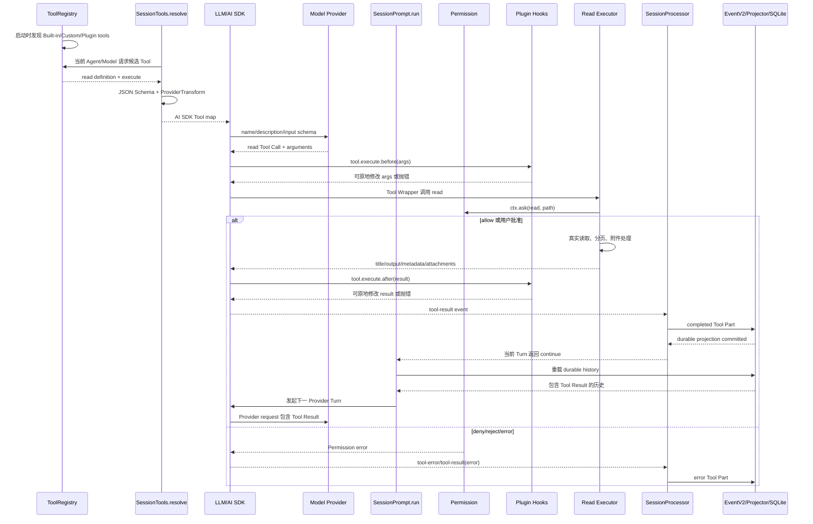

# Tools 与 Security：从一次 `read` 调用理解工具与安全边界

状态：**任务 7 已完成最小验证；任务 8 按用户指示跳过、未作理解验收；待任务 6 交叉审计**。

核对日期：2026-08-18。

源码仓库：`/home/wuzhongyun/projects/Intern_projects/Opencode_learn/opencode github code`。

分支：`dev`。

固定版本：`0e3474509aa5ad16afcf9c439785514d6443c6af`。

本文依据该版本的当前入口接线、实现、规格和仓库测试源码进行静态研究，并在任务 7 实际运行定向测试与一个隔离实验。未调用真实外部 MCP/Provider，未用第三方文章证明 OpenCode 行为，也未把 native V2 的规格目标写成当前默认行为；只有第 10.4、12 节明确列出的测试属于本轮执行证据，其余测试引用仍仅表示静态阅读。

系列位置：这是任务 3-5 四份模块笔记中的第 3 篇。阅读前建议先通过 `10_Research_Agent_and_Orchestration.md` 理解 Tool Call 为什么触发后续 Provider Turn，再通过 `11_Research_Context_and_Persistence.md` 理解 Tool Result 如何进入历史；本文聚焦工具从注册到结算的内部链路。读完后继续阅读 `13_Research_Runtime_Boundary.md`。

## 1. 学习目标与阅读路线

读完本文后，读者应能沿着一次具体 `read` 调用回答以下问题：

1. `read` 怎样从源码中的定义变成这一轮发给模型的 Tool schema。
2. 模型选择调用 Tool 与 OpenCode 真正执行 Tool 为什么是两个步骤。
3. 参数在哪些边界校验，Permission 在什么时点阻塞执行。
4. Plugin before/after hook、Tool Wrapper 和真正文件读取分别位于哪里。
5. Tool Result 如何变成 durable Tool Part，并在下一次 Provider Turn 中回给模型。
6. 拒绝、失败、取消、孤儿 Tool、`providerExecuted` Tool 和 StructuredOutput Tool 为什么不能按普通成功路径解释。
7. Built-in、Custom、Plugin 和 MCP Tool 的发现、信任和执行边界有何不同。
8. native V2 的 typed registry、Location scope、durable settlement、output bounding 和 Permission 已实现到哪里，哪里仍缺 V1 parity。

建议按以下顺序阅读：

```text
第 2 节先分清概念
-> 第 3 节看 read 的整条当前默认路径
-> 第 4-7 节补权限、扩展、输出和异常边界
-> 第 8 节单独学习 native V2
-> 第 9 节做 V1/V2 parity 核对
-> 第 10-12 节查证据、实验和理解问题
```

## 2. 先分清九个概念

| 概念 | 本文中的准确含义 | 不应混同为 |
| --- | --- | --- |
| Tool | 向模型声明的一个具名能力及其参数 schema；本地 Tool 还关联可执行实现 | MCP Server、Skill、Plugin、Subagent |
| Tool Call | 模型在一个 Provider Turn 中生成的“调用某 Tool 及参数”的意图 | 已经执行、Tool Result、Tool Settlement |
| Tool Result | 执行后或 Provider 托管执行后返回给模型的成功值或错误值 | Tool Call 本身 |
| Tool Settlement | Harness 把一次调用确定为成功、模型可见失败或中断，并形成可持久化结果的过程 | 仅仅 `execute()` 返回 |
| Permission | OpenCode 对 action/resource 规则求值，并在 `ask` 时等待用户决定的应用层策略门 | OS Sandbox |
| Sandbox | 通过进程、容器、系统调用、文件系统或网络隔离限制真实系统权限的执行环境 | Permission 对话框；仓库中的 worktree “sandbox”名称 |
| MCP Server | 通过 MCP 协议提供 Tools、Resources、Prompts 等能力的本地进程或远程服务 | 单个 MCP Tool；Plugin |
| Plugin | 启动时载入 OpenCode 进程并注册 Hook/Tool 等行为的代码 | 模型按需调用的 Tool；MCP Server |
| Skill | 由 `skill` Tool 按需加载的工作说明和资源 | 自动执行脚本的 Tool；Subagent |

`Subagent` 是由 `task` 等编排能力启动的另一个 Agent/Session 工作流，虽然入口可能表现为 Tool Call，但它不是本文所说的普通叶子 Tool。Skill 也不是新 Tool：模型先调用内置 `skill` Tool，才把具体 Skill 内容加入上下文。

### 核心结论 C-01：注册、模型选择和执行是三个边界

- **主张**：Tool 注册只让能力进入候选集合；每轮物化才决定发给模型的定义；模型生成 Tool Call 后，Harness 才验证、授权和执行。三者不能合并为“模型调用时工具已经运行”。
- **状态**：`[Current default @ 0e3474509aa5ad16afcf9c439785514d6443c6af]`；`[V2 implemented @ 0e3474509aa5ad16afcf9c439785514d6443c6af]`。
- **当前实现证据**：`packages/opencode/src/tool/registry.ts`，`ToolRegistry` Layer、`ToolRegistry.tools`，86-249、286-335；`packages/opencode/src/session/tools.ts`，`SessionTools.resolve`，41-134；`packages/opencode/src/session/llm.ts`，`LLM.run` 的 AI SDK 分支，276-353。
- **V2 证据**：`packages/core/src/tool/registry.ts`，`ToolRegistry.materialize` 与 materialization-owned `settle`，106-121；`packages/core/src/session/runner/llm.ts`，`runTurnAttempt`，202-214、232-272。
- **版本**：`0e3474509aa5ad16afcf9c439785514d6443c6af`。

## 3. 贯穿例子：一次 `read` 从注册到下一轮

场景：模型需要读取 `/project/src/app.ts`，生成：

```json
{
  "tool": "read",
  "arguments": {
    "filePath": "/project/src/app.ts",
    "offset": 1,
    "limit": 2000
  }
}
```

这段 JSON 只是说明性表示；不同 Provider 的 wire format 不同。稳定事实是 OpenCode 最终把 Provider 流归一化为包含 `id`、`name`、`input` 和可选 `providerExecuted` 的 `LLMEvent.toolCall`。

### 3.1 总时序



### 3.2 第一步：Built-in `read` 进入 Registry

`ReadTool` 用 `Tool.define("read", ...)` 定义参数、说明和 executor。Registry 初始化时取得 `ReadTool`，调用 `Tool.init`，并把它放入 built-in 列表。

`read` 参数 schema 是：

```text
filePath: string，必需
offset: 非负整数，可选，1-based
limit: 非负整数，可选，默认 2000
```

**证据卡 C-02**

- **状态**：`[Current default @ 0e3474509aa5ad16afcf9c439785514d6443c6af]`。
- **定义**：`packages/opencode/src/tool/read.ts`，`Parameters`、`ReadTool`，28-36、64-75、379-385。
- **注册**：`packages/opencode/src/tool/registry.ts`，Layer 初始化中的 `read = yield* ReadTool`、`Tool.init(read)`、built-in 数组，96-111、204-244。
- **Wrapper**：`packages/opencode/src/tool/tool.ts`，`wrap`、`Tool.define`、`Tool.init`，99-180。
- **版本**：`0e3474509aa5ad16afcf9c439785514d6443c6af`。

这里尚未读取文件，也尚未让模型选择 `read`。

### 3.3 第二步：每个 Provider Turn 重新物化 Tool map

`SessionPrompt.run` 每轮创建 Processor 后调用 `SessionTools.resolve`。它把 Registry tools 包装成 AI SDK `tool({ description, inputSchema, execute })`。`ToolJsonSchema.fromTool` 优先使用 Tool 自带 JSON Schema，否则从 Effect Schema 生成并规范化；随后 `ProviderTransform.schema` 做模型兼容变换。

`LLMRequestPrep.prepare` 还会执行最后的可见性过滤：

- User per-prompt `tools[name] === false` 会隐藏 Tool。
- Agent 与 Session Permission 合并后，whole-tool `*` deny 会隐藏 Tool。
- OpenAI/Azure 等路径给动态 Tool 设 `strict: false`，避免不符合 Structured Outputs 子集的 MCP schema 无法注册。
- 最终 Tool map 按名称排序后交给 `streamText`。

**证据卡 C-03**

- **状态**：`[Current default @ 0e3474509aa5ad16afcf9c439785514d6443c6af]`。
- **调用点**：`packages/opencode/src/session/prompt.ts`，`SessionPrompt.run`，1221-1286。
- **物化**：`packages/opencode/src/session/tools.ts`，`SessionTools.resolve` 的 Registry loop，92-134。
- **schema**：`packages/opencode/src/tool/json-schema.ts`，`fromSchema`、`fromTool`，8-26。
- **最终过滤/排序**：`packages/opencode/src/session/llm/request.ts`，`LLMRequestPrep.prepare`、`resolveTools`，148-185、208-214。
- **Provider 调用**：`packages/opencode/src/session/llm.ts`，`streamText` 参数中的 `activeTools`、`tools`，276-353。
- **版本**：`0e3474509aa5ad16afcf9c439785514d6443c6af`。

### 3.4 模型实际看到什么 schema

当前默认 AI SDK 路径中，模型收到的是 Provider wire format 下的：

```text
Tool name
+ description
+ transformed input JSON Schema
```

模型不会看到 JavaScript/Effect executor、`ctx.ask`、Permission rules、Plugin Hook 实现或文件系统对象。它只能根据 name、description、参数 schema 和对话上下文决定是否生成 Tool Call。

native V2 内部 `ToolDefinition` 同时携带 `inputSchema` 与 `outputSchema`，用于 typed settlement；但常见 Provider lowering 仍只把 name、description 和 input schema 放入模型工具定义。例如 OpenAI Chat 的 `lowerTool` 只写 `parameters`，Anthropic 只写 `input_schema`，Gemini 只写 `parameters`。因此不能把 V2 内部 output codec 等同为“模型在 Provider 请求里看到了 output schema”。

**证据卡 C-04**

- **当前状态**：`[Current default @ 0e3474509aa5ad16afcf9c439785514d6443c6af]`。
- **V2 状态**：`[V2 implemented @ 0e3474509aa5ad16afcf9c439785514d6443c6af]`，但 Provider wire projection 依协议变化。
- **当前 Tool shape**：`packages/opencode/src/session/tools.ts`，Registry Tool 转 AI SDK Tool，98-102。
- **V2 definition**：`packages/core/src/tool/tool.ts`，`Runtime.definition`，79-90。
- **V2 request contract**：`packages/llm/src/schema/messages.ts`，`ToolDefinition`、`LLMRequest.tools`，224-232、271-281。
- **Provider lowering**：`packages/llm/src/protocols/openai-chat.ts`，`lowerTool`，179-186；`packages/llm/src/protocols/anthropic-messages.ts`，`lowerTool`，261-266；`packages/llm/src/protocols/gemini.ts`，`lowerTool`，171-175。
- **版本**：`0e3474509aa5ad16afcf9c439785514d6443c6af`。

### 3.5 第三步：模型生成 Tool Call，AI SDK 才调度本地 Wrapper

模型决定调用 `read` 是概率性选择；OpenCode 的后续验证、授权、执行和持久化是 Harness 控制流。默认路径由 AI SDK `streamText` 持有 Tool map，并负责普通本地 Tool dispatch；OpenCode 再把 AI SDK `fullStream` 转成统一 `LLMEvent`。

AI SDK adapter 保留：

- `tool-call` 的 Tool Call ID、name、parsed input、`providerExecuted` 和 provider metadata。
- `tool-result` 的结果值、`providerExecuted` 和 provider metadata。
- `tool-error` 的 name、message 和原始 error。

**证据卡 C-05**

- **状态**：`[Current default @ 0e3474509aa5ad16afcf9c439785514d6443c6af]`。
- **dispatch 所有者**：`packages/opencode/src/session/llm.ts`，AI SDK 分支注释与 `streamText`，276-353。
- **事件归一化**：`packages/opencode/src/session/llm/ai-sdk.ts`，`tool-call`、`tool-result`、`tool-error` cases，220-261。
- **旧 Loop 下可选 native adapter**：`packages/opencode/src/session/llm/native-runtime.ts`，`stream` 与 `nativeTools`，103-145、169-193；这是 opt-in Transport/dispatch adapter，不是 native V2 Session Runtime。
- **版本**：`0e3474509aa5ad16afcf9c439785514d6443c6af`。

### 3.6 第四步：参数验证不是只有一层

普通 Built-in 的输入至少经过两个相关边界：

1. AI SDK 根据发给模型的 `inputSchema` 在调用 `execute` 前校验。
2. `Tool.wrap` 再用原始 Effect Schema 做 `Schema.decodeUnknownEffect`，把 wire input 解码为 executor 的 typed input；失败产生 `Tool.InvalidArgumentsError`，executor 不运行。

Custom/Plugin Tool 由 `fromPlugin` 直接包装，不经过 `Tool.init/wrap`：Zod schema 同时用于生成 JSON Schema 和一个 `Schema.declare`，但其 executor 路径直接调用 `def.execute(args, pluginCtx)`。在默认 AI SDK 路径，实际调用前的主要 gate 是 AI SDK input schema。Legacy JSON-Schema-shaped Custom Tool 的内部 `parameters` 是 `Schema.Unknown`，同样依靠它提供给 AI SDK 的 JSON Schema。

MCP Tool 由 `dynamicTool` 使用 Server 提供的 input schema；StructuredOutput Tool 也直接使用用户 format schema。它们不进入 Built-in 的 `Tool.wrap`。

**证据卡 C-06**

- **状态**：`[Current default @ 0e3474509aa5ad16afcf9c439785514d6443c6af]`。
- **Built-in typed decode**：`packages/opencode/src/tool/tool.ts`，`wrap`，107-145。
- **Custom/Plugin conversion**：`packages/opencode/src/tool/registry.ts`，`fromPlugin`，120-175。
- **MCP input schema**：`packages/opencode/src/mcp/catalog.ts`，`McpCatalog.convertTool`，42-82。
- **StructuredOutput schema**：`packages/opencode/src/session/prompt.ts`，`createStructuredOutputTool`，1565-1590。
- **测试**：`packages/opencode/test/tool/tool-define.test.ts`，`execute receives decoded parameters`、`invalid args surface...`，82-153；`packages/opencode/test/tool/registry.test.ts`，`loads Zod-schema custom tools...`，302-350；`packages/opencode/test/session/structured-output.test.ts`，schema/execute tests，165-279。
- **版本**：`0e3474509aa5ad16afcf9c439785514d6443c6af`。

### 3.7 第五步：before hook、Permission、Executor、after hook 的真实顺序

对 Registry 中的 Built-in/Custom/Plugin Tool，顺序是：

```text
tool.execute.before
-> item.execute
   -> Built-in 内部自行 ctx.ask
   -> Custom/Plugin Tool 是否 ctx.ask 由扩展自己决定
-> tool.execute.after
-> 返回 AI SDK
```

因此：

- `before` 发生在 Built-in 的 Permission 检查前；Hook 可修改传入的共享 `args` 对象，Built-in 随后会对这些修改后的字段求 Permission。仅把 Hook output 的 `args` 属性替换为另一个对象，不会替换 wrapper 已捕获的实参引用。
- `after` 发生在 Built-in/Custom Tool 的通用文本截断之后，因为截断在 `item.execute` 内部完成。
- Hook 抛错会阻止后续步骤或把调用变成错误。
- StructuredOutput Tool 是在 `SessionTools.resolve` 之后直接加入 Tool map，不经过这组 before/after hook，也不请求普通 Tool Permission。

MCP Tool 的细节不同：`before -> ctx.ask(namespaced MCP tool) -> client.callTool -> after(raw MCP result) -> host 转换文本/附件并截断`。因此 MCP 的 after hook 在 host output bounding 之前。

**证据卡 C-07**

- **状态**：`[Current default @ 0e3474509aa5ad16afcf9c439785514d6443c6af]`。
- **Registry Tool 顺序**：`packages/opencode/src/session/tools.ts`，Registry wrapper，102-132。
- **Built-in `read` ask**：`packages/opencode/src/tool/read.ts`，`ReadTool.execute`，229-260。
- **MCP 顺序**：`packages/opencode/src/session/tools.ts`，MCP wrapper，398-486。
- **StructuredOutput 插入点**：`packages/opencode/src/session/prompt.ts`，`SessionPrompt.run`，1226-1250、1288-1293。
- **Hook 合同**：`packages/plugin/src/index.ts`，`Hooks["tool.execute.before"]`、`Hooks["tool.execute.after"]`，266-281。
- **Hook 串行执行**：`packages/opencode/src/plugin/index.ts`，`Plugin.trigger`，282-295。
- **版本**：`0e3474509aa5ad16afcf9c439785514d6443c6af`。

### 3.8 第六步：`read` 真正执行什么

`read` executor 依次：

1. 把相对路径解析到当前 Instance directory。
2. 检查外部目录访问，必要时先请求 `external_directory`。
3. 请求 `read` Permission，resource 是相对 worktree 路径。
4. 对目录排序和分页；对文本按行流式读取，最多默认 2000 行、50 KiB、每行 2000 字符；对图片/PDF 形成 data URL attachment；拒绝其他二进制。
5. 成功读取文本后异步 warm LSP，并可能附加相邻 instruction 的 system reminder。

这里的 50 KiB 是 `read` producer 自己的分页/摄入边界，不是 Registry 通用截断。由于 `read` 返回的 metadata 已含 `truncated`，外层 `Tool.wrap` 不会再次通用截断。完整文件仍在原路径，模型应通过 `offset/limit` 继续读取，而不是获得 truncation 目录中的完整副本。

**证据卡 C-08**

- **状态**：`[Current default @ 0e3474509aa5ad16afcf9c439785514d6443c6af]`。
- **限制与 schema**：`packages/opencode/src/tool/read.ts`，常量与 `Parameters`，13-36。
- **Permission 与执行**：同文件，`ReadTool.execute`，229-260、262-377。
- **producer cap**：同文件，`ReadTool.lines`，137-180。
- **通用 Wrapper 跳过已标记输出**：`packages/opencode/src/tool/tool.ts`，`wrap`，130-144。
- **测试**：`packages/opencode/test/tool/read.test.ts`，read truncation tests，315-385、474-480。
- **版本**：`0e3474509aa5ad16afcf9c439785514d6443c6af`。

### 3.9 `bash` 分支：Permission 之后才启动真实进程

`bash` 比 `read` 多三个风险点：命令解析、真实子进程和持续输出。

```text
参数/schema
-> tree-sitter 解析命令
-> 收集外部目录和命令 pattern
-> ctx.ask(external_directory)
-> ctx.ask(bash)
-> shell.env Plugin Hook
-> ChildProcessSpawner.spawn
-> timeout/abort 时 kill
-> 流式 progress metadata + bounded tail/full-output file
```

旧路径的 Shell Tool 会在输出超过阈值后边写完整 truncation 文件、边只保留 bounded preview/tail。它不是 OS sandbox：真实命令以 OpenCode 进程用户的文件、进程和网络权限运行。

**证据卡 C-09**

- **状态**：`[Current default @ 0e3474509aa5ad16afcf9c439785514d6443c6af]`。
- **Permission**：`packages/opencode/src/tool/shell.ts`，`ShellTool.ask`，263-291。
- **执行与取消**：同文件，`ShellTool.run`，428-595，特别是 spawn 481-559。
- **组装顺序**：同文件，返回的 executor，597-642。
- **输出测试**：`packages/opencode/test/tool/shell.test.ts`，`tool.shell truncation`，1134-1198。
- **版本**：`0e3474509aa5ad16afcf9c439785514d6443c6af`。

### 3.10 第七步：Result 变为 Tool Part，再进入下一轮

`SessionProcessor` 对统一事件建立并更新 Tool Part：

```text
tool-input-start/delta/end -> pending
tool-call                 -> running
tool-result success       -> completed
tool-result error         -> error
tool-error                -> error
```

completed state 保存 input、output、title、metadata、start/end 和 attachments；error state保存 input、error、metadata 和时间。`Session.updatePart` 发布 durable V1 Part event；Core Projector 把 whole Part 写入 SQLite。下一次外层 Loop 重新加载 durable history，`MessageV2.toModelMessagesEffect` 把 completed/error Tool Part 转回 Provider Tool Result。

**证据卡 C-10**

- **状态**：`[Current default @ 0e3474509aa5ad16afcf9c439785514d6443c6af]`。
- **状态合同**：`packages/schema/src/v1/session.ts`，`ToolStatePending/Running/Completed/Error`、`ToolPart`，259-324。
- **状态处理**：`packages/opencode/src/session/processor.ts`，`ensureToolCall`、`handleEvent`、`completeToolCall`、`failToolCall`，160-205、216-253、315-419。
- **durable 发布**：`packages/opencode/src/session/session.ts`，`Session.updateMessage`、`Session.updatePart`，631-645。
- **Projector**：`packages/core/src/session/projector.ts`，V1 `MessageUpdated`/`PartUpdated` projectors，260-328。
- **下一轮转换**：`packages/opencode/src/session/message-v2.ts`，completed/error/pending Tool Part lowering，290-360。
- **Loop continuation**：`packages/opencode/src/session/prompt.ts`，terminal check 与下一轮，1092-1132、1288-1335。
- **测试**：`packages/opencode/test/session/processor-effect.test.ts`，`complete AI SDK tool calls...`，751-814；`packages/opencode/test/session/prompt.test.ts`，Tool continuation，825-851、892-918。
- **版本**：`0e3474509aa5ad16afcf9c439785514d6443c6af`。

## 4. Permission 决策、批准和拒绝

### 4.1 当前规则算法

当前 V1 ruleset 的一条规则是：

```text
permission + pattern + action(allow | ask | deny)
```

`Permission.evaluate` 把传入 rulesets 展平，找最后一条同时匹配 permission 和 pattern 的规则；没有规则时默认 `ask`。`SessionTools.context.ask` 合并顺序是 Agent rules 在前、Session rules 在后，所以更后的匹配规则优先。

`Permission.disabled/visibleTools` 只是 Tool catalog 可见性过滤：只有 whole-tool `pattern: "*"` deny 才直接隐藏。真正资源级授权仍由 Tool executor 的 `ctx.ask` 完成。不要把“模型看不到 Tool”和“Tool 调用已经通过资源授权”写成一件事。

**证据卡 C-11**

- **状态**：`[Current default @ 0e3474509aa5ad16afcf9c439785514d6443c6af]`。
- **规则求值**：`packages/opencode/src/permission/index.ts`，`evaluate`，28-38。
- **ask**：同文件，`Permission.ask`，67-107。
- **可见性过滤**：同文件，`disabled`、`visibleTools`，204-219。
- **ruleset 合并到 ctx**：`packages/opencode/src/session/tools.ts`，`context.ask`，81-89。
- **最终 catalog 过滤**：`packages/opencode/src/session/llm/request.ts`，`resolveTools`，208-214。
- **版本**：`0e3474509aa5ad16afcf9c439785514d6443c6af`。

### 4.2 `ctx.ask` 如何等待用户

对每个 resource pattern：

- 任一结果为 `deny`，立即失败，不创建 pending request。
- 全部为 `allow`，直接继续。
- 至少一个为 `ask`，创建 `PermissionV1.Request` 和进程内 `Deferred`，发布 `permission.asked`，executor 阻塞等待。

用户回复：

- `once`：只放行这一次。
- `always`：把 Tool 提供的 `always` patterns 加到当前 Instance 的内存 `approved`，并放行同 Session 中已被这些规则覆盖的 pending requests。
- `reject`：当前请求失败，并拒绝同 Session 的其他 pending requests。
- 带 message 的 reject 产生 `CorrectedError`，用于给出纠正反馈。

当前旧 Permission 的 `pending` 和 `approved` 位于 `InstanceState`，不是 durable SQLite permission store；测试还证明 `always` approval 可被另一个 Session 使用。因此不要把旧路径 `always` 写成“只在当前调用”或“已经跨重启保存”。

**证据卡 C-12**

- **状态**：`[Current default @ 0e3474509aa5ad16afcf9c439785514d6443c6af]`。
- **状态与 finalizer**：`packages/opencode/src/permission/index.ts`，`State`、Layer 初始化，18-65。
- **等待与清理**：同文件，`ask`，67-107。
- **回复语义**：同文件，`reply`，109-167。
- **测试**：`packages/opencode/test/permission/next.test.ts`，asked event、once/reject/corrected/always，同文件 651-910。
- **版本**：`0e3474509aa5ad16afcf9c439785514d6443c6af`。

### 4.3 Permission 不是 OS Sandbox

Permission 的保证是：“受管 Tool executor 在副作用前是否按规则调用 `ctx.ask`，以及用户是否放行。”它不改变操作系统赋予 OpenCode 进程的权限。

- `bash` 启动普通 host 子进程。
- `read` 的路径限制依赖 executor 的路径解析和 Permission gate，不是 mount namespace。
- Custom/Plugin Tool 可以不调用 `ctx.ask`。
- Plugin 本身在加载或 Hook 中可以直接读文件、执行 `$`、访问网络，不经过 Agent Tool Permission。
- 本地 MCP Server 在连接阶段已经是独立进程；Tool Permission 只 gate 后续受管 `tools/call`，不能约束 Server 启动代码或它自己的后台行为。
- 远程 MCP Server 的漏洞、内部权限和数据保留也不受 OpenCode Permission 修复。

仓库中 Project 的 `sandboxes` 指 worktree/项目位置记录，不应据此宣称 Tool 运行在 OS sandbox。

**证据卡 C-13**

- **状态**：`[Current default @ 0e3474509aa5ad16afcf9c439785514d6443c6af]`；`[V2 implemented @ 0e3474509aa5ad16afcf9c439785514d6443c6af]` 对 V2 bash 同样成立。
- **旧 bash 真实进程**：`packages/opencode/src/tool/shell.ts`，`cmd`、`ShellTool.run`，293-309、481-559。
- **Plugin 获得进程能力**：`packages/opencode/src/plugin/index.ts`，`PluginInput` 构造，141-166。
- **本地 MCP 进程**：`packages/opencode/src/mcp/index.ts`，`connectLocal`，340-369。
- **V2 bash 明示 host authority**：`packages/core/src/tool/bash.ts`，Tool description、executor，97-196。
- **官方 V2 规格**：`specs/v2/session.md`，V2 bash 边界，193-206。
- **版本**：`0e3474509aa5ad16afcf9c439785514d6443c6af`。

## 5. Built-in、Custom、Plugin、MCP 的发现与信任边界

### 5.1 当前共同点和差异

| 类型 | 发现/注册 | 每轮怎样加入 Tool map | 谁执行 | Permission | Hook | 信任边界 |
| --- | --- | --- | --- | --- | --- | --- |
| Built-in | Registry Layer 静态导入并 `Tool.init` | `registry.tools -> SessionTools.resolve` | OpenCode 内部 executor | Tool 自己调用 `ctx.ask` | before/after 包住 executor | 仓库受信代码，但仍有真实系统副作用 |
| Custom Tool | 扫描 config directories 下 `{tool,tools}/*.{js,ts}` 并动态 import | 作为 Registry custom Tool | Custom module 的 `def.execute` | 只有扩展主动调用 `ctx.ask`；whole-tool deny 可隐藏 | before/after | 项目/用户目录中的任意进程内代码 |
| Plugin Tool | Plugin 启动后返回 `hooks.tool`，Registry 读取 `plugin.list()` | 作为 Registry custom Tool | Plugin Tool 的 `def.execute` | 同 Custom；不是自动授权包装 | before/after | 已加载 Plugin 的任意进程内代码 |
| MCP Tool | MCP service 连接 Server、`tools/list` 并缓存 definition | `SessionTools.resolve` 每轮调用 `mcp.tools()`，转为 AI SDK dynamic Tool | MCP Client `callTool` -> Server | Host 明确 `ctx.ask({ permission: namespacedKey })` | before/after | Server 描述/schema/result 均是不可信外部输入；本地/远程执行域不同 |

Custom Tool 和 Plugin Tool 共享 `ToolDefinition` 兼容适配器，但 Custom Tool 文件不是完整 Plugin：它不因此获得所有 Hook 生命周期。Plugin 也不等于 Plugin Tool：一个 Plugin 可以只有 event/LLM Hook，完全不增加模型 Tool。

### 5.2 Custom 与 Plugin Tool 发现

Registry 获取所有 config directories，扫描单层 `{tool,tools}/*.{js,ts}`。文件名是 namespace：default export 使用文件名，具名 export 使用 `namespace_export`。随后 Registry 遍历所有 Plugin Hooks 的 `tool` record，直接使用其 key。

Plugin 自身则先加载内置 Plugin，再解析 `plugin_origins` 中的 file/npm Plugin，动态 import module，执行 Plugin 函数并保存返回 Hooks。外部 Plugin 按配置顺序应用；`Plugin.trigger` 也按 hooks 顺序串行调用。

**证据卡 C-14**

- **状态**：`[Current default @ 0e3474509aa5ad16afcf9c439785514d6443c6af]`。
- **Custom 扫描与命名**：`packages/opencode/src/tool/registry.ts`，Registry state 初始化，178-199。
- **Plugin Tool 适配**：同文件，`fromPlugin`，120-175。
- **Plugin 加载**：`packages/opencode/src/plugin/index.ts`，`Plugin.state`，132-280。
- **Plugin module resolution/import**：`packages/opencode/src/plugin/loader.ts`，`resolve`、`load`、`loadExternal`，82-145、203-236。
- **测试**：`packages/opencode/test/tool/registry.test.ts`，Custom plural directory、Zod schema、attachments、legacy schema，224-493。
- **版本**：`0e3474509aa5ad16afcf9c439785514d6443c6af`。

### 5.3 MCP 发现、命名、刷新和执行

MCP 是独立服务，不进入旧 `ToolRegistry`：

1. Instance 初始化读取 MCP config，并并发连接 enabled Servers。
2. local 使用 `StdioClientTransport` 启动命令；remote 依次尝试 Streamable HTTP 和 SSE，并处理 OAuth 状态。
3. 连接完成后调用分页 `tools/list`，缓存原生 definitions 和 instructions。
4. Server 发 `tools/list_changed` 时刷新缓存并发布 `MCP.ToolsChanged`。
5. `mcp.tools()` 只返回 connected Server 的缓存 Tool，模型名为 `sanitize(server) + "_" + sanitize(tool)`。
6. `SessionTools.resolve` 每轮复制/转换 schema；真正调用时先按 namespaced key 请求 Permission，再执行 `client.callTool`，传入 AbortSignal、timeout 和 progress hook。

Server 提供的 description 和 input schema 会进入模型请求，Tool result 会进入 Session history，所以它们都属于外部不可信数据。MCP Server 本身不是 Tool：一个 Server 可提供多个 Tool，也可只提供 Resource/Prompt。

**证据卡 C-15**

- **状态**：`[Current default @ 0e3474509aa5ad16afcf9c439785514d6443c6af]`。
- **连接**：`packages/opencode/src/mcp/index.ts`，`connectRemote`、`connectLocal`、`create`，236-415。
- **初始化/刷新**：同文件，`watch`、Instance state，442-560。
- **缓存 materialization**：同文件，`MCP.tools`，666-688。
- **命名/执行**：`packages/opencode/src/mcp/catalog.ts`，`convertTool`、`toolName`，42-82、117-120。
- **Session 接线**：`packages/opencode/src/session/tools.ts`，MCP loop，390-490。
- **测试**：`packages/opencode/test/mcp/lifecycle.test.ts`，cached definitions/listChanged、分页、断连、命名，219-237、255-327、483-495；`packages/opencode/test/mcp/catalog.test.ts`，structuredContent 与 output schema，29-107。
- **版本**：`0e3474509aa5ad16afcf9c439785514d6443c6af`。

### 5.4 Plugin 不受 Agent Tool Permission 沙箱化

Plugin 在模型提出 Tool Call 之前就已执行模块顶层代码和 Plugin factory。它得到 `client`、project/worktree/directory、`serverUrl` 和 Bun `$`。Permission 只能约束受管 Tool 调用；它不会自动包围 Plugin 启动、event hook、chat hook 或任意 Plugin 内部 I/O。

即使是 Plugin Tool，Host 也没有自动 `ctx.ask(toolID)`；Plugin Tool 是否调用 `pluginCtx.ask` 由 Plugin 作者决定。whole-tool deny 可以让模型看不到这个 Tool，但不能撤销 Plugin 已经获得的进程能力。

**证据卡 C-16**

- **状态**：`[Current default @ 0e3474509aa5ad16afcf9c439785514d6443c6af]`。
- **PluginInput 与执行**：`packages/opencode/src/plugin/index.ts`，141-177、217-251。
- **Plugin Tool context**：`packages/opencode/src/tool/registry.ts`，`fromPlugin.execute`，138-164。
- **没有 host 自动 ask 的执行顺序**：`packages/opencode/src/session/tools.ts`，Registry wrapper，102-132。
- **版本**：`0e3474509aa5ad16afcf9c439785514d6443c6af`。

## 6. 输出、metadata、attachments 与 bounding

### 6.1 当前默认路径实际有三类边界

不能笼统写“所有 Tool 输出都在一个中心统一截断”。当前旧路径实际是：

1. **producer-specific bound**：`read` 只读取一页；Shell 边执行边保留 preview，并在超过阈值时写完整文件；MCP binary resource 有 MIME/10 MiB gate。
2. **Tool Wrapper bound**：普通 Built-in 在 `Tool.wrap` 中调用 `Truncate.output`；Custom/Plugin Tool 在 `fromPlugin` 内调用同一服务；MCP text 在 Session MCP adapter 中调用。
3. **history/compaction bound**：`MessageV2.toModelMessagesEffect` 可在 compaction 场景按 `toolOutputMaxChars` 再裁历史 Tool output，这不是首次 Tool settlement 的通用输出留存。

默认通用阈值是 2000 行和 50 KiB，可由 `tool_output` config 覆盖。超限时 `Truncate.output` 先写完整文本到 truncation directory，再返回 preview、提示和 `outputPath`，保留 7 天并周期清理。

**证据卡 C-17**

- **状态**：`[Current default @ 0e3474509aa5ad16afcf9c439785514d6443c6af]`。
- **通用实现**：`packages/opencode/src/tool/truncate.ts`，limits/output/cleanup，12-43、53-150。
- **Built-in wrapper**：`packages/opencode/src/tool/tool.ts`，`wrap`，130-144。
- **Custom/Plugin wrapper**：`packages/opencode/src/tool/registry.ts`，`fromPlugin.execute`，149-164。
- **MCP text bound**：`packages/opencode/src/session/tools.ts`，464-480。
- **历史裁切**：`packages/opencode/src/session/message-v2.ts`，`truncateToolOutput`、Tool lowering，49-53、290-313。
- **测试**：`packages/opencode/test/tool/truncation.test.ts`，29-229；`packages/opencode/test/tool/shell.test.ts`，1134-1198。
- **版本**：`0e3474509aa5ad16afcf9c439785514d6443c6af`。

### 6.2 重要边界：Registry Tool 的 after hook 位于通用截断之后

`item.execute` 返回前，Built-in/Custom Tool 已执行通用截断；然后 `SessionTools.resolve` 才触发 `tool.execute.after`，最后直接把可变 `output` 返回 AI SDK。当前代码没有在 after hook 后再次调用 `Truncate.output`。

任务 7 隔离实验进一步确认：恶意或有 bug 的 after hook 能把 `output.output` 扩大到超过通用阈值，并令 `metadata.truncated/outputPath` 与实际输出不一致。这是当前旧路径已复现的 output-bounding 缺口，不应写成“Plugin after hook 的输出仍保证 bounded”。MCP after hook 位于 MCP host 转换和截断之前，不具有同一个顺序缺口。

**证据卡 C-18**

- **状态**：`[Current default, executed in Task 7 @ 0e3474509aa5ad16afcf9c439785514d6443c6af]`；调用顺序与真实 wrapper/hook 隔离实验一致，仍待任务 6 交叉审计。
- **先截断**：`packages/opencode/src/tool/tool.ts`，`wrap`，130-144；`packages/opencode/src/tool/registry.ts`，`fromPlugin.execute`，149-164。
- **后 Hook 且直接 return**：`packages/opencode/src/session/tools.ts`，Registry wrapper，111-130。
- **MCP 对照**：同文件，MCP after hook 与后续转换/截断，407-480。
- **执行证据**：任务 7 临时测试通过真实 `ToolRegistry` 取得由 `Tool.define`/`Tool.init` 包装的内置 `invalid`，经真实 `SessionTools.resolve` 与文件 Plugin 的 `Plugin.trigger` 执行；after hook 看到短 output 与 `truncated: false` 后把 output 放大到 61,440 bytes，最终仍无 `outputPath`。临时测试完成后已删除；仓库仍缺永久回归测试。
- **版本**：`0e3474509aa5ad16afcf9c439785514d6443c6af`。

### 6.3 Attachments

当前 Tool result 的 attachments 是 File Parts：

- Built-in `read` 可返回 image/PDF data URL。
- Custom/Plugin Tool 可返回结构化 attachments，Registry 保留它们。
- MCP `image` content 转 File Part；MCP resource blob 只允许 PDF/GIF/JPEG/PNG/WebP，且 resource blob 上限 10 MiB，否则只添加 omitted 文本。
- Processor 对 image attachment 做 normalize；无法压到图像限制以下的附件会被省略，并把说明附加到 output。
- Provider 不支持 tool-result media 时，history lowering 会把 media 提取到单独 synthetic user message。

文本 bounding 不等于附件 bounding。data URL 可能很大，必须依靠 producer MIME/size gate 和 Image normalization；不能只核对 `output.length`。

**证据卡 C-19**

- **状态**：`[Current default @ 0e3474509aa5ad16afcf9c439785514d6443c6af]`。
- **Read attachments**：`packages/opencode/src/tool/read.ts`，306-324。
- **Custom attachments**：`packages/opencode/src/tool/registry.ts`，149-163；测试 `packages/opencode/test/tool/registry.test.ts:420-462`。
- **MCP MIME/size**：`packages/opencode/src/session/tools.ts`，32-39、426-480、533-575。
- **Processor normalization**：`packages/opencode/src/session/processor.ts`，383-413。
- **Provider history conversion**：`packages/opencode/src/session/message-v2.ts`，290-323。
- **版本**：`0e3474509aa5ad16afcf9c439785514d6443c6af`。

## 7. 失败、取消、orphan、providerExecuted 与 StructuredOutput

### 7.1 普通失败与 Permission 拒绝

普通 executor throw、参数错误、MCP `isError`、Permission deny/reject 最终经 AI SDK 形成 `tool-error` 或 error Tool Result，Processor 把 running Tool Part 改为 `error`。拒绝时，默认 `continue_loop_on_deny !== true` 会让 blocked 状态使 Processor 返回 `stop`；配置可改变旧兼容行为。

不是所有失败都应被转成模型可见 Tool Result：进程 interruption、defect 和 retention failure 在 V2 被明确区分。旧路径的 `Effect.orDie` 和 AI SDK 边界会把若干 typed error 转成 defect/Tool error，仍需任务 6 逐个审计错误分类。

### 7.2 取消与 interrupted orphan

当前旧路径取消 Runner/Provider Stream。Processor cleanup：

- 尽量持久化已累积 Text/Reasoning 和 patch。
- 最多短暂等待 Tool deferred。
- 仍 pending/running 的 Tool Part 改成 `error: "Tool execution aborted"`。
- 写入 `metadata.interrupted: true` 和 end time。
- Assistant 记录 `MessageAbortedError`。

下次 Loop 的 terminal check 显式忽略这种 interrupted error Tool，避免把它当成仍需 continuation 的普通 Tool Call；测试证明不会额外调用 LLM。这就是本文所说的 orphan：历史里有一个未正常 settlement、被 cleanup 封口的 Tool block，不代表仍应执行。

**证据卡 C-20**

- **状态**：`[Current default @ 0e3474509aa5ad16afcf9c439785514d6443c6af]`。
- **cleanup**：`packages/opencode/src/session/processor.ts`，`cleanup`，539-597。
- **interrupt handling**：同文件，`process`，627-683。
- **orphan 判定与 terminal check**：`packages/opencode/src/session/prompt.ts`，`isOrphanedInterruptedTool`、terminal check，96-100、1103-1129。
- **测试**：`packages/opencode/test/session/processor-effect.test.ts`，`mark pending tools as aborted...`，816-879；`packages/opencode/test/session/prompt.test.ts`，orphan exit、cancel，503-529、1147-1168。
- **版本**：`0e3474509aa5ad16afcf9c439785514d6443c6af`。

### 7.3 `providerExecuted` 不走普通本地执行路径

`providerExecuted: true` 表示 Tool 由 Provider 托管执行。OpenCode 接收 Provider 返回的 Tool Call/Result，保留 provider metadata 并持久化，但不应查找或运行同名本地 executor，也不按普通本地 Tool 强制 continuation。

当前默认 AI SDK adapter只归一化 Provider 已产生的 hosted Tool events；旧 Loop terminal check忽略带 `metadata.providerExecuted` 的 Tool Part。旧 Loop 的 opt-in native adapter和 native V2 Runner都有显式 `if providerExecuted then skip local dispatch`。

**证据卡 C-21**

- **状态**：`[Current default @ 0e3474509aa5ad16afcf9c439785514d6443c6af]`；`[V2 implemented @ 0e3474509aa5ad16afcf9c439785514d6443c6af]`。
- **当前事件适配**：`packages/opencode/src/session/llm/ai-sdk.ts`，220-261。
- **当前 Part metadata**：`packages/opencode/src/session/processor.ts`，216-245、331-351。
- **当前 terminal check**：`packages/opencode/src/session/prompt.ts`，1103-1115。
- **旧 Loop native adapter 显式跳过**：`packages/opencode/src/session/llm/native-runtime.ts`，115-129。
- **native V2 显式跳过**：`packages/core/src/session/runner/llm.ts`，232-272，特别是 243。
- **V2 测试**：`packages/core/test/session-runner.test.ts`，`replays durable provider-executed tool results...`，1622-1674。
- **版本**：`0e3474509aa5ad16afcf9c439785514d6443c6af`。

### 7.4 StructuredOutput Tool 是 per-request 控制工具

当最新 User Message 要求 `json_schema` format，当前 Loop 在本轮 Tool map 中临时加入 `StructuredOutput`：

- input schema 是用户要求的 JSON Schema，移除顶层 `$schema`。
- `toolChoice` 设为 `required`，system 追加必须调用该 Tool 的说明。
- AI SDK 校验参数后，executor 只捕获 args 为 Assistant `structured`。
- 一旦成功捕获，Loop 直接 `break`，不走普通本地 Tool Result 驱动的下一轮。
- 模型结束却未调用时，写 `StructuredOutputError`。
- 它不来自 Registry，不走普通 Plugin before/after，也没有普通 Tool Permission。

**证据卡 C-22**

- **状态**：`[Current default @ 0e3474509aa5ad16afcf9c439785514d6443c6af]`。
- **prompt/description**：`packages/opencode/src/session/prompt.ts`，74-82。
- **每轮插入与退出**：同文件，1243-1250、1270-1315。
- **Tool 实现**：同文件，`createStructuredOutputTool`，1565-1590。
- **测试**：`packages/opencode/test/session/structured-output.test.ts`，165-387。
- **V2 对照**：`specs/v2/session.md`，Structured-output policy 标为 missing，139-145。
- **版本**：`0e3474509aa5ad16afcf9c439785514d6443c6af`。

## 8. native V2：独立的 typed registry 与 durable settlement 流程

本节不是当前 TUI 默认链路。native V2 API 已接入 executable Server，但当前普通 TUI 仍走 `SessionPrompt`。V2 Tool 研究必须从 `SessionV2.prompt -> SessionExecution -> Location-scoped SessionRunner` 单独理解。

### 8.1 V2 Tool 的类型和注册作用域

`Tool.make` 创建 opaque Definition：公开调用者不能直接取出 executor。它包含 input codec、output codec、executor，以及可选 structured projection/model-output projection。注册时 record key 才是 model-facing name。

已实现两种注册位置：

- `ApplicationTools`：process-scoped，供 embedded/sdk-next 的 `opencode.tools.register` 使用，跨 Locations 可见。
- `ToolRegistry/Tools.Service`：Location-scoped；Built-in 在 Location Layer 构造时注册。

同一 Location 内同名 registration 最新者优先，Scope 关闭只移除本次 registration；Location registration 覆盖 application registration。每个 Location 的 Registry、Permission、filesystem 和 Runner 都由 `LocationServiceMap` 缓存。

这里的作用域不等于授权边界：公共 `ApplicationTools` 注册只提供 canonical Tool 和 executor，没有自动注入 `PermissionV2.assert`。Registry 可按 Tool name 隐藏 definition，但直接进入 settlement 的 Application Tool 仍会执行；因此应用提供方必须把它视为受信进程内代码，并在 leaf executor 中自行实现所需授权。

**证据卡 V2-01**

- **状态**：`[V2 implemented @ 0e3474509aa5ad16afcf9c439785514d6443c6af]`。
- **opaque Tool**：`packages/core/src/tool/tool.ts`，`Definition`、`make`，18-27、40-67、71-132。
- **Application scope**：`packages/core/src/tool/application-tools.ts`，`ApplicationTools` Layer，21-57。
- **Location scope/overlay**：`packages/core/src/tool/registry.ts`，Layer state、`register`，42-105。
- **Built-in composition**：`packages/core/src/tool/builtins.ts`，31-48。
- **Location wiring**：`packages/core/src/location-services.ts`，`locationServices`，42-79。
- **SDK 接线**：`packages/sdk-next/src/opencode.ts`，`OpenCode.create`，10-42；测试 `packages/sdk-next/test/embedded.test.ts:17-43`。
- **Application Tool 授权边界测试**：`packages/core/test/application-tools.test.ts`，86-106。
- **版本**：`0e3474509aa5ad16afcf9c439785514d6443c6af`。

### 8.2 每轮 materialization 捕获 advertised identity

`ToolRegistry.materialize(permissions)`：

1. 合并 process application 与 Location registrations。
2. 过滤 whole-tool deny。
3. 生成本轮 `definitions`。
4. 返回只属于这一轮的 `settle` closure，内部保留每个 advertised registration identity。

调用 settlement 时，如果 Tool 已移除、被替换，或 overlay 关闭后露出旧 registration，返回 `Stale tool call`，不会执行另一个同名 handler。开始 settlement 后才捕获当前 handler；之后 registration 变化不会替换正在运行的调用。

**证据卡 V2-02**

- **状态**：`[V2 implemented @ 0e3474509aa5ad16afcf9c439785514d6443c6af]`。
- **实现**：`packages/core/src/tool/registry.ts`，`settleWith`、`materialize`，50-82、106-121。
- **测试**：`packages/core/test/session-runner-tool-registry.test.ts`，scoped removal、stale/replacement/captured execution，124-155、336-450。
- **版本**：`0e3474509aa5ad16afcf9c439785514d6443c6af`。

### 8.3 V2 Provider Turn 与本地 settlement

V2 Runner 每轮：

```text
选 Agent/Model，加载 projected history
-> tools.materialize(agent.permissions)
-> LLM.request(tools = definitions)
-> llm.stream(request)
-> durable publish Tool.Called
-> 对非 providerExecuted call 启动 materialization.settle fiber
-> decode input
-> executor 内 Permission.assert
-> encode/validate output
-> project model output
-> ToolOutputStore.bound
-> durable publish Tool.Success/Failed
-> 等待所有 Tool fibers
-> 重载 projected history
-> 下一 Provider Turn
```

Tool Call 的 `assistantMessageID` 在副作用前通过 `Tool.Called` durable event 建立；settlement context 使用 exact Session、Agent、Assistant Message 和 Tool Call IDs。多个本地调用当前 eager 并发启动，但 durable publication 由 per-turn semaphore 串行。

**证据卡 V2-03**

- **状态**：`[V2 implemented @ 0e3474509aa5ad16afcf9c439785514d6443c6af]`。
- **物化/请求**：`packages/core/src/session/runner/llm.ts`，`runTurnAttempt`，199-214。
- **publish call 后 settlement**：同文件，218-272。
- **等待/失败/继续**：同文件，277-345、383-405。
- **Tool codec settlement**：`packages/core/src/tool/tool.ts`，`Runtime.settle`，91-129。
- **测试**：`packages/core/test/session-runner.test.ts`，application Tool，557-612；durable local Tool continuation，1462-1517；eager settlement，1677-1736。
- **版本**：`0e3474509aa5ad16afcf9c439785514d6443c6af`。

### 8.4 V2 durable Tool 状态与 Projector

V2 不复用旧 `message.part.updated` Tool Part 作为主合同，而是发布 `session.next.tool.*`：

```text
Input.Started (durable) -> pending
Input.Delta   (live-only)
Input.Ended   (durable raw-input boundary)
Called        (durable) -> running
Progress      (durable bounded checkpoint)
Success       (durable) -> completed
Failed        (durable) -> error
```

EventV2 transaction 内 Projector 调用 `SessionMessageUpdater`，更新 `SessionMessageTable` 中的 typed Assistant Tool state。Success 保存 bounded content、structured data、可选 outputPaths 和 Provider settlement metadata；Provider-executed 结果还保留兼容 result。

**证据卡 V2-04**

- **状态**：`[V2 implemented @ 0e3474509aa5ad16afcf9c439785514d6443c6af]`。
- **事件合同**：`packages/schema/src/session-event.ts`，Tool namespace，273-373。
- **状态合同**：`packages/schema/src/session-message.ts`，Tool states/AssistantTool，81-138。
- **Publisher**：`packages/core/src/session/runner/publish-llm-event.ts`，tool lifecycle，144-193、213-232、291-394。
- **Projector 接线**：`packages/core/src/session/projector.ts`，Tool project registrations，375-393。
- **状态投影**：`packages/core/src/session/message-updater.ts`，Tool cases，249-342。
- **测试**：`packages/core/test/session-tool-progress.test.ts`，27-157；`packages/core/test/session-runner-tool-events.test.ts`，52-127。
- **版本**：`0e3474509aa5ad16afcf9c439785514d6443c6af`。

### 8.5 V2 Permission

V2 rule 改名为：

```text
action + resource + effect(allow | ask | deny)
```

最后匹配仍优先，但执行授权属于 trusted leaf Tool，而不是 Registry 自动注入。Built-in executor 捕获 Location-scoped `PermissionV2.Service`，用完整 invocation identity 构造 source。公共 Application Tool 不会自动调用 Permission service；其注册方必须在 executor 内承担授权责任。

与旧路径的重要差异：

- Agent configured rules先求 deny；configured deny 不能被 saved approval 覆盖。
- `always` 把 save resources 写入 SQLite `PermissionTable`，按 project 保存，可跨进程读取。
- Pending approval仍是进程内 Deferred；重启时不会恢复正在等待的对话框。
- `assert` 的 decline 被当成 defect，Runner识别用户 decline 后中断本轮，而不是伪装为普通模型可见 Tool error。

**证据卡 V2-05**

- **状态**：`[V2 implemented @ 0e3474509aa5ad16afcf9c439785514d6443c6af]`。
- **求值与服务**：`packages/core/src/permission.ts`，`evaluate`、`Interface`，76-101。
- **configured/saved precedence**：同文件，131-162。
- **assert/reply**：同文件，190-285。
- **durable saved store**：`packages/core/src/permission/saved.ts`，37-79。
- **leaf `read` 调用**：`packages/core/src/tool/read.ts`，53-105。
- **Registry/Application 边界**：`packages/core/src/tool/registry.ts`，42-82、106-121；`packages/core/test/application-tools.test.ts`，86-106。
- **Runner decline 分类**：`packages/core/src/session/runner/llm.ts`，144-150、295-310。
- **测试**：`packages/core/test/permission.test.ts`，105-315。
- **版本**：`0e3474509aa5ad16afcf9c439785514d6443c6af`。

### 8.6 V2 统一 output bounding

V2 的 generic model-output bound 只在 `ToolRegistry.Materialization.settle`：

1. Tool 返回完整 domain output。
2. output codec 编码并校验。
3. `toModelOutput` 投影为 text/file content；没有 projection 时保留 structured output，string 自动成为 text。
4. `ToolOutputStore.bound` 聚合 provider-facing text；无 content 时序列化 structured data。
5. 超过 2000 行或 50 KiB，先把完整 contextual text写入 managed `tool-output` file，再产生首尾 preview；structured metadata 和 native media保持。
6. 完整留存失败时 settlement operationally fail，不发布 lossy success。

这比旧路径更统一，但不等于没有 producer cap。V2 Bash 仍有 1 MiB `AppProcess.maxOutputBytes`，丢弃的进程字节不能由后续 `ToolOutputStore` 恢复；源码明确把“流式完整输出进 managed storage”留为 TODO。V2 Read 也先做 2000 行/50 KiB page 和 20 MiB media ingest gate。

**证据卡 V2-06**

- **状态**：generic settlement bounding 为 `[V2 implemented @ 0e3474509aa5ad16afcf9c439785514d6443c6af]`；producer full-capture parity 为 `[V2 partial @ 0e3474509aa5ad16afcf9c439785514d6443c6af]`。
- **settlement boundary**：`packages/core/src/tool/registry.ts`，50-82。
- **codec/projection**：`packages/core/src/tool/tool.ts`，91-129。
- **store**：`packages/core/src/tool-output-store.ts`，constants、`bound`，13-28、112-174。
- **Bash producer cap**：`packages/core/src/tool/bash.ts`，21、77、154-196。
- **Read producer cap**：`packages/core/src/tool/read-filesystem.ts`，11-15、72-100。
- **测试**：`packages/core/test/tool-output-store.test.ts`，47-225；`packages/core/test/session-runner-tool-registry.test.ts`，206-267；`packages/core/test/tool-bash.test.ts`，372-435。
- **版本**：`0e3474509aa5ad16afcf9c439785514d6443c6af`。

### 8.7 V2 取消、重启和 orphan settlement

V2 interruption清理本轮未 settlement Tool，durably 发布 `Tool.Failed("Tool execution interrupted")`；若 Provider Turn活跃，也发布 Assistant failure。新的 Runner 开始前扫描 projected history，把上次进程遗留的 pending/running Tool 全部 durable fail，然后才发新 Provider Request。它不会重放这些副作用。

这解决的是“durably close orphan”，不是“自动 crash recovery”：post-crash continuation仍明确 deferred；用户可显式 resume，wake不能猜测有歧义的 Provider work 是否安全重试。

**证据卡 V2-07**

- **状态**：orphan closure 为 `[V2 implemented @ 0e3474509aa5ad16afcf9c439785514d6443c6af]`；自动 post-crash continuation 为 `[V2 missing/planned]`。
- **启动时 fail orphan**：`packages/core/src/session/runner/llm.ts`，119-139、383-405。
- **本轮 interruption**：同文件，277-345。
- **规格边界**：`specs/v2/session.md`，48-52、160-173。
- **测试**：`packages/core/test/session-runner.test.ts`，prior-process local/hosted/pending Tools，2252-2409；blocked Tool interruption，2898-3000。
- **版本**：`0e3474509aa5ad16afcf9c439785514d6443c6af`。

## 9. V1/V2 parity 对照

| 能力 | 当前默认旧运行时 | native V2 | 判定 |
| --- | --- | --- | --- |
| 当前 TUI 入口 | `SessionPrompt` 实际使用 | API/Runner 已接线但普通 TUI 未使用 | V1 current default；V2 implemented non-default |
| Canonical Tool type | Built-in `Tool.Def` 与 AI SDK/MCP/Plugin 适配 shape 并存 | 一个 opaque typed `Tool.make` | V2 implemented |
| Built-in registry | 静态 Built-in + model/provider 筛选 | Location-scoped Built-ins | V2 partial，仍缺 task/LSP/repo/plan/code-mode 等 leaves |
| Custom Tool | `.opencode/{tool,tools}` 扫描已接线 | 没有同等 directory discovery 到 canonical registry 的证据 | V2 missing |
| Application Tool | 无 native V2 application registry 概念 | process-scoped `ApplicationTools`，sdk-next 已接线 | V2 implemented |
| Plugin Tool | `hooks.tool` 已接线 | V2 Plugin host未暴露 `Tools` capability | V2 missing/planned |
| Tool before/after Hook | 普通 Registry/MCP 已接线 | V2 Runner/Registry无对应 Hook | V2 missing |
| MCP Tool | connect/list/cache/materialize/call 已接线 | Core config schema存在，但 canonical MCP Tool registration/Runner接线缺失 | V2 missing |
| StructuredOutput | per-request Tool + required choice + direct break | parity 表明确 missing | V2 missing |
| 每轮 materialization | `SessionTools.resolve` 重建 AI SDK map | typed materialization + captured identity/stale rejection | 两者均有；V2 identity更强 |
| 参数 validation | AI SDK + Built-in Effect Schema；扩展路径不一致 | input codec统一 settle | V2 implemented |
| output validation | 主要约定 `ExecuteResult`，无统一 output codec | output codec + optional structured projection | V2 implemented |
| Permission visibility | whole-tool deny过滤 | whole-tool action deny过滤 | 两者 implemented，均不等于 runtime authorization |
| Permission execution | Tool 自行 `ctx.ask`；old approvals进程内 | Built-in trusted leaf 调用 `PermissionV2.assert`；Application Tool 不自动授权；always按 project durable | V2 implemented，语义变化 |
| durable settlement | completed/error V1 Tool Part durable更新 | dedicated durable Tool events + typed projection | 两者 implemented，V2边界更明确 |
| progress | old running metadata反复 whole-Part update | durable bounded Progress合同存在；多数 leaf尚未接入 | V2 partial |
| output bounding | 分散于 producer/wrapper/MCP；after-hook缺口 | settlement统一 bounding；producer cap仍独立 | V2 generic implemented，producer partial |
| attachments | File Parts + provider适配 | structured/content + native file content，generic store不限制媒体 | 两者 implemented，producer limits不同 |
| `providerExecuted` | 记录并跳过普通 continuation/local path | 显式跳过 settlement并 durable保留 provider metadata | 两者 implemented |
| cancel/orphan | cleanup写 interrupted error；terminal check忽略 orphan | interruption durable fail；下次 run先关闭遗留 running/pending | 两者 implemented，V2更可重放 |
| post-crash automatic continuation | 无安全自动重放保证 | 明确 deferred | missing |

### parity 证据总卡 V2-08

- **状态**：混合，见表中逐项标签。
- **V2 Runner 自身 TODO**：`packages/core/src/session/runner/llm.ts`，顶部 parity checklist，45-76。
- **V2 Built-in TODO**：`packages/core/src/tool/builtins.ts`，18-30。
- **V2 Plugin Host capability**：`packages/core/src/plugin/host.ts`，`PluginHost.make` 返回能力，20-219；其中没有 Tool registration capability。
- **V2 MCP/Plugin/StructuredOutput parity**：`specs/v2/session.md`，123-150、187-215。
- **V2 Tool follow-up**：`specs/v2/tools.md`，182-186。
- **版本**：`0e3474509aa5ad16afcf9c439785514d6443c6af`。

## 10. 关键源码与测试索引

### 10.1 当前默认路径源码

| 主题 | 文件、符号、行号 | 版本 |
| --- | --- | --- |
| Registry | `packages/opencode/src/tool/registry.ts`，`ToolRegistry` Layer / `tools`，86-249、286-335 | `0e3474509aa5ad16afcf9c439785514d6443c6af` |
| Tool Wrapper | `packages/opencode/src/tool/tool.ts`，`wrap`，99-149 | `0e3474509aa5ad16afcf9c439785514d6443c6af` |
| Per-turn materialization | `packages/opencode/src/session/tools.ts`，`SessionTools.resolve`，41-493 | `0e3474509aa5ad16afcf9c439785514d6443c6af` |
| AI SDK request | `packages/opencode/src/session/llm.ts`，`LLM.run`，276-353 | `0e3474509aa5ad16afcf9c439785514d6443c6af` |
| AI SDK events | `packages/opencode/src/session/llm/ai-sdk.ts`，tool cases，220-261 | `0e3474509aa5ad16afcf9c439785514d6443c6af` |
| Permission | `packages/opencode/src/permission/index.ts`，`evaluate/ask/reply`，28-167 | `0e3474509aa5ad16afcf9c439785514d6443c6af` |
| Tool states | `packages/opencode/src/session/processor.ts`，`handleEvent/cleanup/process`，278-683 | `0e3474509aa5ad16afcf9c439785514d6443c6af` |
| Event -> SQL | `packages/opencode/src/session/session.ts:631-645`；`packages/core/src/session/projector.ts:260-328` | `0e3474509aa5ad16afcf9c439785514d6443c6af` |
| MCP | `packages/opencode/src/mcp/index.ts`，`create/watch/tools`，372-415、442-560、666-688 | `0e3474509aa5ad16afcf9c439785514d6443c6af` |
| Plugin | `packages/opencode/src/plugin/index.ts`，`Plugin.state/trigger`，132-306 | `0e3474509aa5ad16afcf9c439785514d6443c6af` |
| Output | `packages/opencode/src/tool/truncate.ts`，`Truncate.output`，85-141 | `0e3474509aa5ad16afcf9c439785514d6443c6af` |

### 10.2 native V2 源码

| 主题 | 文件、符号、行号 | 版本 |
| --- | --- | --- |
| typed Tool | `packages/core/src/tool/tool.ts`，`Tool.make/settle`，71-150 | `0e3474509aa5ad16afcf9c439785514d6443c6af` |
| registry/materialization | `packages/core/src/tool/registry.ts`，`settleWith/materialize`，50-121 | `0e3474509aa5ad16afcf9c439785514d6443c6af` |
| Location wiring | `packages/core/src/location-services.ts`，`locationServices`，42-79 | `0e3474509aa5ad16afcf9c439785514d6443c6af` |
| Runner | `packages/core/src/session/runner/llm.ts`，`runTurnAttempt/run`，173-405 | `0e3474509aa5ad16afcf9c439785514d6443c6af` |
| Event publisher | `packages/core/src/session/runner/publish-llm-event.ts`，`createLLMEventPublisher`，53-423 | `0e3474509aa5ad16afcf9c439785514d6443c6af` |
| Projector/updater | `packages/core/src/session/projector.ts:375-393`；`packages/core/src/session/message-updater.ts:249-342` | `0e3474509aa5ad16afcf9c439785514d6443c6af` |
| Permission | `packages/core/src/permission.ts`，`evaluate/assert/reply`，76-285 | `0e3474509aa5ad16afcf9c439785514d6443c6af` |
| durable approvals | `packages/core/src/permission/saved.ts`，`list/add/remove`，37-79 | `0e3474509aa5ad16afcf9c439785514d6443c6af` |
| output bounding | `packages/core/src/tool-output-store.ts`，`bound`，112-174 | `0e3474509aa5ad16afcf9c439785514d6443c6af` |

### 10.3 代表性测试

| 测试 | 证明内容 | 位置 | 版本 |
| --- | --- | --- | --- |
| `tool/registry.test.ts` | Custom/Plugin discovery、schema、attachments | `packages/opencode/test/tool/registry.test.ts:224-493` | `0e3474509aa5ad16afcf9c439785514d6443c6af` |
| `tool/tool-define.test.ts` | typed decode、invalid args 不执行 | `packages/opencode/test/tool/tool-define.test.ts:82-153` | `0e3474509aa5ad16afcf9c439785514d6443c6af` |
| `permission/next.test.ts` | old ask/reply/always/reject | `packages/opencode/test/permission/next.test.ts:651-910` | `0e3474509aa5ad16afcf9c439785514d6443c6af` |
| `session/processor-effect.test.ts` | completed/error/interrupted Tool Part | `packages/opencode/test/session/processor-effect.test.ts:751-879` | `0e3474509aa5ad16afcf9c439785514d6443c6af` |
| `session/prompt.test.ts` | Tool continuation、orphan/cancel | `packages/opencode/test/session/prompt.test.ts:503-529,825-918,1147-1168` | `0e3474509aa5ad16afcf9c439785514d6443c6af` |
| `mcp/lifecycle.test.ts` | MCP cache、refresh、disconnect、prefix | `packages/opencode/test/mcp/lifecycle.test.ts:219-237,255-327,483-495` | `0e3474509aa5ad16afcf9c439785514d6443c6af` |
| `session-runner-tool-registry.test.ts` | V2 scope、stale、codec、bound | `packages/core/test/session-runner-tool-registry.test.ts:61-450` | `0e3474509aa5ad16afcf9c439785514d6443c6af` |
| `permission.test.ts` | V2 configured/saved precedence与durable always | `packages/core/test/permission.test.ts:105-315` | `0e3474509aa5ad16afcf9c439785514d6443c6af` |
| `session-runner.test.ts` | V2 durable continuation、providerExecuted、orphan closure | `packages/core/test/session-runner.test.ts:557-655,1462-1517,1622-1674,2252-2409` | `0e3474509aa5ad16afcf9c439785514d6443c6af` |
| `tool-output-store.test.ts` | V2 text/structured/media/retention failure | `packages/core/test/tool-output-store.test.ts:47-225` | `0e3474509aa5ad16afcf9c439785514d6443c6af` |

上表是代表性测试的静态索引。任务 7 只有 `tool/registry.test.ts`、`tool/tool-define.test.ts`、`permission/next.test.ts`、`mcp/lifecycle.test.ts`、`tool/read.test.ts`、`session-runner-tool-registry.test.ts`、`permission.test.ts` 和 `tool-output-store.test.ts` 实际执行通过；`session/processor-effect.test.ts`、`session/prompt.test.ts`、`session-runner.test.ts` 等其他引用仍仅是静态证据。

### 10.4 任务 7 执行记录

环境：源码 `HEAD` 为 `0e3474509aa5ad16afcf9c439785514d6443c6af`，Bun `1.3.14 (0d9b296a)`；命令均从对应 package 目录运行。表中“Bun 耗时”来自测试 runner 汇总，“墙钟”包含 `npx --yes bun` 启动开销。

| 工作目录与命令 | 结果 | Bun 耗时 | 墙钟 | 失败原因 |
| --- | --- | ---: | ---: | --- |
| `packages/opencode`：`/usr/bin/time -f 'WALL_SECONDS=%e' npx --yes bun test test/tool/registry.test.ts test/tool/tool-define.test.ts test/permission/next.test.ts test/mcp/lifecycle.test.ts test/tool/read.test.ts` | 159 pass，0 fail；289 `expect()`；5 files | 19.23 s | 35.52 s | 无失败 |
| `packages/core`：`/usr/bin/time -f 'WALL_SECONDS=%e' npx --yes bun test test/session-runner-tool-registry.test.ts test/permission.test.ts test/tool-output-store.test.ts` | 39 pass，0 fail；97 `expect()`；3 files | 1.163 s | 13.89 s | 无失败 |
| `packages/opencode`：`/usr/bin/time -f 'WALL_SECONDS=%e' npx --yes bun test test/tool/task7-after-hook-bound-20260818.test.ts` | 隔离实验 1 pass，0 fail；6 `expect()`；1 file | 1.99 s | 15.43 s | 无失败 |

定向测试合计为 198 pass、0 fail；加上隔离实验后本轮共 199 pass、0 fail。临时实验文件为唯一命名的 untracked 文件，执行后已删除；它不计入固定 commit 的仓库测试集合。

## 11. Open Questions 与风险清单

1. **`[Confirmed in Task 7]` 普通 Registry Tool 的 after hook 可以突破通用 output bound。** 真实 `SessionTools.resolve` 生成的 AI SDK Tool wrapper 经真实 Plugin hook 执行后返回 61,440-byte output，仍为 `truncated: false` 且没有 `outputPath`。本轮直接调用 materialized Tool 的 `execute`，未另做完整 Provider stream、Tool Part 持久化和下一轮 request 实验；仓库也仍缺永久回归测试。
2. **`[Unresolved]` Custom/Plugin Tool 的 Permission 用户预期是否应由 Host 自动 gate？** 当前实现只提供可选 `pluginCtx.ask`，whole-tool deny仅隐藏 catalog；需要确认这是刻意信任模型还是迁移债务。
3. **`[Unresolved]` Plugin Hook type 中有 `permission.ask`，但本轮全仓搜索未找到当前 Permission 服务触发该 hook。** 不能依据类型声明写成已接线；任务 6 应确认是否存在生成代码或其他入口。
4. **`[Unresolved]` MCP 普通 `image` content 没有在 MCP adapter 中应用和 resource blob 相同的 10 MiB gate。** 后续 Image normalization可能限制它，但需要用实际大附件核对内存和 durable DB 行为。
5. **`[Unresolved]` 旧 Permission `always` 是 Instance 内存且可跨 Session；配置 reload 后 approved allow 与新 deny 的最后匹配关系需要隔离实验。** 常规静态配置 deny会在首次 ask前直接阻断，但动态变更边界尚未验证。
6. **`[Unresolved]` V2 generic bounding保留 structured metadata不计入 text channel；超大 structured + 非空小 text可能保持完整 structured。** 这是规格明确行为，但 Provider/client/SQLite payload上限与安全策略仍需审计。
7. **`[V2 missing/planned]` MCP、Custom directory Tool、Plugin Tool、before/after Hook 和 StructuredOutput何时进入 canonical registry？** 当前只看到配置 schema/Plugin runtime基础设施，没有 Session Runner Tool接线。
8. **`[V2 partial]` V2 Tool Progress合同已经 durable，但 Bash源码仍将 progress wiring列为 TODO。** 需要逐个 Built-in建立 progress parity，而不是以事件类型存在代表完成。
9. **`[V2 missing/planned]` post-crash continuation如何区分“Provider未收到请求”“Provider已执行但结果未知”“Tool副作用已开始”？** 当前只安全封口 orphan，不自动重放。
10. **`[Unresolved]` output retention path当前仍暴露在 public Session result的 `outputPaths`。** `specs/v2/tools.md:182-186`承认需要 opaque managed-output reference设计。

## 12. 任务 7 最小验证结果

### 12.1 已执行范围

- 当前默认路径：实际执行 Registry、Tool define/decode、旧 Permission、MCP lifecycle 和完整 `read.test.ts`；159 pass、0 fail。
- native V2：实际执行 Tool Registry/materialization、Permission 与 Tool Output Store；39 pass、0 fail。
- 隔离实验：实际执行 after-hook output-bounding；1 pass、0 fail。
- 没有调用真实外部 MCP 或 Provider；MCP 结论来自仓库内 fixture 定向测试，after-hook 实验直接执行 materialized AI SDK Tool wrapper。

### 12.2 after-hook 隔离实验

实验文件 `test/tool/task7-after-hook-bound-20260818.test.ts` 只在运行期间作为 untracked 临时文件存在。它复用了以下真实产品边界，而不是复制产品逻辑：

```text
ToolRegistry 中的内置 invalid
-> Tool.define / Tool.init / Tool.wrap
-> SessionTools.resolve 物化 AI SDK Tool
-> 真实文件 Plugin 由 Plugin Service 加载
-> Plugin.trigger("tool.execute.after")
-> materialized Tool.execute 返回结果
```

`invalid` executor 先返回 53-byte 短文本。真实 `Tool.wrap` 调用通用 `Truncate.output` 后，after hook 观察到该短文本和 `metadata.truncated === false`，再把 `output.output` 改为 60 KiB。最终断言：

- output 为 61,440 bytes，大于默认 `Truncate.MAX_BYTES` 50 KiB。
- `metadata.truncated` 仍是 `false`。
- `metadata.outputPath` 不存在。
- 6 个断言全部通过。

**结论**：当前普通 Registry Tool 的 `tool.execute.after` 确实能把 output 放大到通用 Truncate 之后，且 `SessionTools.resolve` 不会再次 bound。C-18 的核心结论已由静态证据升级为执行确认。

### 12.3 未执行边界

本轮没有执行完整 fake Provider stream，因此没有单独验证放大后的 output 写入 Tool Part、进入下一轮 Provider input时是否会被其他 history/compaction 边界裁切。当前 `read` 的 allow/ask/reject 全链、MCP 大附件/abort 组合实验、V2 orphan 恢复组合实验也未新增隔离用例；相关已有定向测试只按第 10.4 节列出的文件执行，其他结论保持静态状态。

## 13. 理解检查与 Teach-back

不看正文，尝试回答：

1. 为什么 Registry 里有 `read` 不代表模型一定看到它，更不代表文件已经读取？
2. 当前默认路径中，`read` 的 input JSON Schema和真正 Effect Schema各在哪一层使用？
3. `tool.execute.before` 修改路径后，Permission检查的是修改前还是修改后的路径？依据是什么？
4. 为什么 `permission: deny` 不是 Linux/macOS/Windows sandbox？Plugin为何尤其不能依赖它隔离？
5. `once`、`always`、`reject` 在旧 Permission中分别如何影响 Deferred和其他 pending requests？旧 `always` 是否跨重启？
6. MCP Server、MCP Tool和 MCP Resource有什么不同？Permission gate发生在 Server启动前还是 `tools/call` 前？
7. 普通 Registry Tool与 MCP Tool的 after hook相对 output bounding位置有何不同？
8. `providerExecuted` Tool为何不能进入普通本地 `item.execute`？它的 result如何进入下一次请求？
9. StructuredOutput Tool为何不是 Registry Built-in？成功后为什么不继续普通 Tool loop？
10. V2 materialization为什么要捕获 registration identity？overlay关闭后为什么旧 call应报 stale？
11. V2 output codec、model projection和 `ToolOutputStore.bound`分别解决什么问题？
12. V2在进程重启后把 running Tool标成 interrupted，为什么仍不能称为“durable自动恢复执行”？

一个合格的 Teach-back 应能用下面这段骨架重新讲出 `read`：

```text
候选注册
-> 每轮按 Agent/Model/Permission物化 schema
-> Provider只看到定义并选择调用
-> Harness验证参数
-> before hook
-> read executor通过 ctx.ask等待策略/用户
-> 真正文件读取与producer paging
-> wrapper/result conversion/after hook
-> Processor把状态durable写成completed/error
-> Loop重载history
-> 下一Provider Turn看到Tool Result
```

如果把上述任一步说成“模型自己读取文件”，或把 Permission说成“命令在系统沙箱中运行”，说明该模块还没有通过任务 8 Teach-back。
