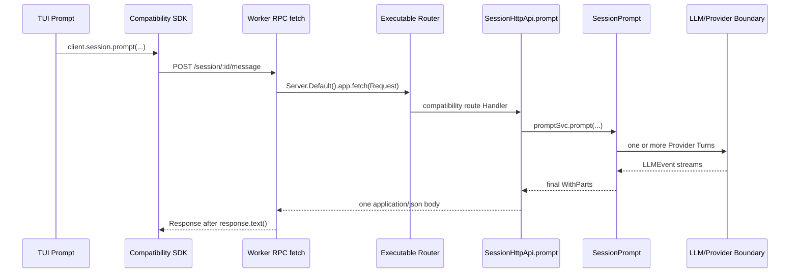
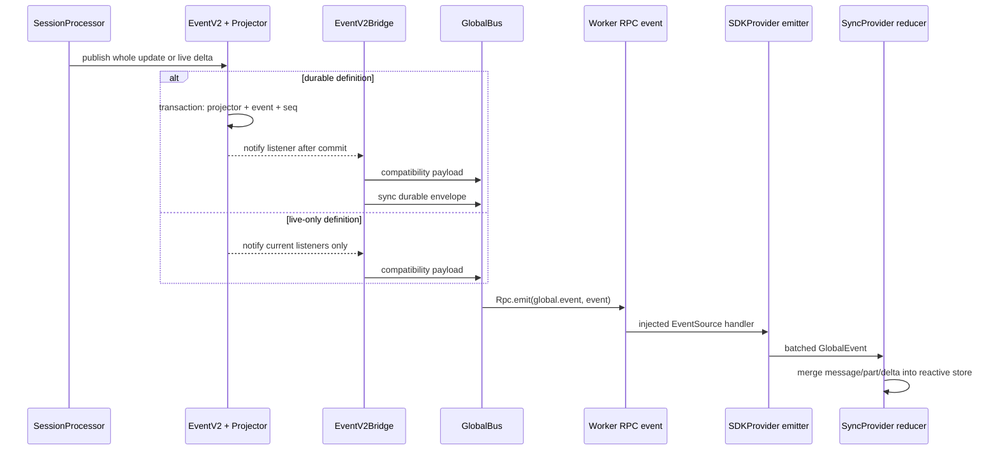

# Runtime Boundary 模块研究：从 TUI 到 Provider 与事件返回

状态：**任务 3-5 模块研究初稿；任务 7 已完成最小验证；任务 8 按用户指示跳过、未作理解验收；待任务 6 交叉审计**。

核对日期：**2026-08-18**。

固定版本：`0e3474509aa5ad16afcf9c439785514d6443c6af`，分支 `dev`。

研究对象：默认本地 TUI、远程 `attach` TUI、当前兼容 Session Runtime、native V2 Session Runtime、Provider/LLM 边界，以及它们在当前 executable 中的组合方式。本文只解释部署形态怎样改变内部调用边界，不重复安装、监听端口、认证或反向代理教程。

证据说明：本文所有源码和测试行号都对应完整 commit `0e3474509aa5ad16afcf9c439785514d6443c6af`。测试矩阵来自静态阅读，任务 7 的实际执行结果、失败和限制单列于 10.4；代码存在不自动等于默认入口使用；生成类名中的 `2`、`3` 不作为架构版本证据；规格中的计划和 TODO 不作为当前行为证据。

系列位置：这是任务 3-5 四份模块笔记中的第 4 篇。建议在读完 Agent/Orchestration、Context/Persistence 和 Tools/Security 三篇后阅读，用 Client、Server、Provider 与事件边界把前三篇重新连接成完整运行图。

## 1. 学习目标、前置知识和阅读路线

### 1.1 学习目标

读完后应能回答：

1. 一条本地 TUI 普通消息经过哪些线程、模块和服务，哪些箭头不是 TCP 网络请求。
2. 一条远程 TUI 普通消息为什么走真实 HTTP，并通过另一条 SSE 连接获得实时更新。
3. 为什么 `POST /session/:id/message` 的响应不是 token stream，即使 Handler 使用了 `HttpServerResponse.stream(...)`。
4. `client.session.prompt(...)` 与 `client.v2.session.prompt(...)` 分别进入哪套路由、Handler 和 Session Runtime。
5. EventV2、`GlobalBus`、`EventV2Bridge`、兼容事件、`sync` envelope、SSE 和 TUI Reactive Store 分别承担什么职责。
6. Provider request 在哪里离开 OpenCode，AI SDK 与 Native Adapter 是什么关系，Tool 到底在哪一侧执行。
7. native V2 已实现什么、仍是 partial/missing 什么，以及为什么当前 TUI 不能被称为 native V2 TUI。
8. 断线、hydrate、replay、取消、Provider 错误和进程崩溃分别在哪个边界处理。

### 1.2 前置知识

- Session 是 Harness 的持久化会话边界；一次用户输入可能触发多个 Provider Turn。
- Provider Turn 是一次模型请求/流，不等同于一次完整用户消息。
- `SessionPrompt`、`SessionRunner`、SDK、Server、Event Bridge 都是逻辑模块或服务名，不天然代表独立进程。
- Durable 表示状态可从 SQLite 重读或重放；live-only 表示只对当前连接和进程中的观察者可见。
- 本项目的“当前默认”由 TUI 实际调用点决定，而不是由包名、文件名或类型名决定。

### 1.3 建议阅读路线

1. 先读第 2 节，建立“模块角色不等于进程”的拓扑概念。
2. 再按第 3 节走一遍本地普通消息，始终把请求路径和事件返回路径分开。
3. 用第 4 节把同一例子替换成远程 `attach`，观察只有传输边界变化，默认 Session Runtime 没有变化。
4. 读第 5-7 节理解 Provider、事件和 executable 组合。
5. 最后独立阅读第 8 节 native V2，不把它拼接进默认流程图。
6. 用第 9-10 节检查失败语义、实现状态、证据和自己的理解。

## 2. 参与者与部署拓扑：先区分角色和进程

### 2.1 逻辑角色不是进程清单

| 参与者 | 类型 | 当前默认职责 | 是否天然是独立进程 |
| --- | --- | --- | --- |
| TUI Prompt | UI 组件 | 收集输入并调用 SDK | 否，运行在 TUI 客户端运行时中 |
| 旧 JavaScript SDK 的兼容 Session API | 客户端模块 | 把 `client.session.prompt` 编码成兼容 HTTP 合同 | 否 |
| Worker RPC Adapter | 本地传输适配 | 把 `fetch` 和 Global Event 跨 `Worker` 边界转发 | 否；源码证明 `Worker`/RPC 边界，不应把它另算为 executable Server 进程 |
| Executable Server Router | 路由和 Handler 图 | 同时承载兼容路由与 native `/api` 路由 | 否；可以内存 `fetch`，也可以挂到监听器 |
| `SessionPrompt` | 当前兼容 Orchestrator | 创建消息、运行旧 Loop、调用 LLM、等待最终结果 | 否 |
| `SessionV2` / `SessionExecution` / `SessionRunner` | native V2 服务 | admission、进程内调度、Location-scoped 执行 | 否；当前默认 TUI 未调用其 prompt 路径 |
| EventV2 / Projector | 持久化和通知模块 | durable transaction、projection、listener/pubsub | 否 |
| `GlobalBus` / `EventV2Bridge` | executable 内兼容事件模块 | 把 EventV2 转成旧客户端可消费的 envelope | 否，且 `GlobalBus` 是进程内 `EventEmitter` |
| Provider | 外部模型服务或本地模型服务 | 接受 Provider Request 并返回 Provider Stream | 通常是网络边界之外的服务；具体部署不由 Session 模块决定 |
| Tool Runtime | OpenCode 内执行模块 | 授权并执行本地 Tool，持久化结果 | 通常与 Server/Harness 同一运行时，不在模型 Provider 内 |

### 2.2 三种实际拓扑

#### A. 默认本地 TUI，无显式网络选项

```text
一个 CLI 宿主
├─ TUI 侧：Prompt + SDK + Reactive Store
└─ Bun Worker 边界：Server.Default().app.fetch + Session Runtime + GlobalBus
   └─ Provider request ──真实网络或本地 Provider transport──> LLM Provider
```

`TuiThreadCommand` 创建 `new Worker(...)`，随后把 SDK 的 `fetch` 和 Event Source 分别注入 `createWorkerFetch(client)` 与 `createEventSource(client)`。Worker 的 `rpc.fetch` 直接调用 `Server.Default().app.fetch(request)`；这经过完整路由图，但没有建立到 `opencode.internal` 的 TCP 连接。

- 状态：`[Current default @ 0e3474509aa5ad16afcf9c439785514d6443c6af]`
- 入口：`packages/opencode/src/cli/cmd/tui.ts`，`TuiThreadCommand.handler`、`createWorkerFetch`、`createEventSource`，24-50、189-249。
- Worker：`packages/opencode/src/cli/tui/worker.ts`，`rpc.fetch`、Global event forwarding，23-49。
- Router：`packages/opencode/src/server/server.ts`，`Server.Default`，56-65。
- 版本：`0e3474509aa5ad16afcf9c439785514d6443c6af`。

#### B. TUI 启动本 executable 的监听模式

`--port`、`--hostname` 或 mDNS 等条件使 `transport` 不再注入 Worker fetch/Event Source，而是让 Worker 调用 `Server.listen(...)`，TUI 通过返回的 URL 使用普通 HTTP/SSE。这里有真实 socket，但 TUI 与 Server 仍可属于同一个 CLI 宿主的不同执行隔离区，不能把“使用 HTTP”自动解释成“远程机器”。

- 状态：`[Current default @ 0e3474509aa5ad16afcf9c439785514d6443c6af]`
- 入口：`packages/opencode/src/cli/cmd/tui.ts`，`external` 与 `transport` 分支，233-249。
- 监听：`packages/opencode/src/cli/tui/worker.ts`，`rpc.server`，54-57；`packages/opencode/src/server/server.ts`，`listen`/`listenEffect`，73-98。
- 版本：`0e3474509aa5ad16afcf9c439785514d6443c6af`。

#### C. 远程 `opencode attach <url>`

```text
TUI Client 进程
├─ SDK POST/GET ─────────HTTP─────────> Executable Server 进程
└─ sdk.global.event() <──长连接 SSE──── Executable Server /global/event
                                             └─ Provider transport -> LLM Provider
```

`AttachCommand` 只向 TUI `run(...)` 传入 URL、directory 和认证 headers，不注入 `fetch` 或 `events`。因此 SDK 使用网络 fetch，`SDKProvider` 因没有 `props.events` 而启动 `/global/event` SSE。

- 状态：`[Current default @ 0e3474509aa5ad16afcf9c439785514d6443c6af]`
- 入口：`packages/opencode/src/cli/cmd/attach.ts`，`AttachCommand.handler`，107-146。
- 传输选择：`packages/tui/src/context/sdk.tsx`，`SDKProvider` 的 `createSDK` 与 `onMount`，23-31、119-131。
- 版本：`0e3474509aa5ad16afcf9c439785514d6443c6af`。

### 核心结论 RB-001

**本地内存 fetch、监听模式 HTTP、远程 HTTP 是三种传输拓扑，不是三套 Session Runtime。普通 TUI 消息在三者中都调用兼容 `client.session.prompt(...)`。**

- 状态：`[Current default @ 0e3474509aa5ad16afcf9c439785514d6443c6af]`
- 证据：`packages/tui/src/component/prompt/index.tsx`，`submitInner()` 普通消息分支，1092-1119；`packages/opencode/src/cli/cmd/tui.ts`，238-249；`packages/opencode/src/cli/cmd/attach.ts`，130-146。
- 限制：源码入口证明 Worker/RPC 隔离和传输选择，但不应据此把 Worker 写成独立 OS Server 进程。
- 版本：`0e3474509aa5ad16afcf9c439785514d6443c6af`。

## 3. 默认本地 TUI 贯穿例子

例子：用户在默认 TUI 输入“解释这个失败测试”并按 Enter。为了避免把最终请求响应和实时 UI 更新混成一条“流”，先追请求，再追事件。

### 3.1 输入请求路径



#### 箭头 1：Prompt 调用的是兼容 Session API

普通消息分支发起 Promise、只挂 `.catch(...)`，随后继续清空输入和导航；它没有 `await` Prompt POST 才更新界面。

- 状态：`[Current default @ 0e3474509aa5ad16afcf9c439785514d6443c6af]`
- 文件：`packages/tui/src/component/prompt/index.tsx`。
- 函数：`submitInner()` 普通消息分支。
- 位置：1092-1146。
- 关键符号：`sdk.client.session.prompt(...)`。
- 版本：`0e3474509aa5ad16afcf9c439785514d6443c6af`。

#### 箭头 2：`client.session.prompt` 生成 `/session/:id/message`

旧 JavaScript SDK 的顶层 `session` getter 返回生成类 `Session2`；其 `prompt` 方法编码兼容 payload 并 POST 到 `/session/{sessionID}/message`。`Session2` 只是生成器为重名组选择的类名，不是 native V2 证明。

- 状态：`[Current compatibility @ 0e3474509aa5ad16afcf9c439785514d6443c6af]`
- 文件：`packages/sdk/js/src/v2/gen/sdk.gen.ts`。
- 方法：`Session2.prompt`，3737-3795；`OpencodeClient.session`，7195-7198。
- 版本：`0e3474509aa5ad16afcf9c439785514d6443c6af`。

#### 箭头 3：本地 `fetch` 是 RPC 后的进程内 Router fetch

TUI 侧把 Request 的 URL、method、headers 和完整文本 body 发送给 Worker；Worker 重建 Request，调用 `Server.Default().app.fetch`，再用 `response.text()` 完整读取响应后回传。这既证明它走真实 Server 路由图，也证明这条 RPC fetch 不保留流式 response body。

- 状态：`[Current default @ 0e3474509aa5ad16afcf9c439785514d6443c6af]`
- 文件：`packages/opencode/src/cli/cmd/tui.ts`，函数 `createWorkerFetch`，24-40。
- 文件：`packages/opencode/src/cli/tui/worker.ts`，方法 `rpc.fetch`，30-49。
- 文件：`packages/opencode/src/server/server.ts`，符号 `Default`，56-65。
- 版本：`0e3474509aa5ad16afcf9c439785514d6443c6af`。

#### 箭头 4：兼容 Route/Handler 进入 `SessionPrompt`

兼容合同把 `prompt` 和 `messages` 都放在 `/session/:sessionID/message`，用 HTTP method 区分。Handler 先验证 Session，然后等待 `promptSvc.prompt(...)` 完成。

- 状态：`[Current compatibility @ 0e3474509aa5ad16afcf9c439785514d6443c6af]`
- 文件：`packages/opencode/src/server/routes/instance/httpapi/groups/session.ts`。
- 符号：`SessionPaths.prompt`、`SessionApi` 的 `prompt` endpoint。
- 位置：78-105、316-328。
- 文件：`packages/opencode/src/server/routes/instance/httpapi/handlers/session.ts`。
- 函数：`SessionHttpApi.prompt`。
- 位置：295-309。
- 版本：`0e3474509aa5ad16afcf9c439785514d6443c6af`。

#### 箭头 5：`SessionPrompt` 执行旧 Loop

`SessionPrompt.prompt` 创建 User Message/Parts 后调用 `loop`；`loop` 通过 `SessionRunState.ensureRunning` 串行同 Session 执行。这里不是 native `SessionInput.admit`/`SessionExecution.wake`。

- 状态：`[Current default @ 0e3474509aa5ad16afcf9c439785514d6443c6af]`
- 文件：`packages/opencode/src/session/prompt.ts`。
- 函数：`SessionPrompt.prompt`、`SessionPrompt.loop`。
- 位置：1052-1071、1343-1347。
- 文件：`packages/opencode/src/session/run-state.ts`。
- 函数：`SessionRunState.ensureRunning`。
- 位置：52-69、88-94。
- 版本：`0e3474509aa5ad16afcf9c439785514d6443c6af`。

### 3.2 为什么 Prompt POST 不是 token stream

兼容 Handler 的确返回 `HttpServerResponse.stream(...)`，但它先执行：

```text
message = await promptSvc.prompt(...整个 Loop...)
body = Stream.make(JSON.stringify(message))
```

因此 HTTP body 只有 Loop 结束后的一个 JSON 值。`stream(...)` 是响应 body 的实现方式，不代表逐 token 发送。默认本地 Worker 还会执行 `await response.text()`，进一步把 body 完整缓冲后才回给 SDK。

### 核心结论 RB-002

**`POST /session/:id/message` 是长耗时的最终结果请求，不是 token stream。TUI 能在 POST 完成前更新，是因为另有 Event Channel。**

- 状态：`[Current default @ 0e3474509aa5ad16afcf9c439785514d6443c6af]`
- Handler 证据：`packages/opencode/src/server/routes/instance/httpapi/handlers/session.ts`，`SessionHttpApi.prompt`，295-309。
- Worker 缓冲证据：`packages/opencode/src/cli/tui/worker.ts`，`rpc.fetch`，42-48。
- TUI 不等待证据：`packages/tui/src/component/prompt/index.tsx`，1094-1119。
- 测试证据：`packages/opencode/test/server/httpapi-sdk.test.ts`，`matches generated SDK prompt streaming through fake LLM`，774-806；测试同时检查最终 Prompt response 和持久化文本，但没有把 POST 当 token 流。
- 版本：`0e3474509aa5ad16afcf9c439785514d6443c6af`。

### 3.3 事件返回路径



#### EventV2 提交边界

Durable Event 在一个 SQLite transaction 中运行 Projector、local commit hook、sequence 更新和 Event row 插入；transaction 返回后才 `notify(...)` listener/pubsub。Live-only Event 不写 durable row，直接通知观察者。

- 状态：`[V2 implemented @ 0e3474509aa5ad16afcf9c439785514d6443c6af]`，且被当前兼容运行时复用。
- 文件：`packages/core/src/event.ts`。
- 函数：`commitDurableEvent`、`publishEvent`、`notify`、`publish`。
- 位置：205-395、398-438。
- 测试：`packages/core/test/event.test.ts`，`runs projectors before publishing to streams`，225-245；`notifies global listeners only after a durable event is committed`，291-320；`isolates observer defects after durable events commit`，271-288。
- 版本：`0e3474509aa5ad16afcf9c439785514d6443c6af`。

#### 当前兼容 whole update 与 delta

兼容 `message.updated`、`message.part.updated` 都带 durable 定义；`message.part.delta` 没有 durable option。旧 Session Service 通过 EventV2 发布 whole Message/Part，而不是自己直接写表。

- 状态：`[Current compatibility @ 0e3474509aa5ad16afcf9c439785514d6443c6af]`
- 合同：`packages/schema/src/v1/session.ts`，`options`、`MessageUpdated`、`PartUpdated`、`PartDelta`，502-507、596-641。
- 发布：`packages/opencode/src/session/session.ts`，`Session.updateMessage`、`Session.updatePart`，631-645。
- Projector：`packages/core/src/session/projector.ts`，`SessionProjector` 的兼容 Message/Part projectors，210-328。
- 版本：`0e3474509aa5ad16afcf9c439785514d6443c6af`。

#### Bridge 同时生成普通兼容事件和 durable `sync` envelope

EventV2 listener 对每个 Event 先向 `GlobalBus` 发出 `{ payload: { id, type, properties } }`。若 Event durable，再发第二个 `{ payload: { type: "sync", syncEvent: { type.version, seq, aggregateID, data } } }`。`sync` 不是普通 Part 更新的替代物，而是可重放的兼容同步 envelope。

- 状态：`[Current compatibility @ 0e3474509aa5ad16afcf9c439785514d6443c6af]`
- 文件：`packages/opencode/src/event-v2-bridge.ts`。
- 符号：`EventV2Bridge` layer listener。
- 位置：35-65。
- 合同：`packages/opencode/src/server/routes/instance/httpapi/groups/global.ts`，`SyncEventSchemas`、`GlobalEventSchema`，16-48。
- 测试：`packages/opencode/test/session/session.test.ts`，`emits legacy global sync payload`，109-131。
- 版本：`0e3474509aa5ad16afcf9c439785514d6443c6af`。

#### Worker Event forwarding 与 TUI reducer

Worker 订阅进程内 `GlobalBus` 并用 RPC 发出 `global.event`；TUI 的注入 Event Source 把它交给 `SDKProvider`。`SDKProvider` 以最多约一帧的 16ms 窗口 batch，再由 `useEvent` 解包。`useEvent` **明确丢弃所有 `payload.type === "sync"`**，所以当前 TUI Reactive Store 消费的是普通兼容 event copy，不用 durable sync envelope 进行 projection。

`SyncProvider` 对 `message.updated`/`message.part.updated` 做有序 upsert，对 `message.part.delta` 只在 Part 已存在时追加字段。

- 状态：`[Current default @ 0e3474509aa5ad16afcf9c439785514d6443c6af]`
- Worker：`packages/opencode/src/cli/tui/worker.ts`，Global event RPC forwarding，23-26。
- 注入：`packages/opencode/src/cli/cmd/tui.ts`，`createEventSource`，42-50。
- Provider：`packages/tui/src/context/sdk.tsx`，`handleEvent`、emitter，35-80、119-131。
- 解包：`packages/tui/src/context/event.ts`，`useEvent.subscribe`，9-19。
- Reducer：`packages/tui/src/context/sync.tsx`，Event reducer，176-445，重点 321-415。
- 测试：`packages/tui/test/cli/cmd/tui/sync-live-hydration.test.tsx`，59-109、111-149、151-200。
- 版本：`0e3474509aa5ad16afcf9c439785514d6443c6af`。

### 核心结论 RB-003

**当前 TUI 的实时画面是“EventV2 -> compatibility event -> GlobalBus -> RPC/SSE -> TUI reducer”；durable `sync` envelope 会经过 transport，但被 TUI `useEvent` 丢弃。Durable 与实时 transport 是两个维度，不是二选一。**

- 状态：`[Current default @ 0e3474509aa5ad16afcf9c439785514d6443c6af]` + `[Current compatibility @ 0e3474509aa5ad16afcf9c439785514d6443c6af]`
- 证据：`packages/opencode/src/event-v2-bridge.ts`，35-60；`packages/tui/src/context/event.ts`，12-19；`packages/tui/src/context/sync.tsx`，321-415。
- 版本：`0e3474509aa5ad16afcf9c439785514d6443c6af`。

## 4. 远程 TUI 对照：HTTP 请求与 SSE 返回

仍用“解释这个失败测试”作为输入。Session 入口没有改变，只替换两段 transport：

```text
请求：TUI SDK --HTTP POST /session/:id/message--> remote Executable Server
事件：TUI SDK <--HTTP SSE GET /global/event----- remote Executable Server
Provider：remote Server --Provider HTTP/other transport--> LLM Provider
```

### 4.1 请求路径

`AttachCommand` 没有传自定义 fetch，生成 SDK 使用普通 fetch。POST 仍是兼容 `/session/:id/message`，仍等待 `SessionPrompt` Loop 最终结果；远程不等于 native V2。

- 状态：`[Current default @ 0e3474509aa5ad16afcf9c439785514d6443c6af]`
- 文件：`packages/opencode/src/cli/cmd/attach.ts`，`AttachCommand.handler`，107-146。
- 文件：`packages/tui/src/context/sdk.tsx`，`createOpencodeClient` 参数，23-31。
- 文件：`packages/sdk/js/src/v2/gen/sdk.gen.ts`，`Session2.prompt`，3737-3795。
- 版本：`0e3474509aa5ad16afcf9c439785514d6443c6af`。

### 4.2 SSE 路径

没有注入 `props.events` 时，`SDKProvider.startSSE()` 调用 `sdk.global.event({ sseMaxRetryAttempts: 0 })`，消费 `events.stream`。外层循环在流结束后按 1s 到 30s 指数退避重连；这里的 `sseMaxRetryAttempts: 0` 禁用的是生成 SDK 内部 retry，由 TUI 自己控制重连循环。

Server 的 `/global/event` 订阅 `GlobalBus`，先发 `server.connected`，每 10 秒 heartbeat，并以 SSE `data:` frame 发 GlobalEvent。SSE frame 的 `id` 字段设置为 `undefined`，Handler 也没有从客户端读取 `Last-Event-ID`。

- 状态：`[Current default @ 0e3474509aa5ad16afcf9c439785514d6443c6af]`
- 客户端：`packages/tui/src/context/sdk.tsx`，`startSSE`，82-117、119-131。
- SDK route：`packages/sdk/js/src/v2/gen/sdk.gen.ts`，`Global.event`，1318-1341。
- Server route：`packages/opencode/src/server/routes/instance/httpapi/groups/global.ts`，`GlobalPaths.event`/endpoint，65-93。
- Server Handler：`packages/opencode/src/server/routes/instance/httpapi/handlers/global.ts`，`eventResponse`，16-65、78-80。
- 测试：`packages/opencode/test/server/httpapi-sdk.test.ts`，`matches generated SDK global event stream`，426-432；`packages/opencode/test/server/httpapi-event.test.ts`，45-93 是 instance `/event` 的相同 SSE transport 基础验证。
- 版本：`0e3474509aa5ad16afcf9c439785514d6443c6af`。

### 核心结论 RB-004

**远程 TUI 使用两个独立 HTTP exchange：一个最终 JSON POST 和一个长连接 SSE。SSE 重连不重发 Prompt POST，也不把 POST 变成 token stream。**

- 状态：`[Current default @ 0e3474509aa5ad16afcf9c439785514d6443c6af]`
- 证据：`packages/tui/src/context/sdk.tsx`，82-117；`packages/opencode/src/server/routes/instance/httpapi/handlers/global.ts`，33-64；`packages/opencode/src/server/routes/instance/httpapi/handlers/session.ts`，295-309。
- 版本：`0e3474509aa5ad16afcf9c439785514d6443c6af`。

## 5. Provider request/stream 边界与 Tool 执行位置

### 5.1 当前默认旧 Session Runtime：AI SDK 是默认 Provider runtime

`LLM.run` 先由旧 Provider service 解析 AI SDK `LanguageModel`、Provider 配置与认证，再由 `LLMRequestPrep.prepare` 组装消息、tools、headers 和 Provider options。未启用专用 native flag 时，`streamText(...)` 发起 Provider request；`result.fullStream` 通过 `LLMAISDK.toLLMEvents` 统一为 `LLMEvent`，下游 `SessionProcessor` 不需要理解 AI SDK 原始事件。

- 状态：`[Current default @ 0e3474509aa5ad16afcf9c439785514d6443c6af]`
- 文件：`packages/opencode/src/session/llm.ts`。
- 函数：`LLM.run`、`LLM.stream`。
- 位置：85-113、224-280、313-381。
- 适配器：`packages/opencode/src/session/llm/ai-sdk.ts`，`toLLMEvents`，76-270。
- 测试：`packages/opencode/test/session/llm.test.ts`，native flag off 的 AI SDK 路径，1316-1343。
- 版本：`0e3474509aa5ad16afcf9c439785514d6443c6af`。

### 5.2 当前旧 Loop 下的 Native Adapter：opt-in，不等于 native V2 Session

只有 `OPENCODE_EXPERIMENTAL_NATIVE_LLM` 专用 flag 为真，`LLM.run` 才尝试 `LLMNativeRuntime.stream`。不支持的 Provider、认证或配置会返回 reason 并 fallback 到 AI SDK。当前 `RuntimeFlags` 明确用 `bool("OPENCODE_EXPERIMENTAL_NATIVE_LLM")`，总开关 `OPENCODE_EXPERIMENTAL` 不会自动开启它。

Native Adapter 把旧 Session/AI-SDK-shaped input 降低成 `@opencode-ai/llm` 的 `LLMRequest`，再交给 `LLMClient`。它仍位于旧 `SessionPrompt` Loop 之下，所以“Provider transport native”不能推出“Session Runtime native V2”。

- 状态：`[Current experimental @ 0e3474509aa5ad16afcf9c439785514d6443c6af]`
- 选择边界：`packages/opencode/src/session/llm.ts`，224-269、357-381。
- Flag：`packages/opencode/src/effect/runtime-flags.ts`，`RuntimeFlags.Service`，10-14、42-55。
- 支持/fallback：`packages/opencode/src/session/llm/native-runtime.ts`，`statusWithFetch`、`stream`，46-77、74-145。
- Request lowering：`packages/opencode/src/session/llm/native-request.ts`，`model`、`request`，145-193。
- 测试：`packages/opencode/test/effect/runtime-flags.test.ts`，`enables native LLM via dedicated flag only`，82-89；`packages/opencode/test/session/llm.test.ts`，`streams OpenAI through native runtime when opted in`，1346-1410。
- 版本：`0e3474509aa5ad16afcf9c439785514d6443c6af`。

### 5.3 native V2 Runner：直接使用 `LLMClient`, 不经过旧 AI SDK `streamText`

native V2 `SessionRunner` 用 `LLM.request(...)` 形成 canonical request，并对每个 Provider Turn 调用一次 `llm.stream(request)`。`LLMClient.compile` 把 common request 编译成 Provider body 和 transport-private prepared data，再由 route transport/`RequestExecutor` 发出。当前支持的 catalog adaptation 仍窄，主要是 OpenAI、OpenAI-compatible 和 Anthropic 的指定 API 形态。

- 状态：`[V2 partial @ 0e3474509aa5ad16afcf9c439785514d6443c6af]`
- Runner：`packages/core/src/session/runner/llm.ts`，`runTurnAttempt`，173-275，重点 205-214、232-275。
- Model adapter：`packages/core/src/session/runner/model.ts`，`fromCatalogModel`、`supported`，131-179。
- Native transport：`packages/llm/src/route/client.ts`，`compile`、`streamRequestWith`、`layer`，341-379、417-425。
- Executor layer：`packages/core/src/effect/app-node-platform.ts`，`requestExecutor`、`llmClient`，11-16。
- 规格边界：`specs/v2/provider-model.md`，Current Session Runner Adaptation，268-284。
- 版本：`0e3474509aa5ad16afcf9c439785514d6443c6af`。

### 5.4 Tool 在哪里执行

Provider 只产生 Tool Call 或执行其声明为 provider-executed 的 hosted tool。普通本地 Tool 的 Permission、文件/命令副作用和 settlement 都在 OpenCode Server/Harness 所在运行时执行。

| 路径 | Tool dispatch 所在边界 | 证据 |
| --- | --- | --- |
| 当前默认 AI SDK | `streamText` 接收带 `execute` 的 prepared tools；Tool Wrapper 回到 OpenCode Permission/Tool Runtime | `packages/opencode/src/session/llm.ts:276-353`；`packages/opencode/src/session/tools.ts:59-134` |
| 旧 Loop + Native Adapter | `LLMNativeRuntime` 看到非 `providerExecuted` call 后调用 `ToolRuntime.dispatch`，其 handler 桥回旧 AI SDK Tool `execute` | `packages/opencode/src/session/llm/native-runtime.ts:103-145,169-190` |
| native V2 Runner | Runner 持久化 call，再以 `toolMaterialization.settle(...)` 启动本地 Tool fiber，结果发布为 durable Session Event | `packages/core/src/session/runner/llm.ts:228-275`；`packages/core/src/session/runner/publish-llm-event.ts:313-394` |
| Provider-executed Tool | Provider 产生 call/result；OpenCode 检测 `providerExecuted` 并跳过本地 dispatch | `packages/opencode/src/session/llm/native-runtime.ts:115-129`；`packages/core/src/session/runner/llm.ts:242-244` |

所有行状态均为固定版本 `0e3474509aa5ad16afcf9c439785514d6443c6af` 下相应路径的 implemented 行为；native V2 的完整 Tool parity 仍是 partial，见 `specs/v2/session.md:139-150`。

### 核心结论 RB-005

**AI SDK、Native Adapter 和 native V2 Runner 是三个不同层次的选择。Provider transport 的实现不能用来判断 TUI 或 Session Orchestration 是否已经切换 V2；普通 Tool 副作用始终留在 OpenCode 一侧。**

- 状态：`[Current default @ 0e3474509aa5ad16afcf9c439785514d6443c6af]` + `[Current experimental @ 0e3474509aa5ad16afcf9c439785514d6443c6af]` + `[V2 partial @ 0e3474509aa5ad16afcf9c439785514d6443c6af]`
- 证据：`packages/opencode/src/session/llm.ts`，224-280；`packages/core/src/session/runner/llm.ts`，205-275；`packages/opencode/src/session/llm/native-runtime.ts`，169-190。
- 版本：`0e3474509aa5ad16afcf9c439785514d6443c6af`。

## 6. Durable Event、兼容 Event、live transport 与 TUI Store

### 6.1 四层关系

| 层 | 数据例子 | 是否 durable | 是否是传输 |
| --- | --- | --- | --- |
| EventV2 durable log/projection | `message.updated.1`、`session.next.prompt.admitted.1`、whole text ended | 是 | 否；它是存储与进程内通知基础设施 |
| EventV2 live-only event | 兼容 `message.part.delta`、native `session.next.text.delta` | 否 | 否；仍需 listener + RPC/SSE 才到客户端 |
| Compatibility envelope | `{ type, properties }` 与 durable `syncEvent` | 普通 envelope 自身不是新的 durable row；`syncEvent` 携带 durable identity | 否；是 transport payload shape |
| Live transport | Worker RPC、`/global/event` SSE、`/api/event` SSE、per-session SSE | 取决于 payload；连接本身不 durable | 是 |
| TUI Reactive Store | 当前 Session、Message、Part 和 delta 合并结果 | 否，客户端内存状态 | 否 |

### 6.2 `sync` envelope 的真实消费者边界

当前 TUI 丢弃 `sync` envelope；Control Plane Workspace 同步路径才会读取 `syncEvent` 并调用 `events.replay(..., { publish: true, ownerID })`。所以不能把 TUI `SyncProvider` 的名字解释为“EventV2 durable sync projector”。它主要是 UI 数据 bootstrap/hydration + live reducer。

- 状态：`[Current compatibility @ 0e3474509aa5ad16afcf9c439785514d6443c6af]`
- TUI 丢弃：`packages/tui/src/context/event.ts`，12-18。
- Workspace replay：`packages/opencode/src/control-plane/workspace.ts`，`parseSSE` callback，395-410。
- 版本：`0e3474509aa5ad16afcf9c439785514d6443c6af`。

### 6.3 hydrate 不是 event replay

进入 Session route 时，TUI 通过兼容 GET API 并行读取 Session、最近 100 条 messages、todo 和 diff。Hydration tracker 记录 hydration 期间到达的 live Message/Part ID，merge 时优先保留这些 live 值，避免较旧 HTTP snapshot 覆盖新 delta。

- 状态：`[Current default @ 0e3474509aa5ad16afcf9c439785514d6443c6af]`
- 触发：`packages/tui/src/routes/session/index.tsx`，Session route effect，287-325。
- 实现：`packages/tui/src/context/sync.tsx`，`session.sync`，594-667；tracker，150-158。
- 测试：`packages/tui/test/cli/cmd/tui/sync-live-hydration.test.tsx`，`stale session hydration does not overwrite live message parts`，59-109；`orphan live deltas do not suppress hydrated parts`，111-149。
- 版本：`0e3474509aa5ad16afcf9c439785514d6443c6af`。

### 6.4 native V2 的事件选择

native V2 提供三类不同的事件读取方式：

1. `GET /api/event`：全 Server 的 native EventV2 live stream，包含 durable metadata 但不回放历史；Server 用容量 256 的 dropping queue，单个慢订阅者 overflow 时终止该订阅。
2. `GET /api/session/:sessionID/event?after=N`：按 Session aggregate 的 durable-only replay-and-tail stream，可用 sequence cursor 无竞态续接；live-only delta 不在其中。
3. `GET /api/session/:sessionID/history?after=N&limit=M`：有限页的 durable history，适合 request/response resync。

- 状态：`[V2 implemented @ 0e3474509aa5ad16afcf9c439785514d6443c6af]`，但当前 TUI 未接线。
- 全局协议：`packages/protocol/src/groups/event.ts`，`/api/event`，29-45。
- 全局 Handler：`packages/server/src/handlers/event.ts`，`EventHandler`，20-50。
- bounded queue：`packages/core/src/event.ts`，`allBounded`，152-164。
- Session 协议：`packages/protocol/src/groups/session.ts`，history/events endpoints，306-343。
- Session Handler：`packages/server/src/handlers/session.ts`，`session.history`、`session.events`，332-364。
- Core：`packages/core/src/session.ts`，`events`、`history`，346-359。
- 测试：`packages/core/test/event.test.ts`，replay and tail，422-478；`packages/core/test/session-prompt.test.ts`，durable Session events after sequence，186-213。
- 版本：`0e3474509aa5ad16afcf9c439785514d6443c6af`。

### 核心结论 RB-006

**“event 带 durable metadata”不等于“这个订阅会 replay”。当前 TUI `/global/event` 与 native `/api/event` 都是 live transport；native per-session `/api/session/:id/event` 才是明确的 durable cursor replay-and-tail API。**

- 状态：`[Current default @ 0e3474509aa5ad16afcf9c439785514d6443c6af]` + `[V2 implemented @ 0e3474509aa5ad16afcf9c439785514d6443c6af]`
- 证据：`packages/opencode/src/server/routes/instance/httpapi/handlers/global.ts`，33-64；`packages/server/src/handlers/event.ts`，20-50；`packages/core/src/session.ts`，346-359。
- 版本：`0e3474509aa5ad16afcf9c439785514d6443c6af`。

## 7. 当前 executable 中新旧路由如何共存

### 7.1 组合不是代理跳转

当前 executable 的 `HttpApiApp.createRoutes()` 合并：

- `rootApiRoutes`：兼容 `/global/*` 等。
- `eventApiRoutes`：兼容 `/event`。
- `instanceRoutes`：兼容 `/session/*`，Handler 包括 `SessionHttpApi.prompt`。
- `serverRoutes`：`@opencode-ai/server/api` + `@opencode-ai/server/handlers` 的 native `/api/*`。
- doc/UI fallback。

`serverRoutes` 不是一个另启的 Server 进程，也不是 HTTP 反向代理到 `packages/server`；它是同一 Effect Router layer tree 中并列 merge 的新合同和 Handler layer。

- 状态：`[V2 implemented @ 0e3474509aa5ad16afcf9c439785514d6443c6af]` 与 `[Current compatibility @ 0e3474509aa5ad16afcf9c439785514d6443c6af]` 共存。
- 文件：`packages/opencode/src/server/routes/instance/httpapi/server.ts`。
- 符号：`instanceApiRoutes`、`serverRoutes`、`createRoutes`。
- 位置：154-181、271-312。
- 关键 merge：276-284。
- native Session layer：299-303。
- 版本：`0e3474509aa5ad16afcf9c439785514d6443c6af`。

### 7.2 `packages/server` 自身的边界

`packages/server/src/api.ts` 用 Protocol 的 `makeDefaultApi` 生成具体 API；`handlers.ts` 合并各组 Handler。`packages/server/src/routes.ts` 可单独组装只含 native API 的 network/embedded routes。当前 executable 复用其 `Api`、`handlers` 和若干 middleware/location layers，但由 opencode executable 自己把它们与兼容路由合并。

- 状态：`[V2 implemented @ 0e3474509aa5ad16afcf9c439785514d6443c6af]`
- Protocol concrete API：`packages/server/src/api.ts`，`Api`，1-8。
- Handler composition：`packages/server/src/handlers.ts`，`handlers`，21-40。
- Standalone/embedded composition：`packages/server/src/routes.ts`，`createRoutes`、`createEmbeddedRoutes`、`makeRoutes`，26-68。
- 版本：`0e3474509aa5ad16afcf9c439785514d6443c6af`。

### 核心结论 RB-007

**同一个 executable 同时能响应 `/session/:id/message` 和 `/api/session/:id/prompt`，因为两套路由 layer 被合并；这只证明 native API 可达，不证明默认 TUI 使用它。**

- 状态：`[Current compatibility @ 0e3474509aa5ad16afcf9c439785514d6443c6af]` + `[V2 implemented @ 0e3474509aa5ad16afcf9c439785514d6443c6af]`
- 证据：`packages/opencode/src/server/routes/instance/httpapi/server.ts`，154-181、271-303；TUI 反证：`packages/tui/src/component/prompt/index.tsx`，1092-1119。
- 测试：`packages/opencode/test/server/httpapi-public-openapi.test.ts`，native prompt 与 `/api/event` 出现在组合 Public API，104-147、223-247。
- 版本：`0e3474509aa5ad16afcf9c439785514d6443c6af`。

## 8. native V2 独立路径与当前接线状态

### 8.1 两个 Prompt API 不能按名称互换

| 项目 | 当前兼容路径 | native V2 路径 |
| --- | --- | --- |
| 旧 JS SDK 调用 | `client.session.prompt(...)` | `client.v2.session.prompt(...)` |
| 生成类 | `Session2.prompt` | `Session3.prompt`；数字不代表架构判断依据 |
| HTTP | `POST /session/:id/message` | `POST /api/session/:id/prompt` |
| 输入 | old Message parts、model、agent、tools、system 等 | `PromptInput`、id、delivery、resume |
| Handler | `SessionHttpApi.prompt` | `SessionHandler` 的 `session.prompt` |
| Core | `SessionPrompt.prompt -> loop` | `SessionV2.prompt -> SessionInput.admit -> optional wake` |
| POST 成功值 | Loop 完成后的 final `SessionV1.WithParts` | durable `SessionInput.Admitted` receipt |
| 是否等 Provider 完成 | 是 | 否；`wake` 只调度进程内 drain |
| 当前普通 TUI 接线 | 是 | 否 |

#### `client.v2.session.prompt` 的生成证据

旧 SDK 根对象的 `v2` getter 返回 `V2` group，`V2.session` 返回 `Session3`；其 prompt POST 到 `/api/session/{sessionID}/prompt`。

- 状态：`[V2 implemented @ 0e3474509aa5ad16afcf9c439785514d6443c6af]`
- 文件：`packages/sdk/js/src/v2/gen/sdk.gen.ts`。
- 方法：`Session3.prompt`，5617-5656。
- getter：`V2.session`，7006-7009；`OpencodeClient.v2`，7215-7218。
- 版本：`0e3474509aa5ad16afcf9c439785514d6443c6af`。

#### Protocol -> Server Handler -> Core

Protocol 声明 `v2.session.prompt` 的成功值是 `{ data: SessionInput.Admitted }`。Handler 映射 NotFound 与 PromptConflict，再返回 admission receipt。Core 在 uninterruptible 区先 durable admit，校验 exact retry 一致性；只有 `resume !== false` 才调用 `execution.wake`。

- 状态：`[V2 implemented @ 0e3474509aa5ad16afcf9c439785514d6443c6af]`
- Protocol：`packages/protocol/src/groups/session.ts`，`session.prompt` endpoint，204-224。
- Handler：`packages/server/src/handlers/session.ts`，`session.prompt`，139-171。
- Core：`packages/core/src/session.ts`，`V2Session.prompt`，360-386。
- Admission：`packages/core/src/session/input.ts`，`SessionInput.admit`，41-81。
- 调度：`packages/core/src/session/execution/local.ts`，local `SessionExecution`，10-36。
- 版本：`0e3474509aa5ad16afcf9c439785514d6443c6af`。

### 8.2 native Prompt POST 为什么也不是 token stream

native Prompt POST 比兼容 POST 更短：它在 durable admission 和 `wake` 注册后立即返回 receipt。Provider output 随后的 live native EventV2 可从 `/api/event` 观察，durable Session facts 可从 per-session event/history 读取。POST 自身既不是最终 Assistant Message，也不是 token stream。

### 核心结论 RB-008

**两个 Prompt POST 都不是 token stream，但等待语义相反：兼容 POST 等完整旧 Loop，native POST 只等 durable admission；native 的最终输出必须由 message/context 查询或事件 API观察。**

- 状态：`[Current default @ 0e3474509aa5ad16afcf9c439785514d6443c6af]` + `[V2 implemented @ 0e3474509aa5ad16afcf9c439785514d6443c6af]`
- 证据：`packages/opencode/src/server/routes/instance/httpapi/handlers/session.ts`，295-309；`packages/server/src/handlers/session.ts`，139-171；`packages/core/src/session.ts`，360-386。
- 测试：`packages/opencode/test/server/httpapi-session.test.ts`，`durably records one v2 prompt for exact message-ID retries`，564-637；`resume:false` 后 messages 为空，默认 wake 后轮询到 promoted message。
- 版本：`0e3474509aa5ad16afcf9c439785514d6443c6af`。

### 8.3 `packages/client` 与 `sdk-next` 是 native V2 API，不是当前 TUI SDK

`@opencode-ai/client` 由 Protocol/Server Effect HttpApi 生成。Promise client 的 `sessions.prompt` 固定 POST `/api/session/:id/prompt`，`events.subscribe` 固定 `/api/event`，`sessions.events` 固定 per-session durable SSE。Effect client 复用同一 contract 并解码 canonical Schema 值。

`sdk-next` 再组合 `@opencode-ai/client/effect`、Core 和 `packages/server` 的 `createEmbeddedRoutes()`：它构造内存 Web Handler 和自定义 fetch，不打开 listener，也不发生网络 I/O，但仍经过 native HTTP Router、middleware、Handler 和 codec。

- 状态：`[V2 implemented @ 0e3474509aa5ad16afcf9c439785514d6443c6af]`
- Client contract：`packages/client/src/contract.ts`，`ClientApi`、group mapping，14-38。
- Promise client：`packages/client/src/generated/client.ts`，`sessions.prompt`、`sessions.events`、`events.subscribe`，370-381、461-472、811-816。
- Effect client：`packages/client/src/generated-effect/client.ts`，Prompt adapter 与 Session event stream，109-124、181-192、210-228。
- sdk-next：`packages/sdk-next/src/opencode.ts`，`OpenCode.create`，10-43。
- 测试：`packages/client/test/contract-identity.test.ts`，contract generation identity，24-45；`packages/client/test/promise.test.ts`，native URL/body，86-172；`packages/sdk-next/test/embedded.test.ts`，real router/handlers 与 global events，9-144。
- 版本：`0e3474509aa5ad16afcf9c439785514d6443c6af`。

### 8.4 native V2 当前 implemented / partial / missing

| 能力 | 状态 | 当前证据或缺口 |
| --- | --- | --- |
| Durable prompt admission、exact retry、`resume:false` | `[V2 implemented @ 0e3474509aa5ad16afcf9c439785514d6443c6af]` | `packages/core/src/session.ts:360-386`；`packages/core/test/session-prompt.test.ts:143-162,252-359,539-582` |
| 同 Session join/coalesced wake，不同 Session 并行 | `[V2 implemented @ 0e3474509aa5ad16afcf9c439785514d6443c6af]` | `packages/core/src/session/run-coordinator.ts:24-103`；`packages/core/test/session-run-coordinator.test.ts:9-55,141-169,372-393` |
| Provider Turn、durable text/reasoning/tool settlement 与 continuation | `[V2 implemented @ 0e3474509aa5ad16afcf9c439785514d6443c6af]`，整体 parity 仍 partial | `packages/core/src/session/runner/llm.ts:173-348,383-410`；`publish-llm-event.ts:239-423` |
| Native Protocol/Server/Client/session cursor API | `[V2 implemented @ 0e3474509aa5ad16afcf9c439785514d6443c6af]` | Protocol `session.ts:204-224,306-358`；Client `generated/client.ts:370-381,449-483` |
| 当前 TUI 使用 native prompt/event contracts | `[V2 missing/planned]` | TUI submit 仍是 `client.session.prompt`，`index.tsx:1092-1119`；TUI event 仍是 `GlobalEvent` compatibility shape，`context/sdk.tsx:1-9` |
| V1 runtime context parity | `[V2 partial @ 0e3474509aa5ad16afcf9c439785514d6443c6af]` | `specs/v2/session.md:123-151` 明列 complete/partial/missing |
| Provider coverage | `[V2 partial @ 0e3474509aa5ad16afcf9c439785514d6443c6af]` | `packages/core/src/session/runner/model.ts:131-179`；`specs/v2/provider-model.md:268-284` |
| Manual `session.compact` 与 `session.wait` | `[V2 missing/planned]` | Core 直接返回 `OperationUnavailableError`，`packages/core/src/session.ts:417-424`；HTTP 测试期望 503，`httpapi-session.test.ts:639-663` |
| Durable status、clustered ownership、post-crash continuation | `[V2 missing/planned]` | `packages/core/src/session/runner/llm.ts:49-86` TODO；`specs/v2/session.md:153-169` |

### 核心结论 RB-009

**native V2 已经是可达、可测试的独立 API 和 Runner slice，不是只有规格；但它仍不是当前 TUI 默认路径，也没有达到 V1 全量 parity。**

- 状态：`[V2 partial @ 0e3474509aa5ad16afcf9c439785514d6443c6af]`
- implemented 证据：`packages/opencode/test/server/httpapi-session.test.ts`，564-637；`packages/sdk-next/test/embedded.test.ts`，9-144。
- 未接线证据：`packages/tui/src/component/prompt/index.tsx`，1092-1119；`packages/tui/src/context/event.ts`，1-19。
- parity 证据：`specs/v2/session.md`，123-177。
- 版本：`0e3474509aa5ad16afcf9c439785514d6443c6af`。

## 9. 失败、取消、断线和恢复边界

### 9.1 当前兼容 Prompt 请求失败

- SDK/HTTP validation 或 Handler error：Prompt Promise reject，TUI `.catch` 显示 toast；输入框此前已按 submit 流程清空。
- Provider error：`SessionProcessor.halt` 写 Assistant Error，发布 `session.error`，设置 idle；retryable error 可先进入 `SessionRetry.policy`。
- Prompt POST 的网络错误只描述请求结果，不会自动撤销已 durable 的 User Message/Part 或已经执行的 Tool 副作用。

证据：

- 状态：`[Current default @ 0e3474509aa5ad16afcf9c439785514d6443c6af]`
- TUI catch：`packages/tui/src/component/prompt/index.tsx`，1111-1119。
- Processor：`packages/opencode/src/session/processor.ts`，`halt`/`process`，599-683。
- 版本：`0e3474509aa5ad16afcf9c439785514d6443c6af`。

### 9.2 当前 TUI 取消

TUI 的 interrupt 命令需要连续触发到阈值后调用兼容 `sdk.client.session.abort`，对应 `POST /session/:id/abort`。Handler 调用 `SessionPrompt.cancel -> SessionRunState.cancel`；Runner interrupt 传播到 Provider Stream。Processor cleanup 尽力 durable flush 当前 Text/Reasoning，把未完成 Tool 标为 interrupted error，并完成 Assistant Message。

- 状态：`[Current default @ 0e3474509aa5ad16afcf9c439785514d6443c6af]`
- TUI：`packages/tui/src/component/prompt/index.tsx`，`session.interrupt` command，392-421。
- Handler：`packages/opencode/src/server/routes/instance/httpapi/handlers/session.ts`，`SessionHttpApi.abort`，232-235。
- Service：`packages/opencode/src/session/prompt.ts`，`SessionPrompt.cancel`，152-155。
- Runner state：`packages/opencode/src/session/run-state.ts`，`cancel`，77-86。
- Cleanup：`packages/opencode/src/session/processor.ts`，`cleanup`、interrupt handling，539-597、627-683。
- 版本：`0e3474509aa5ad16afcf9c439785514d6443c6af`。

### 9.3 远程 SSE 断线与 TUI 恢复

`startSSE` 会重连，但 `/global/event` 不提供 durable cursor replay。连接断开期间的 live-only delta 不可恢复；whole Message/Part 若已经 durable，可在后续 route hydration 中从兼容 GET API 重读。当前代码没有在每次新的 `server.connected` 上自动调用 `session.sync`；Session route mount、显式 bootstrap 或 `server.instance.disposed` 才触发 snapshot refresh。

因此当前恢复模型是：

```text
SSE reconnect 恢复后续 live events
+ Session route hydration 恢复 durable whole state
- 断线期间尚未形成 whole update 的 live-only suffix
```

- 状态：`[Current default @ 0e3474509aa5ad16afcf9c439785514d6443c6af]`，恢复能力为 partial。
- SSE retry：`packages/tui/src/context/sdk.tsx`，82-117。
- Global SSE 无 cursor：`packages/opencode/src/server/routes/instance/httpapi/handlers/global.ts`，16-23、33-64。
- Hydration：`packages/tui/src/context/sync.tsx`，451-555、594-667。
- route trigger：`packages/tui/src/routes/session/index.tsx`，287-325。
- 版本：`0e3474509aa5ad16afcf9c439785514d6443c6af`。

### 9.4 native V2 断线与 replay

- `/api/event` 是 volatile global stream；重连没有 `Last-Event-ID` replay，且慢订阅者可能因 bounded queue overflow 终止。
- `/api/session/:id/event?after=seq` 是 durable-only reconnect-safe stream；不会补回 live text/reasoning/tool-input delta。
- `/api/session/:id/history` 可有限分页 resync durable facts。
- native V2 当前 TUI 未使用这些能力。

- 状态：`[V2 implemented @ 0e3474509aa5ad16afcf9c439785514d6443c6af]`，UI integration missing。
- 证据：`packages/server/src/handlers/event.ts`，9-50；`packages/core/src/event.ts`，152-164、541-604；`packages/protocol/src/groups/session.ts`，306-343。
- 测试：`packages/app/e2e/regression/session-timeline-transport.spec.ts`，`does not request replay when reconnecting the volatile V2 event stream`，100-112；`packages/core/test/event.test.ts`，422-478。
- 版本：`0e3474509aa5ad16afcf9c439785514d6443c6af`。

### 9.5 native V2 取消、错误和进程崩溃

`POST /api/session/:id/interrupt` 调用 `SessionV2.interrupt`，最终中断当前进程 local coordinator owner；idle interrupt no-op。Runner 在 stream/tool interruption时持久化未结算 Tool failure，并在已有 active Assistant 时写 `Provider turn interrupted`。但 ownership、active status 和 drain 都是 process-local。

Prompt admission durable 不等于 Provider work 可自动 crash-resume：post-crash continuation 被明确 deferred，因为崩溃点可能处于 Provider 已接收、Tool 已产生副作用但 settlement 未完整提交等歧义状态。显式 resume 可以从 durable projection 继续，但当前没有安全的自动 startup recovery policy。

- 状态：interrupt `[V2 implemented @ 0e3474509aa5ad16afcf9c439785514d6443c6af]`；post-crash recovery `[V2 missing/planned]`。
- HTTP：`packages/protocol/src/groups/session.ts`，interrupt endpoint，344-358；`packages/server/src/handlers/session.ts`，365-370。
- Core：`packages/core/src/session.ts`，`V2Session.interrupt`，425-432。
- Coordinator：`packages/core/src/session/run-coordinator.ts`，`interrupt`，94-103。
- Runner cleanup：`packages/core/src/session/runner/llm.ts`，277-345、383-405。
- 规格：`specs/v2/session.md`，13-33、160-169；`specs/v2/todo.md`，56-74。
- 测试：`packages/core/test/session-run-coordinator.test.ts`，209-319。
- 版本：`0e3474509aa5ad16afcf9c439785514d6443c6af`。

### 核心结论 RB-010

**重连、hydrate、durable replay、interrupt 和 crash recovery 是五个不同机制。当前兼容 TUI 有 SSE 重连与 snapshot hydration，但没有 cursor replay；native V2 有 per-session durable cursor，却仍没有自动 post-crash continuation。**

- 状态：`[Current default @ 0e3474509aa5ad16afcf9c439785514d6443c6af]` + `[V2 partial @ 0e3474509aa5ad16afcf9c439785514d6443c6af]`
- 证据：`packages/tui/src/context/sdk.tsx`，82-117；`packages/tui/src/context/sync.tsx`，594-667；`packages/core/src/session.ts`，346-359；`specs/v2/session.md`，160-185。
- 版本：`0e3474509aa5ad16afcf9c439785514d6443c6af`。

## 10. V1/V2 对照、测试证据、Open Questions 与理解检查

### 10.1 最小 V1/V2 对照

| 问题 | 当前兼容 Runtime | native V2 |
| --- | --- | --- |
| Prompt admission | 创建 visible User Message/Parts 后进入旧 Loop | 先写 durable `session_input`，之后在 safe boundary promote |
| POST 返回 | final Assistant `WithParts` | `SessionInput.Admitted` receipt |
| 调度 | `SessionRunState.ensureRunning` | process-global `SessionExecution` + `SessionRunCoordinator` |
| Provider | 默认 AI SDK，专用 flag 可选 Native Adapter | canonical `@opencode-ai/llm` + `LLMClient` native routes |
| Tool loop | `SessionPrompt` + `SessionProcessor` + AI SDK/native adapter | `SessionRunner` 显式 provider-turn loop + durable settlement |
| 客户端实时事件 | 兼容 GlobalEvent，经 RPC 或 `/global/event` | `/api/event` native live stream；per-session durable stream |
| TUI store | 已接线兼容 event + GET hydration | 未接线 |
| crash recovery | 依赖 durable Message/Part 重读，但无跨崩溃精确 continuation contract | admission/cursor durable；ambiguous Provider continuation deferred |

### 10.2 源码与测试证据矩阵

下表是源码与测试的静态证据索引，版本统一为完整 SHA `0e3474509aa5ad16afcf9c439785514d6443c6af`；其中哪些测试已在任务 7 实际通过，以 10.4 的运行记录为准。

| 覆盖点 | 源码入口/符号 | 测试证据 | 判定 |
| --- | --- | --- | --- |
| TUI submit | `packages/tui/src/component/prompt/index.tsx:1092-1146`, `submitInner` | `packages/tui/test/cli/tui/prompt-submit-race.test.ts:1-98` 只覆盖 submit race mirror，不是路由集成测试 | implemented；TUI 到 native V2 missing |
| 兼容 SDK prompt | `packages/sdk/js/src/v2/gen/sdk.gen.ts:3737-3795`, `Session2.prompt` | `packages/opencode/test/server/httpapi-sdk.test.ts:774-806` | implemented/default |
| native 旧 SDK prompt | `packages/sdk/js/src/v2/gen/sdk.gen.ts:5617-5656`, `Session3.prompt` | `packages/opencode/test/server/httpapi-session.test.ts:564-637` 走真实组合 Router | implemented/not default TUI |
| Worker fetch | `packages/opencode/src/cli/cmd/tui.ts:24-40`; `cli/tui/worker.ts:30-49` | 未找到直接实例化 Worker 的边界测试；Server path parity 间接覆盖 raw/listener Router | implemented，测试缺口 |
| Event forwarding | `event-v2-bridge.ts:35-65`; `worker.ts:23-26`; `tui.ts:42-50` | `packages/opencode/test/session/session.test.ts:109-131`; `httpapi-sdk.test.ts:675-724` | implemented |
| 兼容 SSE | `handlers/global.ts:33-64`; `tui/context/sdk.tsx:82-117` | `httpapi-sdk.test.ts:426-432`; `httpapi-event.test.ts:45-93` | implemented；断线 cursor missing |
| TUI reducer/hydration | `tui/context/event.ts:9-19`; `sync.tsx:176-445,594-667` | `sync-live-hydration.test.tsx:59-285` | implemented；cursor resync missing |
| Provider default/native seam | `session/llm.ts:224-381`; `native-runtime.ts:46-145` | `session/llm.test.ts:1316-1410,1513-1599`; `runtime-flags.test.ts:82-89` | AI SDK default；Native Adapter experimental |
| executable composition | `httpapi/server.ts:154-181,271-312` | `httpapi-public-openapi.test.ts:104-147,223-247`; `httpapi-session.test.ts:525-663` | coexistence implemented |
| Protocol/Server/Client | `protocol/groups/session.ts:204-224,306-358`; `server/handlers/session.ts:139-171,332-370`; `client/generated/client.ts:370-483` | `client/test/promise.test.ts:86-172`; `contract-identity.test.ts:24-45` | native API implemented |
| sdk-next embedded | `sdk-next/src/opencode.ts:10-43` | `sdk-next/test/embedded.test.ts:9-212` | implemented |
| durable cursor | `core/src/session.ts:346-359`; `core/src/event.ts:541-604` | `core/test/event.test.ts:422-478`; `core/test/session-prompt.test.ts:186-213` | implemented |
| post-crash continuation | 无自动 recovery implementation；`specs/v2/session.md:160-169` | 未找到完成能力的测试 | missing/planned |

### 10.3 待任务 6 核对：现有 06 trace 的 Open Questions

这里只记录 Runtime 边界可能影响 A/B/C 结论的局部问题，不提前执行任务 6 的全面交叉审计，也不修改 `06_Current_Runtime_End_to_End_Trace.md`。

1. **`sync` envelope 的消费措辞需要收紧。** 06 第 513 行说当前 TUI“主要消费”普通 update，可能让读者以为 TUI 偶尔也用 `sync`。源码 `packages/tui/src/context/event.ts:14-16` 是无条件丢弃所有 `sync`。任务 6 应决定是否把正式文档写成“transport 会收到两份，TUI reducer 只消费普通 compatibility copy”。`[Unresolved]`
2. **Worker 是否被称为“进程”需要统一。** 06 已说参与者不是九个独立进程，但拓扑图容易让人把 Worker 和 Executable Server 当两个 OS process。固定源码只直接证明 `new Worker`、RPC 和 `app.fetch`，应统一写为 Worker 执行边界/线程或 isolate，除非任务 7 用运行实验确认具体 Bun runtime。`[Unresolved]`
3. **“Streaming HTTP response”术语仍有误读风险。** 06 第 208-227 行已正确说明不是 token stream，但 Handler 名称和 SDK 注释仍写 “streaming the AI response”。正式文档应优先描述“single JSON body after Loop”，把 `HttpServerResponse.stream` 限定为 body implementation。`[Interpretation]`
4. **Tool 执行归属必须绑定具体 Provider runtime。** 06 第 60、74-75 行对当前默认 AI SDK 路径成立；若 A/C 模块把它泛化成所有路径，会与 native V2 Runner 在 `SessionRunner` 中 settlement、旧 Native Adapter 在 `LLMNativeRuntime` 中 dispatch 的事实冲突。任务 6 应按三条路径分别审计。`[Unresolved]`
5. **Native LLM flag 的仓库说明存在内部矛盾。** `packages/opencode/src/session/llm/AGENTS.md` 声称 umbrella `OPENCODE_EXPERIMENTAL=true` 也会 opt in，但实际 `runtime-flags.ts:54` 与测试 `runtime-flags.test.ts:82-89` 证明只能用专用 flag。本文以 E1 代码和测试为准；任务 6 可记录文档漂移。`[Unresolved]`
6. **V2 TODO 已落后于代码的可能性。** `specs/v2/todo.md:49,113-114` 仍写“expose replayable Session event cursors over HTTP and generated SDK”，但 Protocol、Server、Client 和测试已经存在。本文标记 implemented；任务 6 应核实 TODO 是否只是未更新，不能按 TODO 把现有 API降级成 missing。`[Unresolved]`
7. **远程 TUI reconnect 后没有自动 durable resync。** `startSSE` 会重连，但 `server.connected` 没有触发 `session.sync`。任务 7 最小集未覆盖主动断线，仍需后续实验确认长断线后，用户停留在同一 Session 页面时 whole update 是否会因后续事件自然收敛，还是必须切换页面/显式 refresh。`[Unresolved]`
8. **兼容 POST 的网络失败与 durable admission 可见性。** 当前 POST 可在 User Message 已写入、Provider/Tool 已执行后因连接失败而 reject。需要 A/B 模块在任务 6 统一“客户端失败”与“Session 事务失败”的表述，避免暗示请求 reject 会 rollback 整个 Harness 执行。`[Unresolved]`

### 10.4 任务 7 最小验证结果与后续实验

#### 实测环境

- 日期：2026-08-18。
- 源码：`0e3474509aa5ad16afcf9c439785514d6443c6af`，执行前后 `git status --short` 均为空。
- 系统：Linux `6.6.87.2-microsoft-standard-WSL2`，x86_64，WSL2。
- Runtime：Bun `1.3.14`（与根 `packageManager` 一致）、Node `v22.22.2`、npm/npx `10.9.7`。
- 执行规则：均从对应 package 目录调用 `npx --yes bun`；未启动付费 Provider，LLM 路径只使用测试 fake LLM 或无 Provider 的 admission/事件场景，没有访问真实模型服务。
- 计时：表中“Bun”是 Bun 自报测试耗时，“wall”是 `/usr/bin/time` 包住整个 `npx --yes bun` 的耗时，包含 npx 启动开销。

#### 最小测试集命令与统计

| Package | 命令（在 package 目录执行） | 结果 | Bun / wall |
| --- | --- | --- | --- |
| `packages/opencode` | `npx --yes bun test test/server/httpapi-sdk.test.ts test/server/httpapi-session.test.ts test/server/httpapi-event.test.ts test/server/httpapi-public-openapi.test.ts test/session/llm.test.ts test/effect/runtime-flags.test.ts` | **FAIL**：112 pass、12 fail、1 个 test 间 unhandled error；124 tests / 6 files | 64.61s / 82.40s |
| `packages/opencode` 稳定性复跑 | `npx --yes bun test --max-concurrency 1 test/server/httpapi-sdk.test.ts test/server/httpapi-session.test.ts test/server/httpapi-event.test.ts test/server/httpapi-public-openapi.test.ts test/session/llm.test.ts test/effect/runtime-flags.test.ts` | **FAIL**：仍为 112 pass、12 fail、1 error；并发上限未改变失败集合 | 55.39s / 66.69s |
| `packages/opencode` 排除稳定失败文件后的拆分 | `npx --yes bun test test/server/httpapi-session.test.ts test/server/httpapi-event.test.ts test/server/httpapi-public-openapi.test.ts test/session/llm.test.ts test/effect/runtime-flags.test.ts` | **PASS**：106 pass、0 fail；106 tests / 5 files | 27.08s / 44.02s |
| `packages/tui` | `npx --yes bun test test/cli/tui/prompt-submit-race.test.ts test/cli/cmd/tui/sync-live-hydration.test.tsx` | **PASS**：8 pass、0 fail；8 tests / 2 files | 1.66s / 19.41s |
| `packages/client` | `npx --yes bun test test/promise.test.ts test/contract-identity.test.ts` | **PASS**：10 pass、0 fail；10 tests / 2 files | 2.00s / 19.75s |
| `packages/sdk-next` | `npx --yes bun test test/embedded.test.ts` | **FAIL**：1 pass、3 fail；4 tests / 1 file | 2.03s / 19.75s |
| `packages/sdk-next` 稳定性复跑 | `npx --yes bun test --max-concurrency 1 test/embedded.test.ts` | **FAIL**：仍为 1 pass、3 fail | 1.452s / 12.42s |
| `packages/opencode` 协调者独立复核 | 其他四路任务全部结束后单独运行 `npx --yes bun test test/server/httpapi-sdk.test.ts` | **FAIL**：6 pass、12 fail、1 error；18 tests / 1 file | Bun 32.03s |
| `packages/sdk-next` 协调者独立复核 | 其他四路任务全部结束后单独运行 `npx --yes bun test test/embedded.test.ts` | **FAIL**：1 pass、3 fail；4 tests / 1 file | Bun 1.293s |

路径核对结果：请求中的 `test/session/runtime-flags.test.ts` 实际是 `packages/opencode/test/effect/runtime-flags.test.ts`；TUI hydration 文件实际是 `packages/tui/test/cli/cmd/tui/sync-live-hydration.test.tsx`。Client 按本文引用选择了 `promise.test.ts` 与 `contract-identity.test.ts`。

#### 最小隔离验证

1. **native Prompt admission receipt，已执行并通过。** 在 `packages/opencode` 执行 `npx --yes bun test test/server/httpapi-session.test.ts -t 'durably records one v2 prompt for exact message-ID retries'`：1 pass、20 filtered、0 fail，Bun 4.10s / wall 21.00s。该真实组合 Router 测试确认 `POST /api/session/:id/prompt` 在 `resume:false` 时返回 200 和 `SessionInput.Admitted` shape；此时 message GET 仍为空，而数据库已有未 promoted 的 durable `session_input`。exact retry 返回相同 receipt；默认 resume 的第二次请求返回后，测试再轮询到 User Message promoted。它证明 POST 成功值是 admission receipt，不是最终 Assistant，也没有启动真实 Provider。
2. **native Promise contract，已执行并通过。** Client 最小集中的 `session methods use the public HTTP contract` 确认 Promise client 调用 `POST /api/session/ses_test/prompt`、发送 `{ prompt, resume:false }`，并把响应解码为 admission；contract identity tests 同时通过。
3. **兼容 Prompt 最终响应，已尝试但未形成动态证据。** 在 `packages/opencode` 执行 `npx --yes bun test test/server/httpapi-sdk.test.ts -t 'matches generated SDK prompt streaming through fake LLM'`：0 pass、1 fail、17 filtered，Bun 4.75s / wall 21.62s。失败发生在读取 `prompt.data` 前，local test server 返回的 SDK 结果没有 data，因此本轮不能用它实测“兼容 POST 等到最终 Assistant”；RB-002 的这一半仍只有源码与测试意图证据，等待后续修复测试 Harness 后重测。
4. **live event 与 hydration 隔离，已执行并通过，但不是 reconnect 实验。** `sync-live-hydration.test.tsx` 的 6 个测试全部通过，其中 gate 控制的 HTTP snapshot 与主动注入 live event 证明：hydration 期间到达的 whole Part 不被 stale snapshot 覆盖，hydrate 前已追加的 text delta 也不会被空 snapshot 清除；orphan delta 不会错误压制后续 hydrated Part。这验证 reducer/hydration 竞争边界，不证明 SSE 断开后的自动重连或 cursor replay。
5. **embedded 单测隔离，已执行并通过。** 对 `embedded.test.ts` 的四个 test name 分别运行 `-t`，每次均为 1 pass、3 filtered、0 fail（Bun 0.934-1.84s，wall 15.65-18.60s）。这支持 embedded router/client、global event 隔离和 Layer service 各自可工作，但不消除整文件运行的 lifecycle 失败。

#### 失败原因与限制

- `httpapi-sdk.test.ts` 单独 filter、两次 6 文件运行，以及协调者在其他四路任务全部结束后的单文件复核都稳定失败：本地 Effect test server 上多项 generated SDK 请求收到 502/空 response，两个 SSE case 在 5s 超时，file search readiness 还产生一个 test 间 unhandled error；其余错误是 `prompt.data`/session ID 缺失后的级联断言或 Schema 失败。`--max-concurrency 1` 和脱离并行任务均未改善，因此不能把它归因于本轮 package 并行，也不能把这些 Harness 失败解释成 Runtime Boundary 语义反证。
- `sdk-next/embedded.test.ts` 整文件首个测试通过，随后三个测试均以 `SQLITE_CANTOPEN` 打开首个测试已删除的临时数据库路径失败；`--max-concurrency 1` 和协调者独立复核均复现，而四个 test 分进程 filter 均通过。现象指向整文件内 module-global DB 配置/已 memoize layer 与临时目录生命周期污染；本任务不允许修改 tracked 源码或测试，因此只记录，不修复。
- isolated embedded 测试中可看到预期的 `ModelUnavailableError`/`ModelNotSelectedError` 日志：advisory wake 尝试 drain，但没有配置模型。相关断言仍通过，且没有发起真实 Provider 请求。
- 本轮没有直接实例化 TUI Worker，也没有测 TCP listener 状态；没有人为切断 `/global/event`；没有测 `Last-Event-ID`、per-session cursor replay、Prompt Promise 与 event 的时间戳排序、fetch cancel 与 Session abort 的差异。
- 因兼容 fake-LLM Prompt filter 失败，本轮只实证了对照的一侧：native POST 返回 durable admission receipt。不能把它扩写成“已动态测得两个 POST 的完整响应时点对照”。

#### 实验设计状态

**实验 1：本地 Worker 双通道。`[待后续]`** 目的仍是证明 Prompt Promise 最晚完成，而 RPC events 先到，并确认没有 TCP listener。需要 fake/recorded LLM 延迟两段 text，记录 `message.part.delta`、whole Part、Prompt Promise resolve 和 listener 状态。本轮未直接运行 Worker 集成测试。

**实验 2：远程 SSE 断线。`[部分执行]`** 已通过 TUI reducer 的 live-vs-hydration gate 测试和兼容 `/event` 基础流测试；尚未在 fake LLM 中途主动断开 `/global/event`，所以 live-only suffix 丢失、SSE 自动 reconnect、停留原页面时是否自动 hydrate 仍为 `[Unresolved]`。

**实验 3：兼容与 native Prompt 响应时点对照。`[部分执行]`** native `resume:false` admission receipt 已由真实 Router filter 通过；兼容 fake-LLM filter 已执行但因 local SDK 请求 502 失败。native receipt 结论已验证，兼容 POST 等待最终 Assistant 和二者同一 gate 下的时间顺序仍为 `[Unresolved]`。

**实验 4：native per-session replay。`[待后续]`** 尚未执行从 cursor 断开再重连的隔离实验；当前仍只有既有源码/测试静态证据，不能由本轮运行结果新增“durable-only replay”的动态结论。

**实验 5：取消与重连交叉。`[待后续]`** 尚未分别观察只断 SSE、只取消 Prompt fetch、显式 Session abort/interrupt 和 Tool settlement。本轮不新增取消语义结论。

#### 任务 7 最小结论

固定 commit 和无真实 Provider 条件下，最小验证足以确认：native Prompt HTTP 合同可达且返回 durable admission receipt；native Client Promise 合同使用 `/api/session/:id/prompt`；当前 TUI reducer 能在 snapshot hydration 与 live update 竞态中保留较新的 live state；AI SDK/native runtime flag、基础 SSE、组合 OpenAPI 等其余 5 个 `opencode` 文件测试通过。兼容 Prompt 的最终 Assistant 等待语义、事件先于 Prompt Promise、SSE reconnect/resync、native cursor replay 和取消交叉没有被本轮完整动态验证，继续保留为后续实验或任务 6 审计限制。

### 10.5 Teach-back 理解检查

1. 为什么 `Server.Default().app.fetch` 仍然算走 Server 路由，却不算网络 HTTP？
2. 如果兼容 Prompt POST 还没返回，TUI 为什么已经显示了文字？请指出另外一条 transport。
3. `HttpServerResponse.stream(Stream.make(JSON.stringify(message)))` 为什么不是 token stream？
4. `client.session.prompt` 和 `client.v2.session.prompt` 的 URL、Handler、Core service、返回值分别是什么？
5. 为什么 `Session2` 不能直接解释成 Session V2？
6. EventV2 durable、`GlobalBus` compatibility payload、`syncEvent`、SSE 和 TUI Store 各自解决什么问题？
7. 远程 SSE 断线时，哪些状态可通过 hydration 恢复，哪些 delta 可能永久丢失？
8. `/api/event` 与 `/api/session/:id/event` 在 replay 语义上有什么关键差别？
9. 旧 Loop 的 Native Adapter 与 native V2 Session Runner 有什么本质差别？
10. Provider 返回普通 Tool Call 后，谁真正读取文件或执行命令？`providerExecuted` 又有什么不同？
11. native Prompt admission 已 durable，为什么仍不能宣称 Provider work 可以安全地 crash-resume？
12. 当前 executable 同时有新旧路由，为什么当前 TUI 仍只能标记为 compatibility path？

## 11. 本轮结论

本轮模块研究得到的最短心智模型是：

```text
默认 TUI：
compatibility Prompt POST -> old SessionPrompt Loop -> final JSON
                         +-> EventV2 -> compatibility event -> RPC/SSE -> TUI Store

native V2：
native Prompt POST -> durable session_input receipt -> advisory wake -> SessionRunner
                    +-> native live /api/event
                    +-> durable per-session event/history cursor
```

最重要的边界不是“有没有 HTTP”或“类名有没有 V2”，而是：调用了哪个 SDK getter、命中了哪个 URL、哪个 Handler 调用了哪个 Session service、POST 等待什么，以及实时事件是否具备 durable cursor。固定 commit 下，默认 TUI 仍是兼容 Session Runtime；native V2 已经实现独立 API、Runner 和 durable Session cursor，但 TUI 接线、完整 parity、clustered ownership 与 post-crash continuation 仍未完成。
